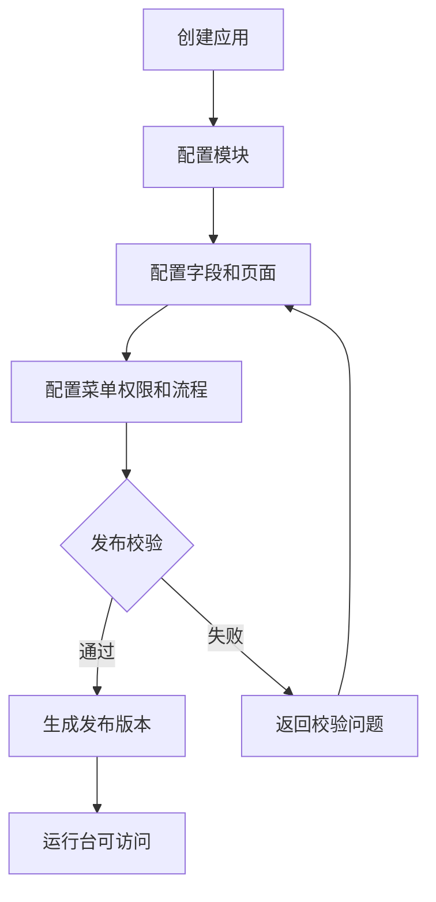
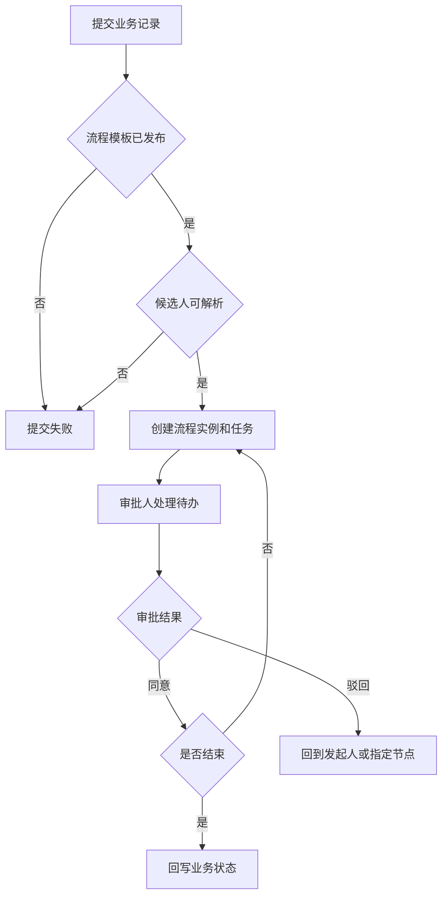

# 可配置业务系统平台 PRD

## 背景

本项目面向企业内部系统建设，将 unexamine 重构为“可配置业务系统平台”。旧项目已具备平台账号、租户、动态模块、字段、页面、流程、上传、OpenAPI、日志和运维脚本等能力，但存在接口组织不统一、生成式 CRUD 与业务接口混杂、平台态/配置态/运行态边界不清、旧表前缀与新约束不一致、旧页面偏调试台等问题。

新项目不复制旧项目页面和接口，而是在旧项目领域能力基础上重建产品化平台。目标用户覆盖平台运营人员、企业系统管理员、应用配置人员、业务办理人员、审批人员、OpenAPI 接入方和运维审计人员。系统使用场景包括轻量 CRM、OA、进销存、ERP/MES 子场景的配置、发布、运行、审批、导入导出、附件管理、开放接口接入和审计追踪。

## 目标

- 建设一个可长期演进的企业内部可配置业务系统平台，支持通过应用、模块、字段、页面、菜单、权限、流程、打印模板、KPI、仪表盘等配置组合业务系统。
- 明确平台态、配置态、运行态、流程工作台和运维态的产品入口与权限边界。
- 建立后端 Maven 多模块、`base`/`manage` 分层、数据库表前缀、MyBatis-Plus 代码生成和前端 API 契约优先的工程约束。
- MVP 覆盖登录、系统/租户、应用、模块、字段、页面、菜单、角色权限、记录运行、上传、基础流程、OpenAPI 基础接入、日志和健康检查。
- 成功标准：配置人员可创建并发布一个应用模块，业务用户可按权限录入、查看、编辑、删除、导出记录并发起流程，审批人可处理待办，管理员可审计日志，OpenAPI 可按授权访问，后端和前端实现均能通过契约闭环验证。
- 不做事项：不照搬旧页面信息架构；不直接暴露生成式基础 CRUD 作为正式业务 API；不沿用旧 `un_plat_` 平台表前缀；不在首期实现智能助手、命令中心、流程模拟、复杂灰度发布、备份恢复等高级能力，除非后续阶段另行定义。

## 用户角色

- 平台超级管理员：管理平台账号、全局配置、系统/租户、平台角色、OpenAPI 全局策略、文件存储、日志和健康检查；不得绕过业务权限直接操作租户业务数据。
- 企业/租户管理员：管理本租户内系统、部门、用户、角色、菜单、应用访问范围和基础配置；只能访问所属租户、所属系统数据。
- 应用配置管理员：配置应用、模块、字段、页面、菜单、字典、打印模板、仪表盘、KPI、流程模板和发布版本；不能直接越权修改运行态业务数据。
- 业务用户：在应用运行台使用业务列表、表单、详情、关联数据、附件、导出和仪表盘；操作受模块权限、字段权限和数据权限限制。
- 审批人/流程参与人：在流程工作台处理待办、查看抄送、查看我的申请和流程图；只能处理分配给自己的任务或授权代理任务。
- OpenAPI 管理员与客户端：管理员配置客户端、凭证、授权范围、IP 白名单和限流策略；客户端按签名、授权范围和幂等规则访问开放接口。
- 运维与审计人员：查看数据库、Redis、文件存储、密钥、Flyway 脚本版本、导出任务、调用日志、健康检查和审计日志；不参与业务配置审批之外的数据修改。
- 移动端用户：使用工作台、待办、业务记录查看与轻量处理能力；移动端范围以已发布应用和已授权流程为准。

## 功能范围

### 平台中心

- 包含账号、系统、租户、平台角色、平台菜单、全局配置、登录日志、操作日志、消息配置、健康检查。
- 包含平台级 OpenAPI 策略、文件存储策略和审计策略配置。
- 不包含租户内业务记录的直接编辑入口，不替代应用配置中心管理模块字段。

### 系统管理中心

- 包含租户内用户、部门、角色、菜单、权限、字典、系统上下文切换。
- 支持用户启停、角色授权、部门层级、菜单可见性和操作权限配置。
- 不包含平台全局账号与跨租户策略配置，不包含运行态记录越权管理。

### 应用配置中心

- 包含应用、模块模型、字段、字段选项、页面、菜单、列表视图、过滤模板、关联关系、导入导出模板、打印模板、仪表盘、KPI、集成事件配置。
- 支持配置草稿、校验、发布、版本快照、历史查看和必要回滚策略。
- 不包含把所有行业套件硬编码进系统；业务能力通过配置组合形成。

### 应用运行台

- 包含业务列表、表单新增、详情查看、编辑、删除、附件、关联数据、导入、导出、仪表盘查看和流程发起。
- 支持服务端分页、排序、筛选、字段权限、数据范围、上下文字段自动补齐。
- 不包含未发布模块的访问，不允许前端伪造后端未提供更新语义的编辑能力。

### 流程工作台

- 包含流程模板、模板版本、流程设计、流程发布、流程运行记录、待办、抄送、我的申请、审批处理、审批日志和流程图查看。
- 支持节点、连线、条件、候选人、审批动作、驳回、撤回、终止、流转记录。
- 不包含首期复杂流程模拟和灰度流程开关，除非后续阶段补充。

### 上传与文件中心

- 包含文件上传、分片上传、下载、预览、删除、存储配置和文件引用关系。
- 支持与业务记录、流程附件、配置附件关联，并保留审计记录。
- 不包含无引用清理策略以外的任意文件批量删除入口。

### OpenAPI 与集成中心

- 包含客户端、凭证、授权范围、IP 白名单、签名验签、幂等、限流、访问日志、业务记录与流程开放接口。
- 支持按租户、系统、应用、模块、接口范围授权。
- 不包含绕过业务权限和数据权限的后门接口。

### 运维中心

- 包含数据库连接状态、Redis 状态、文件存储状态、密钥状态、Flyway 脚本版本、后台导出任务、OpenAPI 调用日志、健康检查和审计日志。
- 支持失败日志摘要、任务重试状态查看和异常追踪。
- 不包含直接在线改库、直接修改生产配置密钥明文等高风险操作。

### 移动端

- 包含登录、工作台、应用入口、业务记录查看/轻量编辑、待办处理和消息提醒。
- 不包含复杂配置设计器、批量导入导出和高级运维页面。

## 技术架构与模块边界

后端必须基于旧项目参考继续采用 Maven 多模块工程，父工程为 `backend/pom.xml`，默认子模块为 `examine-core`、`examine-plat`、`examine-module`、`examine-flow`、`examine-upload`、`examine-app`、`examine-web`。如确需新增或拆分模块，必须在后续数据库设计与实现文档中说明原因和边界。

### Maven 多模块职责

| 模块 | 业务职责 | 对外接口边界 |
| --- | --- | --- |
| `examine-core` | 通用返回、异常、分页、上下文、安全工具、权限工具、审计基础、MyBatis-Plus 通用配置、Redis/缓存基础能力 | 不暴露业务 Controller，只提供公共能力给其他模块依赖 |
| `examine-plat` | 平台账号、系统、租户、平台 RBAC、平台菜单、平台配置、平台消息、平台日志 | 暴露平台管理相关 `manage.controller`，不处理业务模块记录 |
| `examine-module` | 应用、模块、字段、页面、菜单、字典、部门成员、角色权限、记录、EAV 字段值、关联、导入导出、仪表盘、KPI、打印模板、集成事件 | 暴露应用配置和应用运行相关业务 API，所有记录操作必须经权限与数据范围校验 |
| `examine-flow` | 流程模板、模板版本、流程设计、流程发布、流程实例、任务、候选人、审批动作、审批日志、待办 | 暴露流程配置、发起、待办、审批、流程图查询 API |
| `examine-upload` | 文件、分片、存储配置、下载、预览、引用关系 | 暴露文件上传、下载、预览与引用管理 API，不直接决定业务记录权限 |
| `examine-app` | 开放平台/OpenAPI 客户端、凭证、授权范围、IP 白名单、签名、幂等、调用日志 | 暴露 OpenAPI 管理和开放访问入口，调用业务能力时必须复用业务模块权限与校验 |
| `examine-web` | Spring Boot 启动、Web 装配、全局拦截器、统一异常、鉴权入口、OpenAPI 文档、Flyway/代码生成器开发入口 | 只承载启动、全局配置和必要聚合入口，不堆放业务实现 |

### 依赖方向与禁止规则

- 依赖方向以 `examine-core` 为底座，业务模块依赖 `examine-core`；`examine-module` 可按业务需要依赖 `examine-plat`、`examine-flow`、`examine-upload` 的公开服务；`examine-web` 依赖各业务模块用于启动集成。
- 禁止 `examine-core` 反向依赖任何业务模块。
- 禁止各模块直接访问其他模块的 mapper 或 entity 进行跨层数据操作；跨模块调用必须通过公开的 manage service 或明确的应用服务接口。
- 禁止在 `examine-web` 中堆放模块业务 Controller、业务 Service 和实体转换逻辑。
- 禁止将 MyBatis-Plus 生成的基础 CRUD Controller 作为正式业务接口暴露。
- 禁止前端直接依赖表结构、实体类字段或未在 API 文档声明的隐式字段。

### `base` 与 `manage` 分层

- `base` 包只承载 MyBatis-Plus 根据数据库表生成的贴表 CRUD 能力，包含 `entity/`、`mapper/`、`service/`、`service/impl/`。`base` 不承载对外 Controller，不承载业务编排，不直接作为 API 出入参暴露。
- `manage` 包承载业务编排、Controller、BO、VO、DTO、converter、enums、权限校验、事务控制、跨模块协调和实体到 VO 转换。
- Controller 入参使用 BO/DTO，出参使用 VO；系统上下文、审计字段、租户字段、应用字段、模块字段由后端补齐，不由前端任意传入。
- 保存、新增、编辑、状态变更、发布、审批、导入导出等操作必须在 `manage` 层封装业务语义和事务边界。

### 数据库与代码生成规则

- 数据库表统一按 `un_ + 模块前缀 + 业务名` 命名，禁止无前缀平铺。
- 平台与租户表统一使用 `un_platt_`，不沿用旧项目 `un_plat_`。
- 默认表前缀：平台与租户 `un_platt_`，动态模块/模型/记录 `un_module_`，流程审批 `un_flow_`，上传与文件 `un_upload_`，应用/版本 `un_app_`，OpenAPI `un_openapi_`，系统日志 `un_sys_`，审计 `un_audit_`。
- DBA 设计必须维护表与 Maven 模块映射，并说明旧 `un_plat_` 到新 `un_platt_` 的差异。
- 后端实现必须先根据 `docs/db_design.md` 和 `sql/init.sql` 执行 SQL 入库建表，再使用 MyBatis-Plus 代码生成器生成 `base` 层代码。
- MyBatis-Plus 代码生成器应放在 `backend/examine-web/src/test/java/com/unique/examine/generator/` 或等价开发期工具目录，包含数据源读取、表前缀清单、表到 Maven 子模块映射、`base` 包输出策略和禁止生成对外 Controller 策略。
- 生成报告需说明 SQL 执行结果、表清单、模块映射、生成路径和失败原因。

### 前端执行边界

- 前端必须先基于后端 API 文档建立 API 契约和 typed SDK，再实现页面。
- 页面不得散落 axios/fetch 调用，统一通过 typed SDK 访问接口。
- 前端必须输出页面到接口映射，建议形成 `frontend/docs/api-contract-map.md`，说明每个页面使用的接口、字段、状态、按钮动作和错误处理。
- 页面实现必须补齐上下文字段闭环：租户、系统、应用、模块、记录、流程任务等上下文由路由、状态和接口返回共同约束，不能靠用户手工输入系统字段。
- 新增/编辑语义必须闭环：后端没有更新接口或更新字段语义未定义时，前端不得展示可编辑入口；保存成功后列表、详情和表单状态必须同步刷新。

## 业务流程

### 应用配置与发布流程

1. 应用配置管理员创建应用，填写应用名称、编码、所属系统、可见范围和状态。
2. 配置模块模型，定义模块编码、名称、数据权限策略、是否启用流程、是否允许导入导出。
3. 配置字段、字段选项、页面布局、列表视图、菜单、角色权限、打印模板、仪表盘和流程模板。
4. 系统执行配置完整性校验，校验模块编码、字段编码、必填字段、页面字段引用、菜单权限、流程引用和数据隔离字段。
5. 校验通过后发布版本，生成配置快照；运行台只读取已发布版本。
6. 校验失败时返回失败项，配置保持草稿状态，不影响已发布版本。

### 业务记录运行流程

1. 业务用户进入应用运行台，系统根据登录上下文加载可访问应用、模块和菜单。
2. 用户进入模块列表，后端按租户、系统、应用、模块、角色、字段权限和数据范围返回列表数据。
3. 用户新增记录，前端只提交允许写入字段；后端补齐上下文字段、审计字段和默认值。
4. 用户查看详情，后端返回字段权限过滤后的详情、附件、关联数据和流程状态。
5. 用户编辑或删除记录，后端校验记录存在、数据权限、状态是否允许变更、是否存在流程锁定。
6. 操作成功后写入记录历史和审计日志；失败时返回明确错误码和原因。

### 流程审批流程

1. 用户在业务记录详情或表单提交发起流程。
2. 后端校验模块已启用流程、记录状态允许提交、流程模板已发布、候选人可解析。
3. 流程引擎创建流程实例、任务、审批日志并锁定必要业务状态。
4. 审批人在待办列表处理任务，可同意、驳回、转交或查看流程图。
5. 流程结束后回写业务记录状态，解除流程锁定并记录审计。
6. 模板不存在、候选人为空、重复提交、无权限处理或任务已完成时，进入异常分支并返回原因。

### OpenAPI 调用流程

1. OpenAPI 管理员创建客户端、凭证、授权范围和 IP 白名单。
2. 客户端按签名规则、时间戳、随机串和幂等键发起请求。
3. 后端校验客户端状态、签名、授权范围、IP、限流和幂等。
4. 校验通过后调用对应业务 manage service，并按授权范围过滤字段和数据。
5. 请求结果和失败原因写入调用日志。
6. 签名失败、超时、重复请求、超限、无授权或业务校验失败时返回标准错误。

## 页面/交互说明

- 登录页：支持账号密码登录，登录成功后进入工作台；登录失败展示错误原因，不暴露敏感信息。
- 工作台：首页展示当前系统、可访问应用、待办摘要、最近访问模块、导出任务状态和健康提醒。
- 平台中心：提供系统/租户/账号/角色/配置/日志列表、详情、新增、编辑、启停、授权、审计查看等操作。
- 系统管理中心：提供用户、部门、角色、菜单、字典维护；角色授权采用模块、菜单、操作、字段、数据范围分组配置。
- 应用配置中心：应用列表支持新增、编辑、启停、发布；模块配置采用分步或标签页，字段、页面、菜单、权限、流程、导入导出模板分别维护。
- 字段配置页：字段编码、名称、类型、必填、默认值、选项、唯一性、可见性、可编辑性、索引建议和校验规则分区展示。
- 页面设计页：支持列表、表单、详情布局配置；字段拖拽或选择后必须校验字段存在和权限策略。
- 应用运行列表页：支持分页、排序、筛选、列显隐、批量操作、导出、进入详情；按钮根据权限和记录状态动态展示。
- 记录表单页：新增和编辑区分入口与接口，保存时只提交允许写入字段；保存后跳转详情或留在表单由页面策略决定。
- 记录详情页：展示基础信息、字段详情、附件、关联数据、流程状态、操作历史；状态按钮受权限和流程状态限制。
- 流程设计页：使用可视化流程图配置节点、连线、条件和候选人；发布前必须通过连通性和候选人校验。
- 流程工作台：待办、抄送、我的申请分标签展示；审批弹窗展示意见、附件、下一节点和流程图。
- 上传中心：支持文件上传、分片进度、预览、下载、删除和引用查看；删除前提示引用风险。
- OpenAPI 页面：客户端、凭证、授权范围、IP 白名单、调用日志分区管理；密钥只在创建或重置时展示一次。
- 运维中心：展示健康检查、脚本版本、导出任务、调用日志和审计日志；异常项可查看失败摘要。

## 数据规则

- 平台账号：包含账号、姓名、手机号/邮箱、密码摘要、状态、最后登录时间、租户/系统授权关系；状态枚举为启用、停用、锁定。
- 系统/租户：包含名称、编码、状态、有效期、管理员、配置项；编码全局唯一，停用后业务入口不可访问。
- 应用：包含应用编码、名称、所属系统、状态、发布版本、可见范围；状态枚举为草稿、已发布、停用。
- 模块模型：包含模块编码、名称、所属应用、数据权限策略、流程启用标记、导入导出标记；同一应用下模块编码唯一。
- 字段：包含字段编码、名称、类型、必填、默认值、选项、校验规则、是否列表展示、是否可搜索、是否可编辑；同一模块下字段编码唯一。
- 页面：包含页面类型、布局配置、字段引用、按钮配置、权限引用；引用字段必须存在且未删除。
- 业务记录：包含记录 ID、租户、系统、应用、模块、创建人、负责人、状态、版本号、软删除标记和审计字段；记录值按字段类型写入 typed value 或索引值结构。
- 流程模板：包含模板编码、名称、所属应用/模块、版本、状态、流程图、节点、连线、条件；只有已发布版本可被运行态引用。
- 流程实例与任务：包含流程实例 ID、业务记录 ID、当前节点、任务状态、候选人、处理人、处理意见、处理时间；任务状态枚举为待处理、已处理、已取消、已转交、已退回。
- 文件：包含文件 ID、原始文件名、大小、类型、存储位置、引用对象、上传人、状态；状态枚举为临时、已引用、已删除。
- OpenAPI 客户端：包含客户端编码、凭证、授权范围、IP 白名单、状态、限流策略、密钥版本；状态枚举为启用、停用、过期。
- 审计日志：记录操作人、操作对象、操作类型、请求来源、前后差异、结果、错误原因和时间。
- 通用校验：编码只能由字母、数字、下划线组成；名称不能为空；删除采用软删除优先；唯一性需考虑租户、系统、应用、模块和软删除维度；历史数据是否回填由后续数据库设计明确。

## 权限规则

- 访问控制分为平台权限、租户/系统权限、应用权限、模块权限、操作权限、字段权限、数据权限和流程任务权限。
- 平台超级管理员只能管理平台级配置和租户授权，不默认拥有所有租户业务记录的编辑权。
- 租户管理员只能管理所属租户范围内用户、角色、应用授权和系统配置。
- 应用配置管理员可维护配置态数据，但运行态业务数据仍受模块权限和数据范围限制。
- 业务用户访问模块记录时必须同时满足菜单可见、模块授权、操作授权、字段可见和数据范围规则。
- 字段权限控制列表展示、详情展示、表单写入和搜索条件；无写入权限字段即使前端提交也必须被后端拒绝或忽略。
- 数据权限至少支持本人、本人部门、本部门及下级、指定角色/成员、全部授权范围等策略，具体枚举由后续设计细化。
- 流程任务只能由候选人、当前处理人、授权代理人或管理员按规则处理；已完成任务不能重复处理。
- OpenAPI 按客户端、授权范围、IP 白名单、签名、限流和租户/系统上下文共同鉴权。
- 所有越权访问、越权操作、字段越权写入和跨租户访问都必须记录审计日志。

## 异常场景

- 输入参数缺失或格式错误：返回参数错误，说明字段和校验规则。
- 编码重复：应用、模块、字段、流程模板、客户端等唯一编码重复时拒绝保存。
- 数据不存在：访问已删除、不存在或无权访问的数据时返回数据不存在或无权限，避免泄露跨租户信息。
- 无权限：用户没有菜单、模块、操作、字段或数据范围权限时拒绝访问，并写入审计。
- 发布校验失败：字段引用不存在、页面配置不完整、流程图不连通、候选人为空、权限缺失时禁止发布。
- 运行态版本冲突：配置发布版本与运行态引用不一致时以运行态快照为准，并提示重新加载。
- 记录状态冲突：流程处理中、已归档、已删除或锁定记录禁止编辑、删除或重复提交。
- 重复提交：新增、流程提交、OpenAPI 写入和导出任务创建需支持幂等，重复请求返回既有结果或拒绝。
- 文件上传失败：分片缺失、大小超限、类型不允许、存储不可用时返回失败，并清理临时分片。
- 导出失败：任务参数无效、数据权限不足、后台任务异常时记录失败原因，支持查看失败摘要。
- OpenAPI 异常：签名失败、时间戳过期、IP 不在白名单、授权范围不足、限流命中、幂等冲突时返回标准错误。
- 流程异常：模板未发布、候选人为空、任务已处理、审批人无权、节点配置变更导致快照不一致时拒绝操作。
- 外部依赖异常：数据库、Redis、文件存储不可用时在健康检查和操作错误中展示可追踪原因，避免静默失败。

## 验收标准

- 平台中心：可创建系统/租户/账号/角色，可启停账号和系统，可查看登录日志、操作日志和健康状态。
- 系统管理中心：可维护部门、用户、角色、菜单和权限；不同角色登录后菜单、按钮和数据范围符合授权。
- 应用配置中心：可创建应用和模块，配置字段、页面、菜单和权限；发布前校验失败能展示问题，发布成功后生成版本快照。
- 应用运行台：普通用户只能看到已授权应用和模块；可按字段权限新增、查看、编辑、删除记录；列表支持分页、排序、筛选和导出。
- 字段与数据规则：必填、唯一、类型、选项、默认值和字段权限在前后端同时生效，后端为最终校验点。
- 流程工作台：可发布流程模板，可从记录发起流程，审批人可在待办处理，同意/驳回后业务状态和审批日志正确更新。
- 上传与文件：可上传、预览、下载、删除文件；业务记录和流程附件能建立引用；删除受引用和权限限制。
- OpenAPI：客户端按签名和授权范围访问；签名错误、IP 不符、越权、限流和重复请求均能返回明确错误并记录日志。
- 运维中心：可查看数据库、Redis、文件存储、Flyway 版本、导出任务、OpenAPI 调用日志和健康检查结果。
- 技术架构：后端工程采用 `examine-core`、`examine-plat`、`examine-module`、`examine-flow`、`examine-upload`、`examine-app`、`examine-web` 多模块；`base` 与 `manage` 分层清晰；业务实现不堆在 `examine-web`。
- 数据库命名：所有业务表符合 `un_ + 模块前缀 + 业务名`，平台表使用 `un_platt_`，DB 设计中能看到表与模块映射。
- 代码生成：后端能证明已先执行初始化 SQL 入库，再用 MyBatis-Plus 生成 `base` 层 CRUD，生成器和生成报告可追踪。
- 前端契约：前端先建立 API 契约和 typed SDK，再实现页面；页面到接口映射、上下文字段补齐、新增/编辑语义闭环可验证。
- 异常处理：参数错误、重复、无权限、数据不存在、状态冲突、流程异常、上传失败、OpenAPI 异常均有明确返回和审计记录。
