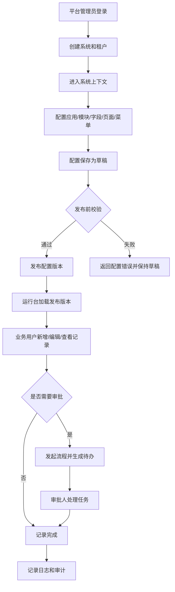
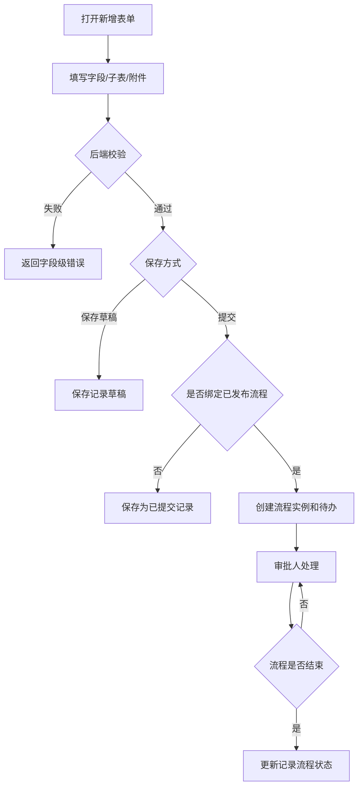

# 可配置业务系统平台 PRD

## 背景

本次建设目标是将旧 unexamine 项目重构为可长期演进的可配置业务系统平台，而不是简单复制旧项目接口或页面。平台需要支持普通企业内部小型、中型业务系统的搭建、配置、运行和运维，覆盖账号、租户、系统、应用、模块、字段、页面、菜单、角色权限、业务数据、流程审批、附件、导入导出、OpenAPI、日志审计和部署运维等核心能力。

旧项目已沉淀 Maven 多模块后端、Vue3 Web 管理端、UniApp 移动端、平台账号、低代码元数据、EAV 业务记录、流程、上传、OpenAPI 和部分测试部署脚本等可参考能力。但旧项目存在页面组织分散、配置态与使用态混杂、部分页面偏接口测试化、SQL 来源分散、中文编码异常、运行产物混入工程目录、OpenAPI 安全能力不足、流程设计器偏 JSON 编辑等问题。本次 PRD 以旧项目能力模型为参考，重新定义产品结构、业务边界、页面体验、权限规则和验收标准。

目标用户和系统使用场景包括：

- 平台管理员维护平台账号、系统、租户、全局配置、健康检查和全局审计。
- 系统拥有者或系统管理员在某个系统内配置组织、用户、角色、应用、模块、字段、页面、菜单、流程和开放接口。
- 应用管理员维护具体应用的模块、页面、导入导出、打印模板、仪表盘和流程绑定。
- 普通业务用户在运行台填写表单、查看列表和详情、处理附件、发起流程、查看审批状态和导出数据。
- 审批人通过流程工作台处理待办、抄送、转交、撤回、终止等任务。
- 运维人员查看配置检查、服务健康、数据库、Redis、文件存储、接口日志、导出任务和部署版本信息。
- 外部系统通过 OpenAPI 在授权范围内访问记录、流程和文件能力。

## 目标

本次建设目标：

- 建设平台层、自定义系统层、应用配置台、应用运行台、流程工作台、运维中心分层清晰的产品结构。
- 支持从创建系统、配置应用模块、发布页面、录入业务数据、发起审批、查看日志到导出数据的完整闭环。
- 支持轻量 CRM、OA、进销存、ERP 子场景、MES 子场景等企业内部系统，通过模块、字段、子表、流程、规则、API、打印模板和仪表盘组合实现。
- 建立统一的数据隔离、权限控制、配置发布、审计日志和异常处理规则。
- 为后续数据库设计、后端接口、前端页面和构建验证提供可落地的产品依据。

成功标准：

- 平台管理员可以完成账号、租户、系统和全局配置管理。
- 系统管理员可以在不修改代码的情况下创建应用、模块、字段、页面、菜单、角色和基础流程。
- 普通用户可以通过运行台完成列表查询、表单新增编辑、详情查看、附件上传、流程发起和任务处理。
- 所有业务接口按 systemId、tenantId、appId、moduleId 做数据边界隔离，后端强制校验权限。
- 配置类能力支持草稿、发布、版本和回滚，运行时数据保存配置快照，避免配置变更破坏历史数据。
- OpenAPI 与内部接口分离，具备签名、幂等、限流、IP 白名单、密钥版本和调用审计能力。
- 构建、部署和运维入口能暴露关键健康状态和失败原因。

不做事项：

- 不将 ERP、MES 建设为重型行业套件，只通过可配置能力支持轻量子场景。
- 不直接复制旧项目页面组织、SQL 文件、运行日志、dist、node_modules、tmp、zip 或 IDE 配置等历史产物。
- 不把运行台做成配置后台，普通业务用户不暴露复杂配置入口。
- 不把前端权限作为唯一权限控制依据，后端接口必须再次校验。
- 不使用“查询最大值 + 1”生成自动编号。
- 不以明文密钥兼容模式作为 OpenAPI 主方案。
- 不把流程设计器仅做成 JSON 或列表编辑器。
- 不在 PRD 中写入数据库、Redis 等运行环境明文密码。

## 用户角色

- 平台管理员：管理平台账号、平台角色、租户、系统、平台菜单、全局配置、全局日志、健康检查和部署信息；可查看所有平台级数据。
- 系统拥有者：创建并拥有某个业务系统，负责系统启停、租户选择、系统管理员授权和系统级配置。
- 系统管理员：管理系统内用户、部门、角色、权限、应用、模块、页面、菜单、流程、字典、OpenAPI 和审计日志。
- 应用管理员：维护指定应用下的模块、字段、列表视图、表单页面、详情页面、导入导出模板、打印模板、仪表盘和流程绑定。
- 普通业务用户：访问被授权的运行台菜单，执行记录新增、查看、编辑、删除、导出、附件、评论、流程发起等业务操作。
- 审批人：在流程工作台处理待办任务，可同意、拒绝、转交、抄送、撤回、终止或查看流程轨迹，具体操作受流程节点和权限限制。
- 运维人员：查看运行配置、数据库连接状态、Redis 状态、文件存储状态、接口日志、导出任务、异常消息、版本和部署信息，不默认拥有业务数据修改权。
- OpenAPI 调用方：通过外部应用凭证调用开放接口，只能访问授权系统、租户、模块和操作范围内的数据。

权限边界：

- 平台级角色不能自动获得系统内业务数据权限，进入系统后必须按系统内角色重新授权。
- 系统内角色不能越权访问其他系统或其他租户数据。
- 应用管理员只能管理授权应用，不默认管理平台、租户或其他应用。
- OpenAPI 调用方不参与后台页面登录，不继承人类用户的管理入口权限。

## 功能范围

### 1. 平台中心

包含：

- 平台账号注册、登录、刷新会话、退出登录。
- 平台系统列表、创建系统、进入系统、系统启停。
- 租户管理、平台管理员管理、平台角色和菜单权限。
- 平台消息、登录日志、操作日志、全局配置。

不包含：

- 系统内业务模块字段配置。
- 普通业务数据的运行台操作。
- 直接替代运维中心执行数据库或文件修复。

### 2. 系统与租户上下文

包含：

- systemId、tenantId 上下文选择和切换。
- 平台态 systemId=0 与系统态 systemId!=0 的边界识别。
- 系统内应用、部门、成员、角色、权限的数据隔离。

不包含：

- 跨系统共享业务数据。
- 系统内用户绕过租户边界访问数据。

### 3. 应用配置台

包含：

- 应用管理：创建、启用、停用、排序、版本管理。
- 模块管理：模块创建、字段配置、字段选项、子表、模块关系、动作配置。
- 字典和部门管理。
- 页面管理：列表页、表单页、详情页、页面块、运行菜单。
- 列表视图和筛选模板：列配置、排序、筛选、固定列、保存视图。
- 导入导出模板、导出任务、打印模板、仪表盘配置。
- 配置草稿、发布、版本、回滚和发布前校验。

不包含：

- 普通业务用户在运行台直接修改字段、页面、流程等配置。
- 未发布配置直接影响运行台正式用户。

### 4. 应用运行台

包含：

- 按菜单进入业务模块列表。
- 业务记录新增、编辑、详情、软删除、历史查看。
- 表单字段校验、唯一性校验、自动编号、子表录入、关联数据选择。
- 附件上传、下载、预览、删除。
- 评论、操作历史、流程状态展示。
- 导出、导入预演、导入任务和失败明细。
- 运行台仪表盘和常用视图。

不包含：

- 平台级账号、租户、系统配置。
- 流程模板设计和字段配置。

### 5. 流程工作台

包含：

- 流程模板、流程版本、节点、连线、条件、节点审批人、会签或签、抄送、转交、子流程配置。
- 流程可视化设计、发布前校验、流程模拟和版本发布。
- 流程与模块、动作、业务记录绑定。
- 发起流程、待办、已办、抄送、我的申请、流程实例、任务处理、流程轨迹。
- 同意、拒绝、撤回、终止、转交、抄送、会签或签等处理动作。

不包含：

- 只通过 JSON 编辑承载流程设计。
- 未发布流程版本被运行台正式发起。

### 6. 文件与导入导出

包含：

- 文件上传、分片上传、存储配置、附件关联、下载和预览。
- 导入模板、导入预演、导入提交、失败明细、回滚策略。
- 导出模板、导出任务、导出状态、下载和失败原因。
- 文件与任务操作审计。

不包含：

- 将远程文件存储视为本地数据库事务的一部分。
- 无权限用户访问附件或导出文件。

### 7. OpenAPI

包含：

- 外部应用、凭证、授权范围、IP 白名单、密钥版本、密钥轮换。
- HMAC 签名、时间戳、防重放、Idempotency-Key 幂等控制。
- 记录查询、新增、更新、流程发起、任务处理等开放接口。
- 调用日志、错误日志、限流和审计。

不包含：

- OpenAPI 直接使用后台登录态。
- 明文 SK 作为主认证方案。
- 外部应用访问未授权系统、租户、模块或字段。

### 8. 运维中心

包含：

- 配置检查、数据库检查、Redis 检查、文件存储检查、服务健康检查。
- 接口日志、异常消息、导出任务状态、版本信息、部署信息。
- 启动前关键配置检查：密钥占位、数据库、Redis、文件存储、脚本版本。

不包含：

- 直接修改业务数据。
- 展示明文密钥或连接密码。

### 9. 移动端

包含：

- 移动端认证、系统选择、运行台菜单、记录列表、表单、详情、附件、流程待办和任务处理。
- 以运行台和流程工作台为主，优先支持业务使用场景。

不包含：

- 首期不要求完整覆盖平台中心、复杂配置台、可视化流程设计器和运维中心。

## 业务流程

### 平台建系统到业务运行流程

1. 平台管理员登录平台中心。
2. 平台管理员创建系统，设置系统名称、租户、系统拥有者和启用状态。
3. 系统拥有者进入系统，创建系统管理员或应用管理员。
4. 系统管理员创建应用、模块、字段、页面、菜单和基础角色。
5. 应用管理员配置列表、表单、详情、导出模板和流程绑定。
6. 配置保存为草稿，执行发布前校验。
7. 校验通过后发布配置版本，运行台加载最新发布版本。
8. 普通业务用户进入运行台，按菜单访问模块并新增、编辑、查看业务记录。
9. 需要审批的记录发起流程，审批人处理待办。
10. 系统记录操作日志、流程日志、附件日志和审计日志。

异常分支：

1. 发布前校验失败时，提示缺失字段、无效页面、无效流程绑定或权限缺失，配置保持草稿状态。
2. 用户无运行台菜单权限时，不展示菜单；直接访问接口时返回无权限。
3. 运行台加载配置失败时，使用已发布稳定版本；无可用版本时提示配置不存在。

### 记录新增与审批流程

1. 业务用户进入运行台模块列表。
2. 用户点击新增，系统按已发布表单配置渲染字段、子表和默认值。
3. 用户填写数据并上传附件。
4. 后端校验必填、格式、枚举、唯一性、权限、自动编号和关联数据有效性。
5. 保存草稿或提交。
6. 保存草稿时记录保持草稿状态。
7. 提交时若模块绑定流程，系统按已发布流程版本创建流程实例和首个待办。
8. 审批人处理待办，流程按条件流转。
9. 流程结束后更新业务记录流程状态。

异常分支：

1. 重复提交时，按幂等键或业务状态识别并返回已处理结果。
2. 附件上传失败时，表单提交失败；已上传文件需要按本次 fileId 做补偿清理。
3. 审批任务已被处理时，后续重复处理返回任务已完成。
4. 流程版本不存在或未发布时，不允许提交审批。

### OpenAPI 调用流程

1. 外部应用申请或由系统管理员创建 OpenAPI 应用。
2. 系统管理员配置授权范围、IP 白名单、密钥版本和限流规则。
3. 调用方按约定携带应用标识、时间戳、签名、幂等键和目标系统上下文。
4. 后端校验签名、时间窗口、IP 白名单、授权范围、限流和幂等。
5. 校验通过后执行业务接口，并写入调用日志。
6. 调用失败时返回标准错误码、错误信息和请求追踪标识。

异常分支：

1. 签名错误、时间戳过期、IP 不在白名单、超出授权范围、超过限流时拒绝请求并记录审计。
2. 幂等键重复时返回首次请求结果或明确提示重复请求。
3. 目标系统、租户、模块不存在时返回数据不存在或无权限。

## 页面/交互说明

### 平台中心

- 登录页：账号、密码、验证码或二次认证入口；按钮包含登录、注册、忘记密码。
- 系统列表页：展示系统名称、租户、状态、拥有者、创建时间；按钮包含创建系统、进入系统、启用、停用、编辑。
- 系统创建/编辑弹窗或页面：填写系统名称、编码、租户、拥有者、描述、状态；编码创建后不允许随意修改。
- 平台角色与菜单页：左侧角色列表，右侧菜单权限树，支持勾选、保存、重置。
- 平台日志页：支持按账号、时间、操作类型、结果筛选，查看日志详情。

### 应用配置台

- 应用列表页：展示应用名称、编码、状态、版本、排序；支持新建、编辑、启停、进入配置。
- 模块配置页：模块基础信息、字段列表、子表、关联关系、动作配置分区展示；字段支持新增、编辑、排序、启停、删除。
- 字段编辑表单：字段名称、字段编码、字段类型、是否必填、是否唯一、默认值、枚举选项、显示规则、校验规则。
- 页面设计页：按列表、表单、详情三类配置页面块、字段展示、按钮和状态切换；支持预览。
- 菜单配置页：树形菜单管理，绑定应用、模块、页面和权限标识。
- 发布页：展示草稿变更、校验结果、版本说明、发布按钮、回滚入口。

### 应用运行台

- 运行首页：按当前用户权限展示应用菜单、常用模块、待办摘要和仪表盘。
- 记录列表页：支持服务端分页、排序、筛选、固定列、列显隐、保存视图、批量操作和导出。
- 记录表单页：按配置动态渲染字段、子表、附件、关联数据选择器；底部按钮包含保存草稿、提交、取消。
- 记录详情页：展示基础信息、字段分组、子表、附件、评论、历史、流程状态和操作日志；按权限展示编辑、删除、发起流程、导出等按钮。
- 导入页：上传文件、选择模板、预演校验、查看错误明细、确认导入和查看任务结果。
- 导出任务页：展示任务状态、创建人、创建时间、完成时间、失败原因和下载按钮。

### 流程工作台

- 流程模板列表页：展示模板名称、绑定模块、状态、当前版本、更新时间；支持新建、编辑、复制、发布、停用。
- 流程设计页：画布展示开始、审批、条件、抄送、子流程、结束节点；右侧配置节点审批人、条件、动作和超时规则；顶部提供保存草稿、模拟、发布校验、发布。
- 待办页：按模块、发起人、时间、流程状态筛选；支持打开任务详情。
- 任务处理页：展示业务记录快照、流程图、审批意见、附件和历史；按钮按节点权限展示同意、拒绝、转交、抄送、撤回、终止。
- 实例详情页：展示流程轨迹、节点状态、处理人、处理意见和耗时。

### OpenAPI 管理

- 外部应用列表页：展示应用名称、状态、授权系统、最近调用时间；支持创建、启停、查看详情。
- 凭证页：展示密钥版本、创建时间、过期时间、状态；支持生成、轮换、禁用，不展示明文密钥。
- 授权范围页：按系统、租户、应用、模块、接口动作配置授权。
- 调用日志页：按应用、接口、状态、时间、追踪标识筛选，支持查看请求摘要和错误原因。

### 运维中心

- 健康检查页：展示服务、数据库、Redis、文件存储、配置项、脚本版本状态。
- 异常消息页：展示异常类型、发生时间、影响范围、处理状态。
- 部署信息页：展示版本、构建时间、运行环境和关键配置是否占位，不展示敏感值。

## 数据规则

### 核心实体

- 平台账号：平台登录主体，包含账号、姓名、手机号或邮箱、状态、最近登录时间。
- 租户：业务隔离单位，包含租户名称、编码、状态和负责人。
- 系统：平台下的业务系统，包含 systemId、系统名称、系统编码、拥有者、租户、状态。
- 应用：系统内业务应用，包含 appId、systemId、tenantId、名称、编码、状态、排序、当前发布版本。
- 模块：应用内业务对象，包含 moduleId、appId、名称、编码、模块类型、状态。
- 字段：模块字段元数据，包含 fieldId、moduleId、字段编码、字段名称、字段类型、必填、唯一、默认值、枚举来源、校验规则、排序。
- 页面：列表、表单、详情等页面配置，包含 pageId、moduleId、页面类型、布局、页面块和版本。
- 菜单：运行台入口，包含 menuId、父级菜单、绑定应用、模块、页面、权限标识、排序、状态。
- 角色：系统或平台权限集合，包含角色名称、角色类型、状态。
- 成员：用户在系统内的身份，包含用户、部门、角色、状态。
- 业务记录：模块运行数据主记录，包含 recordId、systemId、tenantId、appId、moduleId、编号、状态、创建人、更新人、流程状态。
- 记录值：业务记录字段值，按字段类型保存字符串、数值、日期、布尔、枚举、附件、关联等值。
- 流程模板：流程定义入口，包含模板名称、绑定模块、状态、当前版本。
- 流程版本：已发布或草稿版本，包含节点、连线、条件、设置和发布时间。
- 流程实例：业务记录发起后的运行实例，保存发起人、业务快照、当前状态。
- 流程任务：审批待办，包含任务状态、处理人、候选人、处理意见和完成时间。
- 附件：上传文件元数据，包含 fileId、systemId、tenantId、存储位置、文件名、大小、类型、状态。
- 导入导出任务：异步任务，包含任务类型、模板、状态、失败原因、结果文件。
- OpenAPI 应用：外部调用主体，包含 clientId、名称、状态、授权范围。
- OpenAPI 凭证：密钥版本、加密密钥摘要、过期时间、状态。
- 审计日志：记录登录、操作、接口调用、流程动作、文件动作和异常。

### 字段类型

字段类型至少包括：

- 文本、长文本、数字、金额、日期、日期时间、布尔、单选、多选、字典、部门、成员、附件、关联记录、子表、自动编号、公式、只读展示。

字段校验规则：

- 必填字段提交时不能为空，草稿可按配置决定是否放宽。
- 唯一字段在同 systemId、tenantId、moduleId、未删除记录范围内唯一。
- 枚举、字典、部门、成员、关联记录必须引用有效且有权限的数据。
- 数字、金额、日期、日期时间必须符合字段类型格式。
- 自动编号由独立序号能力或数据库原子能力生成，不允许用查询最大值加一。
- 系统生成字段不暴露给前端 Save 入参，由后端补齐。

### 状态流转

- 系统状态：草稿、启用、停用。
- 应用状态：草稿、启用、停用。
- 配置版本状态：草稿、已发布、已停用、已回滚。
- 模块状态：启用、停用。
- 记录状态：草稿、已提交、已归档、已删除。
- 流程模板状态：草稿、已发布、停用。
- 流程实例状态：运行中、已通过、已拒绝、已撤回、已终止。
- 流程任务状态：待处理、已同意、已拒绝、已转交、已撤回、已终止、已跳过。
- 导入导出任务状态：待执行、执行中、成功、失败、已取消。
- 附件状态：临时、已关联、已删除。
- OpenAPI 凭证状态：启用、禁用、过期、已轮换。

### 数据隔离

- 平台数据使用平台级边界，系统态业务数据必须带 systemId。
- 租户内数据必须带 tenantId。
- 应用配置和运行数据按 appId 隔离。
- 模块配置和业务记录按 moduleId 隔离。
- 运行时业务记录保存配置版本或配置快照，保证历史详情和流程审批不因后续配置变更失真。

### 配置发布规则

- 字段、页面、菜单、流程、导入导出模板、打印模板和仪表盘等影响运行台的配置必须支持草稿、校验、发布、版本、回滚。
- 发布前必须校验字段编码唯一、页面引用字段有效、菜单绑定有效、流程节点连线完整、审批人配置有效、导出模板字段有效。
- 已发布配置可回滚到历史发布版本，回滚不删除历史业务数据。
- 删除或停用字段时不得破坏历史记录展示；历史记录按快照展示。

## 权限规则

- 所有接口必须鉴权，除登录、注册和明确开放的健康检查外，不允许匿名访问。
- 前端根据权限隐藏菜单、按钮、字段和页面块；后端必须按同一权限模型再次校验。
- 平台权限包括平台菜单权限、平台操作权限、系统创建和系统管理权限。
- 系统内权限包括菜单权限、页面权限、按钮或动作权限、字段读写权限、数据范围权限。
- 字段权限支持可见、可编辑、只读、隐藏；隐藏字段不得在接口出参中返回给无权限用户。
- 数据范围支持本人、本人部门、下级部门、指定部门、全部数据等规则，具体范围由角色配置决定。
- 多角色用户权限合并时，菜单和操作权限取并集，字段写权限按更严格规则处理，数据范围按配置策略取并集或最小范围，需在后台明确配置。
- 流程任务处理权限由流程节点候选人、实际处理人、管理员权限和任务状态共同决定。
- 附件访问权限继承业务记录权限，同时校验文件归属 systemId、tenantId 和关联对象。
- OpenAPI 权限按外部应用授权范围校验，不继承后台用户页面权限；涉及代操作时必须记录 acting 用户或调用方身份。
- 运维人员可查看健康和日志，不默认拥有业务记录修改权限。

## 异常场景

- 输入缺失：必填字段、必要上下文、流程模板、页面配置缺失时，返回明确字段或配置错误。
- 数据不存在：系统、租户、应用、模块、字段、页面、菜单、记录、流程实例、任务或附件不存在时，返回数据不存在，不创建隐式默认数据。
- 无权限：用户无菜单、页面、字段、动作、数据范围或附件权限时，返回无权限并记录审计。
- 跨系统或跨租户访问：请求上下文与数据归属不一致时拒绝访问。
- 重复提交：同一表单、同一流程任务、同一 OpenAPI 幂等键重复提交时，返回已处理结果或重复提交提示。
- 唯一冲突：唯一字段、系统编码、应用编码、模块编码、字段编码、菜单编码、OpenAPI 应用标识冲突时，返回冲突原因。
- 配置未发布：运行台引用未发布或已停用配置时，提示配置不可用。
- 配置发布失败：字段引用、页面绑定、流程连线、审批人、导出模板或权限配置校验失败时，保持草稿。
- 上传失败：文件大小、类型、存储配置、网络或存储服务异常导致失败时，返回失败原因；已成功上传但后续失败的文件按 fileId 补偿删除。
- 导入失败：模板不匹配、字段错误、权限不足、唯一冲突、数据格式错误时，输出失败明细，未确认前不写入正式数据。
- 导出失败：任务执行失败时记录失败原因，允许重新发起。
- 流程异常：任务已处理、流程已结束、审批人为空、条件无法命中、流程版本不存在时，返回明确错误。
- OpenAPI 异常：签名错误、时间戳过期、IP 不在白名单、超出授权范围、超过限流、幂等冲突时拒绝请求并记录日志。
- 外部依赖异常：数据库、Redis、文件存储不可用时，运维中心提示健康异常，业务接口返回标准错误。
- 敏感配置异常：密钥仍为占位值或配置缺失时，启动检查和运维中心必须提示，不展示明文敏感值。
- 编码异常：文档、页面或配置出现乱码时，按 UTF-8 规范修复并纳入验收。

## 验收标准

### 平台中心

- 平台管理员可以登录、刷新会话、退出登录。
- 平台管理员可以创建系统、编辑系统、启用或停用系统，并指定租户和系统拥有者。
- 用户进入系统后，后续接口必须带正确系统上下文。
- 平台日志可以按账号、时间、操作类型和结果查询。

### 系统与权限

- 系统管理员可以创建部门、成员、角色并分配菜单、页面、字段、动作和数据范围权限。
- 无权限用户不能在前端看到对应菜单和按钮。
- 无权限用户直接调用接口时，后端返回无权限。
- 跨 systemId、tenantId 的数据访问被拒绝。

### 应用配置

- 应用管理员可以创建应用、模块、字段、页面和运行菜单。
- 字段支持必填、唯一、默认值、枚举、字典、附件、关联、子表等配置。
- 页面配置可以保存草稿、预览、发布和回滚。
- 发布前校验能识别无效字段引用、重复编码、无效菜单绑定和缺失页面。

### 应用运行

- 普通用户可以在授权菜单中查看记录列表，支持分页、排序、筛选和保存视图。
- 普通用户可以新增、编辑、查看详情、软删除授权范围内记录。
- 表单提交能校验必填、格式、枚举、唯一性和关联数据权限。
- 详情页展示字段、子表、附件、历史、评论、流程状态和操作日志。
- 自动编号在并发提交下不重复。

### 流程

- 管理员可以通过可视化设计器配置流程节点、连线、条件、审批人和抄送。
- 流程发布前能校验开始结束节点、连线完整性、审批人和条件配置。
- 用户可以对绑定流程的记录发起审批。
- 审批人可以处理待办，重复处理已完成任务时返回明确提示。
- 流程结束后业务记录流程状态正确更新，流程轨迹完整可查。

### 文件与导入导出

- 用户可以上传、下载、预览和删除有权限的附件。
- 附件访问必须校验业务记录权限和文件归属。
- 导入支持预演校验、失败明细和确认导入。
- 导出以任务形式执行，用户可以查看状态、失败原因和下载结果。

### OpenAPI

- 外部应用可以配置凭证、授权范围、IP 白名单、限流和密钥版本。
- 请求签名、时间戳、防重放和幂等校验生效。
- 未授权模块、字段或动作不能通过 OpenAPI 访问。
- 所有 OpenAPI 调用记录调用方、接口、结果、耗时、错误原因和追踪标识。

### 运维中心

- 运维人员可以查看服务、数据库、Redis、文件存储和关键配置健康状态。
- 运维中心不展示数据库、Redis、OpenAPI 等明文密钥。
- 启动前检查能识别密钥占位、数据库不可用、Redis 不可用、文件存储不可用和脚本版本异常。
- 异常消息、导出任务和接口日志可查询并展示失败摘要。

### 移动端

- 移动端用户可以登录、选择系统、进入运行台菜单。
- 移动端支持记录列表、表单、详情、附件和流程待办处理。
- 移动端首期不要求配置台和可视化流程设计器完整能力。
