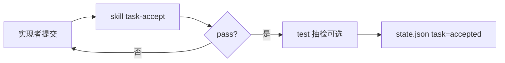

# 任务级验收（裁判 ≠ 选手）

## 原则

| 角色 | 能做 | 不能做 |
|------|------|--------|
| 实现者（backend/frontend/dba） | 写代码、写自检说明 | 判定自己任务 pass |
| test Agent | 设计用例、执行验收 | 实现业务代码 |
| skill `task-accept` | 对照任务标准机械检查 | 修改实现 |
| pm | 阶段 Gate 建议 | 替代 test 执行 e2e |

**禁止：** backend 写完说「完成」→ backend 自己写 test_report pass。

## 单任务验收流程



## task-accept Skill 检查项

每个 `docs/tasks/TASK-*.md` 必须包含 `acceptance` 段，skill 逐条核对：

1. `outputs` 文件全部存在且非空
2. `self_check_commands` 已执行且日志在 `docs/evidence/accept-{taskId}.log`
3. 无新增 open P0 issue 指向该任务
4. 若任务类型为 `frontend`：`npm run build` 通过
5. 若任务类型为 `backend`：声明的 `mvn` 模块 test 通过
6. 实现者 id ≠ 验收执行记录中的 actor

## 验收证据格式

`docs/evidence/accept-TASK-XXX.md`：

```markdown
# TASK-XXX 验收

- task_id: TASK-XXX
- implementer: backend
- acceptor: skill:task-accept
- verdict: pass | fail
- checked_at: ISO8601
- checklist:
  - [x] outputs 存在
  - [x] mvn test 通过
- commands:
  - mvn -pl examine-plat -am test
- logs: docs/evidence/accept-TASK-XXX.log
- issues: []
```

## 阶段验收 vs 任务验收

| 级别 | 执行者 | 产物 |
|------|--------|------|
| 任务 | skill task-accept | `accept-TASK-*.md` |
| 批次 | test Agent | `docs/evidence/batch-*.md` |
| 阶段 | skill review-gate + 你 | `gate-{phase}.json` |
| 项目 | e2e-user-script + 你试用 | `e2e-car-system.md` |

## review-gate 输出 JSON

```json
{
  "phase": "build",
  "verdict": "pass",
  "gates_checked": ["api_frozen", "tasks_planned"],
  "open_p0": 0,
  "tasks_without_accept": [],
  "blockers": []
}
```

`verdict=fail` 时不得进入下一阶段。
