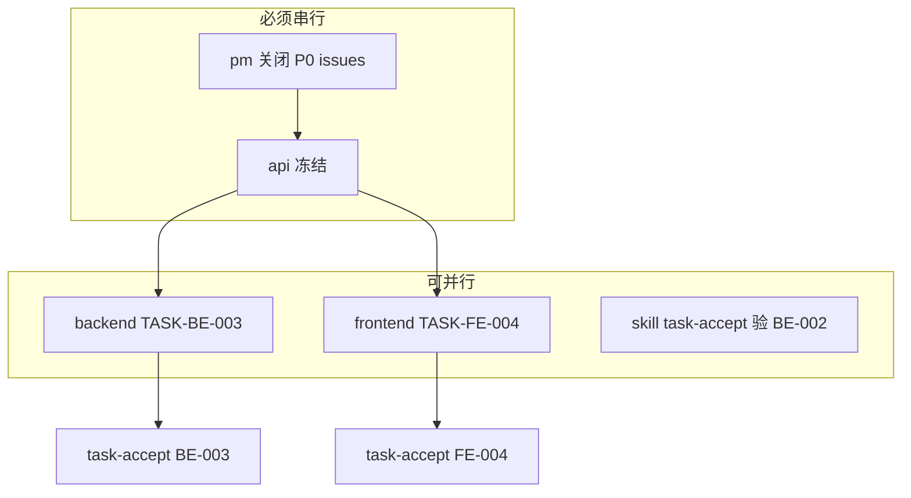

# Agent 与 Skill

## 判断标准

| 类型 | 何时用 | 会话 | 记忆 |
|------|--------|------|------|
| **Agent** | 需要理解、权衡、多轮修正 | **每次新建** | 只读落盘文件，不读聊天历史 |
| **Skill** | 输入输出确定、可脚本化 | 无状态一次执行 | 无 |

## Worker Agents（本项目固定 8 个）

| Agent | 负责 | 不负责 |
|-------|------|--------|
| **pm** | 产品决策、issue 裁决、Gate 签字建议 | 写代码 |
| **analyst** | 需求理解、旧项目摘要 | 定 API 字段 |
| **uiux** | 信息架构、交互规格、调用 Open Design | 写 Vue/React 业务代码 |
| **planner** | 任务 DAG、并行标记、依赖 | 改 PRD 业务范围 |
| **dba** | 表结构、sql | 写 Controller |
| **backend** | Java 实现、单测 | 定 UI 文案 |
| **frontend** | 页面实现、构建 | 定表结构 |
| **test** | 用例、执行验收、写证据 | 修实现代码 |

**Conductor** 不是 Worker，是调度层（通常由你当前 Cursor 主会话扮演）。

## Skills（本项目固定 6 个）

| Skill | 触发 | 输出 |
|-------|------|------|
| `open-design` | uiux / 你 | `docs/design/prototypes/*.html` |
| `contract-sync` | contract 后、build 前 | 同步报告 pass/fail |
| `clean-build` | 每个 build 批次末 | `docs/evidence/build-*.md` |
| `task-accept` | 单任务 claimed done 后 | `docs/evidence/accept-{taskId}.md` |
| `review-gate` | 阶段末 | `docs/evidence/gate-{phase}.json` |
| `e2e-user-script` | verify 阶段 | `docs/evidence/e2e-*.md` |

## 并行示例（Build 阶段）

条件：

- `TASK-FE-004` 的 `depends_on` 含 `TASK-BE-003` 时，frontend **不能**先跑
- `task-accept` 的执行者 **不是** 该任务的 backend/frontend agent

## 何时用多个 Agent？

你的理解是对的：

1. **并行提速**：无依赖、路径不重叠的任务同时开多个新会话
2. **发现问题**：不同角色各审各的维度，向 PM 提 issue，避免单人幻觉
3. **限制上下文**：每人只读自己输入文件，避免「感觉已经做过」

**不需要** 10 个 Agent 常驻聊天室。
