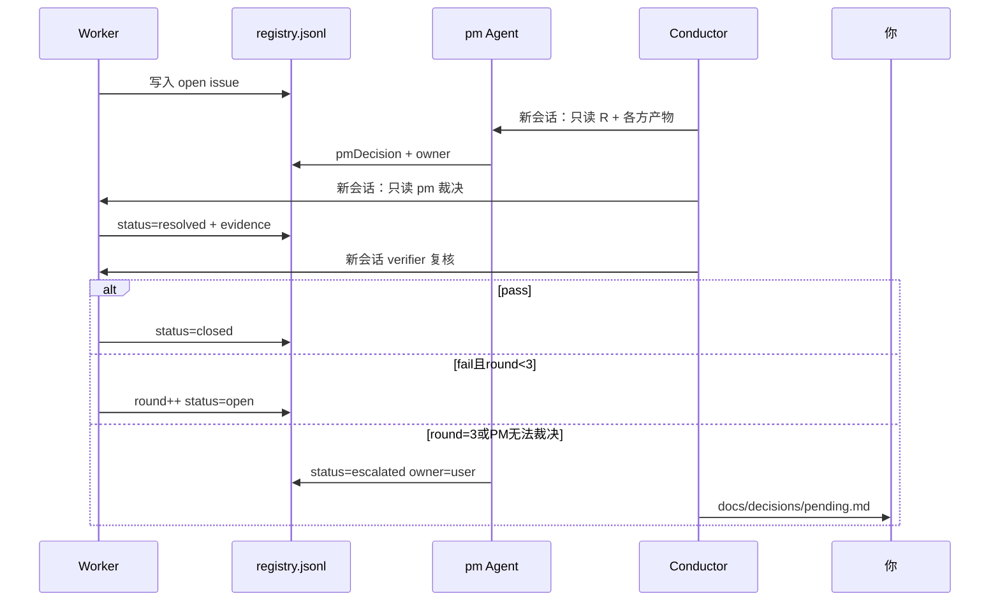

# Issue 协议

## 注册表

唯一文件：`.cursor/session/issues/registry.jsonl`（一行一条 JSON）

## 字段

| 字段 | 说明 |
|------|------|
| id | `ISS-001` 递增 |
| stage | discovery / design / contract / build / verify |
| raisedBy | 提出角色 |
| owner | 责任角色；无法决策填 `user` |
| problem | 问题描述 |
| impact | P0 / P1 / P2 |
| round | 1–3 |
| status | open / resolved / closed / escalated |
| pmDecision | PM 裁决（仅 pm 写） |
| actionRequired | 责任方要做什么 |
| verifier | 复核角色（默认 raisedBy） |
| closeCondition | 关闭条件（可验证） |
| evidence | 证据文件路径数组 |

## 循环

## 硬规则

- 存在 `impact=P0` 且 `status=open` → 对应 Stage Gate **不得** 通过
- PM **不能** closed 自己提出的 P0（须 verifier 或 test skill）
- `escalated` → Conductor **暂停** Build/Verify，直到你写入 `docs/decisions/resolution.md`
- 每个 issue 最多 3 round，超过必须 escalated

## Worker 提 issue 模板

见 [templates/issue.md](../templates/issue.md)
