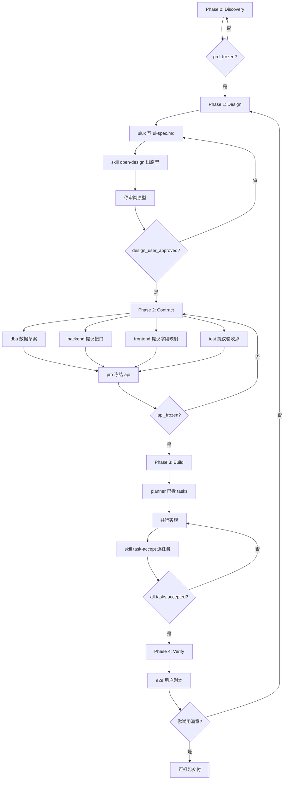

# Work Graph（阶段 DAG）

## 总流程（对应你的第 6 点）

## Phase 0: Discovery

| 步骤 | 角色 | 输入 | 输出 |
|------|------|------|------|
| 0.1 | analyst | `docs/user_requirement.md` | `docs/requirements/analysis.md`, `docs/requirements/legacy-summary.md` |
| 0.2 | pm | 0.1 产出 | `docs/product/prd.md`, `docs/product/understanding.md` |
| 0.3 | pm | 各方 review | 更新 understanding，关闭 blocking issues |
| Gate | pm + 你 | — | `gates.prd_frozen = true` |

**退出标准：** PRD 含 MVP 边界、用户角色、主流程 Mermaid、验收剧本（车系统/che）。

## Phase 1: Design（硬停在你签字）

| 步骤 | 角色 | 输入 | 输出 |
|------|------|------|------|
| 1.1 | uiux | prd + understanding | `docs/design/ui-spec.md`（信息架构、页面、状态、中文文案） |
| 1.2 | skill open-design | ui-spec | `docs/design/DESIGN.md`, `docs/design/prototypes/**/*.html` |
| 1.3 | uiux | 规格 vs 原型 | `docs/design/design-diff.md`（差异说明） |
| 1.4 | **你** | 原型预览 | `docs/design/user-approval.md`（签字/修改意见） |
| Gate | **你** | user-approval | `gates.design_user_approved = true` |

**硬规则：** `design_user_approved = false` → **禁止** Phase 2/3/4，禁止改 `backend/`、`frontend/`、`sql/`。

## Phase 2: Contract（多角色共笔 API）

不是 PM 单人写 `api.md`，而是：

| 步骤 | 角色 | 输出分片 |
|------|------|----------|
| 2.1 | dba | `docs/api/_draft/db-impact.md` |
| 2.2 | backend | `docs/api/_draft/backend-proposal.md` |
| 2.3 | frontend | `docs/api/_draft/frontend-mapping.md` |
| 2.4 | test | `docs/api/_draft/test-contract.md` |
| 2.5 | pm | 合并为 `docs/api/api.md`，裁决冲突 |
| 2.6 | 各角色 | 复核 → issues → pm 关闭 |
| Gate | pm | `gates.api_frozen = true` |

## Phase 3: Build

| 步骤 | 角色 | 说明 |
|------|------|------|
| 3.0 | planner | `docs/tasks/plan.md` + `docs/tasks/TASK-*.md`（含 depends_on、parallel_group、outputs） |
| 3.1 | dba | `sql/init.sql`（若 API 需要新表） |
| 3.2 | backend / frontend | 按任务实现，路径不重叠可并行 |
| 3.3 | skill task-accept | **每个任务单独验收** |
| 3.4 | skill clean-build | 批次构建证据 |

## Phase 4: Verify

| 步骤 | 角色 | 说明 |
|------|------|------|
| 4.1 | test | 跑 `e2e-user-script`（车系统剧本） |
| 4.2 | skill review-gate | 输出 gate-verify.json |
| 4.3 | **你** | 部署试用，写入 `docs/design/user-approval.md` 或 `docs/decisions/` |

## 首期 MVP 用户剧本（验收锚点）

与 `user_requirement.md` 对齐，首期只验一条：

1. 平台管理员创建「车」系统
2. 系统内开通 `che` 成员
3. 建模、发布、授权车辆模块
4. `che` 登录 → 业务运行台 → 增删改查车辆
5. `che` 看不到平台管理/建模/权限入口
