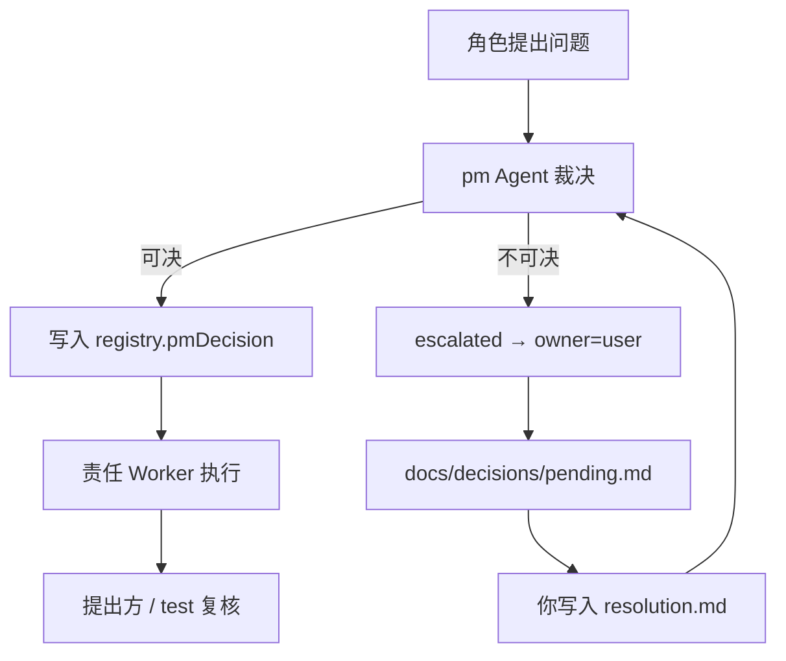

# 决策权限：PM vs 用户

> **是的：日常产品/技术分歧由 PM 裁决；PM 裁不了才找你。**  
> 但有若干事项 **只有你能决**，PM 不得代签。

## 决策流（默认）

## PM 可决策（无需问你）

| 类型 | 示例 |
|------|------|
| issue 归属 | 前端问题分给 frontend 还是 uiux |
| API 草案冲突 | 字段名、错误码、分页参数统一 |
| 任务拆分 | 依赖顺序、并行组、输出路径 |
| MVP 内优先级 | 车系统剧本内先做运行台还是成员页 |
| 冻结建议 | 建议 Conductor 更新 gate（**除用户专属 Gate**） |
| 需求澄清 | analyst 与 prd 的措辞统一 |

## PM 必须 escalated（只有你能决）

| 类型 | 示例 | 落盘 |
|------|------|------|
| **设计确认** | 原型是否满意 | `user-approval.md` |
| **范围变更** | 增加/砍掉 MVP 模块 | `docs/decisions/resolution.md` |
| **规则变更** | 修改 frozen-rules | `docs/decisions/resolution.md` |
| **产品定位** | 平台 vs 单租户 SaaS 取舍 | `docs/decisions/resolution.md` |
| **第三方依赖** | 是否必须用 Open Design / 某 DB | `docs/decisions/resolution.md` |
| **3 轮未闭环** | issue round=3 仍争议 | `pending.md` |
| **试用结论** | 部署后「普通人是否可用」 | 你口头 + `user-trial.md` |

## 用户专属 Gate（PM 不能代签）

| Gate | 签字人 |
|------|--------|
| `design_user_approved` | **仅你** |
| `user_script_passed` 中「试用满意」 | **仅你** |
| `frozen-rules` 变更 | **仅你** |

PM 只可输出 `gate-advice` 建议，Conductor 根据 **落盘文件** 改 state。

## Conductor（当前 Cursor 主会话）做什么

- 调度 Worker、检查 Gate、写 events
- **不做** PM 的产品裁决
- 发现 PM 越权代签 → 开 P0 issue

## 你收到 pending 时看什么

`docs/decisions/pending.md` 含：

1. issue 摘要与各方证据路径
2. PM 倾向（仅供参考）
3. 选项 A/B（或 open）
4. 你写入 `docs/decisions/resolution.md` 后 Conductor 恢复流程

## 与旧 .codex 的差异

| 旧 | 新 |
|----|-----|
| Orchestrator 兼 PM 宣布完成 | 分离；完成靠 evidence + Gate |
| user_questions 散落 | pending + resolution 成对 |
| PM 可 implied 用户同意 | 未写 resolution = 未决 |
