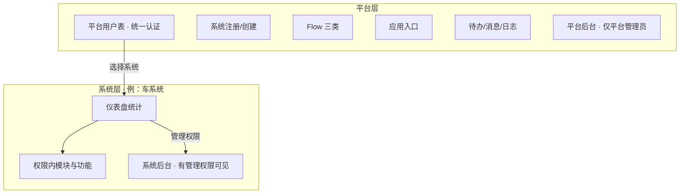
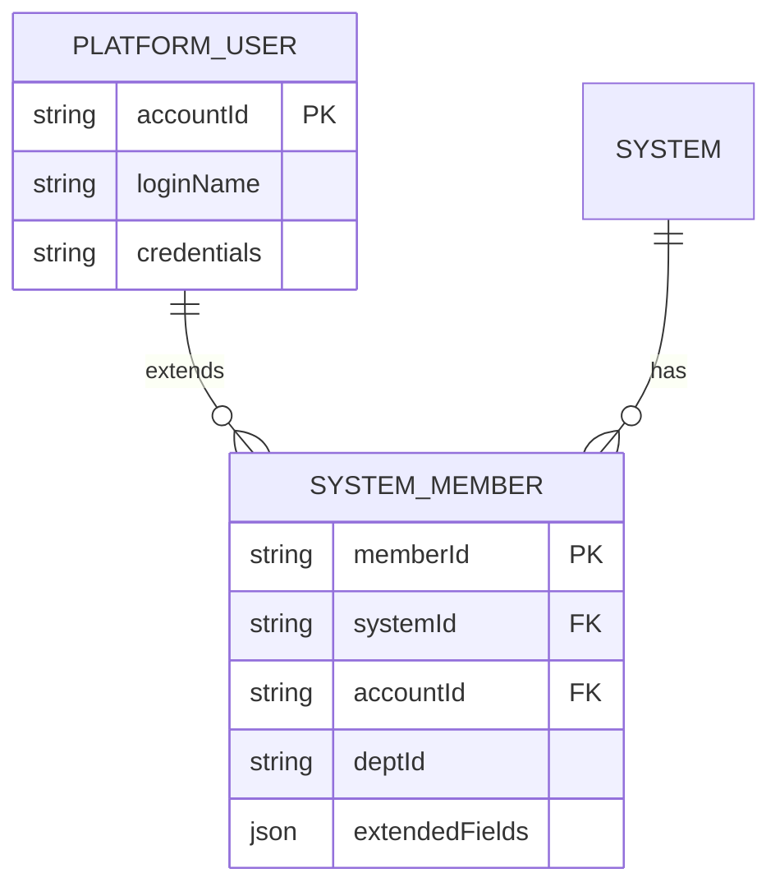

# 领域模型（沉淀版）

> 从 `user_requirement.md` + 用户决策 RES-2026-06-15-001 提炼。PRD/API 须与此一致。

## 1. 两层世界



## 2. 账号模型（统一认证）



| 规则 | 说明 |
|------|------|
| 唯一登录表 | 平台用户表；类统一认证中心 |
| 平台创建用户 | **只能在平台**创建平台用户 |
| 未登录注册 | 注册 **一个系统** + 平台用户；注册人 = 该系统超管 |
| 系统成员 | 平台用户的**扩展**（组织、角色、数据范围、可扩展字段），不能独立登录 |

**与 v1 差异：** 不是「系统里偷偷建一套账号」；添加成员 = 关联/扩展已有平台用户，或邀请后在平台侧建号再绑定。

## 3. 平台登录后信息架构

### 3.1 平台工作台（所有平台用户，按权限裁剪）

| 导航 | 内容 |
|------|------|
| 基础信息 | 个人、平台级基础 |
| 我的系统 | 拥有/被授权的系统列表 |
| Flow | 见 §4 三类流程（平台视角入口） |
| 应用 | 平台视角应用（与系统内应用配置区分） |
| 日志 | 平台/跨系统日志（按权限） |
| 待办 | 跨系统或平台级待办汇总 |
| 消息 | 消息中心 |

### 3.2 选择系统后

| 用户类型 | 默认落点 | 额外入口 |
|----------|----------|----------|
| 普通成员 | **仪表盘统计页** + 权限内模块/功能 | 无系统后台 |
| 系统管理员 | 仪表盘 | **系统后台**（见下表） |
| 平台管理员 | 同上 + 平台全局 | **平台后台管理设置** |

### 3.3 系统后台（需系统管理权限）

- 系统基础信息
- 组织结构
- 角色权限
- 模块菜单
- 功能配置
- 流程配置
- 应用配置
- 日志
- 恢复默认 / 清空数据

### 3.4 平台后台（仅平台管理员）

- 平台用户管理
- 平台角色与全局策略
- 平台级配置、运维、对外应用等

## 4. Flow 三类（平台级产品能力）

| 类型 | 说明 | 典型场景 |
|------|------|----------|
| **基础审批** | 简单审批链 | 单模块记录提交审批 |
| **事件触发审批** | 由业务事件/状态变更触发 | 状态变为 X 自动发起 |
| **大流程** | 表单 + 多节点审批的完整流程 | 复杂 OA、跨步骤业务 |

流程配置可在系统后台；平台 Flow 入口用于跨系统待办、发起、监控（按权限）。

## 5. 页面动作与导出（非模块级）

**动作权限**（同一配置体系）：

| 动作类型 | 示例 |
|----------|------|
| 数据 CRUD | 新建、编辑、删除 |
| 协作 | 转移、添加团队成员 |
| 状态 | 特定状态字段变更 |
| 输出 | **导出**（配置后可导出该业务数据） |

```
模块/页面
  └── 动作配置（新建/编辑/删除/转移/加成员/改状态/导出…）
        └── 角色权限绑定
```

**禁止**把「导出」与「模块」「Flow」画成同级产品域；导出是动作权限的一种。

## 6. 系统内 vs 平台级「应用」

| | 系统内业务应用 | 平台级对外应用 |
|--|----------------|----------------|
| 用途 | 组织模块、菜单、仪表盘业务 | 外部系统 AK/SK 接入 |
| 配置 | 系统后台 · 应用配置 | 平台后台 |
| 后端 | examine-module | examine-app |

## 7. 核心对象关系

```
平台用户 ──扩展为──> 系统成员 ──授予──> 角色 ──控制──> 菜单/动作/字段/数据范围
系统 ──包含──> 业务应用 ──包含──> 模块 ──包含──> 字段、页面 schema、动作（含导出）
模块 ──发布──> 菜单 ──出现在──> 仪表盘/业务功能
流程（三类）──可绑定──> 模块/事件
```

## 8. 默认种子账号

| 字段 | 值 |
|------|-----|
| 登录名 | `plat_admin` |
| 密码 | `123123aa` |
| 角色 | 平台管理员 |

写入 `sql/init.sql`，环境部署即可用。

## 9. 代码生成器

重建 backend 时 **必须**参考 `.oldbk/backend/examine-generator/`：

- 命令即配置
- 产出各模块 `base/`；业务只写 `manage/`

## 10. 日志分层

| 层 | 记录什么 |
|----|----------|
| 平台日志 | 平台用户、系统注册、平台配置、对外应用 |
| 系统日志 | 成员/角色、配置变更、业务数据、流程、导出动作审计 |

## 11. 验收画像

- **plat_admin**：平台后台 + 创建车系统
- **che**：平台用户扩展为车系统成员；进车系统见仪表盘与车辆模块，无系统后台
