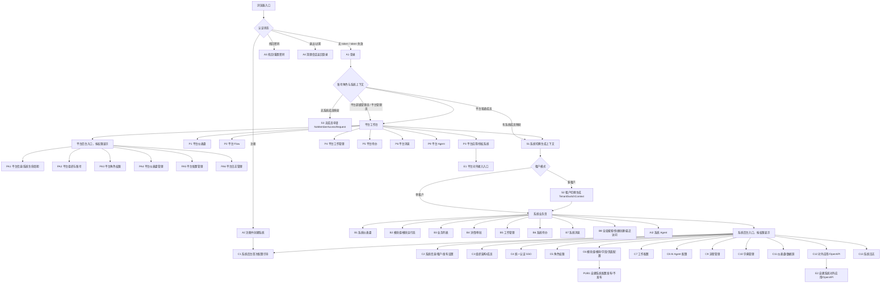
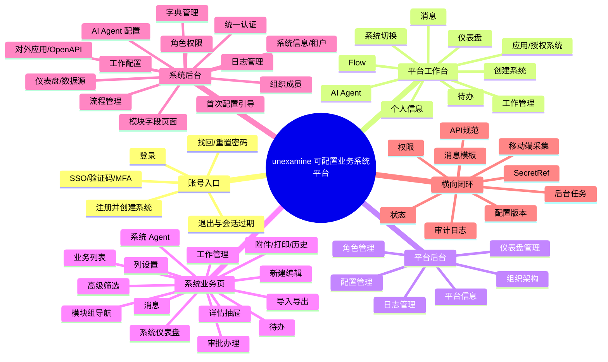

# unexamine 全项目流程图

> 生成时间：2026-07-02  
> 用途：作为后续开发、拆任务、验收时的“项目范围锚点”。  
> 依据：`docs/user_requirement.md`、`docs/design/prototype-brief.md`、`docs/design/prototypes/index.html`、`docs/design/reviews/prototype-latest-2026-06-18.md`、`docs/framework/final-system-flow-blueprint.md`。  
> 边界：本文描述的是需求与锁版原型要求覆盖的完整业务流程，不代表当前实现已经全部完成；最终完成仍以工程证据和用户验收为准。

## 0. 阅读方式

本文不是单纯页面清单，而是把项目拆成：

1. 入口与认证流程。
2. 四套壳：平台工作台、平台后台、系统业务页、系统后台。
3. 六类使用主体：平台超级管理员、平台管理员、平台普通成员、系统管理员、系统普通成员、外部系统。
4. 每条业务从入口、列表、筛选、动作、结果、权限、日志、消息、待办、读回闭环展开。

后续任何开发任务都应能映射到本文中的一个流程编号，例如 `A1 登录`、`P2 平台 Flow`、`B2 运行态模块列表`、`C6 模块配置发布`、`E1 OpenAPI 调用`、`AI2 系统 Agent`。

## 1. 总览流程图



## 2. 思维导图总树



## 3. 角色与默认入口

| 角色 | 登录后默认入口 | 可见主能力 | 禁止/隐藏 |
|---|---|---|---|
| 平台超级管理员 `platform_admin_root` | 平台工作台，个人信息可进平台后台 | 平台仪表盘、Flow、应用授权、创建系统、平台后台、系统切换 | 不能绕过系统成员上下文直接改业务数据 |
| 平台管理员 | 平台工作台，按平台角色权限可进平台后台 | 平台授权、平台配置、平台日志、平台任务、AI 模型授权 | 不能配置系统业务字段，不能直接办理系统业务审批 |
| 平台普通成员 `platform_member` | 平台工作台 | 授权系统、平台 Flow、平台工作、平台待办、平台消息、系统切换申请 | 平台后台、系统后台、未授权系统业务 |
| 系统管理员 `sys_admin_vehicle` | 系统业务页，可从个人信息进系统后台 | 当前系统业务、系统配置、模块字段、角色权限、流程、字典、工作配置、日志 | 平台后台、其他系统数据 |
| 系统普通成员 `che` | 当前系统业务页 | 授权模块、待办、消息、工作、个人信息、系统 Agent | 系统后台、平台后台、无权限模块/字段/动作 |
| 外部系统 | OpenAPI | 按应用 scope 读写授权模块、上传文件、发起流程、查询状态 | 未授权字段、越权数据、无幂等/错误签名调用 |

## 4. 全局入口与认证流程

### A1 登录

路径：

```text
浏览器入口
  > 无 token / token 失效
  > 登录页
  > 账号密码 / MFA / 验证码 / SSO
  > 登录中状态
  > 登录成功
  > 读取 account/me + 系统切换选项
  > 按角色进入平台工作台或系统目标页
```

必须覆盖：

- 输入：账号、密码、MFA/验证码、企业 SSO、短信验证码。
- 错误：账号密码错误、账号停用、登录失败次数锁定、SSO 过期、网络失败、限流。
- 日志：登录方式、MFA、IP、设备、地点、requestId、traceId、失败原因。
- 路由：无 token 时不得渲染平台/系统页面；失效 token 必须清理本地状态。
- 结果：平台角色进入平台工作台；系统直达链接必须先生成系统上下文。

### A2 注册并创建第一个系统

路径：

```text
登录页
  > 注册并创建系统
  > 账号信息
  > 系统名称 / 系统编码 / 租户模式 / 初始化模板
  > 校验
  > 创建平台账号
  > 创建业务系统
  > 创建默认租户 / 默认成员 / 系统超级管理员角色
  > 生成 SystemSwitchContext
  > 进入系统后台首次配置引导
```

必须覆盖：

- 注册成功后不能只生成账号或进入空平台页。
- 创建人成为该系统超级管理员，拥有当前系统后台和业务权限。
- 首次配置引导至少包含：系统信息、组织架构、统一认证、角色权限、模块字段、流程字典、邀请成员、发布前检查、普通成员预览、不发布处理。

### A3 找回/重置密码

路径：

```text
登录页
  > 找回密码
  > 账号/邮箱/手机号
  > 验证码或恢复 token
  > 输入新密码
  > 成功页
  > 返回登录
```

必须覆盖：

- 找回密码是独立页面流程，不是隐藏抽屉或 toast。
- 重置成功后必须能用新密码登录。
- 失败原因清楚：验证码错误、过期、账号停用、限流。

### A4 退出与会话过期

路径：

```text
个人信息
  > 退出登录
  > 清理 access/refresh token
  > 清理平台/系统壳本地状态
  > 返回登录页
```

必须覆盖：

- 过期刷新失败同样返回登录。
- 直接访问系统/平台 URL 时无有效 token 只能看到登录页。

## 5. 平台工作台流程

平台工作台顶部主导航固定为：`仪表盘 / Flow / 应用 / 工作`。右侧固定为：`AI Agent / 系统切换 / 创建系统 / 待办 / 消息 / 个人信息`。平台后台入口只按权限出现在个人信息或明确管理入口中。

### P1 平台仪表盘

路径：

```text
登录
  > 平台工作台
  > 仪表盘默认页
  > 查看授权系统运行概览
  > 查看平台统计
  > 查看任务/授权/发布状态
  > 进入授权详情或任务日志
```

内容：

- 统计：系统数、租户数、平台任务、授权状态、待续期/异常/队列积压。
- 授权系统运行概览：系统、租户、授权状态、成员数、版本、最近发布、系统状态、操作。
- 边界提示：平台不配置业务字段、不办理业务审批、不直接写业务数据。
- 动作：查看授权、任务日志、进入系统切换、创建系统。
- 权限：平台普通成员看不到平台后台；创建系统按平台权限裁剪。

### P2 平台 Flow

路径：

```text
平台工作台
  > Flow
  > Flow 列表
  > 搜索/筛选触发源、影响系统、运行状态
  > 新建平台 Flow
  > 配置触发源、影响系统、节点连线、幂等键、重试/补偿
  > 保存草稿
  > 发布检查
  > 运行批次
  > 查看运行日志 / 失败反馈 / traceId
```

列表要素：

- Flow 名称、触发源、影响系统、最近运行、失败反馈、审计状态、操作。
- 基础能力：搜索、状态筛选、负责人/系统筛选、列表分页、列设置、运行日志导出。
- 动作：新建、复制、启用/停用、查看结果、运行日志、失败重试、补偿任务。
- 结果：平台任务、平台消息、平台日志、运行批次、traceId。
- 禁止：用通用说明抽屉代替 Flow 详情；平台 Flow 不直接写系统业务数据。

### P3 平台应用/授权系统

路径：

```text
平台工作台
  > 应用
  > 已授权系统/应用列表
  > 搜索系统、租户、授权号
  > 查看授权详情
  > 申请授权 / 调整授权 / 新增系统授权
  > 平台审批
  > 平台消息反馈
```

列表要素：

- 授权系统、租户、系统管理员、授权模块、到期时间、数据隔离、状态。
- 平台管理员：新增系统授权、调整授权、停用授权。
- 平台普通成员：查看授权结果、发起申请。
- 结果：authorizationChangeId、requestId、平台待办/消息、平台日志。
- 禁止：平台应用页不能重复放“系统切换”按钮；不能用“进入系统”绕过顶部系统切换。

### P4 创建系统

路径：

```text
平台工作台
  > 创建系统
  > 系统名称 / 编码 / 租户模式 / 模板
  > 创建
  > 后端创建 system/tenant/member/super-admin mapping
  > 新系统出现在系统切换
  > 生成 SystemSwitchContext
  > 进入系统后台首次配置引导
```

必须读回：

- 新系统在系统切换列表可见。
- 创建人拥有系统超级管理员身份。
- 当前上下文指向新系统，不能停留在空白平台页。

### P5 平台工作管理

路径：

```text
平台工作台
  > 工作
  > 仪表盘 / 项目任务 / 普通任务 / 日报
```

仪表盘：

- 我负责的任务、我派发的任务、今日日报、逾期风险。
- 项目进度与预警：项目、负责人、任务组、任务数、完成度、风险。
- 工作日历：任务截止、日报、发布窗、待办。

项目任务：

- 列表/看板互斥切换。
- 列表：搜索项目任务、项目、负责人；筛选项目、状态、标签；分页。
- 看板：列字段来自工作配置，颜色/图标来自数据字典；无分页，按列滚动加载。
- 动作：新建项目任务、AI 提取项目任务、更新、评论、附件、验收、完成。

普通任务：

- 支持一行描述创建，后续补项目、业务对象、标签、截止时间。
- 列表/看板互斥切换；列表分页，看板滚动加载。
- 动作：新建、指派、转交、延期、完成、重新打开。

日报：

- 只展示我的日报列表和筛选。
- 筛选：日期、状态、项目、关键词。
- 动作：写日报、自动生成今日日报草稿、撤回、继续写、导出 PDF。
- 自动草稿必须人工确认，不直接提交。

### P6 平台待办

路径：

```text
平台工作台
  > 顶部待办
  > 左侧待办类型
  > 右侧待办列表
  > 筛选
  > 行点击进入对应平台对象
  > 办理/处理/批量处理
```

左侧类型：

- 全部待办、审批待办、提醒待办、今日需处理、任务失败。

列表字段：

- 类型、标题、来源系统、租户、节点/提醒、到期、状态、操作。

规则：

- 平台待办不显示系统业务模块侧栏。
- 行点击是主动作；操作列只放办理、处理等差异动作。
- 处理结果进入平台任务/消息/日志。

### P7 平台消息

路径：

```text
平台工作台
  > 顶部消息
  > 右侧消息流抽屉
  > 筛选系统/租户/模板/类型/状态/时间/关键词
  > 整条消息点击
  > 跳平台授权、平台任务、平台日志或系统切换
```

规则：

- 平台消息不能直接打开系统业务详情。
- 消息卡片内不放重复“查看/打开/进入”按钮。
- 支持标记已读、全部已读、归档、展开全文。
- 消息模板驱动：templateCode、层级、变量、渠道、跳转目标、去重键、已读回执、免打扰、失败重试、message_delivery_log。

### P8 平台个人信息

路径：

```text
平台工作台
  > 个人信息
  > 个人资料 / 账号安全 / 消息偏好 / 平台后台入口 / 退出登录
```

规则：

- 个人信息不放“授权系统/进入系统”；系统进入统一走顶部系统切换。
- 平台后台入口仅平台管理员/平台超级管理员可见。
- 账号安全包含修改密码、MFA、登录设备、强制下线。

### P9 平台 Agent

路径：

```text
平台工作台
  > AI Agent
  > 对话查询平台授权/日志/任务/模型额度/系统状态
  > 解析结果
  > 平台任务草稿确认
  > 生成平台任务/平台消息/平台日志
```

规则：

- 平台 Agent 只处理平台范围。
- 需要业务数据时，引导用户通过系统切换进入目标系统。
- 平台 Agent 的确认页只生成平台任务，不复用系统业务写入确认。

## 6. 平台后台流程

平台后台左侧固定：`平台信息 / 组织架构 / 角色管理 / 仪表盘管理 / 配置管理 / 日志管理`。平台后台只管理平台级能力，不显示系统业务数据，不配置系统业务字段。

### PA1 平台信息与系统生命周期

流程：

```text
平台后台
  > 平台信息
  > 查看平台基础信息、版本、授权状态、全局数据策略
  > 编辑平台信息
  > 查看系统生命周期状态
  > 启用/停用/删除/恢复系统
  > 生成任务、traceId、审计日志
```

覆盖：

- 平台名称、版本、系统状态、租户授权、全局数据策略。
- 系统生命周期：创建、启用、停用、删除、恢复、禁用原因、审计边界。
- 危险操作必须有原因、后台任务、读回和审计。

### PA2 平台组织架构

流程：

```text
平台后台
  > 组织架构
  > 左侧平台部门树
  > 右侧平台账号列表
  > 搜索/筛选
  > 新增平台成员 / 配置成员
  > 分配平台角色 / MFA / 状态
```

规则：

- 只展示平台组织、平台账号、平台角色。
- 不出现系统业务角色、车辆档案、驾驶员等业务对象。
- 左树右表，部门树可选中并刷新右侧列表。

### PA3 平台角色管理

流程：

```text
平台后台
  > 角色管理
  > 平台角色列表
  > 新增/配置平台角色
  > 配置平台后台入口、菜单、按钮、日志范围
  > 权限预览
  > 保存并刷新权限缓存
```

角色：

- 平台超级管理员：内置唯一，不可删除。
- 平台管理员：平台信息、授权、配置、日志、AI Agent。
- 平台普通成员：平台工作台、平台 Flow、授权系统入口。
- 平台审计员：只读日志、系统状态、版本。

### PA4 平台仪表盘管理

流程：

```text
平台后台
  > 仪表盘管理
  > 新增平台指标
  > 选择数据源
  > 配置可见角色、刷新频率、脱敏策略
  > 保存布局
  > 发布预览
```

组件：

- 租户授权趋势、任务失败分布、系统发布状态、配额预警、授权续期。

### PA5 平台配置管理

流程：

```text
平台后台
  > 配置管理
  > 搜索全局配置
  > 进入具体配置抽屉/页面
  > 保存草稿
  > 发布检查
  > 后台任务/日志/traceId
  > 发布或停用
```

必须包含：

- 账号安全：登录失败锁定、MFA、强制下线。
- 统一认证/企业 SSO：OIDC、SAML、OAuth2、LDAP/AD、企业微信/钉钉、证书/JWKS、回调、域名白名单、属性映射、JIT、MFA、测试发布、登录审计。
- 消息模板与通知渠道：站内消息、待办、邮件、短信、Webhook、模板变量、跳转目标。
- AI Agent 模型授权：本地模型、外部模型、API 地址、SecretRef、额度、并发、脱敏、数据出境、授权系统。
- 容量配额和限流：用户数、系统数、字段数、导入导出并发、OpenAPI 调用次数。
- 平台功能开关：按平台角色或授权系统控制平台侧功能可见性，不承接 examine2 项目级发布策略。
- 平台配额与限流：系统数、成员数、字段数、导入导出并发、OpenAPI 调用次数。
- 平台级 API 规范：requestId、traceId、错误码、幂等键、分页筛选、权限/字典/页面配置失效。
- 平台配置版本：身份源、消息模板、模型授权、平台 Flow、平台应用的保存、发布、停用和版本读回。

### PA6 平台日志管理

流程：

```text
平台后台
  > 日志管理
  > 左侧日志类型树
  > 右侧统一日志列表
  > 筛选/列设置/导出
  > 行点击日志详情
  > 风险复核/信任设备/下载错误文件
```

左侧类型：

- 全部平台日志、平台登录日志、平台业务日志、风险事件、导出与后台任务。

详情字段：

- logType、actor、systemId、tenantId、requestId、traceId、auditLogId、IP/设备、权限快照、字段脱敏、before/after、错误原因、下一步修复入口。

规则：

- 右侧不再重复放日志类型下拉作为主分类。
- 操作列不放“查看详情”；行点击承担详情主动作。

## 7. 系统切换与上下文流程

### S1 进入系统

路径：

```text
平台工作台系统切换 / 直接访问 /systems/{systemId}/...
  > 检查目标系统授权
  > POST /platform/system-switch
  > 生成 SystemSwitchContext
  > 重绘系统业务壳
  > 进入目标路由
```

`SystemSwitchContext` 必含：

- systemId
- tenantId
- accountMemberBindingId
- systemMemberId
- effectiveRoleIds
- dataScope
- permissionSnapshotSummary
- messageTodoScope

重绘内容：

- 系统名称、租户、顶部模块分组、左侧模块、业务列表、待办、消息、字段权限、数据范围、AI 策略范围。

禁止：

- 只换 URL 或标题但仍显示旧系统数据。
- 用平台账号 ID 直接读写系统业务数据。
- 平台内置超级管理员绕过系统成员映射。

### S2 租户切换

路径：

```text
系统业务页
  > 多租户系统显示租户切换
  > 选择租户
  > 生成 TenantSwitchContext
  > 重绘模块、数据、待办、消息、权限
```

规则：

- 单租户隐藏租户切换。
- 多租户显示禁用原因。
- 租户切换必须改变 tenantId、tenantRoleIds、tenantDataScope、isTenantSwitchable、disabledReason。

### S3 无系统成员申请

路径：

```text
认证成功 / 访问目标系统
  > 没有 systemMemberId
  > NoMemberAccessRequest
  > 填申请理由/申请角色
  > 系统管理员审核
  > 绑定员工、角色、数据范围
  > 审核通过后才能系统切换
```

对象字段：

- requestId、status、identityProvider、externalUserId、targetSystemId、tenantId、requestRole、approverId、approveResult、roleIds、dataScope、rejectReason、traceId。

禁止：

- SSO 登录成功后自动授予系统业务权限。

## 8. 系统业务页流程

系统业务页采用 CRM 骨架：顶部模块分组，左侧组内模块，右侧列表/详情。运行态不能混入后台配置控件。

### B1 系统仪表盘

路径：

```text
系统切换
  > 系统业务页
  > 仪表盘默认页
  > 查看当前系统业务概览、工作/待办/消息摘要
  > 有模块则进入模块
  > 无已发布模块时，系统管理员看到配置引导
```

内容：

- 当前系统名称和上下文标签。
- 仪表盘组件：统计卡、趋势、列表组件、待办、KPI、任务摘要。
- 数据来源必须来自已发布仪表盘配置/数据源，不能是写死欢迎页。
- 普通成员不得看到后台配置入口。

### B2 模块组与模块导航

路径：

```text
系统业务页
  > 顶部模块分组
  > 点击车辆管理/合同管理/客户管理
  > 左侧显示组内模块
  > 点击车辆档案/维保记录/驾驶员
  > 右侧加载该模块列表
```

规则：

- 模块组只负责运行态导航和发布关系，不是业务数据父级。
- 业务数据归属 systemId/tenantId/moduleId。
- 只显示当前角色有权限的模块组和模块。
- 左侧模块必须指向独立模块列表或明确模块占位页，不能把筛选/列设置/详情伪装成模块入口。

### B3 业务列表

以车辆档案为原型，所有模块列表复用这一套运行逻辑。

路径：

```text
模块列表
  > 搜索
  > 场景/保存视图
  > 高级筛选
  > 列设置
  > 排序/分页
  > 勾选批量
  > 导入/导出
  > 新建
  > 行点击详情
```

工具栏：

- 搜索：例如搜索车牌、品牌型号、驾驶员。
- 场景：全部、在用、待年检、维保中、我负责的。
- 高级筛选：车辆状态、归属部门、驾驶员、购置日期、年检到期、最近维保。
- 列设置：显示/隐藏、拖拽排序、列宽、固定列、保存为我的表头。
- 导入：模板下载、上传文件、字段匹配、预检查。
- 导出：全部导出、导出选中、字段/格式/范围/后台任务。
- 新建：右侧抽屉打开表单。

表格要求：

- 复选框、收藏、序号、主字段、业务字段、状态、负责人/部门、时间字段、操作列。
- 表头支持排序/筛选。
- 列表分页，返回 pageNo、pageSize、total、traceId。
- 行点击打开右侧详情；按钮/复选框/输入框不触发行点击。

勾选批量态：

- 已选 N 条。
- 转移、删除、导出选中、批量编辑、清除选择。
- 数据状态不允许时禁用并显示短原因，例如流程锁定、无权限、维保中不能删除。

### B4 新建与编辑表单

路径：

```text
模块列表
  > 新建
  > 右侧表单抽屉
  > 字段按已发布 schema 渲染
  > 必填/唯一/格式校验
  > 保存草稿 / 提交
  > 成功后列表和详情读回
```

车辆字段示例：

- 车牌号、品牌型号、车辆状态、归属部门、驾驶员、购置日期、年检到期、最近维保、备注。

规则：

- 表单字段、隐藏、只读、默认值、校验、脱敏来自发布版字段配置和权限。
- 保存同时处理主数据、自定义字段值、子表、附件、关联关系、团队成员、历史、流程触发。
- 失败不能半成功；错误字段必须定位。
- 表单草稿可恢复。

### B5 详情与审批

路径：

```text
列表行点击
  > 右侧详情工作区
  > 查看摘要
  > 切换详情 tab
  > 查看审批面板
  > 按权限编辑/转移/删除/打印/更多
  > 审批同意/拒绝/转办/加签
  > 状态回写
  > 操作日志/消息/待办更新
```

详情结构：

- 顶部：模块标签、主标题、收藏、上一条/下一条、转移、编辑、删除、打印、更多。
- 摘要：部门、负责人、车辆状态、年检到期、最近维保、审批状态。
- 标签页：详细资料、团队成员、费用/预算/分摊、附件、打印记录、操作记录。
- 右侧审批面板：当前节点、处理人、超时、审批动作、审批历史、流程图入口。

审批规则：

- 审批中按规则禁用编辑、删除、转移。
- 拒绝、撤回、终止必须填写原因。
- 当前登录人不是处理人时隐藏或禁用审批按钮，并说明当前处理人。
- 审批通过后写回业务状态、流程状态、历史、待办、消息、日志。
- 重复审批动作必须幂等。

更多动作：

- 复制为新记录、转移、归档、发起审批、查看操作日志。
- 操作列和更多动作不能重复“查看详情”。

### B6 附件、文件、打印

附件流程：

```text
表单/详情
  > 上传文件
  > 文件校验
  > 绑定业务记录
  > 预览/下载/版本
  > 操作日志
```

必须覆盖：

- 上传、预览、下载、删除、缩略图、引用关系、存储配置。
- 本地存储/对象存储、大文件分片、预览失败下载。
- 文件删除前检查引用。
- 移动端扫码/拍照上传进入附件草稿、业务对象绑定、权限脱敏、失败重试和业务日志。

打印流程：

```text
详情
  > 打印
  > 选择模板
  > 预览
  > 打印/下载
  > 打印记录
```

必须覆盖：

- 模板名称、版本、打印人、时间、结果。
- 打印模板绑定模块字段、关联字段、子表、页眉页脚、签章区。

### B7 导入导出

导入：

```text
列表工具栏
  > 导入
  > 下载模板
  > 上传文件
  > 字段匹配
  > 预检查
  > 错误行下载
  > 确认导入
  > 后台任务
  > 批次结果
  > 回滚或不可回滚原因
```

导出：

```text
列表工具栏
  > 导出
  > 全部导出 / 导出选中
  > 范围、字段、格式、脱敏
  > 权限过滤
  > 后台任务
  > 完成消息
  > 下载结果文件
  > 审计日志
```

规则：

- 导入导出不常驻列表下方。
- 大任务进入统一后台任务模型。
- 字段权限决定导出字段和脱敏。
- 导入不能覆盖系统字段、审计字段、自动编号字段。
- 导入失败不能污染数据。

### B8 系统工作管理

路径：

```text
系统业务页
  > 工作
  > 仪表盘 / 项目任务 / 普通任务 / 日报
```

与平台工作管理同模型，但范围为当前 system/tenant/member。

必须覆盖：

- 项目、任务组、项目任务、普通任务、日报、日历、统计。
- 项目任务和普通任务分标签，不混成一个任务页。
- 列表/看板互斥切换，列表分页，看板滚动加载。
- 看板列/泳道来自工作配置已发布字段，颜色图标来自数据字典。
- 日报只展示我的日报列表和筛选；自动草稿必须人工确认。
- 任务可关联系统、租户、模块、业务对象；跳转仍受业务对象权限控制。

### B9 系统待办

路径：

```text
系统业务页
  > 顶部待办
  > 左侧待办类型
  > 右侧待办列表
  > 筛选
  > 行点击业务对象/任务详情
  > 审批在详情右侧面板办理
```

类型：

- 全部待办、审批待办、提醒待办、今日需处理、超时/即将超时、抄送待阅、任务失败。

规则：

- 待办是独立工作台，隐藏业务模块侧栏。
- 发起人不能看到审批人待办。
- 审批人只能处理分配给自己的待办。
- 已处理和待处理状态分开。

### B10 系统消息

路径：

```text
系统业务页
  > 顶部消息
  > 右侧消息流抽屉
  > 筛选
  > 整条点击跳业务对象/审批详情/任务/日报/日志
```

筛选：

- 系统、租户、模板、来源、类型、已读、归档、时间、关键词。

规则：

- 系统消息只在当前系统成员上下文内跳转业务对象。
- 卡片内不堆重复详情按钮。
- 标记已读、全部已读、归档必须有可见结果。

### B11 日常效率入口

入口：

- 全局搜索、最近访问、收藏菜单、快捷创建、表单草稿、错误字段定位、移动端扫码/拍照上传。

流程：

```text
系统业务页
  > 全局搜索
  > 查询车辆/待办/日志/任务
  > 按权限展示结果
  > 定位详情/办理/日志
```

```text
系统业务页
  > 快捷创建
  > 选择车辆草稿/任务/日报/附件采集
  > 进入对应抽屉
  > 保存草稿或提交
```

规则：

- 所有效率入口仍受角色、字段、数据范围、脱敏控制。

## 9. 系统后台流程

系统后台左侧固定：`系统信息 / 组织架构 / 统一认证 / 角色管理 / 模块管理 / 工作配置 / AI Agent 配置 / 流程管理 / 字典管理 / 仪表盘管理 / 数据源 / 对外应用 / 日志管理`。系统后台不显示普通业务列表和审批办理页。

### C1 首次配置引导

路径：

```text
注册创建系统 / 创建系统后
  > 系统后台
  > 系统初始化引导
  > 逐步进入真实后台页面
  > 发布检查
  > 普通成员预览
  > 发送登录入口
```

步骤：

1. 系统信息：名称、图标、编码、租户模式、默认时区、编号规则。
2. 组织架构：部门树、员工、岗位、成员映射。
3. 统一认证：继承平台身份源、组织映射、员工绑定、JIT、无权限反馈。
4. 角色权限：系统超管、业务角色、字段权限、后台入口权限。
5. 模块与字段：模块组、模块、字段、列表、筛选、场景、动作。
6. 流程与字典：审批类型、状态字典、任务/日报字典、发布检查。
7. 邀请成员：邀请普通成员、分配角色、验证系统切换。
8. 发布业务首页：发布前检查、普通成员预览、登录入口、不发布处理。

规则：

- 每一步必须链接到真实后台页面并显示读回状态。
- 不能只是营销 stepper。
- 阻塞项必须显示原因和修复入口。

### C2 系统信息、租户与发布设置

流程：

```text
系统后台
  > 系统信息
  > 编辑基础信息
  > 配置单/多租户
  > 查看当前系统发布状态
  > 保存草稿 / 发布 / 不发布 / 停用
```

覆盖：

- 系统名称、图标、编码、域名/访问地址、默认首页、参数、系统内功能开关。
- 租户模式：单租户隐藏租户切换；多租户配置默认租户、租户管理员、租户角色映射、租户域名、配额、日志。
- 切换租户模式影响：历史数据、权限、OpenAPI、导入导出、仪表盘、数据源、日志。
- 发布状态：未发布、已发布、停用、发布失败；展示阻塞项、影响范围、最后发布版本和运行态读回入口。
- 边界：这里描述自建系统配置是否发布到运行态，不描述 examine2 项目级运行维护。

### C3 组织架构与成员

流程：

```text
系统后台
  > 组织架构
  > 左侧部门树
  > 右侧员工列表
  > 新增/导入员工
  > 分配部门、岗位、角色、状态、数据范围
```

规则：

- 左树右表，部门树 240-280px。
- 树节点支持新增子部门、重命名、停用。
- 员工详情抽屉包含基础信息、部门、角色、登录安全、systemMemberId。
- 人员字段、流程审批人、数据权限共用成员数据。

### C4 系统统一认证

流程：

```text
系统后台
  > 统一认证
  > 左侧配置树
  > 身份源继承
  > 域名与租户范围
  > 组织映射
  > 员工绑定
  > JIT 与无权限反馈
  > 测试发布与登录日志
```

覆盖：

- 系统只继承平台已发布身份源，不在系统内维护 secret 明文。
- 外部部门映射系统部门树。
- externalUserId/email/mobile/employeeNo 绑定平台账号、系统员工、systemMemberId。
- 未匹配部门/员工进入预检、草稿、人工确认、同步任务。
- 发布检查包含回调、域名、属性样本、组织映射、成员映射、无权限页、登录日志 traceId。

### C5 系统角色权限

流程：

```text
系统后台
  > 角色管理
  > 左侧角色列表
  > 成员分配
  > 菜单/模块权限
  > 动作权限
  > 字段权限
  > 数据权限
  > 权限预览
  > 保存并刷新缓存
```

权限维度：

- 后台入口权限。
- 菜单/模块可见。
- 动作：查看、新建、编辑、删除、转移、导入、全部导出、导出选中、批量编辑、打印、审批。
- 字段：可见、可编辑、列表显示、详情显示、导出、脱敏。
- 数据范围：全部、本人、本部门、本部门及下级、指定部门、指定成员、按字段规则。
- 审批节点字段权限。

预览：

- 切换 che/sys_admin_vehicle/platform_member/platform_admin_root。
- 展示最终菜单、按钮、字段、数据范围、拒绝原因。
- 前端隐藏只是体验，后端必须兜底拒绝。

### C6 模块组、模块、字段、页面配置

模块配置主链：

```text
模块组
  > 模块
  > 字段
  > 列表
  > 筛选
  > 场景
  > 页面动作
  > 导入导出
  > 打印模板
  > 权限预览
  > 发布检查
  > 发布
  > 运行态读回
```

模块组：

- 创建、编辑、删除、排序、归属模块、可见角色、发布后进入运行态顶栏。

模块：

- 创建、编辑、删除、复制、主字段、字段、页面、流程绑定、数据量、状态、菜单可见、最近发布。
- 删除前检查数据和依赖。

字段：

- 基础：文本、多行文本、手机号、邮箱、URL、身份证号、数字、百分比、金额、日期、日期时间、日期范围、时间、时间范围、开关。
- 选项：单选、多选、级联、标签、状态。
- 组织：人员、部门、组织/租户。
- 媒体：附件、图片、文件组、签名、条码/二维码。
- 业务：自动编号、关联数据、引用字段、子表、地址、地理位置、评分、进度。
- 高级：公式、汇总、查找、聚合、JSON、密码/密钥、系统字段、AI 填充字段。

字段配置：

- 显示名称、编码、类型、必填、默认值、提示、排序、隐藏、只读、搜索、筛选、列表、详情、权限。
- 校验：长度、范围、精度、正则、唯一、条件必填、重复检查。
- 列表规则：默认列、列宽、固定列、排序、筛选、导出、脱敏。
- 选项规则：字典绑定、颜色、图标、停用历史。
- 关联规则：目标模块、显示字段、筛选条件、反向关联、允许新增。
- 子表规则：列、行权限、汇总、最小/最大行数、导入导出。

页面配置：

- 列表页：显示列、固定列、列宽、排序、搜索、高级筛选、分页、批量、保存视图。
- 表单页：分组、两列、折叠、只读、隐藏、联动、必填、子表、附件、草稿。
- 详情页：字段、附件、关联数据、子表、流程状态、变更历史、评论。
- 仪表盘页：指标、图表、排行、进度、待办、KPI、列表组件。

页面动作：

- 新建、编辑、删除、转移、导入、全部导出、导出选中、批量编辑、打印、审批。
- 配置动作位置、按钮文案、权限点、禁用规则、二次确认、日志记录、是否批量。

发布：

- 主字段、默认列、默认场景、动作权限、角色覆盖、导入导出、打印模板、影响范围。
- 运行态只使用已发布版本。
- 历史数据和打印记录保留当时配置版本。
- 支持不发布、停用或恢复到旧配置版本，并展示影响范围。

### C7 工作配置

流程：

```text
系统后台
  > 工作配置
  > 项目任务字段
  > 普通任务字段
  > 日报字段
  > 看板字段
  > 字段权限
  > 发布检查
  > 发布/不发布
```

规则：

- 工作配置是系统后台一级页面。
- 不显示统计卡片。
- 不直接维护状态/标签选项；选项来自数据字典。
- 看板列/泳道只能选择已发布的下拉单选或多选字段。
- 发布检查覆盖字段、字典、权限、看板、日报自动统计、历史兼容性。

### C8 AI Agent 配置

流程：

```text
系统后台
  > AI Agent 配置
  > 模型来源
  > AgentPolicyScope
  > 模块/字段/动作/数据范围
  > 确认策略
  > 脱敏/外发限制
  > 发布检查
  > 审计日志
```

必须覆盖：

- 平台授权模型、本地模型、系统第三方模型。
- AgentPolicyScope：moduleScope、fieldScope、actionScope、dataScopeExpression、外发限制、脱敏策略、策略版本。
- 查询、写入、低置信度、批量修改、导出、发起流程都必须按权限和二次确认控制。
- 每次运行记录策略版本、模型授权版本、提示词版本、权限快照、工具调用、外部发送数据快照、人工确认人。

### C9 流程管理

配置流程：

```text
系统后台
  > 流程管理
  > 流程列表/版本列表
  > 选择绑定模块和触发事件
  > 画布设计
  > 节点属性
  > 条件分支
  > 模拟运行
  > 发布检查
  > 发布
  > 运行态发起/待办/审批/日志
```

流程页面：

- 筛选：模块、审批类型、触发事件、状态、版本、创建人、更新时间。
- 节点库：开始、审批、条件分支、并行网关、合并网关、抄送、填写表单、任务、通知、字段更新、数据创建/更新、外部 API/Webhook、等待、定时器、子流程、AI 辅助、结束。
- 画布：节点、连线、箭头、条件标签。
- 属性面板：节点类型不同，字段不同。

审批节点：

- 审批方式：或签、会签、顺序会签。
- 审批人来源：成员、角色、部门、部门负责人、直属上级、字段人员、上一节点处理人。
- 字段权限：可见、可编辑、必填、隐藏。
- 操作：同意、拒绝、转办、加签、退回、撤回、评论、附件。
- 超时、代理、委托、候选领取、会签比例、状态回写。

运行流程：

```text
模块事件 / 手动发起 / OpenAPI / 导入完成
  > 匹配流程绑定
  > 优先级和互斥
  > 复制发布版本快照
  > 创建流程实例
  > 创建待办/消息
  > 审批处理
  > 回写记录状态
  > 历史/日志/消息更新
```

发布检查：

- 无开始/结束、审批人为空、字段权限冲突、条件循环、外部 API 未测试、断线、死路。

### C10 字典管理

流程：

```text
系统后台
  > 字典管理
  > 字典类型
  > 字典项
  > 颜色/图标/语义/排序/默认项
  > 启用/停用
  > 引用影响分析
  > 发布检查
  > 发布
```

类型：

- 普通字典、树形字典、级联字典、状态字典、标签字典、字段选项字典、系统内置字典。

状态字典：

- 颜色、图标、语义、排序、默认项、是否终态、是否允许停用。
- allowedTransitions、terminal、rollbackAllowed、flowLocked、停用历史、流程占用说明。

引用影响：

- 字段、列表筛选、流程条件、仪表盘、导入模板、看板列/泳道、日历标记。

### C11 仪表盘管理与数据源

仪表盘管理：

```text
系统后台
  > 仪表盘管理
  > 组件库
  > 画布
  > 绑定数据源
  > 配置统计方式/筛选/刷新/跳转
  > 可见角色
  > 发布预览
```

组件：

- 指标卡、折线图、柱状图、饼图、排行、进度条、待办列表、数据列表、KPI。

数据源：

```text
系统后台
  > 数据源
  > 系统内 / 外部 API / 数据库直连
  > 连接配置
  > 字段映射
  > 测试
  > 发布
  > 被仪表盘/KPI/报表/Agent 使用
```

规则：

- 数据源不是业务模块，而是可查询视图。
- 数据源有发布版本、权限、脱敏、失败反馈。

### C12 对外应用与 OpenAPI

配置流程：

```text
系统后台
  > 对外应用
  > 创建应用
  > 配置 OpenApiSecretRef
  > 配置 scope
  > IP 白名单 / 限流 / 回调
  > 授权模块/动作/字段/数据
  > 发布
  > 调用日志
```

对象：

- 应用名称、状态、入口地址、凭证引用、授权范围、回调、限流、最近使用、轮换状态。

规则：

- 对外应用是 OpenAPI 入口，不是模块父级。
- secret 只显示 SecretRef、版本、轮换状态、到期、最近使用，不回显明文。
- 密钥轮换走 SecretRotationJob：新版本、双写验证、切换生效、旧版本停用、失败回滚、审计。

### C13 系统日志管理

流程：

```text
系统后台
  > 日志管理
  > 左侧日志类型树
  > 右侧统一列表
  > 筛选 / 列设置 / 导出
  > 行点击详情
  > 差异动作
```

左侧类型：

- 全部系统日志、登录日志、业务日志、风险事件、导入导出/后台任务、AI Agent。

业务日志覆盖：

- 字段变更、审批、导入导出、OpenAPI、后台任务、AI Agent、文件、错误、权限拒绝。

详情：

- 日志类型、主体、来源、IP/设备、requestId、traceId、auditLogId、字段差异、脱敏结果、权限快照、审批节点快照、错误原因、修复入口。

## 10. 外部接入流程

外部接入不是一个孤立模块，它有两个入口：

- 平台入口：平台侧应用/授权能力，管理平台范围的开放能力，不能直接授权系统业务数据。
- 自建系统入口：系统后台的对外应用/OpenAPI，授权当前系统内的模块、字段、动作、流程和数据范围。

### E1 平台对外接入入口

路径：

```text
平台工作台 / 平台后台
  > 应用 / 授权
  > 创建平台应用或平台授权入口
  > 配置平台 scope
  > 绑定平台 Flow / 平台任务 / 平台消息 / 平台日志能力
  > 发布或停用
  > 查看平台调用日志
```

能力：

- 平台授权申请、平台 Flow 发起、平台任务创建、平台消息回调、平台日志查询。
- 平台模型额度、系统授权状态、平台级系统切换引导。

禁止：

- 平台应用不能直接读写某个自建系统的业务模块记录。
- 需要系统业务数据时，必须进入目标系统，由系统后台对外应用授权。

### E2 自建系统对外应用 / OpenAPI

路径：

```text
系统后台
  > 对外应用
  > 创建应用
  > 配置 OpenApiSecretRef 版本
  > 配置模块/动作/字段/数据范围/Flow scope
  > IP 白名单 / 限流 / 回调
  > 发布或停用
  > 外部系统按 scope 调用
  > 系统调用日志
```

能力：

- 创建记录、编辑记录、删除记录、查询列表、查询详情、上传文件、发起流程、查询流程状态、维护关联关系。

错误：

- wrong secret、read-only scope、缺幂等键、限流、字段无权限、数据越权、签名过期。

日志：

- 调用方、应用、secret 版本、scope、耗时、结果、错误码、脱敏请求/响应、traceId。

边界：

- 导入导出不是外部接入入口，它是系统后台模块动作配置后，在系统业务页模块列表工具栏出现的运行态动作。
- 导入导出细节仍归 `B7` 和 `14.6`。

## 11. AI 流程

### AI1 平台 Agent

入口：

- 平台工作台顶部 AI Agent。
- 平台后台 AI 模型授权和平台 Agent 策略配置。

允许：

- 平台授权、平台日志、平台任务/消息、模型额度、系统切换引导、平台 Flow 查询。

禁止：

- 未通过系统切换直接读写系统业务记录。

流程：

```text
平台 Agent 对话
  > 解析意图
  > 平台范围查询/任务草稿
  > 人工确认
  > 平台任务/消息/日志
```

### AI2 系统 Agent

入口：

- 系统业务页顶部或右侧系统 Agent。
- 系统后台 AI Agent 配置。

允许：

- 当前 system/member/role/dataScope 内的模块数据查询、统计、任务提取、日报草稿、确认后写入。

流程：

```text
系统 Agent 对话
  > 解析目标系统/模块/字段/对象
  > 权限和脱敏裁剪
  > 低置信度补充
  > 写入确认页
  > 保存草稿/进入审批/失败补偿
  > 业务日志 traceId
```

查询规则：

- 返回口径：系统、租户、模块、时间范围、筛选条件。
- 查询结果受字段权限、数据范围、脱敏规则限制。
- 导出、批量修改、发起流程必须二次确认。

写入确认：

- 来源对话、模型、提示词版本、字段差异、旧值/新值、置信度、权限裁剪、校验失败、写入结果、失败补偿。

## 12. 自建系统发布 / 不发布流程

本节只描述用户创建的自建系统内部“配置是否发布到运行态”，不描述 examine2 项目级运行维护或交付事项。

### PUB1 配置发布 / 不发布

路径：

```text
系统后台
  > 模块 / 字段 / 列表 / 筛选 / 场景 / 动作
  > 流程 / 字典 / 工作配置 / 仪表盘 / 数据源 / Agent 策略 / 对外应用
  > 保存草稿
  > 发布检查
  > 选择发布或不发布
  > 发布后运行态读回
```

发布对象：

- 模块组、模块、字段、列表、筛选、场景、页面动作、打印模板、导入导出动作。
- 流程、字典、工作配置、仪表盘、数据源、AI Agent 策略、对外应用。

状态：

- 草稿：只在后台可见，不影响普通用户运行态。
- 发布检查失败：展示阻塞项、影响范围、修复入口、traceId。
- 已发布：运行态使用发布版本，并保留版本号和快照。
- 不发布：草稿保留，不进入运行态。
- 停用：运行态隐藏入口或禁用能力，历史数据和日志仍可查。

必须读回：

- 普通成员运行态能看到已发布模块、字段、动作、流程、字典和仪表盘。
- 未发布草稿不得泄漏到运行态、OpenAPI、AI 查询和导出。
- 发布历史记录发布人、时间、版本、影响范围、结果和审计日志。

## 13. 横向规则闭环

### 13.1 权限闭环

所有流程都必须同时满足：

- 菜单隐藏或无权限页。
- 按钮隐藏或禁用并说明原因。
- 字段可见/可编辑/可导出/脱敏。
- 数据范围过滤。
- 后端兜底拒绝。
- 权限预览与运行态一致。
- 403 反馈包含缺失权限、当前角色、申请入口、requestId。

### 13.2 状态闭环

状态必须可见：

- 加载、空状态、无权限、错误、禁用、后台任务状态。
- 草稿、发布检查失败、不发布、已发布、停用。
- 审批中、通过、拒绝、撤回、终止。
- 导入导出 queued、processing、success、partial_success、failed、canceled。
- OpenAPI 成功、失败、限流、签名错误、scope 不足。

状态颜色统一：

- 灰：待处理、未开始、草稿。
- 蓝：处理中、审批中、当前。
- 橙：待确认、临期、低置信度。
- 绿：完成、通过、成功、有效。
- 红：失败、拒绝、逾期、停用、暂停。

### 13.3 审计闭环

关键动作必须写日志：

- 登录、SSO、系统切换、租户切换。
- 配置保存、发布、不发布、停用。
- 业务新增、编辑、删除、恢复。
- 审批处理、转办、加签、撤回、终止。
- 导入导出、文件上传、打印、OpenAPI。
- AI 查询、写入、失败、人工确认。
- 密钥轮换、配置发布、配置停用。

日志必须可追：

- requestId、traceId、auditLogId、actor、systemId、tenantId、moduleId、objectId、before/after、权限快照、脱敏快照、错误原因。

### 13.4 后台任务闭环

所有长任务统一：

- 导入、导出、发布检查、AI 写入、密钥轮换。
- 返回 taskId、idempotencyKey、progress、resultFile、errorFile、retryable、cancelable、traceId。
- 消息/待办/日志能追踪任务结果。

### 13.5 配置发布闭环

草稿配置不能直接影响运行态：

- 模块字段、列表、筛选、场景、动作、打印模板、导入导出、流程、字典、工作配置、Agent 策略、仪表盘、数据源都要有草稿/发布/不发布/版本。
- 发布检查必须列出影响范围、失败项、修复入口、traceId。
- 运行态只读已发布版本。

## 14. 功能归类、使用时机、权限和业务逻辑

本节不是新的功能清单，也不新增一级模块。它只定义“怎么读前面的功能结构”：先确认功能归属，再说明什么时候用、谁能用、背后的业务逻辑是什么、结果如何读回。

归类原则：

- 功能必须挂在所属产品域下，不能因为有后台任务、错误状态或日志就单独抬成一级功能。
- 导入、导出、打印、批量编辑、转移、删除等都属于“模块页面动作”，由系统后台模块配置发布，在系统业务页模块列表或详情中使用。
- 附件属于字段、评论、审批、导入导出结果或文件对象的组成部分，不能脱离业务对象单独成为主流程。
- 待办、消息、日志是业务动作的结果承接和追踪入口，不替代原业务对象。
- OpenAPI 和 AI 都有平台入口与自建系统入口；平台入口只能处理平台对象，自建系统入口只能在当前系统权限范围内处理业务对象。
- 发布/不发布是自建系统配置进入运行态的状态，不是 examine2 项目的运行维护流程。

每个功能都按四个维度读：

| 维度 | 回答的问题 | 写在哪里 |
|---|---|---|
| 功能结构 | 它属于平台工作台、平台后台、系统业务页还是系统后台？ | 章节 5-12 |
| 使用时机 | 用户在什么路径、什么状态下用它？ | 本节“使用时机”说明 |
| 角色权限 | 哪些角色可见、可点、可写、可导出、可审批？ | 章节 3、13.1 和各功能权限说明 |
| 业务逻辑 | 保存、发布、审批、导入、AI 写入后改变什么对象和状态？ | 本节细节和章节 13 |

核心归属矩阵：

| 能力/动作 | 所属功能域 | 使用时机 | 主要角色 | 业务逻辑归属 |
|---|---|---|---|---|
| 登录、注册、找回、退出 | 账号入口 | 进入产品前、会话失效、账号安全变更 | 所有人 | 认证、会话、登录日志 |
| 系统切换、租户切换 | 平台工作台/系统业务页上下文 | 进入自建系统或切换租户时 | 平台账号且有系统成员映射 | SystemSwitchContext / TenantSwitchContext |
| 模块组、模块导航 | 系统后台配置 + 系统业务页运行态 | 管理员发布模块后，普通成员日常进入业务 | 系统管理员配置，系统成员使用 | 发布版本、角色可见、运行态导航 |
| 列表、筛选、列设置、批量 | 系统业务页模块列表 | 用户查询和处理模块数据时 | 有模块查看/动作权限的成员 | 后端分页、字段权限、数据范围 |
| 新建、编辑、详情、评论、附件 | 系统业务页模块记录 | 用户维护业务记录时 | 有记录动作权限的成员 | 记录保存、字段校验、历史、日志 |
| 导入、导出、打印 | 模块页面动作 | 管理员配置并发布动作后，用户在列表/详情触发 | 系统管理员配置，有动作权限者使用 | 后台任务、文件、权限、审计 |
| 审批、待办、消息 | 流程管理 + 系统业务页/待办/消息 | 记录触发流程或审批人处理任务时 | 发起人、审批人、抄送人 | 流程实例、待办、消息、业务状态 |
| 工作管理 | 平台工作/系统工作 | 管理项目任务、普通任务、日报时 | 平台成员或系统成员 | 工作对象、日报草稿、消息待办 |
| 对外应用/OpenAPI | 平台应用或系统后台对外应用 | 外部系统接入时 | 平台管理员、系统管理员、外部系统 | SecretRef、scope、调用日志 |
| AI Agent | 平台 Agent 或系统 Agent | 用户查询、生成草稿、确认写入时 | 平台成员或系统成员 | 策略范围、人工确认、审计 |
| 字典、数据源、仪表盘 | 系统后台配置 + 运行态展示 | 管理员配置发布后，运行态展示或被字段引用 | 系统管理员配置，成员查看 | 发布版本、引用影响、权限 |

下面的细节都按这个归属矩阵理解：它们是对应功能下的场景检查项，不是新的一级功能。

### 14.1 入口、账号、安全场景

登录相关场景：

- 首次打开：无 token，只显示登录页；浏览器本地残留系统路由也不能先闪一下业务页。
- token 过期：清 token、清当前系统/租户/成员上下文、提示会话过期、回登录页。
- 账号密码错误：显示错误原因，不暴露账号是否存在；写登录失败日志和失败次数。
- 账号停用：禁止登录，展示停用原因或联系管理员入口。
- 登录失败锁定：达到阈值后进入锁定状态，显示剩余解锁时间或管理员解锁入口。
- MFA/验证码：发送、倒计时、重发、过期、错误、限流、切换验证方式都要有状态。
- SSO 登录：跳转、回调、身份源不可用、属性缺失、无 systemMemberId、无部门映射、无员工绑定都要可见。
- 强制下线：当前会话被管理员下线后，下一次请求清理本地状态并回登录。
- 修改密码：旧密码校验、新密码强度、确认密码、成功后是否踢出其他设备。
- 找回密码：验证码/恢复 token 过期、账号停用、重置成功后返回登录并可用新密码登录。

注册并创建系统场景：

- 账号已存在：提示登录或换手机号/邮箱。
- 系统编码重复：提示编码规则和重复原因。
- 租户模式选择：单租户默认创建默认租户；多租户创建默认租户并提示后续可扩展。
- 初始化模板：空白模板、常见模板、模板不可用、模板初始化失败。
- 创建部分失败：账号成功但系统失败、系统成功但成员绑定失败时必须有补偿任务和审计日志。
- 成功落点：必须进入系统后台首次配置引导，不能停在空平台页。

### 14.2 四套壳与导航细节

平台工作台：

- 顶部：平台 Logo/名称、Flow、应用、工作、AI Agent、系统切换、创建系统、待办、消息、个人信息。
- 平台普通成员：隐藏平台后台入口、隐藏无权限创建系统；系统卡片显示可进入、待授权、已停用、无成员申请中。
- 平台管理员：可见平台后台入口，但不能从平台页直接打开系统业务记录。
- 平台消息：只跳平台授权、平台任务、平台日志、系统切换引导，不直接跳系统业务详情。

平台后台：

- 左侧固定平台信息、组织架构、角色管理、仪表盘管理、配置管理、日志管理。
- 不显示系统业务模块、业务字段、业务审批办理。
- 危险操作必须二次确认、填写原因、生成后台任务和审计。

系统业务页：

- 顶部显示当前系统、当前租户、模块组、全局搜索、快捷创建、待办、消息、Agent、个人信息。
- 左侧只显示当前模块组下的已发布且有权限模块。
- 右侧主区只承载当前业务对象的列表、表单、详情或工作台，不堆后台配置。
- 普通成员看不到系统后台入口；直连后台 URL 返回无权限页。

系统后台：

- 左侧固定系统信息、组织架构、统一认证、角色管理、模块管理、工作配置、AI Agent 配置、流程管理、字典管理、仪表盘管理、数据源、对外应用、日志管理。
- 系统后台不显示平台全局配置，不承接平台级模型采购和全局授权。

### 14.3 列表、表格、筛选、视图场景

列表基础：

- 加载：骨架屏或 loading，不显示旧数据冒充新数据。
- 空状态：区分无数据、筛选无结果、无权限、模块未发布、后台接口失败。
- 搜索：关键词、清空、回车、按钮触发、搜索中、无结果。
- 高级筛选：字段类型匹配控件，支持保存视图、重置、应用、筛选条件回显。
- 排序：单字段、多字段或限制单字段时要明确；排序字段无权限时不出现。
- 分页：上一页、下一页、页码、页大小、总数变化、最后一页删除后回退。
- 列设置：显示/隐藏、排序、固定列、列宽、恢复默认、保存个人偏好。
- 选中列：全选当前页、跨页选择提示、清除选择、批量动作权限裁剪。
- 序号列：当前页序号或全局序号规则明确。
- 行点击：业务数据行点击打开详情；复选框、按钮、链接、输入框不触发行详情。

业务场景：

- 普通用户只看到授权模块和授权字段；隐藏字段不在列表、导出、OpenAPI、AI 返回中泄漏。
- 只读用户：新建、编辑、删除、导入按钮隐藏或禁用并说明原因。
- 有批量权限：批量编辑、转移、删除、导出选中必须有确认、结果和日志。
- 大数据列表：服务端分页，常用筛选字段走索引或索引值表，前端可虚拟滚动。
- 多租户切换后：列表必须刷新，不能保留上一个租户数据。

### 14.4 表单、字段、校验、草稿场景

字段类型细节：

- 文本：长度、必填、唯一、正则、默认值、占位提示、敏感脱敏。
- 多行/富文本：字数限制、粘贴、图片/附件引用、安全过滤。
- 数字/金额/百分比：精度、范围、单位、千分位、负数、四舍五入。
- 日期/时间：格式、时区、开始结束范围、不能早于/晚于某字段。
- 单选/多选/级联/标签/状态：字典绑定、停用项历史显示、默认项、颜色、图标。
- 人员/部门/组织：按系统/租户/部门/角色筛选，停用成员历史保留。
- 附件/图片/文件组：上传前校验、上传中、失败重试、预览、下载、删除、权限。
- 关联数据/引用字段：目标模块、筛选条件、反向关联、无权限关联对象提示。
- 子表：增删行、最小/最大行数、行权限、汇总、导入导出。
- 自动编号：独立序号规则，保存时生成，失败回滚不跳号或记录跳号策略。
- 公式/汇总/查找/聚合：依赖字段变更、循环依赖、计算失败、历史快照。
- 密码/密钥字段：只显示引用或掩码，不能回显明文，导出和日志脱敏。
- AI 填充字段：来源、置信度、人工确认、拒绝、覆盖旧值日志。

表单状态：

- 新建：默认值、字段权限、条件显隐、条件必填、保存草稿、提交。
- 编辑：只读字段锁定，隐藏字段不提交，版本冲突提示。
- 草稿：自动保存、手动保存、恢复草稿、丢弃草稿、草稿过期。
- 校验失败：定位到第一个错误字段，分组/折叠区自动展开，错误文案可读。
- 重复提交：按钮 loading，idempotencyKey 防重复，重复请求返回同一结果或冲突说明。
- 保存成功：读回详情或列表更新，显示 traceId/操作记录入口。

### 14.5 详情、审批、评论、历史场景

详情工作区：

- 详情头部：主标题、状态、业务编号、收藏、上一条/下一条、编辑、删除、打印、更多。
- 标签页：详细资料、团队成员、关联数据、子表、附件、打印记录、审批历史、操作记录。
- 右侧审批面板：只有当前记录存在待办或流程实例时显示。
- 列表上下文：关闭详情后保留筛选、分页、滚动和选中状态。

审批场景：

- 发起：手动发起、保存后自动发起、导入完成触发、OpenAPI 触发。
- 审批人来源：成员、角色、部门负责人、字段人员、上一节点处理人、候选领取。
- 操作：同意、拒绝、转办、加签、退回、撤回、终止、评论、附件。
- 字段权限：审批节点可见、可编辑、必填、隐藏字段与运行表单不同。
- 终态：通过、拒绝、撤回、终止、过期；终态后重复操作返回冲突并禁用按钮。
- 请求者反例：提交人不能办理只属于审批人的待办。
- 读回：业务状态、流程状态、待办状态、消息状态、操作记录同步更新。

协作场景：

- 评论：新增、回复、@成员、编辑、删除、置顶、标记解决。
- 附件评论：评论中上传附件，权限随目标对象，不绕过字段权限。
- 变更历史：字段 before/after、修改人、时间、来源 Web/移动端/OpenAPI。

### 14.6 导入、导出、文件、打印场景

导入：

- 下载模板：按当前模块发布版本、字段权限、字典项、必填规则生成。
- 上传文件：格式、大小、空文件、重复上传、病毒/安全校验。
- 字段匹配：自动匹配、手动匹配、必填未匹配、系统字段禁止导入。
- 预检查：字段类型、字典不存在、人员/部门匹配失败、唯一冲突、跨租户数据。
- 错误文件：行号、字段、错误原因、修复建议。
- 确认导入：全部成功、部分成功、全部失败、可回滚/不可回滚原因。
- 结果追踪：任务进度、消息、待办、日志、导入明细、traceId。

导出：

- 范围：全部、筛选结果、选中记录、当前页。
- 字段：当前列、指定字段、权限字段、脱敏字段。
- 格式：xlsx、csv、pdf 或项目实际支持格式；不支持的格式要禁用或说明。
- 后台任务：大导出异步，支持取消、重试、下载过期。
- 反例：无导出权限、字段无导出权限、数据范围外记录不能出现在文件中。

文件：

- 上传：分片、断点续传或普通上传按实际能力说明；失败可重试。
- 预览：图片、PDF、普通文件、不支持预览、权限不足。
- 下载：权限校验、下载日志、链接过期、文件丢失。
- 绑定：字段附件、评论附件、审批附件、导入文件、导出结果文件来源分清。

打印：

- 模板：字段、关联字段、子表、页眉页脚、签章区、套打偏移。
- 版本：打印记录保存模板版本和字段快照。
- 输出：浏览器打印、print-ready HTML、PDF 如未实现需明确边界。
- 失败：模板停用、字段缺失、权限不足、渲染失败。

### 14.7 Flow、待办、消息、通知场景

Flow 配置：

- 新建空画布：不自动注入演示节点；发布必须因无节点/无边失败。
- 节点库：开始、审批、条件、并行、合并、抄送、填写、任务、通知、字段更新、数据创建/更新、外部 API、等待、定时器、子流程、AI、结束。
- 连线：条件标签、优先级、默认分支、异常分支、断线检查、循环检查。
- 节点属性：不同节点必须有专属属性，不能都复用审批节点。
- 模拟运行：输入样例、命中分支、审批人解析、字段权限、外部 API 测试。

待办：

- 类型：审批待办、提醒待办、任务失败、导入导出结果、AI 确认。
- 状态：待处理、已处理、已转办、已过期、已撤回、已归档。
- 操作：办理、转办、延后、批量处理、标记已读、归档。
- 跳转：目标对象无权限、目标被删除、目标已终态都要有明确反馈。

消息：

- 消息流：整条消息点击为主动作，不堆重复“查看/打开/进入”按钮。
- 筛选：系统、租户、模板、类型、状态、时间、关键词。
- 动作：已读、全部已读、归档、加载更多、展开全文。
- 模板：templateCode、变量、渠道、跳转目标、去重键、免打扰、失败重试。
- 分层：平台消息与系统消息分开；平台消息不得直接打开系统业务详情。

### 14.8 OpenAPI、外部应用、密钥场景

外部应用配置：

- 应用创建：名称、编码、负责人、状态、入口地址、回调地址。
- SecretRef：appKey 掩码、secret 版本、轮换状态、到期时间、最近使用。
- Scope：模块、动作、字段、数据范围、Flow、回调事件。
- 安全：IP 白名单、限流、签名、时间戳、防重放、幂等键。

调用场景：

- 成功创建/编辑/查询/上传/发起流程/查询流程状态。
- wrong secret：返回认证失败，写调用日志，不暴露 secret 细节。
- read-only scope：读允许，写拒绝。
- 字段无权限：请求字段被拒绝或裁剪，响应说明字段权限。
- 数据越权：跨系统、跨租户、跨数据范围拒绝。
- 缺幂等键：需要幂等的写接口拒绝或按契约处理。
- 限流：返回明确限流错误和重试建议。
- 回调失败：重试次数、失败原因、补偿入口。

密钥轮换：

- 新版本生成、双写验证、切换生效、停用旧版本、失败回滚、审计日志。
- 页面、日志、导出、AI 上下文都不能出现明文密钥。

### 14.9 AI Agent 场景

平台 Agent：

- 查询平台授权、平台日志、平台任务、模型额度、系统状态。
- 生成平台任务草稿，人工确认后写平台任务/消息/日志。
- 需要系统业务数据时，只能引导系统切换，不能直接读取。

系统 Agent：

- 查询统计：说明系统、租户、模块、时间范围、筛选条件和权限裁剪。
- 任务提取：从业务记录、待办、消息、日志提取任务草稿，人工确认。
- 日报草稿：使用 DailyReportAutoSourceRule，只读有权限数据，提交前确认。
- 写入业务：展示字段差异、置信度、权限裁剪、校验失败、补偿方案。
- 批量修改/导出/发起流程：必须二次确认。
- 失败：低置信度、模型超时、工具失败、权限不足、外发限制、脱敏拦截。
- 审计：策略版本、模型授权版本、提示词版本、工具调用、权限快照、traceId。

### 14.10 自建系统发布、不发布、版本场景

发布对象：

- 模块组、模块、字段、列表、筛选、场景、表单、详情、页面动作。
- 导入导出动作、打印模板、流程、字典、工作配置、仪表盘、数据源、AI Agent 策略、对外应用。
- 平台侧应用、平台 Flow、平台消息模板、平台身份源、平台模型授权也走平台范围内的发布/停用。

发布状态：

- 草稿：后台可编辑，运行态不可见。
- 发布检查失败：阻塞项、影响范围、修复入口、traceId 可见。
- 已发布：运行态、OpenAPI、AI、导出只读发布版本。
- 不发布：保留草稿，不影响当前运行态。
- 停用：运行态隐藏或禁用入口，历史记录和日志保留。
- 版本读回：展示版本号、发布人、发布时间、影响对象、前后差异、审计日志。

### 14.11 技术契约、错误、性能、文档场景

API 规范：

- URL、方法、分页、排序、筛选、错误码、requestId、traceId、时间格式统一。
- 平台接口、系统接口、OpenAPI 分层，不能混用上下文。
- 错误信息分用户可读文案和技术定位信息。

错误码：

- 账号、系统、租户、模块、字段、权限、流程、文件、导入导出、OpenAPI、AI、配置发布分别有错误域。
- 不能所有失败都叫“参数错误”或“系统异常”。
- 403 必须能说明缺失权限、当前角色、申请入口、requestId。

幂等和限流：

- 表单保存、审批按钮、OpenAPI 写入、导入确认、导出创建都要防重复。
- 登录、注册、OpenAPI、文件上传、导入导出、高频查询要限流。
- 限流按 IP、账号、appKey、systemId、tenantId 或接口维度组合。

性能：

- 大表格服务端分页，常用筛选索引，字段值查询避免全表扫。
- 仪表盘统计可缓存，配置发布后失效。
- 大导入/导出走后台任务。
- 文件上传下载要有大小、类型、超时和失败恢复策略。

文档：

- 配置说明、管理员手册、普通用户手册、OpenAPI 接入说明。
- 常见问题、错误排查、配置发布说明、字段/流程/权限配置说明。

### 14.12 典型业务模板与多场景落地

客户/合同/订单：

- 客户：联系人、跟进记录、附件、合同关联、回款状态、权限按负责人/部门。
- 合同：合同编号、金额、甲乙方、审批、打印、归档、到期提醒。
- 订单：订单明细子表、金额汇总、状态流转、导入导出、发货或交付记录。

OA/审批：

- 请假：请假类型、时间范围、时长计算、审批人、余额校验、销假。
- 报销：费用明细子表、发票附件、金额汇总、预算校验、付款状态。
- 采购：采购明细、供应商、预算、审批、收货、入库关联。

项目/任务/日报：

- 项目任务：项目、任务组、负责人、协作人、进度、验收、风险、截止日期。
- 普通任务：一行创建、指派、延期、完成、重新打开、关联业务对象。
- 日报：我的日报列表、自动草稿、人工确认、撤回、团队查看权限。

资产/工单/巡检：

- 资产：编号、位置、责任人、维修记录、折旧或状态。
- 工单：来源、优先级、派单、处理、回访、超时提醒。
- 巡检：设备、点位、扫码/拍照、异常上报、整改闭环。

轻量 ERP/MES：

- 采购、销售、库存台账、生产工单、质检记录、设备巡检都通过模块、字段、子表、流程、KPI、打印模板组合实现。
- 不做重型行业套件，但必须保证配置能力能承接这些轻量场景。

移动端场景：

- 扫码定位业务对象、拍照上传附件、移动表单草稿、移动审批。
- 小屏下表格有卡片替代展示；关键操作不依赖鼠标悬停。
- 移动上传失败可重试，离开页面前提示未保存草稿。

## 15. 覆盖检查表

| 能力域 | 是否纳入本文流程 | 主要流程编号 |
|---|---:|---|
| 登录、注册、找回密码、退出 | 是 | A1-A4 |
| 平台工作台默认仪表盘 | 是 | P1 |
| 平台 Flow | 是 | P2 |
| 平台应用/授权系统 | 是 | P3 |
| 创建系统 | 是 | P4 |
| 平台工作管理 | 是 | P5 |
| 平台待办/消息 | 是 | P6-P7 |
| 平台 AI Agent | 是 | P9 / AI1 |
| 平台后台 | 是 | PA1-PA6 |
| 系统切换 / 租户切换 / 无成员申请 | 是 | S1-S3 |
| 系统业务仪表盘 | 是 | B1 |
| 模块组与模块运行态 | 是 | B2 |
| 业务列表、高级筛选、列设置、批量 | 是 | B3 |
| 新建、编辑、草稿、校验 | 是 | B4 |
| 详情、附件、打印、审批 | 是 | B5-B6 |
| 导入导出 | 是 | B7 / C6 / 14.6 |
| 系统工作管理 | 是 | B8 |
| 系统待办/消息 | 是 | B9-B10 |
| 全局搜索、快捷创建、最近访问 | 是 | B11 |
| 系统首次配置引导 | 是 | C1 |
| 系统信息、租户、发布设置 | 是 | C2 |
| 组织成员 | 是 | C3 |
| 统一认证/SSO | 是 | C4 |
| 角色权限 | 是 | C5 |
| 模块、字段、页面、动作、发布 | 是 | C6 |
| 工作配置 | 是 | C7 |
| AI Agent 配置 | 是 | C8 |
| 流程管理 | 是 | C9 |
| 字典管理 | 是 | C10 |
| 仪表盘和数据源 | 是 | C11 |
| 平台对外接入 | 是 | P3 / E1 |
| 自建系统对外应用/OpenAPI | 是 | C12 / E2 |
| 日志审计 | 是 | C13 / PA6 |
| 自建系统配置发布/不发布 | 是 | PUB1 / 13.5 / 14.10 |
| 权限、状态、后台任务、审计横向闭环 | 是 | 13.x |
| 字段类型、校验、草稿、公式、子表 | 是 | 14.4 |
| 详情协作、审批反例、终态读回 | 是 | 14.5 |
| 文件、打印模板、导入导出异常分支 | 是 | 14.6 |
| Flow 节点、待办、消息模板、通知渠道 | 是 | 14.7 |
| OpenAPI scope、SecretRef、密钥轮换 | 是 | 14.8 |
| AI 查询、写入确认、日报草稿、失败审计 | 是 | 14.9 |
| 配置发布、停用、版本读回 | 是 | 14.10 |
| API 规范、错误码、幂等、限流、性能、文档 | 是 | 14.11 |
| CRM/OA/项目/资产/工单/轻量 ERP/MES/移动端 | 是 | 14.12 |

## 16. 后续开发拆任务规则

任何后续任务如果要进入开发，必须写清：

- 对应流程编号。
- 目标角色。
- 入口 URL 或导航动作。
- 用户要完成的业务结果。
- 前端页面/抽屉/状态。
- 后端数据和读回点。
- 权限正例和反例。
- 空、加载、无权限、错误、禁用、后台任务状态。
- 生成 CRUD 只是基础设施，哪些是需要编码的业务行为。
- 验收脚本从真实入口开始，不能只测接口 200 或截图。

如果一个需求不能映射到本文流程，要先补本文或补需求/原型，再进入开发。
