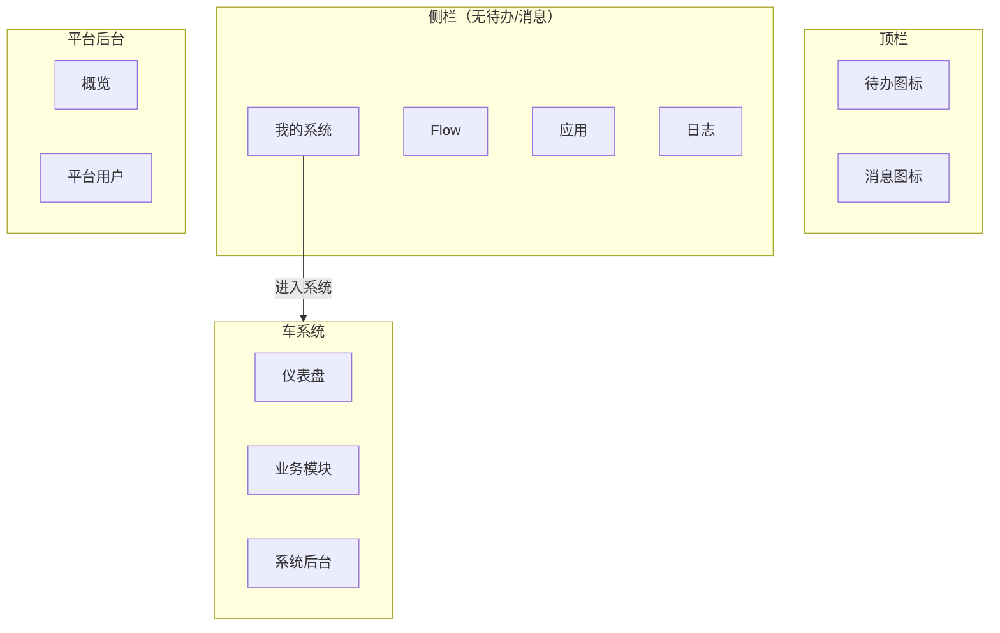

# unexamine 界面规格（UI Spec）— MVP 冻结草案

> **agentId:** uiux  
> **taskId:** phase-1-ui-spec  
> **版本:** 0.3.0-res004  
> **日期:** 2026-06-15  
> **依据:** `docs/product/prd.md`、`.cursor/knowledge/domain-model.md`、`.cursor/knowledge/frozen-rules.md`、`docs/decisions/resolution.md`

**开场说明：** 我是 uiux，本次产出界面规格与原型协作 brief，不写前端业务代码。

---

## 1. 设计目标

| 目标 | 说明 |
|------|------|
| 任务导向 | 用户按「登录 → 选系统 → 仪表盘 → 做业务」思考，不按 API 模块思考 |
| 配置/使用分离 | 系统后台与业务功能分入口、分视觉层级 |
| 普通人可用 | 无裸露技术 ID、无调试台布局 |
| 中文优先 | 按钮、空态、错误、权限提示均为业务中文 |
| P0 锚点 | 车系统 / `che` 成员 7 步剧本每一步有页面与状态定义 |

---

## 2. 视觉与组件库（冻结推荐）

### 2.1 技术栈

| 项 | 决策 | 说明 |
|----|------|------|
| 框架 | Vue 3 + Vite + TypeScript | 与 prd 一致 |
| 组件库 | **Naive UI**（推荐冻结） | Vue 3 原生、表格/表单/布局成熟；风格克制，易做企业后台 |
| 备选 | Ant Design Vue | 若你更熟悉 Ant 体系，可在签字前改选 |
| 图标 | `@vicons/ionicons5` 或 Naive 内置 | 统一线性图标 |
| 路由 | Vue Router | 平台 / 系统 / 后台 三套布局壳 |

**ISS-U06 裁决：** 本 spec **推荐 Naive UI**；你在 `user-approval.md` 签字即视为确认，或 notes 中写明改用 Ant Design Vue。

### 2.2 设计气质（给 Open Design）

参考 **Linear / Notion / Stripe Dashboard** 的克制企业风，**不要**营销落地页风格。

| Token | 值 | 用途 |
|-------|-----|------|
| 主色 | `#2563EB`（蓝） | 主按钮、选中态、链接 |
| 成功 | `#16A34A` | 发布成功、保存成功 |
| 警告 | `#D97706` | 待办、未发布草稿 |
| 危险 | `#DC2626` | 删除、终止 |
| 背景 | `#F8FAFC` | 内容区底 |
| 卡片 | `#FFFFFF` + 1px `#E2E8F0` | 面板、列表容器 |
| 正文 | `#0F172A` | 主文案 |
| 次要 | `#64748B` | 说明、表头辅助 |
| 圆角 | 8px（卡片）/ 6px（按钮） | 统一 |
| 字号 | 14px 正文 / 16px 小标题 / 20px 页标题 | 中文可读 |

详细 token 由 Open Design 写入 `docs/design/DESIGN.md`，须与本节一致。

### 2.3 全局布局壳

```
┌─────────────────────────────────────────────────────────────┐
│ 顶栏：Logo | 上下文（平台 / 车系统）| 待办 消息 | 用户 ▾ 退出   │
├──────────┬──────────────────────────────────────────────────┤
│ 左侧导航  │ 面包屑                                              │
│ （按上下文）│ ┌──────────────────────────────────────────────┐ │
│          │ │ 页面标题 + 主操作区（右对齐）                      │ │
│          │ ├──────────────────────────────────────────────┤ │
│          │ │ 内容区（列表/表单/卡片）                           │ │
│          │ └──────────────────────────────────────────────┘ │
└──────────┴──────────────────────────────────────────────────┘
```

**三种壳：**

| 壳 | 何时 | 左侧导航特征 |
|----|------|--------------|
| 平台工作台 | 登录后未进系统 | 侧栏：我的系统、Flow、应用、日志；**顶栏**：待办/消息图标；底栏：平台后台 |
| 系统使用态 | 进入某系统后 | **顶栏：仪表盘 + 模块组名**；点击组名后**左栏=组内模块**；管理员可见「系统后台」 |
| 系统配置态 | 点击「系统后台」 | 基础参数、字典、模块组、模块、字段、仪表盘、数据源、流程、对外应用… |

**禁止：** 普通成员（che）看到系统配置侧栏或平台后台入口。

### 2.4 运行态导航（模块组）— RES-003

```
┌──────────────────────────────────────────────────────────────────┐
│ Logo  车系统  │ [仪表盘] [车辆管理●] [人事管理]  │ 待办 消息 用户 │
├──────────┬───────────────────────────────────────────────────────┤
│ 车辆档案◀│ 面包屑 / 车辆档案                                    │
│ 维保记录 │ ┌─────────────────────────────────────────────────┐ │
│ 驾驶员   │ │ 列表 / 表单 / 详情                                 │ │
│          │ └─────────────────────────────────────────────────┘ │
└──────────┴───────────────────────────────────────────────────────┘
     ↑ 点击顶栏「车辆管理」后出现的组内模块左栏（例：3 个模块）
```

| 规则 | 说明 |
|------|------|
| 顶栏 | 固定「仪表盘」+ 已发布**模块组**名称（按权限） |
| 点组名 | 左侧展开该组下**模块**列表；默认选中第一个有权限模块 |
| 未点组 | 仅仪表盘时，可隐藏组内左栏或显示上次组 |
| 配置顺序 | **先模块组 → 再模块**（强制） |

### 2.5 运行态业务页骨架（强制结构 · 非尺寸）

> **说明：** 本节定义**必须存在的区域与交互**，不规定像素宽度、抽屉是 800px 还是 1000px——具体尺寸、间距、视觉层级由 UI/Design 专业输出；原型与实现**不得缺少下列结构点**。

#### 2.5.1 整体分区（自上而下、自左而右）

```
┌─ 顶栏 ─────────────────────────────────────────────────────────────┐
│ 系统名 │ [仪表盘] [模块组A●] [模块组B] … │ 待办 消息 用户          │
├─ 模块左栏 ─┬─ 业务工作区 ───────────────────────────────────────────┤
│ （点模块组 │  ┌─ 列表区 ─────────────┬─ 详情区（点行后出现）──────┐ │
│  后出现）  │  │ 工具栏：搜索+场景…导出│  摘要+编辑/删除            │ │
│  组内模块  │  │ 表格                  │  Tab                       │ │
│  · 模块1   │  │                       │  Tab内容 │ 审批信息(对齐) │ │
│  · 模块2   │  └───────────────────────┴──────────────────────────┘ │
└────────────┴───────────────────────────────────────────────────────┘
```

| # | 结构点 | 必须 | 说明 |
|---|--------|:----:|------|
| 1 | **顶栏模块组** | ✅ | 已发布模块组名称作为顶栏 Tab/按钮；「仪表盘」独立一项 |
| 2 | **点模块组 → 左栏模块** | ✅ | 仅选中某模块组时，左侧展示该组下模块列表；未选组时可隐藏或保留上次组 |
| 3 | **右区默认列表** | ✅ | 选中某模块后，右侧主区为**业务列表**（非表单/非配置） |
| 4 | **列表工具栏** | ✅ | 列表上方：**搜索** + **场景**（视图/筛选预设）；**导出**在场景**右侧**（可含导入、列设置等，导出不可丢） |
| 5 | **点行 → 右区详情** | ✅ | 点击列表数据行，在列表**右侧**出现详情（分栏或抽屉均可，须同屏可见列表+详情） |
| 6 | **详情顶：重要信息** | ✅ | 详情顶部展示主识别字段 + 若干关键摘要（如状态、负责人、日期等） |
| 7 | **详情顶：操作按钮** | ✅ | 摘要旁/下方须有 **编辑**、**删除**（及权限内其它动作）；无权限则隐藏 |
| 8 | **详情：标签页** | ✅ | 摘要/操作下方为 Tab，切换不同信息分区（详细资料、附件、操作记录等，按模块配置） |
| 9 | **审批信息与 Tab 区对齐** | ✅ | 审批流/流程信息在 Tab **内容区**同高并列展示（通常在详情右栏），与 Tab 切换的内容区对齐，不漂浮在页面外 |

#### 2.5.2 与 CRM 回款页的映射（参考，非照抄）

| CRM 回款 | 车系统车辆档案 |
|----------|----------------|
| 顶栏「回款」模块组 | 顶栏「车辆管理」模块组 |
| 左栏回款管理/计划 | 左栏车辆档案/维保/驾驶员 |
| 搜索 + 场景 Tab + 右侧导出 | 同结构 |
| 点行右侧详情滑层 | 点「京A·12345」右侧详情 |
| 详情顶摘要条 + 编辑 | 车牌 + 状态/部门/驾驶员 + 编辑/删除 |
| 详细资料 Tab + 右侧审批流 | 详细资料 Tab + 右侧审批流信息 |

#### 2.5.3 Design 负责 vs 产品骨架负责

| 产品骨架（必须） | Design 专业输出（可变） |
|------------------|-------------------------|
| 有哪些区域、何时出现 | 各区域宽度比例、断点 |
| 搜索/场景/导出相对位置 | 控件高度、字号、颜色 token |
| 详情分栏 vs 抽屉 | 1000px 或 42% 等具体数值 |
| Tab 名称与审批是否常驻 | 折叠、动画、空态视觉 |

**原型验收：** `runtime-list.html` 须能一眼看出 §2.5.1 全部 9 点；配置态见 [`config-spec.md`](./config-spec.md)。

---

## 3. 信息架构

### 3.1 平台层（登录后）— RES-2026-06-15-002



**导航规则：** 待办/消息**仅顶栏**；侧栏不得重复。平台后台须有概览等实质页面。

### 3.2 路由命名（实现参考，用户界面不展示 path）

| 路由 | 页面 | 权限 |
|------|------|------|
| `/login` | 登录 | 公开 |
| `/register` | 注册并创建系统 | 公开 |
| `/platform/systems` | 我的系统 | 已登录 |
| `/platform/flow` | 平台 Flow 汇总 | 已登录 |
| `/platform/apps` | 应用快捷入口 | 已登录 |
| `/platform/todos` | 待办 | 已登录 |
| `/platform/messages` | 消息 | 已登录 |
| `/platform/logs` | 平台日志 | 按权限 |
| `/platform/admin/overview` | 平台后台概览 | 平台管理员 |
| `/platform/admin/users` | 平台用户管理 | 平台管理员 |
| `/s/:systemId/admin/basic` | 系统基础参数 | 系统管理 |
| `/s/:systemId/admin/dict` | 数据字典 | 系统管理 |
| `/s/:systemId/admin/datasource` | 数据源 | 系统管理 |
| `/s/:systemId/admin/dashboard-cfg` | 仪表盘配置 | 系统管理 |
| `/s/:systemId/admin/app-bind` | 应用接入 | 系统管理 |
| `/s/:systemId/dashboard` | 系统仪表盘 | 系统成员 |
| `/s/:systemId/m/:menuId` | 业务模块列表 | 菜单+动作权限 |
| `/s/:systemId/m/:menuId/new` | 新建 | create |
| `/s/:systemId/m/:menuId/:recordId` | 详情/编辑 | view/edit |
| `/s/:systemId/admin/**` | 系统后台各页 | 系统管理权限 |

---

## 4. 术语与文案规范

| 对用户显示 | 禁止使用 | 含义 |
|------------|----------|------|
| 我的系统 | 租户列表、systemId | 可进入的业务系统 |
| 系统仪表盘 | 运行台、工作台（单独作导航名） | 进入系统后的首页 |
| 系统后台 | 管理配置、建模后台 | 配置态入口 |
| 车辆档案 | moduleId、MOD-xxx | 业务模块中文名 |
| 导出 | 导出中心、EXP | 列表动作，非独立域 |
| 系统内应用接入 | 应用（单独出现易混淆时） | 本系统关联平台级应用 |
| 平台级对外应用 | — | 平台后台创建；系统内做「应用接入」绑定 |

**按钮动词：** 新建、保存、发布、添加成员、进入系统、返回我的系统、导出、筛选、重置。

---

## 5. P0 页面规格

以下每页包含：入口、布局、字段/按钮、权限态、空态/加载/错误。

---

### 5.1 登录页 `P-LOGIN`

| 项 | 说明 |
|----|------|
| 入口 | 未登录访问任意页重定向；顶栏「登录」 |
| 布局 | 居中卡片，左侧可选产品一句价值说明（非营销长文） |
| 字段 | 账号、密码 |
| 主按钮 | **登录** |
| 次链接 | **注册并创建系统** → `/register` |
| 加载 | 按钮 loading「登录中…」 |
| 错误 | 账号或密码错误 → 卡片内红色提示「账号或密码不正确」 |
| 成功 | 跳转 **我的系统** |

---

### 5.2 注册并创建系统 `P-REGISTER`

| 项 | 说明 |
|----|------|
| 入口 | 登录页链接 |
| 布局 | 单页表单（非多步 wizard MVP），标题「创建你的第一个业务系统」 |
| 字段 | 登录账号*、密码*、确认密码*、**系统名称***（例：车）、系统标识（可选，自动 slug） |
| 主按钮 | **注册并进入系统后台** |
| 说明文案 | 「注册后你将自动成为该系统管理员，可邀请同事加入。」 |
| 校验 | 密码不一致、系统名空 → 字段下提示 |
| 成功 | 进入 **车系统 · 系统后台 · 基础信息**，顶部展示一次性引导条：「建议下一步：创建业务应用与模块」 |

**禁止：** 出现「先建平台账号再建系统」两步心智。

---

### 5.3 我的系统 `P-MY-SYSTEMS`

| 项 | 说明 |
|----|------|
| 入口 | 平台侧栏默认首页；登录成功默认落点 |
| 布局 | 页标题「我的系统」+ 右上 **创建系统**（与注册类似简表单弹窗） |
| 列表列 | 系统名称、我的角色、最近访问、操作 |
| 行操作 | **进入系统**（主按钮） |
| 空态 | 插图 +「你还没有可进入的业务系统」+ **注册并创建系统** |
| 加载 | 骨架卡片 |
| 权限 | 平台管理员可见全部其有权限的系统；普通用户只见被授权系统 |

---

### 5.4 平台后台 · 概览 `P-PLAT-ADMIN-OVERVIEW`（仅平台管理员）

| 项 | 说明 |
|----|------|
| 入口 | 平台后台默认首页 |
| 布局 | 统计卡片行 + 快捷入口 |
| 卡片 | 业务系统总数、平台用户数、待处理待办、今日消息 |
| 快捷 | 平台用户管理、创建系统、查看日志 |
| 空态 | 新环境：「创建第一个业务系统」引导 |

### 5.5 平台后台 · 用户管理 `P-PLAT-ADMIN-USERS`

| 项 | 说明 |
|----|------|
| 入口 | 平台侧栏「平台后台」→ 用户管理 |
| 布局 | 标准列表页 |
| 列表列 | 登录账号、姓名、状态、创建时间、操作 |
| 主按钮 | **新建平台用户** |
| 表单字段 | 登录账号、初始密码、姓名、手机（可选）、状态 |
| 说明 | 「系统内添加成员时，从此处已有的平台用户中选择。」 |
| 空态 | 「暂无平台用户」 |

**车系统剧本：** `plat_admin` 在此预置或确认 `che` 用户存在。

---

---

### 5.5 系统后台 · 统一侧栏与首页 `P-SYS-ADMIN-HOME`

**系统后台侧栏顺序（强制）：**

```
首页引导 → 基础参数 → 数据字典 → 数据源 → 仪表盘配置
→ 模块组 → 模块 → 建模(字段/动作/菜单/发布)
→ 成员与角色 → 组织结构(P1) → 流程配置 → 对外应用 → 系统日志(P1)
```

| 项 | 说明 |
|----|------|
| 入口 | 仪表盘右上「系统后台」 |
| 首页 | 配置 checklist：基础参数✓、字典、模块组、发布、仪表盘发布、成员 |
| 主按钮 | 「下一步推荐」链到未完成的配置页 |
| 返回 | 「返回仪表盘」 |

---

### 5.6 系统仪表盘 `P-SYS-DASHBOARD`（运行态 · **配置驱动**）

> 仪表盘不是写死的欢迎页，由后台「仪表盘配置」发布。见 `design-scope.md` §7。

| 项 | 说明 |
|----|------|
| 入口 | 进入系统后**默认**；顶栏「仪表盘」 |
| 布局 | **可配置组件栅格**：统计卡、列表摘要、快捷入口、图表占位 |
| 组件能力 | 统计值、筛选按钮、图标样式、绑定数据源 |
| 欢迎区 | 可配置组件之一（或系统基础参数中的名称） |
| 模块组入口 | 可配置「模块组快捷卡」组件 |
| 车系统示例 | 统计卡「车辆总数」+ 筛选「在用」+ 模块组卡「车辆管理」 |
| che / admin | 同一套配置，按权限过滤组件数据 |
| 空态 | 「管理员尚未配置仪表盘」 |

---

### 5.6b 系统后台 · 基础参数 `P-SYS-ADMIN-BASIC`

| 字段/区块 | 说明 |
|-----------|------|
| 系统名称* | 显示名，如「车系统」 |
| 系统图标 | 上传或选预设；用于顶栏/登录页 |
| 系统编码 | 内部标识 |
| **域名/访问地址** | 子域名或绑定域名，如 `che.example.com`；解析说明文案 |
| 登录页展示 | 是否展示系统名+图标 |
| 默认首页 | 仪表盘（固定） |
| 保存 | 主按钮 |

---

### 5.6c 系统后台 · 数据字典 `P-SYS-ADMIN-DICT`

| 项 | 说明 |
|----|------|
| 入口 | 系统后台 → 数据字典 |
| 左 | 字典类型列表（如「车辆状态」「车型」） |
| 右 | 字典项：编码、显示名、排序、启用 |
| 主按钮 | 新建类型 / 新建字典项 |
| **与字段关联** | 建模「字段」页：下拉类型可选「关联字典 → 车辆状态」 |
| 车系统 | 字典「车辆状态」：在用、停用；供状态字段下拉 |

---

### 5.6d 系统后台 · 数据源 `P-SYS-ADMIN-DATASOURCE`

| 项 | 说明 |
|----|------|
| 入口 | 系统后台 → 数据源 |
| 列表列 | 名称、类型、状态、操作 |
| 类型 Tab / 筛选 | **系统内** \| **外部 API** \| **数据库直连** |

| 类型 | 配置要点 |
|------|----------|
| 系统内 | 绑定模块/字段聚合；支持**公式计算**（如 `COUNT(车辆档案)`、`SUM(金额)`） |
| 外部 API | URL、方法、Header、参数；可引用对外应用凭证 |
| 数据库直连 | 连接串（加密存储）、只读 SQL（增强可限流） |

| 主按钮 | 新建数据源 |
| 被引用 | 仪表盘组件、统计卡绑定数据源 |

---

### 5.6e 系统后台 · 仪表盘配置 `P-SYS-ADMIN-DASHBOARD-CFG`

| 项 | 说明 |
|----|------|
| 入口 | 系统后台 → 仪表盘配置 |
| 布局 | 左：组件面板；中：栅格画布；右：组件属性 |
| 组件类型 | 统计卡、列表摘要、模块组快捷入口、图表（占位）、筛选条 |
| 组件属性 | 标题、图标样式、绑定数据源、筛选按钮（条件）、刷新间隔 |
| 发布 | 与模块发布类似：「发布仪表盘」 |
| 车系统示例 | 1 个统计卡（车辆总数←系统内数据源）+ 1 个模块组卡 |

---

### 5.7 系统后台 · 成员与角色 `P-SYS-ADMIN-MEMBERS`

| 项 | 说明 |
|----|------|
| 入口 | 系统后台 → 成员与角色 |
| Tab | 成员 \| **角色** |
| 成员列表列 | 姓名、登录账号、部门、角色、状态、操作 |
| 主按钮 | **添加成员** |
| 添加成员弹窗 | 搜索**平台已有用户** → 选角色 → 确认 |

#### 5.7.1 角色编辑（三维权限 — Design 必含，见 design-scope.md）

点击角色「配置权限」进入（同页抽屉或子视图）：

| Tab | 内容 | MVP 原型示例 |
|-----|------|--------------|
| **模块权限** | 模块树 + 动作勾选（查看/新建/编辑/删除/导出/审批） | 车辆档案模块全选动作 |
| **字段权限** | 按模块：字段列表，可见/可编辑 | 车辆档案：车牌必填可见，颜色只读 |
| **数据范围** | 单选：全部 / 本部门 / 仅本人 / 自定义（增强灰显） | 车辆操作员=本部门 |

| 车系统 | 角色「车辆操作员」绑定 che；模块+字段+数据见上表 |

---

### 5.8 系统后台 · 配置链（RES-003）

> **配置顺序：** 先**模块组** → 再**组下模块** → 字段 → 页面动作 → 菜单 → 发布。  
> 运行态：顶栏显示组名，点组名后左栏显示组内模块。

#### 5.8.1 模块组 `P-SYS-ADMIN-MODULE-GROUP`

| 字段 | 说明 |
|------|------|
| 组名称* | 例：车辆管理（**运行态顶栏显示**） |
| 排序 | 数字 |
| 说明 | 可选 |
| 预览 | 「发布后，顶栏将出现本组名；组内模块在左侧导航展示」 |

#### 5.8.2 模块 `P-SYS-ADMIN-MODULE`

| 字段 | 说明 |
|------|------|
| 所属模块组* | 下拉（须先建组） |
| 模块名称* | 车辆档案 |
| 模块说明 | 可选 |

#### 5.8.3 字段 `P-SYS-ADMIN-FIELDS`

> **细粒度配置项、按钮、映射：** 见 [`config-spec.md`](./config-spec.md) §2–§3（字段抽屉逐项、类型下拉、字典/关联映射、唯一、占宽、列表/筛选开关）。

| 项 | 说明 |
|----|------|
| 布局 | 可编辑表格 + **右侧字段配置抽屉**（非仅表格行） |
| 列表列 | 显示名、编码、类型、必填、列表/详情/搜索/筛选、操作 |
| 抽屉必含 | 基础（名称/编码/类型）· 展示（显隐/占宽）· 数据（必填/只读/唯一/默认值）· 类型专属（字典/关联模块） |
| 车系统示例 | 车牌(text,唯一) · 品牌(text) · **状态(select→字典「车辆状态」)** · 驾驶员(relation→驾驶员模块.姓名) |
| 主按钮 | **添加字段** |

**关联字段映射示例（Design 必须在抽屉中可见）：**

| 字段 | 关联目标 | 显示 | 存储 |
|------|----------|------|------|
| 驾驶员 | 模块「驾驶员」 | 姓名字段 | recordId |

#### 5.8.4 页面与动作 `P-SYS-ADMIN-PAGE`

> 动作编码与出现位置：见 [`config-spec.md`](./config-spec.md) §1.1、§7。

| 项 | 说明 |
|----|------|
| 页面类型 | 列表+表单+详情（MVP 默认一套） |
| 动作权限 | 复选：查看、新建、编辑、删除、转移、导入、全部导出、导出选中、批量编辑 |
| 说明 | 「导出是页面动作，不是独立菜单。」 |
| 绑定角色 | 在 `admin-roles` 动作 Tab 勾选 |

#### 5.8.5 菜单 `P-SYS-ADMIN-MENU`

| 字段 | 说明 |
|------|------|
| 绑定模块 | 车辆档案 |
| 归属模块组 | 自动带出「车辆管理」 |
| 显示位置 | 运行态：**顶栏组 → 左栏模块**；仪表盘可展示组入口卡片 |

#### 5.8.6 发布 `P-SYS-ADMIN-PUBLISH`

| 项 | 说明 |
|----|------|
| 布局 | 发布检查清单（模块组/模块/字段/页面/菜单 是否就绪） |
| 主按钮 | **发布到系统** |
| 成功 | Toast「发布成功，顶栏将出现车辆管理，组内模块可在左侧导航使用」 |

#### 5.8.7 流程配置 `P-SYS-ADMIN-FLOW`（Design 必含全节点类型 IA）

| 项 | 说明 |
|----|------|
| 入口 | 系统后台 → 流程配置 |
| 布局 | 左：绑定模块+触发事件；中：**流程画布**；右：节点属性；顶/侧：**节点面板** |
| 触发事件 | 新建 / 编辑 / 删除 / 字段值变动（字段+条件） |
| **节点类型（Palette）** | 见下表 |

| 节点类型 | 配置要点 | MVP 实现 |
|----------|----------|----------|
| 审批 | 审批人：角色/成员/主管；多层串行 | ✅ |
| 条件 | 字段+运算符+分支 | ✅ 单字段 |
| 抄送 | 通知对象；不阻塞流程 | ⭕ |
| 外部 API | URL、方法、参数；可引用映射 | ⭕ 设计必有，实现可 stub |
| 动态加签 | 运行态在业务数据上追加节点 | ❌ 增强；画布可标注「运行态能力」 |

| 车系统示例 | 新建车辆 → 条件(状态=停用) → 部门主管审批 → 抄送车管 |

**原型要求：** 画布上至少 3 种节点图示 + 节点面板 5 项（增强项可带「二期」标签）。

#### 5.8.8 对外应用 `P-SYS-ADMIN-EXTERNAL-APP`（RES-003）

| 项 | 说明 |
|----|------|
| 入口 | 系统后台 → **对外应用** |
| 含义 | 本系统**对外访问入口**；外部按配置接口调用 |
| 列表列 | 应用名称、AppKey（脱敏）、状态、操作 |
| 主按钮 | **新建对外应用** |
| 基础配置 | 名称、凭证、启用/停用、IP 白名单（简版） |
| **参数映射**（Design 必含） | 见下表 |
| 授权范围 | 可选模块、可选动作（查询/写入） |

**参数映射表**（按接口/场景一张表）：

| 列 | 说明 |
|----|------|
| 接口参数名 | 外部 API 要求的 key，如 `plateNo` |
| 来源类型 | 模块字段 / 常量 / 系统变量 |
| 来源值 | 如 `车辆档案.车牌` 或常量 |
| 类型 | 文本/数字/日期… |
| 必填 | 是/否 |

示例行：`plateNo` ← `车辆档案.车牌`（文本，必填）

| MVP 实现 | 单模块字段直线映射；嵌套 JSON、转换函数 → 增强期 |
| 与模块关系 | 授权哪些模块可被此应用访问；**不在应用下建模块** |

#### 5.8.9 系统日志 `P-SYS-ADMIN-LOGS`（P1）

| 项 | 说明 |
|----|------|
| 入口 | 系统后台侧栏「系统日志」 |
| 列表 | 时间、操作人、模块、动作、摘要 |
| 筛选 | 时间范围、模块、操作类型 |
| 分层 | 仅本系统日志；不与平台日志混页 |

---

### 5.9 业务列表 `P-RUNTIME-LIST`（车辆档案）

> **RES-005：** 列表须为「高级业务表格」，非简易调试表。

| 项 | 说明 |
|----|------|
| 入口 | 顶栏点「车辆管理」→ 左栏选「车辆档案」；或仪表盘组卡片 |
| 壳 | 顶栏含模块组 + 组内左栏（见 §2.4） |
| 页标题 | 车辆档案 |

**工具栏（左→右）：**

| 区域 | 控件 |
|------|------|
| 左 | 快捷搜索框；**高级搜索**（打开右侧或顶部抽屉）；**场景**下拉（预设+「保存当前为场景」） |
| 中 | 选中 N 条时显示批量条：**编辑** **转移** **删除** **导出**（按权限） |
| 右 | **导入** **新建** **导出** **列设置** |

**高级搜索抽屉：**

- 字段：车牌（包含）、品牌型号、状态（多选）、购置日期范围、驾驶员
- 按钮：**查询** **重置** **保存为场景**

**表格结构：**

| 列序 | 列 | 说明 |
|------|-----|------|
| 1 | ☐ 全选 | 勾选列；表头 checkbox |
| 2 | # | **序号**（分页连续，如 1–20） |
| 3+ | 业务列 | 车牌、品牌型号、购置日期、驾驶员、状态…（可配置） |
| 末 | 操作 | 查看、编辑（按权限） |

**列设置面板：** 勾选显示列、拖拽排序、列宽、固定左侧列；**保存为我的表头**。

**行交互：**

- 点击行（非操作列）→ **右侧详情抽屉**（只读字段 + 底部「编辑」「关闭」）
- 复杂子表/流程历史 → 抽屉内「查看完整详情」跳整页（P1 `runtime-detail`）

| 分页 | 底部分页，默认 20 条 |
| 空态 | 「暂无车辆记录」+ **新建车辆**（有权限时） |
| 加载 | 表格骨架 |
| 错误 | 「加载失败，请稍后重试」+ 重试 |

**导入（工具栏）：** 点击 → 步骤：下载模板 → 上传文件 → 预检结果（成功/失败行数）→ 确认导入。MVP 原型可只做前两步占位。

**禁止：** 独立「导出中心」导航；导出/导入均在列表工具栏或批量条。

#### 5.9.1 建模侧列表配置（`admin-modeling` 扩展）

| Tab/区块 | 内容 |
|----------|------|
| 列表列 | 字段是否列表显示、默认顺序、默认列宽、可筛选、可高级搜索 |
| **列表场景** | 场景名、默认筛选条件、默认列集；例：「在用车辆」「闲置车辆」 |
| 页面动作 | 查看、新建、编辑、删除、**转移**、**导入**、**导出**、批量编辑 |

---

### 5.10 业务表单 `P-RUNTIME-FORM`（新建/编辑）

| 字段 | 控件 |
|------|------|
| 车牌 | 输入框，必填 |
| 车型 | 输入框 |
| 颜色 | 输入框 |
| 状态 | 下拉：在用 / 停用 |

| 按钮 | 说明 |
|------|------|
| 保存 | 主按钮 |
| 取消 | 返回列表 |
| 附件（P1） | 单文件上传区；MVP 原型可占位「添加附件」 |

| 校验 | 车牌为空 →「请填写车牌」 |
| 成功 | Toast「保存成功」→ 返回列表或停留详情 |

---

### 5.11 业务详情 `P-RUNTIME-DETAIL`

| 项 | 说明 |
|----|------|
| 首选形态 | 列表行点击 → **右侧详情抽屉**（RES-005） |
| 整页详情 | 子表/流程历史复杂时从抽屉「查看完整详情」进入 |
| 布局 | 描述列表展示字段 |
| 按钮 | **编辑**、**关闭** / **返回列表** |
| 无编辑权限 | 隐藏编辑，仅查看 |

---

### 5.12 平台层页面

#### 5.12.1 平台工作台入口（侧栏）

| 页面 | 行为 |
|------|------|
| Flow `P-PLAT-FLOW` | 跨系统/平台级流程实例与待办汇总列表（非配置页） |
| 应用 `P-PLAT-APPS` | 用户可访问的**平台应用**卡片入口（deep link / 文档链接） |
| 日志 `P-PLAT-LOGS` | 只读表格 |
| 待办/消息 | **仅顶栏图标**进入面板或 `/platform/todos`、`/platform/messages` |

#### 5.12.2 平台后台配置（RES-005 新增）

| 页面 ID | 文件（建议） | 说明 |
|---------|--------------|------|
| P-PLAT-ADMIN-FLOW | `platform/plat-admin-flow.html` | 平台 Flow 列表 + 画布入口；示例：跨系统入职大流程 |
| P-PLAT-ADMIN-APPS | `platform/plat-admin-apps.html` | 平台对外应用 CRUD + **绑定平台 Flow**（scope 含 flow.trigger 等） |

**平台应用配置要点：**

- 应用名称、AppKey（脱敏）、状态
- **授权能力**：勾选可开放的 Flow（例：「入职审批流程-触发」）
- 参数映射（若 Flow 对外暴露字段，同系统对外应用映射表形态）
- 与系统内 `admin-external-app` **文案区分**：「平台对外应用」vs「系统对外应用」

**平台 Flow 配置要点：**

- 不绑定单一业务模块；可引用多系统模块或纯平台编排
- 节点面板同系统 Flow（审批/条件/抄送/外部 API）
- **对外开放**：须在平台应用中授权，不可裸暴露

---

## 6. 权限态一览

| 状态 | UI 表现 |
|------|---------|
| 无系统成员身份 | 进不了系统；列表无该行 |
| 无菜单权限 | 侧栏不显示；仪表盘无卡片 |
| 无 create | 隐藏「新建」 |
| 无 edit | 行内无编辑 |
| 无 export | 工具栏/批量条无「导出」 |
| 无 import | 工具栏无「导入」 |
| 无 transfer | 批量条无「转移」 |
| 无系统管理 | 无「系统后台」入口 |
| 无平台管理 | 无「平台后台」导航 |
| 接口 403 | 全页「你没有权限访问此页面」+ 返回仪表盘 |
| 会话过期 | 跳转登录，提示「登录已过期，请重新登录」 |

---

## 7. 车系统剧本 → 页面映射矩阵（完整配置链）

| 步骤 | 角色 | 页面 ID | 关键 UI 断言 |
|------|------|---------|--------------|
| 1 | plat_admin | P-LOGIN → P-MY-SYSTEMS | 进入车系统 |
| 2 | plat_admin | P-PLAT-ADMIN-USERS | che 用户存在 |
| 3 | plat_admin | P-SYS-ADMIN-HOME → BASIC | 名称/图标/域名 |
| 4 | plat_admin | P-SYS-ADMIN-DICT | 车辆状态字典 |
| 5 | plat_admin | P-SYS-ADMIN-DATASOURCE | 车辆总数数据源 |
| 6 | plat_admin | P-SYS-ADMIN-MODULE-GROUP/MODULE | 车辆管理组+模块 |
| 7 | plat_admin | P-SYS-ADMIN-MODELING | 字段关联字典；发布 |
| 8 | plat_admin | P-SYS-ADMIN-DASHBOARD-CFG | 统计卡绑定数据源 |
| 9 | plat_admin | P-SYS-ADMIN-MEMBERS | che+三维权限 |
| 10 | plat_admin | P-SYS-ADMIN-FLOW / EXTERNAL（可选） | 流程/对外应用 |
| 11 | che | P-SYS-DASHBOARD | 配置化仪表盘；无后台 |
| 12 | che | P-RUNTIME-LIST → FORM | 顶栏组壳+CRUD+导出 |
| 13 | che | 全局 | 无平台/系统管理入口 |

---

## 8. Open Design 原型清单

须产出可浏览器打开的 HTML（落盘 `docs/design/prototypes/`）：

| 优先级 | 文件路径 | 对应页面 |
|--------|----------|----------|
| P0 | `prototypes/platform/login.html` | P-LOGIN |
| P0 | `prototypes/platform/register.html` | P-REGISTER |
| P0 | `prototypes/platform/my-systems.html` | P-MY-SYSTEMS（**侧栏去掉待办/消息**） |
| P0 | `prototypes/platform/plat-admin-overview.html` | P-PLAT-ADMIN-OVERVIEW |
| P0 | `prototypes/system/admin-modeling.html` | **模块分组+模块**链（非应用与模块） |
| P0 | `prototypes/system/admin-flow.html` | P-SYS-ADMIN-FLOW |
| P1 | `prototypes/system/admin-app-bind.html` | P-SYS-ADMIN-APP-BIND |
| P1 | `prototypes/platform/plat-admin-users.html` | P-PLAT-ADMIN-USERS |

原型须附 `docs/design/DESIGN.md`（token + 组件规则）。

详细 brief 见 [`prototype-brief.md`](./prototype-brief.md)。

---

## 9. MVP 不做（UI）

- 拖拽仪表盘设计器、KPI 卡片配置
- 独立「导出中心」页
- Excel 导入向导
- 平台对外应用管理界面
- 裸露 API 编号、schema JSON 编辑器（管理员用表单化配置）
- 英文主界面文案

---

## 10. 设计验收检查表（供 user-approval）

- [ ] 平台管理员能看懂「下一步做什么」（注册引导、发布清单）
- [ ] 添加 che 只需「搜索平台用户」，无需理解双账号表
- [ ] che 登录后第一屏是**车系统仪表盘**，不是平台后台
- [ ] 列表/表单像业务系统，不像调试台
- [ ] 导出在列表工具栏，无导出中心导航
- [ ] 空态、错误态、无权限态均有中文文案
- [ ] 配置态（系统后台）与使用态（仪表盘/业务）视觉可区分

---

## 11. 变更规则

- 改信息架构 → PM 更新 prd → 重出 ui-spec → 你重新签字
- 改视觉 token → 更新 DESIGN.md + 局部原型
- 实现阶段 frontend 不得擅自改主布局与 IA
