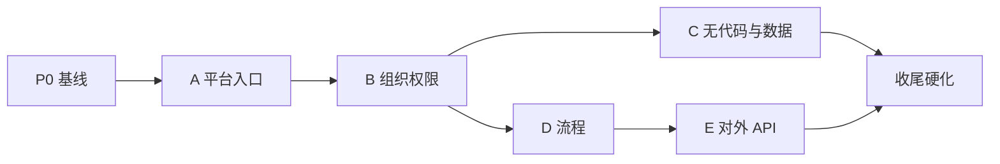

# examine2 开发排期

依据 **[开发方案](development-plan.md)** 与 [README.md](../README.md) 第 12 节里程碑（A–E），整理**建议顺序、周期量级、依赖与可并行项**。人力与范围以评审为准；下表为**规划基线**，可在项目管理工具中拆成 Sprint / 用户故事。

---

## 1. 假设与说明

| 项 | 说明 |
|----|------|
| 周期单位 | **自然周**（约 5 个工作日），区间为**粗估**，需按团队人数与熟练度调整。 |
| 起点 | 以「项目启动 / 基线评审通过」为第 1 周起点（**W1**）。 |
| 门禁 | 每阶段结束前：**OpenAPI 与 README 契约对齐**、核心路径**自动化测试**、基线依赖无已知阻塞（见开发方案 §6、§7）。 |
| 鉴权 | 全程采用开发方案约定：**自研 Filter/拦截器 + Redis**，不引入 Spring Security。 |

---

## 2. 总览（阶段 → 周期 → 里程碑）

| 阶段 | 建议周期 | 对应里程碑 | 主要落位模块 | 依赖 |
|------|----------|------------|--------------|------|
| **P0 基线收敛** | W1–W2（约 2 周） | —（横切） | `examine-web`、`examine-core` | — |
| **A 平台入口** | W3–W5（约 3 周） | README 阶段 A | `examine-web` 为主 | P0 可并行收尾 |
| **B 组织与权限** | W6–W8（约 3 周） | README 阶段 B | `examine-web`、`examine-module`、`examine-core` | A |
| **C 无代码与 `*_data`** | W9–W12（约 4 周） | README 阶段 C | `examine-module` 为主，`examine-core` | B |
| **D 流程引擎** | W10–W13（约 4 周，见 §3 并行） | README 阶段 D | `examine-flow`（或等价包） | B；与 C **部分重叠** |
| **E 对外应用与开放 API** | W14–W15（约 2 周） | README 阶段 E | `examine-app` | D（flow 对内主链路稳定） |
| **F 收尾与硬化** | W16–W17（约 2 周） | — | 全模块 | C/D/E 按范围裁剪 |

**粗算总时长**：串行主路径约 **17 周**；若 **D 与 C 中后期并行**，可压缩到约 **14–15 周**（见 §3）。

---

## 3. 并行与关键路径

- **关键路径**：`P0 → A → B → C → F` 与 `B → D → E → F`；**D 建议在 B 完成后与 C 中后期并行**，避免 flow 空转等待元数据，但需约定**模块触发 flow** 的接口契约先行冻结（Mock 亦可）。
- **可并行**：**P0** 末周与 **A** 首周可重叠（仅当基线风险可控）；**upload**（`examine-upload`）可在 **C 中后期**插入；**message / todo** 最小可用可在 **A 后**与 B 部分并行（见 §4）。

---

## 4. 分阶段任务清单（可拆 Issue）

### P0 基线收敛（W1–W2）

| 序号 | 任务 | 产出 / 验收 |
|------|------|-------------|
| P0-1 | 引入 `spring-boot-starter-data-redis`、连接池与序列化策略 | 本地/联调 Redis 可用 |
| P0-2 | JSON 统一 **Jackson**；移除或隔离 **Fastjson2** 使用路径 | 构建通过、关键接口回归 |
| P0-3 | 移除 **Sa-Token** 依赖路径；**自研**登录鉴权骨架（Filter/拦截器 + Redis 存 `platId`/`systemId`/`tenantId`） | 与 README §1.2 会话模型一致 |
| P0-4 | 移除 **Hutool** 依赖或按模块分批替换 | 编译与核心用例通过 |
| P0-5 | `examine-web` 启动类、统一异常、Actuator；**Docker Compose**（可选）MySQL+Redis | 开发方案 §2 可复现环境 |
| P0-6 | OpenAPI/Knife4j 基线；错误码与 Header 占位 | 契约可评审 |

### A 平台入口（W3–W5）

| 序号 | 任务 | 产出 / 验收 |
|------|------|-------------|
| A-1 | 注册/登录/登出、token 刷新；会话 **platId** + 切换 **systemId** | 与 README §1.1–§1.2 一致 |
| A-2 | 自建系统列表、创建系统、「进入系统」；**`X-System-Id` / `X-Tenant-Id`** 校验链 | 与 README §1.3 一致 |
| A-3 | 多租户系统：**选择 tenant** 写入会话与 header | README 阶段 A 验收 |
| A-4 | message/todo **占位**（列表空态 + 权限过滤框架）可选 | 不阻塞 B |

### B 组织与权限（W6–W8）

| 序号 | 任务 | 产出 / 验收 |
|------|------|-------------|
| B-1 | 组织、成员、角色、数据权限模型与接口 | 符合 README §5.4、ADR D7/D15 |
| B-2 | **AuthContext** 计算、缓存与失效 | 接口硬过滤、集成测试 |
| B-3 | 成员扩展字段与 `*_data` 衔接（若 B 阶段需要展示） | 与开发方案 §5.1 对齐 |

### C 无代码与 `*_data`（W9–W12）

| 序号 | 任务 | 产出 / 验收 |
|------|------|-------------|
| C-1 | 模块、字段、表单、列表、字典、关系；槽位与 typed-value | README + ADR D3/D4 |
| C-2 | 业务行数据落 `*_data`、CRUD、**DSL 白名单** | ADR D12 |
| C-3 | 导入导出、打印（按范围裁剪） | 与权限一致 |
| C-4 | Action 触发 flow（**Facade 调用**，不内嵌引擎） | 为 D 阶段联调留接口 |

### D 流程（W10–W13，可与 C 重叠）

| 序号 | 任务 | 产出 / 验收 |
|------|------|-------------|
| D-1 | 模板与实例、`flow_record`/`record_node`；**模板→运行时复制** | ADR D5/D6 |
| D-2 | 主链路：发起、办理、整单终态；**或签、单实例、再发起** | README §9、ADR D17–D19 |
| D-3 | 对内：`X-System-Id`/`X-Tenant-Id`；与 module 触发点联调 | — |
| D-4 | Outbox 轻量版（若本阶段纳入） | ADR D8 |

### E 对外应用（W14–W15）

| 序号 | 任务 | 产出 / 验收 |
|------|------|-------------|
| E-1 | 对外应用 CRUD、`appId`/`secret`、轮换 | README §6.2 |
| E-2 | **`/api/v1/**`**、**flowId** 路由；**appId** 鉴权与资源授权 | 与 README §1.3 表一致 |
| E-3 | 开放 API **幂等**（`Idempotency-Key` + Redis） | README §4.2、ADR D11/D16 |
| E-4 | 限流、审计、防重放（最小集） | 安全基线 |

### F 收尾与硬化（W16–W17）

| 序号 | 任务 | 产出 / 验收 |
|------|------|-------------|
| F-1 | `examine-upload` 与业务/flow 关联（若未提前） | 开发方案 §5.7 |
| F-2 | 审计三类分离、压测与慢 SQL、文档与运维手册 | README §10、附录待收口 |
| F-3 | 全链路回归、预发验证 | 发布就绪 |

---

## 5. 横切能力插入点

| 能力 | 建议插入阶段 |
|------|----------------|
| Context 校验（README §1.3） | P0–A 完成链路 |
| 幂等中间件（Redis） | C 写接口前；**E 必完成** |
| Outbox 轮询 | D 或 F，视异步范围 |
| 审计分表 | B 后持续增量 |

---

## 6. 风险与缓冲

| 风险 | 建议 |
|------|------|
| P0 迁出 Sa-Token/Hutool 工作量超预期 | P0 加 **0.5–1 周** 缓冲，或分模块分批迁 |
| C 与 D 并行导致接口返工 | **C-4** 与 **D-3** 前冻结 **触发 flow** 的契约与 Mock |
| 人力不足 | **E** 可整体后移；MVP 可先 **对内 flow**（D）再 **对外**（E） |

---

## 7. 修订记录

| 日期 | 说明 |
|------|------|
| 2026-04-04 | 初稿：依据开发方案与 README 里程碑 A–E，划分 P0–F 与周次粗估 |
