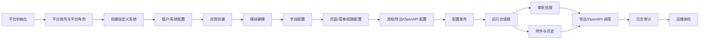
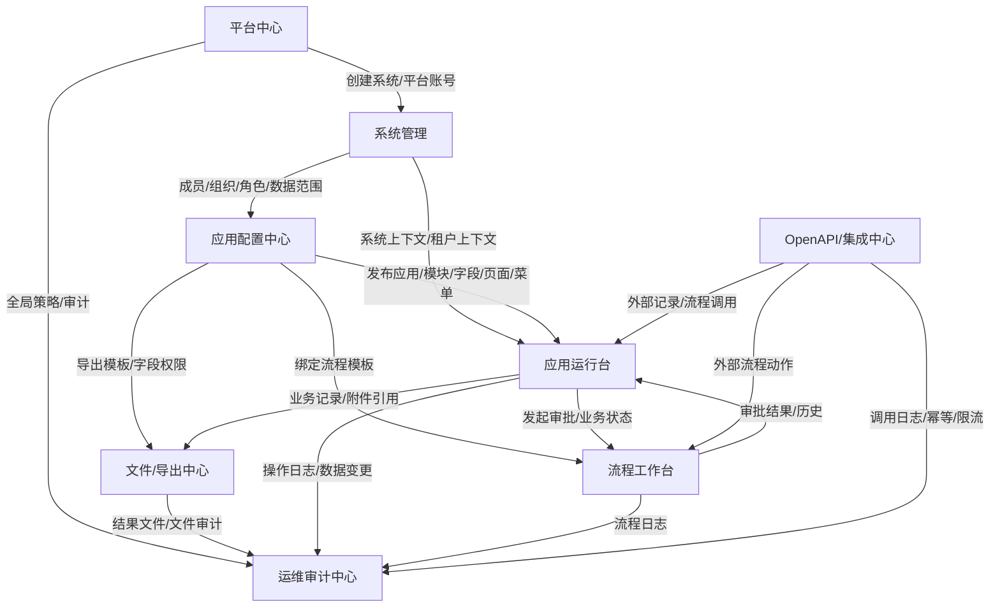
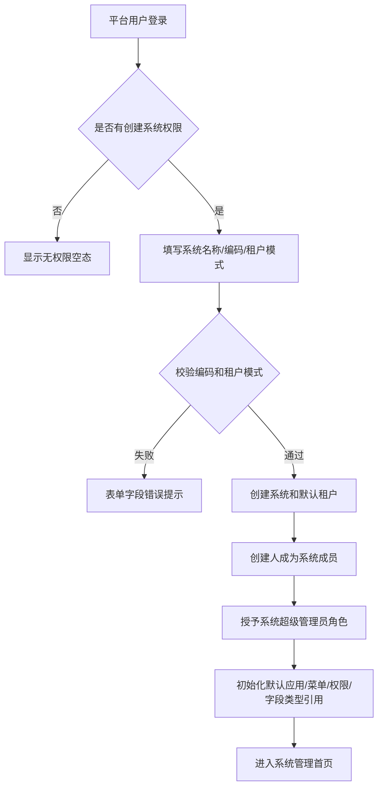
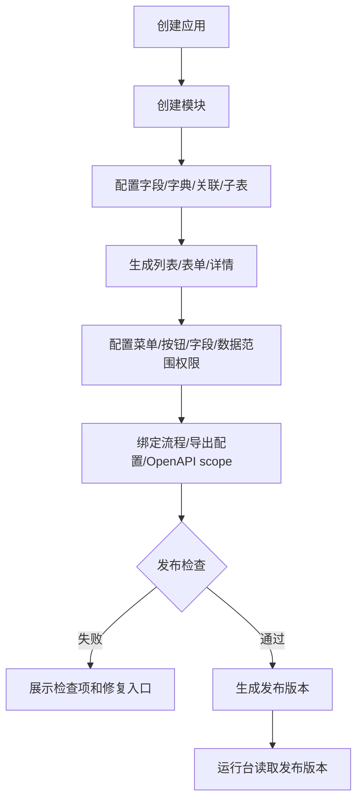
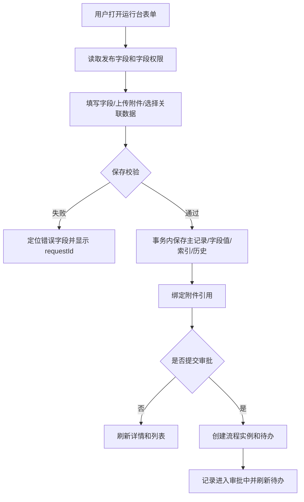

# unexamine 重构 PRD

## 背景

unexamine 本次重构目标是建设一个面向普通企业团队长期使用的“可配置业务系统平台”。平台应支持不写代码的管理员创建系统、配置应用、搭建模块字段、发布页面菜单、维护组织权限、配置审批流程，并让普通业务用户在运行台完成数据填报、查询、审批、附件、导出和外部系统集成。

旧项目已经沉淀了后端 Maven 多模块、平台账号、系统租户、动态模块、EAV 记录、流程、上传、导出、OpenAPI、日志和 Flyway migration 等参考能力，但旧项目存在页面产品形态缺失、配置态与运行态混杂、调试式 CRUD 接口较多、PO 直接暴露、错误码不成体系、运行时 schema repair、OpenAPI 表域命名需重整、中文编码异常等问题。本次 PRD 只以当前活动区文档为输入重新生成，不读取、不沿用 `.codex/archive` 中的旧 PRD、API、DB、SQL 或代码产物。

本 PRD 只用于 PRD 阶段冻结产品理解，不生成 API 契约、不生成数据库设计、不生成 SQL、不进入后端或前端实现。PRD 完成后必须交由 DBA、backend、frontend、test 重新审查。

### PM 决策吸收

| issueId | PRD 吸收决策 | 关闭条件对应位置 |
| --- | --- | --- |
| PU-001 | 新 PRD 从当前输入重建，不引用归档 PRD/API/DB/SQL/代码。 | 背景、验收标准 |
| PU-002 | 平台、账号、系统、租户、平台 RBAC 表前缀统一为 `un_plat_`。 | 技术架构与模块边界、数据规则 |
| PU-003 | OpenAPI 表前缀统一为 `un_openapi_`；`examine-app` 是后端模块名。 | 技术架构与模块边界、数据规则 |
| PU-004 | 平台用户为全局登录主体；系统内用户是平台用户在系统中的成员扩展；系统创建人默认成为系统超级管理员。 | 用户角色、权限规则、数据规则 |
| PU-005 | 每个模块拆分 MVP、后续增强、暂不做事项。 | 功能范围 |
| PU-006 | MVP 对模块、字段、页面、流程、导出配置保留草稿、发布、版本语义；运行态读取发布版本。 | 数据规则、业务流程 |
| PU-007 | 动态记录按 record、value、index、relation、subtable、history 说明产品边界。 | 数据规则 |
| PU-008 | 核心对象状态、允许操作、禁止操作形成状态矩阵。 | 数据规则、页面/交互说明 |
| PU-009 | 菜单、操作、字段、数据范围、导出、OpenAPI 权限形成权限矩阵。 | 权限规则 |
| PU-010 | 新增、编辑、删除、提交审批、导出任务、OpenAPI 调用分别定义事务范围和失败反馈。 | 业务流程、异常场景 |
| PU-011 | 文件状态、引用对象、删除规则、失败补偿和权限校验明确。 | 数据规则、业务流程、页面/交互说明 |
| PU-012 | MVP 必做导出任务闭环；导入执行延后，MVP 仅预留任务模型和页面入口。 | 功能范围、数据规则 |
| PU-013 | OpenAPI 客户端绑定系统/租户和授权范围，支持签名、时间窗口、幂等键、限流、IP 白名单、调用日志。 | 功能范围、权限规则、异常场景 |
| PU-014 | PRD 定义错误码命名空间和典型错误；所有请求响应和页面错误展示必须携带 requestId。 | 数据规则、异常场景 |
| PU-015 | 页面按入口、字段、筛选、按钮、状态、空态、加载态、错误态、权限禁用态、保存刷新规则描述。 | 页面/交互说明 |
| PU-016 | PRD 明确上下文字段自动补齐、动态字段值结构、统一分页/排序/筛选方向；API 阶段再冻结 typed SDK。 | 技术架构与模块边界、页面/交互说明 |
| PU-017 | PRD 明确建库 seed、创建系统事务内初始化、测试样例隔离、默认账号/角色/菜单/字段类型/租户/应用的名称、编码、状态、归属和唯一规则；这些 seed 只供 DB 设计和测试准备，不进入 API/代码阶段。 | 数据规则、业务流程、验收标准 |
| PU-018 | 旧项目 flow 实体与 DDL 不一致、旧 OpenAPI 表域历史原因由 analyst 后续补充；不阻塞 PRD，但阻塞 DB 设计。 | 技术架构与模块边界、验收标准 |

## 目标

### 建设目标

1. 建立平台层与自定义系统层清晰分离的产品结构。
2. 支持平台用户创建和进入多个自定义系统，并在系统内维护成员、组织、角色、权限、应用、模块和业务数据。
3. 支持系统管理员通过配置完成应用创建、模块建模、字段设计、页面/菜单/权限/流程/导出配置和发布。
4. 支持普通用户在运行台完成业务数据新增、编辑、查询、详情、附件、提交审批、导出和历史追踪。
5. 支持审批人在流程工作台处理待办、查看流程图和审批历史。
6. 支持外部系统通过受控 OpenAPI 接入授权范围内的记录和流程能力。
7. 支持运维与审计人员查看健康检查、请求日志、操作日志、导出任务、OpenAPI 调用日志和版本信息。
8. 为 DBA、backend、frontend、test 后续设计提供可验证的业务边界、状态矩阵、权限矩阵、页面矩阵、数据规则和异常规则。

### 成功标准

1. DBA 能根据 PRD 识别表前缀、核心实体、状态流转、数据落点、版本快照、权限落库方向和初始化数据范围。
2. backend 能根据 PRD 拆分平台、系统配置、运行台、流程、文件/导出、OpenAPI、运维审计等业务接口边界，但本阶段不生成接口契约。
3. frontend 能根据 PRD 理解页面入口、导航、列表、筛选、表单、详情、按钮、状态、空态、错误态、权限禁用态和保存刷新规则。
4. test 能根据 PRD 设计端到端、权限、状态、异常、并发、幂等、审计和数据隔离测试。

### 不做事项

1. 不在本阶段输出 API 契约、数据库设计、SQL、任务拆分、后端代码或前端页面。
2. MVP 不做通用脚本执行平台。
3. MVP 不做行业级 ERP/MES 深度套件，只通过动态模块支持轻量场景组合。
4. MVP 不做复杂 BI 平台、完整 KPI 闭环、复杂打印模板可视化、完整移动端配置器、智能助手、命令中心、全局搜索、备份恢复、多环境管理、容量配额和完整数据脱敏。
5. 不把平台超级管理员设计为可绕过系统内权限直接修改业务数据的入口；如未来需要运维型只读能力，必须单独设计审计边界。

## 用户角色

| 角色 | 身份来源 | 权限边界 | 典型入口 |
| --- | --- | --- | --- |
| 平台超级管理员 | 平台内置或平台授权账号 | 管理平台账号、平台角色、系统、租户、全局配置、健康检查和平台审计；默认不直接修改系统内业务数据。 | 平台中心、运维审计中心 |
| 平台用户 | 全局登录主体，账号维护在平台层 | 可创建系统、加入系统或作为外部协作账号；进入系统后必须转换为系统成员上下文。 | 登录页、我的系统 |
| 系统创建人/系统超级管理员 | 创建自定义系统的平台用户自动获得 | 拥有该系统内组织、角色、菜单、应用、模块、字段、流程、数据范围和运行配置的最高管理权。 | 系统管理、应用配置中心 |
| 系统管理员 | 系统超级管理员授权的系统成员 | 管理本系统基础信息、成员、部门、角色、权限、字典、消息、日志和功能开关。 | 系统管理 |
| 租户管理员 | 多租户系统中特定租户的管理成员 | 管理本租户成员、部门、授权、应用运行数据；不能跨租户管理。 | 系统管理、应用运行台 |
| 应用配置管理员 | 系统内被授予应用配置权限的成员 | 管理指定应用和模块的字段、页面、菜单、流程绑定、导出配置和发布。 | 应用配置中心 |
| 业务用户 | 系统内普通成员 | 只访问有权限菜单、操作、字段和数据范围内的业务记录。 | 应用运行台 |
| 审批人 | 流程节点候选人或被转交成员 | 处理分配给自己的待办，查看授权业务数据、流程图和审批历史。 | 流程工作台 |
| 运维审计人员 | 平台或系统授权成员 | 查看健康检查、日志、任务、OpenAPI 调用、审计链路；默认只读。 | 运维审计中心 |
| OpenAPI 客户端 | 平台或系统内创建的外部接入凭证 | 仅能按绑定系统、租户、scope、IP 白名单、签名和数据范围访问授权能力。 | OpenAPI/集成中心 |

平台用户是唯一登录主体。自定义系统内“用户/成员”不是独立登录账号，而是平台用户在某个系统内的成员扩展，承载系统内部门、岗位、角色、数据范围、状态和租户归属。系统内权限由系统自己的组织架构和角色权限配置维护。

## 功能范围

### 阶段边界总览

| 阶段 | 范围 |
| --- | --- |
| MVP 必做 | 平台登录和我的系统、系统/租户上下文、系统成员组织角色、应用和模块配置、字段设计、页面/菜单/权限发布、运行台列表/表单/详情、附件、流程基础、导出任务闭环、OpenAPI 基础安全、运维审计基础。 |
| 后续增强 | 应用模板、应用复制、配置导入导出、高级字段、复杂页面设计器、导入预演和回滚、打印模板可视化、完整仪表盘/KPI、移动端完整适配、流程模拟、权限预览增强、数据脱敏。 |
| 暂不做 | 通用脚本执行平台、行业级 ERP/MES 套件、复杂 BI 平台、以智能助手为核心闭环、平台管理员绕过业务规则直接改数。 |

### 模块范围矩阵

| 模块 | 业务目标 | 主要角色 | 关键页面 | 核心操作 | 状态变化 | 权限点 | 依赖模块 | MVP | 后续增强 | 暂不做 |
| --- | --- | --- | --- | --- | --- | --- | --- | --- | --- | --- |
| 平台中心 | 管理全局登录主体、系统入口和平台基础运维。 | 平台超级管理员、平台用户 | 登录、注册、我的系统、系统列表、平台账号、平台角色、平台菜单、平台日志 | 登录/退出、创建系统、启停系统、管理平台账号角色、查看日志 | 账号正常/停用/锁定；系统草稿/启用/停用/归档 | 平台菜单、平台操作、系统创建、日志查看 | 运维审计、系统管理 | 登录、我的系统、平台账号角色、系统创建启停 | 找回密码、SSO、强制下线、授权套餐 | 绕过系统权限直接改业务数据 |
| 系统管理 | 管理单个自定义系统的成员、租户、组织和角色权限。 | 系统超级管理员、系统管理员、租户管理员 | 系统概览、基础信息、租户、成员、部门、角色权限、字典、功能开关 | 编辑系统信息、邀请成员、维护部门、配置角色、配置数据范围、管理字典 | 成员邀请/启用/停用；租户启用/停用；角色启用/停用 | 系统管理、成员管理、角色授权、字典维护 | 平台中心、应用配置、权限引擎 | 系统基础信息、成员部门、角色、菜单/操作/数据范围 | 权限预览、租户套餐、功能灰度 | 让系统管理员管理平台全局配置 |
| 应用配置中心 | 配置应用、模块、字段、页面、菜单、流程和导出并发布到运行台。 | 系统超级管理员、应用配置管理员 | 应用列表、应用概览、模块列表、字段设计器、页面设计器、菜单配置、发布检查 | 创建应用、创建模块、配置字段、生成页面、绑定菜单权限、发布配置 | 应用草稿/启用/停用/归档；模块草稿/已发布/停用/归档；配置草稿/已发布 | 应用管理、模块管理、字段管理、页面发布、菜单授权 | 系统管理、流程、文件/导出 | 基础字段、默认列表/表单/详情、菜单权限、发布版本 | 拖拽页面设计器、高级字段、应用模板、配置导入导出 | 自由脚本规则引擎 |
| 应用运行台 | 让业务用户按权限使用已发布应用。 | 业务用户、应用管理员 | 运行首页、业务列表、业务表单、业务详情、关联数据、历史、导出任务入口 | 查询、筛选、新增、编辑、软删除、上传附件、提交审批、导出 | 记录草稿/已提交/审批中/已通过/已拒绝/已撤回/已归档/已删除 | 菜单可见、按钮操作、字段可见/可写、数据范围、导出脱敏 | 应用配置、流程、文件/导出、权限 | 列表/表单/详情、附件、历史、流程状态、导出 | 个人视图、高级表格、移动端完整运行台、评论 | 运行台出现复杂配置入口 |
| 流程工作台 | 支持流程模板配置和审批任务处理。 | 系统管理员、审批人、业务用户 | 流程模板、流程设计器、发布检查、待办、抄送、我的申请、审批详情 | 设计流程、发布流程、发起审批、同意、拒绝、撤回、终止、转交、抄送 | 模板草稿/已发布/停用；实例审批中/通过/拒绝/撤回/终止；任务待办/已办/取消 | 流程配置、流程发起、任务处理、实例查看 | 应用配置、应用运行台、权限 | 基础图设计、发布检查、待办审批、审批历史 | 流程模拟、子流程完整编排、复杂异常策略 | 只保存不可读 JSON 的流程设计器 |
| 文件/导出中心 | 管理上传文件、业务引用、导出任务和结果文件。 | 业务用户、应用管理员、运维审计人员 | 文件列表、上传记录、文件详情、导出模板、导出任务 | 上传、预览、下载、删除、配置导出模板、创建导出任务、重试失败任务 | 文件临时/已引用/已删除；导出任务排队/处理中/成功/失败/取消 | 文件上传下载、业务对象权限、导出权限、脱敏权限 | 应用运行台、运维审计 | 文件元数据、引用关系、导出任务闭环 | 对象存储、分片、导入预演/回滚、复杂模板 | MVP 不做导入执行闭环 |
| OpenAPI/集成中心 | 支持外部系统安全访问授权业务能力。 | 系统管理员、平台超级管理员、外部系统 | 客户端列表、凭证、scope、IP 白名单、调用日志 | 创建客户端、轮换凭证、配置 scope、启停客户端、查看调用日志 | 客户端草稿/启用/停用/过期；凭证有效/过期/吊销 | OpenAPI 管理、scope 授权、签名、限流、IP 白名单、数据范围 | 平台中心、系统管理、应用运行台、运维审计 | 客户端、凭证、签名、幂等、限流、日志 | 外部用户映射、Webhook、回调订阅 | 与内部接口混用权限模型 |
| 运维审计中心 | 提供健康检查、日志、任务和审计追踪。 | 平台超级管理员、运维审计人员、系统管理员 | 健康检查、请求日志、错误日志、操作日志、导出任务、OpenAPI 日志、版本信息 | 查看健康、检索 requestId、查看操作链路、定位失败任务 | 健康正常/警告/异常；任务成功/失败；日志归档 | 运维只读、审计查看、系统级日志范围 | 所有模块 | 健康检查、requestId、操作日志、错误日志、版本信息 | 慢查询、日志归档、备份恢复、多环境 | 在 PRD 阶段生成部署脚本 |

## 项目整体流程图

| 阶段 | 输入 | 输出 | 关键角色 | 失败边界 |
| --- | --- | --- | --- | --- |
| 平台初始化 | 数据库、Redis、文件存储、密钥、默认平台角色 | 可登录平台、默认平台管理员、健康基线 | 平台超级管理员、运维人员 | 配置缺失、密钥占位、数据库不可达时阻止启动或标记健康异常 |
| 平台账号与角色 | 平台用户信息、平台菜单、平台角色 | 平台登录主体和平台权限 | 平台超级管理员 | 账号停用/锁定不能登录；无系统权限只能看到空态引导 |
| 创建自定义系统 | 系统名称、编码、租户模式、创建人 | 系统、默认租户、系统创建人成员扩展、系统超级管理员角色 | 平台用户 | 系统编码重复、租户模式非法、初始化失败则系统创建回滚 |
| 租户/系统配置 | 系统基础信息、成员、部门、角色、数据范围 | 系统管理基础配置 | 系统超级管理员、系统管理员 | 成员未绑定平台用户不得登录；租户停用后业务运行受限 |
| 应用创建 | 应用名称、编码、图标、所属系统/租户 | 应用草稿或启用应用 | 应用配置管理员 | 应用编码重复、系统停用时禁止创建 |
| 模块建模 | 模块、字段、字典、关联、子表、自动编号规则 | 模块配置草稿 | 应用配置管理员 | 字段编码重复、类型非法、关联模块无权限或不存在时阻断 |
| 页面/菜单/权限配置 | 列表、表单、详情、菜单、按钮、字段权限、数据范围 | 可发布配置版本 | 应用配置管理员、系统管理员 | 发布检查失败不得进入运行台 |
| 流程/导出/OpenAPI 配置 | 流程模板、导出模板、OpenAPI 客户端和 scope | 可触发审批、导出和外部调用 | 系统管理员、应用配置管理员 | 流程无结束路径、导出模板字段无权限、OpenAPI scope 越界则禁止启用 |
| 配置发布 | 配置草稿、发布说明、版本号 | 运行态可读取的发布版本 | 应用配置管理员 | 版本冲突、校验不通过、依赖缺失时保留草稿并提示 |
| 运行台填报 | 发布版本、用户权限、业务输入 | 业务记录、字段值、历史、附件引用 | 业务用户 | 无权限、字段校验失败、记录被流程锁定时页面展示错误和 requestId |
| 审批处理 | 业务记录、流程版本、审批动作 | 流程实例、任务状态、业务状态联动、审批历史 | 审批人 | 重复处理、候选人为空、流程版本停用时阻断并留痕 |
| 导出/OpenAPI | 筛选条件、导出模板、客户端签名、scope | 导出文件、OpenAPI 响应、调用日志 | 业务用户、外部系统 | 导出失败更新任务状态；签名失败/限流/幂等冲突返回明确错误 |
| 日志审计与运维 | requestId、操作日志、任务日志、健康检查 | 可追踪审计链路和健康结果 | 运维审计人员 | 日志写入失败需写错误日志；健康异常不得静默通过 |

## 业务模块关系图

平台中心提供全局账号、系统创建、平台审计和全局策略。系统管理负责单个系统的组织和权限上下文。应用配置中心生产发布版本，应用运行台只消费已发布配置。流程工作台、文件/导出中心和 OpenAPI/集成中心分别围绕业务记录提供审批、文件任务和外部接入能力。运维审计中心接收所有模块的日志、任务、健康和审计数据。

## 业务场景矩阵

| 角色 | 模块 | 场景 | 触发条件 | 输入 | 输出 | 权限点 | 异常分支 | 验收点 |
| --- | --- | --- | --- | --- | --- | --- | --- | --- |
| 平台超级管理员 | 平台中心 | 初始化并管理平台账号和系统 | 首次部署或平台运营 | 默认管理员、平台角色、系统配置 | 可登录平台、系统列表、平台日志 | 平台账号管理、系统管理 | 密钥缺失、数据库不可达、账号锁定 | 可登录；系统健康展示；平台前缀方向为 `un_plat_` |
| 平台用户 | 平台中心 | 创建自定义系统 | 用户登录后无系统或需要新系统 | 系统名称、编码、租户模式 | 系统、默认租户、创建人成员扩展、系统超级管理员角色 | 系统创建 | 编码重复、初始化失败 | 创建人进入系统后拥有系统超级管理员权限 |
| 系统超级管理员 | 系统管理 | 管理成员/部门/角色权限 | 系统创建完成 | 平台用户、部门、角色、菜单/操作/字段/数据范围 | 系统成员、组织树、角色授权 | 系统内成员管理、权限管理 | 平台用户不存在、跨系统授权、角色停用 | 成员不是独立账号；权限由系统内配置维护 |
| 租户管理员 | 系统管理 | 管理本租户成员和业务数据范围 | 多租户系统启用 | 租户、成员、部门、角色 | 租户内授权和成员可见范围 | 租户管理、数据范围 | 跨租户操作、租户停用 | 单租户隐藏租户选择；多租户隔离可验证 |
| 应用配置管理员 | 应用配置中心 | 创建应用、模块、字段、页面并发布 | 系统已启用且有配置权限 | 应用、模块、字段、页面、菜单、权限 | 发布版本、运行菜单 | 应用管理、模块管理、发布 | 字段编码重复、发布检查失败 | 运行台只读取已发布版本 |
| 业务用户 | 应用运行台 | 填报业务记录 | 有菜单和新增权限 | 表单字段、附件、关联数据 | 业务记录、字段值、历史、附件引用 | 菜单、按钮、字段可写、数据范围 | 必填缺失、类型错误、无权限、流程锁定 | 保存后跳详情或刷新列表；错误显示 requestId |
| 业务用户 | 应用运行台 | 查询、筛选和导出授权数据 | 模块已发布且有查看/导出权限 | 筛选、排序、分页、导出模板 | 列表数据、导出任务、结果文件 | 查看、筛选字段、导出、脱敏 | 无可见字段、导出失败、任务超限 | 服务端分页；导出任务状态可追踪 |
| 审批人 | 流程工作台 | 处理待办 | 记录提交并生成待办 | 审批动作、意见、附件 | 任务状态、流程实例状态、业务状态联动 | 待办处理、业务数据查看 | 重复处理、必须填写原因、候选人失效 | 待办处理一次；拒绝/撤回/终止原因必填 |
| OpenAPI 客户端 | OpenAPI/集成中心 | 调用记录或流程能力 | 客户端启用且凭证有效 | 签名、时间戳、幂等键、scope、业务参数 | 授权范围内响应、调用日志 | scope、IP 白名单、限流、数据范围 | 签名失败、过期、限流、幂等冲突 | 调用日志含客户端、systemId、tenantId、requestId |
| 运维审计人员 | 运维审计中心 | 排查失败和审计操作 | 用户反馈错误或健康异常 | requestId、时间、用户、系统 | 请求日志、错误日志、操作日志、任务日志 | 运维只读、审计范围 | 日志不存在、跨系统无权限 | 能按 requestId 串联页面错误和后端日志 |

## 技术架构与模块边界

### 后端 Maven 多模块

后端沿用旧项目多模块方向，并新增 `examine-generator`。默认模块如下：

| 模块 | 业务职责 | 对外接口边界 | 依赖方向 | 禁止事项 |
| --- | --- | --- | --- | --- |
| `examine-core` | 通用返回、异常、错误码、requestId、上下文、安全工具、MyBatis-Plus 配置、基础实体、缓存协调。 | 不暴露业务 Controller；提供公共能力。 | 被其它模块依赖。 | 不承载具体业务流程。 |
| `examine-plat` | 平台账号、系统、租户、平台 RBAC、平台消息、平台日志、全局配置。 | 平台中心和系统创建相关 manage controller。 | 依赖 core；被 web 聚合。 | 不直接处理系统内业务记录。 |
| `examine-module` | 应用、模块、字段、字典、页面、菜单、成员、部门、权限、动态记录、关联、导出、仪表盘/KPI 基础。 | 应用配置和运行台相关 manage controller。 | 依赖 core、plat；可调用 flow/upload 的明确 service 边界。 | 不绕过权限直接访问其它系统数据。 |
| `examine-flow` | 流程模板、版本、设计器、实例、任务、抄送、审批日志、业务状态联动。 | 流程配置和工作台相关 manage controller。 | 依赖 core、module 的业务记录抽象。 | 不保存不可解释的孤立流程 JSON。 |
| `examine-upload` | 文件存储配置、上传、预览、下载、引用关系、分片扩展、文件安全。 | 文件中心和附件相关 manage controller。 | 依赖 core、plat 上下文。 | 不跳过业务对象权限提供下载。 |
| `examine-app` | OpenAPI 客户端、凭证、签名、scope、幂等、限流、IP 白名单、调用日志。 | OpenAPI 管理和开放接入过滤/服务边界。 | 依赖 core、plat、module/flow 授权服务。 | 不使用内部登录态替代外部签名鉴权。 |
| `examine-generator` | MyBatis-Plus 代码生成、后续 XML 模板、通用 CRUD 扩展模板、表到模块映射、可选生成接口。生成结果落到各业务模块 `base` 层。 | 设计期/开发期工具模块；若未来提供生成接口，必须受平台管理员权限控制。 | 读取数据库和模块映射，输出到业务模块 base 包。 | 不生成对外 Controller；不生成 manage 业务编排。 |
| `examine-web` | Spring Boot 启动、Web 装配、过滤器/拦截器、全局异常、OpenAPI 文档、必要聚合入口。 | 应用启动和全局 Web 能力。 | 依赖所有业务模块。 | 不堆放业务实现，不直接写业务事务。 |

### base 与 manage 分层

- `base` 为 MyBatis-Plus 生成的贴表 CRUD，包含 `entity`、`mapper`、`service`、`service/impl`，只表达单表基础能力。
- `manage` 为业务编排层，包含 `controller`、`service`、`service/impl`、`bo`、`vo`、`dto`、`converter`、`enums`，负责权限校验、事务边界、上下文补齐、业务状态、错误码、实体到 VO 转换。
- Controller、Feign 和 Service 的保存/更新入参不得直接暴露实体；前端可写字段进入 SaveBO/UpdateBO/DTO，系统上下文、租户、审计字段由后端补齐。

### 表前缀规则

数据库表统一以 `un_` 开头，按模块前缀分组：

| 业务域 | 前缀 |
| --- | --- |
| 平台、账号、系统、租户、平台 RBAC、平台日志 | `un_plat_` |
| 动态模块、模型、字段、页面、菜单、记录、权限、导出 | `un_module_` |
| 流程审批 | `un_flow_` |
| 上传与文件 | `un_upload_` |
| OpenAPI 客户端、凭证、scope、幂等、限流、调用日志 | `un_openapi_` |
| 系统日志、审计、运维健康 | `un_sys_` 或 `un_audit_`，DBA 后续按归属细分 |

旧项目中 OpenAPI 相关历史表域仅作为旧参考，新项目 OpenAPI 表统一使用 `un_openapi_`。

### 前端执行边界

- 前端实现前必须先完成 API 契约冻结和 typed SDK 生成，不得散落手写 fetch/axios 调用。
- 页面到接口映射、上下文字段自动补齐、枚举、错误码、分页、排序、筛选、动态字段值结构必须在 API 阶段闭环。
- 前端不得为后端没有更新语义的接口伪造“编辑”能力。
- PRD 阶段只定义页面和交互规则，不生成前端代码。

## 业务流程

### 1. 创建系统与默认初始化

1. 正常流程：平台用户填写系统信息；后端校验系统编码唯一；在同一事务内创建系统、默认租户、创建人的系统成员扩展、系统超级管理员角色、默认系统菜单/权限、默认应用或默认应用入口，并绑定平台字段类型元数据引用；页面进入系统管理首页。
2. 状态变化：系统从草稿进入启用；创建人成员状态为启用；默认租户状态为启用。
3. 数据落点：平台系统、租户、系统成员扩展、系统内角色、角色权限、默认应用或默认应用入口，以及系统可用字段类型引用；字段类型定义本身来自建库 seed，不在每个系统重复复制。
4. 权限校验：必须具备平台系统创建权限；创建后只在该系统内获得系统超级管理员权限。
5. 异常反馈：编码重复在表单字段旁提示；初始化失败回滚系统创建并显示 requestId。

### 2. 应用配置、模块建模与发布

1. 正常流程：应用配置管理员创建应用和模块，配置字段，生成默认页面，配置菜单和权限，绑定流程和导出配置，提交发布。
2. 状态变化：应用草稿到启用；模块草稿到已发布；字段/页面/流程/导出配置从草稿生成发布版本。
3. 数据落点：应用、模块、字段、页面、菜单、权限、配置版本、发布记录。
4. 权限校验：应用管理、模块管理、字段管理、页面发布、角色授权分别校验。
5. 异常反馈：字段编码重复、页面缺主键展示字段、流程未发布、菜单未授权时发布检查失败，并保留草稿。

### 3. 业务记录保存与提交审批

1. 新增和编辑必须在同一业务事务内处理主记录、字段值、索引值、唯一性、自动编号、关联/子表、历史和附件引用校验。
2. 保存草稿不触发流程；提交审批在本地数据保存成功后同步创建流程实例和首个待办。需要影响主流程回滚的步骤不得使用 fire-and-forget。
3. 附件先是临时文件，业务保存成功后绑定引用；业务失败时临时文件保留到过期清理或按本次上传补偿删除。
4. 记录进入审批中后，受流程锁定规则限制，默认禁止普通编辑和删除。

### 4. 审批处理

1. 审批人进入待办列表，系统按任务候选人、领取状态和数据权限筛选。
2. 审批详情展示业务数据、字段快照、流程图、当前节点、审批历史、附件和操作区。
3. 同意推进到下一节点或结束；拒绝、撤回、终止必须填写原因；转交必须选择有效系统成员。
4. 每个任务只能成功处理一次；重复点击返回已处理提示或幂等结果。
5. 审批结束后按流程配置回写业务状态，并写审批日志、操作审计和消息。

### 5. 文件与导出任务

1. 文件上传校验系统/租户上下文、大小、扩展名、MIME 类型和存储配置。
2. 文件状态从临时到已引用，再到已删除；被业务字段、导出任务、流程附件引用的文件不得直接物理删除。
3. 导出任务创建时保存筛选条件、字段权限快照、脱敏规则、模板、操作者和 requestId。
4. 后台生成成功后写结果文件引用并更新任务为成功；失败记录错误原因和可重试次数。
5. 下载结果文件时再次校验任务归属、文件状态和下载权限。

### 6. OpenAPI 调用

1. 外部系统使用客户端凭证、时间戳、nonce、幂等键和签名调用。
2. 后端先校验客户端状态、凭证、签名时间窗口、IP 白名单、限流和幂等，再校验 scope、系统/租户上下文和数据范围。
3. 授权通过后按内部业务服务执行记录或流程动作，不复用平台用户登录态。
4. 所有调用写入调用日志，包含客户端、systemId、tenantId、scope、requestId、结果、耗时和失败原因。

## 页面/交互说明

### 页面/交互矩阵

| 模块 | 页面 | 入口 | 列表字段 | 筛选 | 表单/详情 | 按钮 | 空态/加载态/错误态 | 权限禁用态 | 保存刷新规则 |
| --- | --- | --- | --- | --- | --- | --- | --- | --- | --- |
| 平台中心 | 登录/注册 | 根路径、系统直登路径 | 不适用 | 不适用 | 账号、密码、验证码可选、注册信息 | 登录、注册、找回密码预留 | 登录失败显示原因和 requestId；账号锁定提示剩余时间 | 停用账号禁止登录 | 登录成功进入我的系统或系统运行台 |
| 平台中心 | 我的系统 | 登录后默认页 | 系统名称、编码、状态、角色、租户模式、最近进入时间 | 状态、关键字、我的角色 | 系统卡片详情 | 创建系统、进入、设置、停用 | 无系统引导创建；加载失败显示重试 | 无设置权限隐藏设置按钮 | 创建成功刷新系统列表并进入新系统 |
| 平台中心 | 平台账号/角色 | 平台管理导航 | 账号、姓名、状态、角色、最近登录 | 状态、角色、关键字 | 账号详情、角色授权 | 新增、编辑、启停、重置密码、授权 | 无账号显示邀请入口；错误带 requestId | 无平台管理权限只读或不可见 | 保存后刷新当前页和详情抽屉 |
| 系统管理 | 系统基础信息 | 进入系统后管理导航 | 不适用 | 不适用 | 名称、编码只读、租户模式、默认首页、状态、Logo | 保存、启用、停用 | 系统停用显示黄色警示 | 非系统管理员只读 | 保存后重新拉取系统上下文 |
| 系统管理 | 租户/成员/部门 | 系统管理导航 | 租户/成员名、账号、部门、角色、状态、加入时间 | 租户、部门、角色、状态、关键字 | 成员扩展详情、部门树、角色分配 | 邀请、启停、调整部门、授权 | 无成员引导邀请；平台用户不存在提示 | 租户管理员不可跨租户操作 | 保存后刷新树、列表和人员选择器缓存 |
| 系统管理 | 角色权限 | 系统管理导航 | 角色名称、状态、成员数、权限摘要 | 状态、关键字 | 菜单、按钮、字段、数据范围、导出、OpenAPI scope | 新增、编辑、复制、启停、保存授权 | 无角色显示默认角色初始化 | 无授权权限时所有授权控件禁用并说明原因 | 保存后清权限缓存并提示重新生效 |
| 应用配置 | 应用列表/概览 | 系统内应用配置入口 | 应用名、编码、状态、模块数、发布版本、更新时间 | 状态、关键字 | 应用名称、编码、图标、描述、状态 | 新增、编辑、启停、进入配置、进入运行 | 无应用引导创建 | 无应用管理权限隐藏新增编辑 | 保存后刷新列表和侧边导航 |
| 应用配置 | 模块/字段设计 | 应用概览进入 | 模块名、编码、状态、字段数、发布状态 | 状态、关键字 | 字段名称、编码、类型、必填、默认值、字典、关联、子表、权限 | 新增字段、编辑字段、停用字段、发布 | 无字段显示字段类型引导；发布失败显示检查项 | 无字段管理权限只读 | 保存字段后刷新字段列表和页面预览 |
| 应用配置 | 页面/菜单/权限配置 | 模块配置导航 | 页面名、类型、发布状态、菜单名、权限点 | 类型、发布状态 | 列表列、表单分组、详情区块、菜单路径、按钮权限 | 保存草稿、预览、发布 | 无页面生成默认页面；错误定位配置项 | 无发布权限禁用发布 | 发布成功刷新运行菜单和 schema 缓存 |
| 应用运行台 | 业务列表 | 运行菜单 | 动态主显示字段、状态、创建人、更新时间、流程状态 | 关键字、高级筛选、状态、时间、人员/部门字段 | 行详情抽屉或跳详情页 | 新增、编辑、删除、提交审批、导出、批量操作 | 无数据显示新增入口；无权限显示申请权限提示 | 按菜单/按钮/字段权限过滤或禁用 | 保存/审批/删除后刷新当前页，保留筛选 |
| 应用运行台 | 业务表单/详情 | 列表新增编辑、详情 | 不适用 | 不适用 | 字段分组、子表、关联数据、附件、流程状态、历史 | 保存草稿、提交审批、编辑、删除、撤回 | 校验失败定位字段；版本变化提示刷新 | 字段不可写显示只读；流程锁定禁用编辑 | 保存草稿留当前页并刷新详情；提交后进入审批态 |
| 流程工作台 | 待办/抄送/我的申请 | 顶部工作台或运行台入口 | 标题、业务模块、发起人、当前节点、到达时间、状态 | 状态、模块、发起人、时间 | 审批详情、流程图、历史、意见 | 同意、拒绝、转交、领取、撤回、终止 | 无待办显示空态；重复处理显示已处理 | 非候选人禁用处理按钮 | 处理成功移除待办并刷新详情状态 |
| 文件/导出 | 文件列表/导出任务 | 运行台附件、文件中心、导出入口 | 文件名、大小、类型、状态、引用对象、上传人；任务状态、进度、结果 | 状态、类型、上传人、任务类型 | 文件详情、引用关系、失败原因 | 上传、预览、下载、删除、重试 | 上传失败显示原因；导出失败显示可重试 | 无业务对象权限禁止下载 | 上传成功更新附件字段；导出成功刷新任务和结果 |
| OpenAPI | 客户端/调用日志 | 系统管理或平台 OpenAPI | 客户端名、状态、scope、限流、最近调用；日志结果、耗时 | 状态、scope、IP、时间、结果 | 客户端详情、凭证只展示一次、IP 白名单 | 新增、启停、轮换凭证、复制 clientId | 无客户端引导创建；凭证过期警示 | 无 OpenAPI 管理权限只读 | 保存后刷新列表；轮换后只展示新 secret 一次 |
| 运维审计 | 健康/日志/版本 | 运维导航 | 检查项、状态、耗时、requestId、用户、模块、结果 | 时间、系统、租户、用户、requestId、级别 | 日志详情、错误栈摘要、操作前后快照 | 刷新、复制 requestId、导出日志预留 | 健康异常显示处理建议；日志为空显示筛选建议 | 运维只读不可修改业务 | 刷新保留筛选条件 |

### 通用交互规则

1. 所有表格使用服务端分页、排序和筛选；前端不可一次性加载全量业务记录。
2. 所有保存、发布、审批、导出创建、OpenAPI 凭证轮换按钮在请求中禁用，避免重复提交。
3. 页面错误必须展示用户可理解提示，并提供 requestId 复制入口。
4. 离开未保存表单必须二次确认。
5. 权限禁用态必须说明原因，例如“无编辑权限”“记录审批中不可编辑”“字段无写权限”。
6. 凭证类敏感信息只展示一次，后续只展示掩码和轮换入口。
7. 移动端 MVP 只覆盖登录、运行台列表/详情轻量查看、表单轻量编辑、附件拍照/上传和待办处理；不提供复杂配置器、批量导入导出和高级运维页面。

## 数据规则

### 核心实体

| 实体 | 关键字段/属性 | 规则 |
| --- | --- | --- |
| 平台账号 | accountId、loginName、passwordHash、status | 全局登录主体；密码不可返回；停用/锁定不可登录。 |
| 系统 | systemId、code、name、tenantMode、status、ownerAccountId | code 全局唯一；创建人默认成为系统超级管理员。 |
| 租户 | tenantId、systemId、code、name、status | 系统可选多租户；单租户也初始化默认租户并在界面隐藏复杂切换。 |
| 系统成员 | memberId、systemId、tenantId、accountId、deptId、status | 是平台用户在系统内的成员扩展，不是独立登录账号。 |
| 应用 | appId、systemId、tenantId、code、name、status | 同一系统/租户内编码唯一；停用保留数据。 |
| 模块 | moduleId、appId、code、name、status、publishedVersion | 模块发布后运行台可见；停用后保留历史。 |
| 字段 | fieldId、moduleId、code、type、required、permission、status | 编码创建后原则上不修改；删除默认停用。 |
| 页面配置 | pageId、moduleId、type、draftVersion、publishedVersion | 运行态读取发布版本。 |
| 业务记录 | recordId、systemId、tenantId、appId、moduleId、status、flowStatus | 保存主记录和动态字段值；保留历史。 |
| 字段值 | recordId、fieldId、value、typedValue、displaySnapshot | 按字段类型保存原值、typed 值和展示快照。 |
| 字段索引值 | recordId、fieldId、typed columns | 支撑筛选、排序、唯一性和范围查询。 |
| 关联/子表 | sourceRecordId、targetRecordId、relationType、childRowOrder | 关联数据和子表必须在业务保存事务内处理。 |
| 流程实例/任务 | instanceId、taskId、templateVersion、status、actor | 保存流程版本快照和审批历史。 |
| 文件 | fileId、systemId、tenantId、status、storageKey、owner | 文件状态与引用关系决定下载和删除。 |
| 导出任务 | jobId、moduleId、status、filterSnapshot、resultFileId | 保存筛选、权限和脱敏快照。 |
| OpenAPI 客户端 | clientId、systemId、tenantId、status、scope、rateLimit | 表前缀统一为 `un_openapi_`。 |

### 初始化数据边界

本节只冻结 DBA 后续设计“初始化数据”和 test 后续准备前置数据所需的产品边界，不生成 SQL，不生成 API，不要求后端或前端实现；进入 API/代码阶段前，不能把本节 seed 自动扩展为接口契约或实现任务。

#### 建库 seed：生产 `init.sql` 必须初始化

| 数据对象 | 默认名称 | 默认编码 | 默认状态 | 归属规则 | 唯一编码规则 | 说明 |
| --- | --- | --- | --- | --- | --- | --- |
| 默认平台管理员账号 | 平台超级管理员 | `platform_admin` | 正常，首次登录必须改密 | 平台全局账号，不归属任何自定义系统或租户 | `loginName` 全局唯一 | 密码不得在 PRD 写明明文；DBA 后续设计时可用安全占位哈希或部署变量注入，账号必须绑定 `PLAT_SUPER_ADMIN`。 |
| 平台角色 | 平台超级管理员、平台管理员、平台审计员 | `PLAT_SUPER_ADMIN`、`PLAT_ADMIN`、`PLAT_AUDITOR` | 启用 | 平台全局 | 平台角色 `code` 全局唯一 | `PLAT_SUPER_ADMIN` 拥有平台中心全部管理菜单；审计角色默认只读。 |
| 平台菜单 | 我的系统、系统管理、租户管理、平台账号、平台角色、全局配置、系统健康、操作日志、版本和部署、OpenAPI 全局策略 | `PLAT_MY_SYSTEM`、`PLAT_SYSTEM`、`PLAT_TENANT`、`PLAT_ACCOUNT`、`PLAT_ROLE`、`PLAT_CONFIG`、`PLAT_HEALTH`、`PLAT_AUDIT_LOG`、`PLAT_VERSION`、`PLAT_OPENAPI_POLICY` | 启用 | 平台全局菜单树 | 同一父菜单下 `code` 唯一；顶级菜单 `code` 全局唯一 | 平台菜单只控制平台中心入口，不授权系统内业务数据写入。 |
| 平台配置 | 密码策略、会话策略、默认文件存储、OpenAPI 全局策略、审计保留策略 | `SECURITY_PASSWORD_POLICY`、`SESSION_POLICY`、`FILE_STORAGE_DEFAULT`、`OPENAPI_GLOBAL_POLICY`、`AUDIT_RETENTION_POLICY` | 启用 | 平台全局 | 配置 `key` 全局唯一 | 密钥、对象存储密码、OpenAPI 主密钥等敏感值不得以明文 seed；生产环境由部署配置或安全配置注入。 |
| 默认字段类型元数据 | 文本、多行文本、数字、金额、日期、日期时间、单选、多选、开关、人员、部门、附件、图片、自动编号、关联数据、子表、地址、标签、JSON | `TEXT`、`TEXTAREA`、`NUMBER`、`MONEY`、`DATE`、`DATETIME`、`SELECT`、`MULTI_SELECT`、`SWITCH`、`MEMBER`、`DEPT`、`ATTACHMENT`、`IMAGE`、`AUTO_NO`、`RELATION`、`SUB_TABLE`、`ADDRESS`、`TAG`、`JSON` | 启用 | 平台全局元数据，供系统和模块引用 | 字段类型 `code` 全局唯一 | 字段类型定义只 seed 一份；系统创建时只建立可用引用或默认启用关系，不重复生成类型定义。 |

#### 创建自定义系统事务内初始化

创建系统必须把以下对象放在同一业务事务内完成。任一对象创建失败，系统、租户、成员、角色、权限、默认应用和字段类型引用全部回滚；不得出现“系统已创建但创建人无系统超级管理员权限”的半初始化状态。

| 数据对象 | 默认名称 | 默认编码 | 默认状态 | 归属规则 | 唯一编码规则 | 说明 |
| --- | --- | --- | --- | --- | --- | --- |
| 默认租户 | 默认租户 | `default` | 启用 | 归属当前系统；单租户系统也必须初始化 | 同一 `systemId` 下租户 `code` 唯一 | 单租户模式下界面隐藏租户切换，但数据仍带默认租户上下文。 |
| 创建人成员扩展 | 使用平台账号姓名或登录名 | 默认使用平台账号 `loginName`；如冲突可追加账号 ID 短码 | 启用 | 归属当前系统和默认租户；引用平台账号 | 同一 `systemId` 下 `accountId` 唯一；成员 `code` 同一系统唯一 | 该成员不是独立登录账号，只是平台用户在系统内的成员上下文。 |
| 系统超级管理员角色 | 系统超级管理员 | `SYS_SUPER_ADMIN` | 启用 | 归属当前系统，默认授予创建人成员 | 同一 `systemId` 下角色 `code` 唯一 | 拥有当前系统内组织、成员、角色、菜单、应用、模块、字段、流程、文件/导出、OpenAPI 和审计配置权限。 |
| 系统默认菜单/权限 | 系统首页、系统基础信息、租户管理、成员部门、角色权限、应用配置、模块配置、流程配置、导出中心、OpenAPI 中心、日志审计、运行工作台 | `SYS_HOME`、`SYS_PROFILE`、`SYS_TENANT`、`SYS_MEMBER_DEPT`、`SYS_ROLE_PERMISSION`、`APP_CENTER`、`MODULE_CONFIG`、`FLOW_CENTER`、`EXPORT_CENTER`、`OPENAPI_CENTER`、`SYS_AUDIT`、`RUN_WORKBENCH` | 启用 | 归属当前系统；权限默认绑定 `SYS_SUPER_ADMIN` | 同一 `systemId` 和父菜单下 `code` 唯一 | 管理菜单和运行菜单要分开；无权限菜单不展示。 |
| 默认应用或默认应用入口 | 默认应用 | `default_app` | 草稿 | 归属当前系统和默认租户 | 同一 `systemId`、`tenantId` 下应用 `code` 唯一 | 作为系统创建后的配置起点；未发布模块前普通业务用户不看到运行数据入口。 |
| 字段类型引用 | 默认启用字段类型集 | 引用建库 seed 的字段类型 `code` | 启用 | 归属当前系统，可被该系统下应用和模块引用 | 同一 `systemId`、字段类型 `code` 唯一 | MVP 不支持系统自定义新增字段类型；仅允许启停或配置可用范围，实际定义仍来自平台字段类型元数据。 |

#### 不进入生产 `init.sql` 的测试样例数据

以下数据只属于 test 后续测试夹具、测试 SQL、测试环境导入包或 analyst/test 补充的最小端到端样例，不进入生产 `init.sql`：

1. 演示系统、演示租户、演示部门、演示成员、演示角色和演示授权。
2. 客户管理、请假审批、报销审批等业务样例应用、样例模块、样例字段、样例页面、样例流程模板和样例菜单。
3. 业务记录、审批实例、待办、附件文件、导出任务、OpenAPI 测试客户端、幂等记录、限流记录和调用日志。
4. 便于自动化测试的弱密码账号、固定验证码、固定 token、固定签名密钥或可预测对象存储密钥。

#### seed 编码和归属统一规则

1. 平台 seed 归属平台全局，编码使用稳定英文或大写下划线，除默认管理员登录名 `platform_admin` 外，不带系统、租户或环境前缀。
2. 系统事务内 seed 必须带 `systemId`；涉及租户隔离的数据必须同时带 `tenantId`，默认租户编码固定为 `default`。
3. 平台账号 `loginName` 全局唯一；系统成员通过 `systemId + accountId` 唯一，不允许把系统成员当作独立账号。
4. 平台角色、平台菜单、平台配置、字段类型元数据按平台域唯一；系统角色、系统菜单、默认应用按系统或系统+租户维度唯一。
5. 默认角色、菜单、配置和字段类型的编码一经进入生产 seed，不允许随意改名；需要变更时必须通过后续 DB migration 明确兼容策略。

### 状态矩阵

| 对象 | 状态 | 允许操作 | 禁止操作 |
| --- | --- | --- | --- |
| 账号 | 正常、停用、锁定 | 正常可登录；停用可由管理员启用；锁定可等待或解锁 | 停用/锁定不可登录 |
| 系统 | 草稿、启用、停用、归档 | 启用可运行；停用允许管理员进入设置；归档只读 | 停用禁止普通用户进入运行台；归档禁止新增配置和数据 |
| 租户 | 启用、停用 | 启用可切换和运行 | 停用禁止新增成员和业务数据 |
| 应用 | 草稿、启用、停用、归档 | 启用可配置和运行；停用可查看历史 | 停用禁止运行台新增；归档禁止编辑 |
| 模块 | 草稿、已发布、停用、归档 | 已发布可运行；停用可查询历史 | 草稿不对普通用户可见；停用禁止新增和提交审批 |
| 字段 | 草稿、启用、停用、删除标记 | 启用参与表单和列表；停用保留历史显示 | 删除标记不允许新记录写入 |
| 配置版本 | 草稿、已发布、已废弃 | 草稿可编辑；已发布供运行态读取 | 已废弃不可被新运行实例引用 |
| 业务记录 | 草稿、已提交、审批中、已通过、已拒绝、已撤回、已归档、已删除 | 草稿可编辑；审批中按锁定规则处理；通过/拒绝可查看和按权限归档 | 已删除不可编辑；审批中默认禁止普通编辑和删除 |
| 流程模板 | 草稿、已发布、停用 | 已发布可绑定和发起 | 草稿/停用不可发起新实例 |
| 流程实例 | 审批中、已通过、已拒绝、已撤回、已终止 | 审批中可处理待办；终态可查看历史 | 终态不可继续审批 |
| 流程任务 | 待处理、已处理、已取消、已转交、已退回 | 待处理可处理或转交 | 非待处理不可再次处理 |
| 文件 | 临时、已引用、已删除、过期 | 临时可绑定；已引用可按权限预览下载 | 已删除不可下载；已引用不可直接物理删除 |
| 导出任务 | 排队、处理中、成功、失败、取消 | 失败可按规则重试；成功可下载结果 | 处理中不可重复领取；取消不可下载 |
| OpenAPI 客户端 | 草稿、启用、停用、过期 | 启用可调用；停用可查看日志 | 停用/过期不可调用 |

### 校验与枚举规则

1. 编码类字段仅允许英文、数字、下划线，同一唯一维度内不可重复。
2. 自动编号必须使用序号表或数据库原子能力，不允许“查询最大值 + 1”。
3. 字段类型 MVP 包含文本、多行文本、数字、金额、日期、日期时间、单选、多选、开关、人员、部门、附件、图片、自动编号、关联数据、子表、地址、标签、JSON。
4. 公式、汇总、引用、状态字段作为后续增强，MVP 可预留类型枚举但不要求完整计算闭环。
5. 动态字段值必须保存展示快照，避免字典、字段名或关联记录变化导致历史数据不可解释。
6. 软删除数据默认保留历史和审计；唯一性是否允许软删除后重用由 DB/API 阶段按模块规则细化。
7. requestId 必须贯穿前端错误、后端日志、操作审计、导出任务和 OpenAPI 调用日志。
8. 错误码命名空间按模块划分：PLAT、SYS、MODULE、FIELD、PERM、FLOW、UPLOAD、EXPORT、OPENAPI、AUDIT、COMMON。API 阶段冻结具体错误码。

## 权限规则

### 权限边界

1. 平台超级管理员管理平台账号、系统、全局配置和平台审计，不默认拥有系统内业务数据写权限。
2. 系统创建人默认成为该系统超级管理员，并获得系统内组织、角色、菜单、应用、模块、流程、数据范围配置权限。
3. 系统内成员是平台用户在系统中的扩展，系统内权限只由系统组织架构和角色权限配置维护。
4. 系统内权限包含菜单权限、按钮/操作权限、字段可见/可写权限、数据范围权限、导出脱敏权限、流程权限、OpenAPI scope。
5. 前端权限只用于体验过滤，后端接口必须重新校验。

### 权限判定顺序

1. 校验登录态或 OpenAPI 签名。
2. 校验系统和租户上下文。
3. 校验成员状态和角色状态。
4. 校验菜单/API 访问权限。
5. 校验按钮/业务操作权限。
6. 校验字段可见、可写、筛选、导出、OpenAPI 返回权限。
7. 校验数据范围。
8. 校验业务状态和流程锁定。
9. 写入操作审计。

角色权限叠加采用“授权并集 + 显式禁用优先 + 数据范围按最小可见规则”的口径。字段无写权限时，保存请求应拒绝并提示字段无权限，不静默忽略。

### 权限矩阵

| 角色 | 平台中心 | 系统管理 | 应用配置 | 运行台数据 | 流程 | 文件/导出 | OpenAPI | 运维审计 |
| --- | --- | --- | --- | --- | --- | --- | --- | --- |
| 平台超级管理员 | 全局管理 | 可创建/停用系统；系统内默认只读审计 | 默认无系统内配置权，除非被加入系统 | 默认无写权限 | 默认无处理权 | 可看平台任务和全局策略 | 可管全局策略 | 全局审计只读 |
| 系统超级管理员 | 查看自己系统入口 | 本系统全权管理 | 本系统全权配置 | 按系统内规则可配置和访问 | 可配置和查看本系统流程 | 可管理本系统文件和导出 | 可管理本系统客户端 | 可查看本系统审计 |
| 系统管理员 | 无平台全局权 | 授权范围内管理 | 授权范围内配置 | 可按角色访问 | 可按角色管理 | 可按角色管理 | 可按角色管理 | 本系统只读 |
| 应用配置管理员 | 无 | 只读必要系统上下文 | 管理授权应用/模块 | 可预览授权模块 | 可绑定授权流程 | 可配置导出模板 | 可配置授权 scope | 查看配置日志 |
| 业务用户 | 我的系统 | 只读个人成员信息 | 无 | 按菜单、按钮、字段、数据范围操作 | 发起或查看自己的流程 | 上传附件、导出授权数据 | 无 | 查看本人操作结果 |
| 审批人 | 我的系统 | 只读必要上下文 | 无 | 查看待办关联业务数据 | 处理分配任务 | 查看待办附件 | 无 | 查看本人审批日志 |
| 运维审计人员 | 只读 | 只读 | 只读 | 默认只读审计 | 只读流程日志 | 只读任务和文件元数据 | 只读调用日志 | 查看健康、日志、requestId |
| OpenAPI 客户端 | 无 | 无 | 无 | scope 内记录能力 | scope 内流程能力 | scope 内文件能力 | 凭证管理由管理员完成 | 写调用日志 |

## 异常场景

| 场景 | 触发条件 | 处理规则 | 页面/调用反馈 |
| --- | --- | --- | --- |
| 参数缺失或类型错误 | 必填字段空、字段类型不合法 | 拒绝保存，不写业务数据 | 定位字段，显示错误码和 requestId |
| 编码重复 | 系统/应用/模块/字段/角色编码重复 | 拒绝保存 | 字段旁提示重复 |
| 无权限 | 菜单、按钮、字段、数据范围、scope 不满足 | 拒绝访问并写审计 | 页面显示无权限；接口返回权限错误 |
| 数据不存在 | 记录、模块、流程、文件已删除或跨系统 | 返回不存在或无权限，不泄露其它系统数据 | 显示数据不存在或已被删除 |
| 状态冲突 | 停用模块新增、审批中编辑、任务重复处理 | 拒绝或返回幂等结果 | 显示当前状态不允许操作 |
| 发布检查失败 | 页面缺字段、流程无结束路径、菜单未授权 | 不生成发布版本 | 展示检查清单和修复入口 |
| 文件上传失败 | 类型/大小不合法、存储不可用 | 不创建引用；临时文件按规则清理 | 上传组件展示失败原因 |
| 业务保存后续失败 | 附件绑定、流程创建、事件扩展失败 | 需回滚主事务的同步步骤失败则整体回滚 | 表单提示保存失败和 requestId |
| 导出失败 | 生成文件失败、权限变化、存储不可用 | 更新任务失败状态，记录原因和重试边界 | 导出任务列表显示失败和重试按钮 |
| OpenAPI 签名失败 | 签名错误、时间过期、IP 不匹配 | 拒绝调用，写失败日志 | 返回 OpenAPI 错误码和 requestId |
| 幂等冲突 | 相同幂等键请求参数不同 | 拒绝并记录冲突 | 返回幂等冲突错误 |
| 限流 | 登录、导出、OpenAPI、上传超限 | 拒绝或排队，写日志 | 提示稍后重试 |
| 健康异常 | 数据库、Redis、文件存储、密钥异常 | 标记健康检查异常，不静默通过 | 运维页展示异常项和建议 |

## 验收标准

### PRD 文档验收

1. `docs/prd.md` 必须为当前活动区新生成文档，不引用归档 PRD/API/DB/SQL/代码产物。
2. 文档必须包含背景、目标、用户角色、功能范围、项目整体流程图、业务模块关系图、业务场景矩阵、技术架构与模块边界、业务流程、页面/交互说明、数据规则、权限规则、异常场景、验收标准。
3. 文档中平台表前缀只能使用 `un_plat_`，OpenAPI 表前缀必须使用 `un_openapi_`。
4. 文档必须明确平台用户是全局登录主体，系统内成员是平台用户在系统里的成员扩展，系统创建人默认成为系统超级管理员，系统内权限由系统组织和角色权限维护。
5. 文档必须明确 `examine-generator` 模块职责和生成结果落到各业务模块 `base` 层。
6. 文档必须显式吸收 PU-001 到 PU-018 的 PM 决策和关闭条件。

### DBA 可验收标准

1. 能从 PRD 识别平台、模块、流程、上传、OpenAPI、审计的表前缀方向。
2. 能从 PRD 识别系统、租户、平台账号、系统成员、应用、模块、字段、业务记录、流程、文件、导出任务、OpenAPI 客户端的核心关系。
3. 能从 PRD 识别配置草稿、发布、版本、运行快照和状态矩阵的落库要求。
4. 能从 PRD 识别动态记录 record、value、index、relation、subtable、history 的产品边界。
5. 能从 PRD 识别建库 seed、创建系统事务内初始化、测试样例隔离，以及默认账号、角色、菜单、字段类型、系统超级管理员角色、默认租户和默认应用的名称、编码、状态、归属和唯一规则。
6. 若仍需要旧表字段级参考，应按 PU-018 退回 analyst 补充，不得直接进入 DB 设计。

### backend 可验收标准

1. 能按平台、系统配置、应用配置、运行台、流程、文件/导出、OpenAPI、运维审计拆分业务接口边界。
2. 能识别动态记录保存、提交审批、文件引用、导出任务、OpenAPI 调用的事务和补偿原则。
3. 能识别权限判定顺序、角色叠加规则、字段无写权限处理和 requestId 可观测要求。
4. 能识别错误码命名空间，具体错误码在 API 阶段冻结。

### frontend 可验收标准

1. 能从页面/交互矩阵识别平台中心、系统管理、应用配置、运行台、流程工作台、文件/导出、OpenAPI、运维审计的入口、列表字段、筛选、表单/详情、按钮、状态和刷新规则。
2. 能识别空态、加载态、错误态、权限禁用态、系统停用态、流程锁定态、凭证只展示一次等页面要求。
3. 能识别 API 契约冻结和 typed SDK 是前端实现前置条件。

### test 可验收标准

1. 能基于业务场景矩阵设计端到端用例：创建系统、配置应用、发布模块、运行填报、审批、导出、OpenAPI、审计。
2. 能基于状态矩阵设计正向和反向状态流转用例。
3. 能基于权限矩阵设计平台管理员、系统超级管理员、系统管理员、应用配置管理员、业务用户、审批人、运维审计人员、OpenAPI 客户端的权限用例。
4. 能基于异常场景设计参数、重复、无权限、数据不存在、状态冲突、发布失败、文件失败、导出失败、OpenAPI 签名失败、幂等冲突、限流、健康异常用例。
5. 能区分生产 `init.sql` 必须包含的 seed、创建系统事务内初始化数据，以及不进入生产 `init.sql` 的测试样例数据；最小端到端样例仍由后续 analyst/test 作为测试夹具补齐。

本 PRD 生成后，需要 DBA、backend、frontend、test 重新审查。所有阻塞 issue 关闭或降级前，不得进入 API 契约、DB 设计、SQL 生成或实现阶段。
