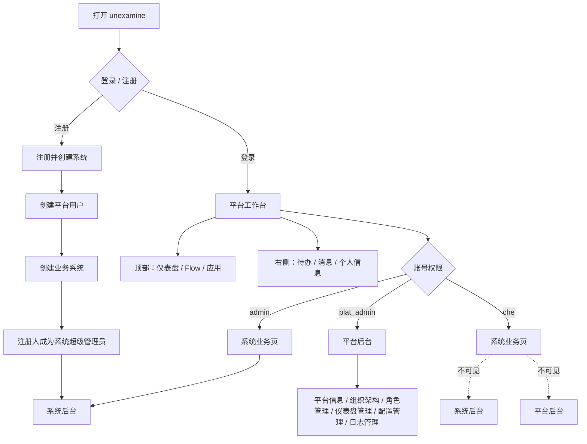
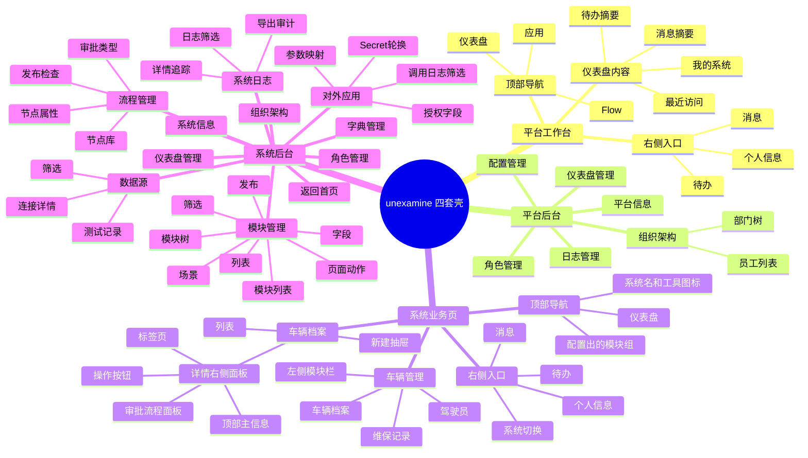
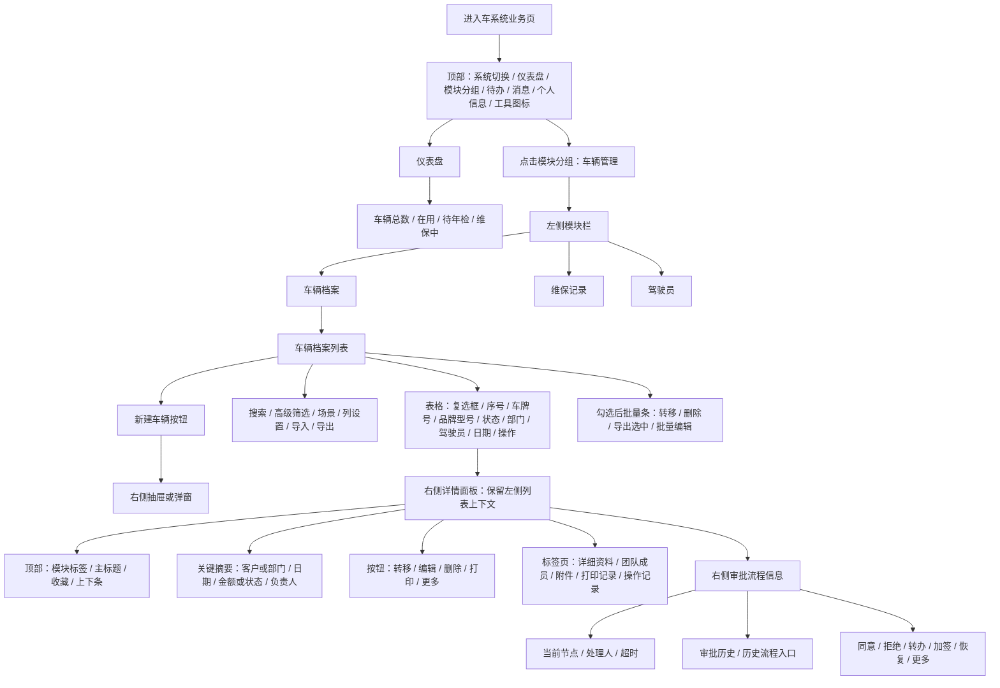
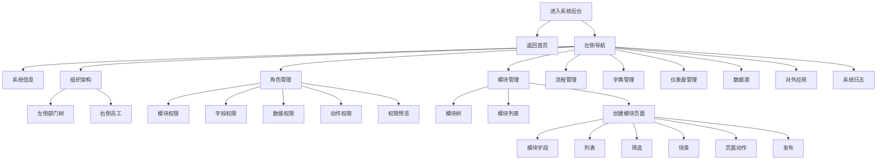
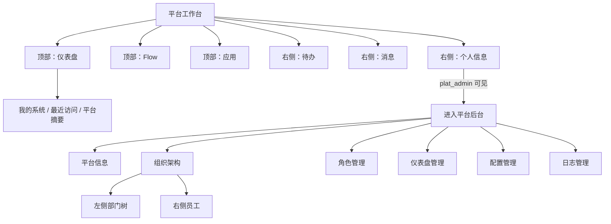
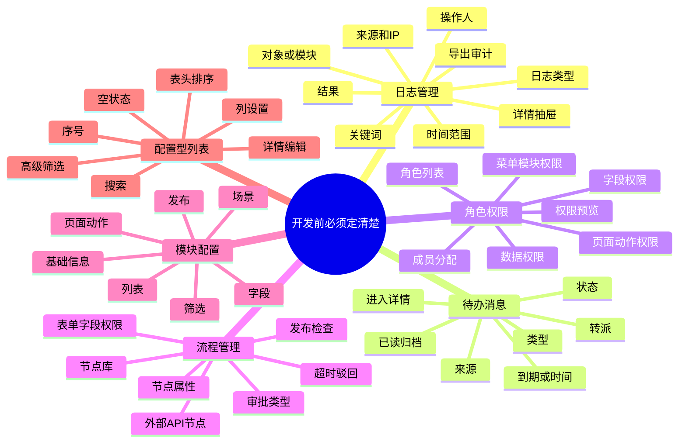

# 产品全量功能 NS 图（四套壳版）

> 这份图按用户 2026-06-16 新骨架重写。
> 默认展示超级管理员全量功能；实际用户看到什么，由角色、菜单、按钮、字段、数据权限裁剪。

## 1. 登录后角色分流

## 2. 四套壳总图

## 3. 系统业务页 NS 图

## 4. 系统后台 NS 图

## 5. 平台工作台与平台后台 NS 图

## 6. 超级管理员全量功能清单

| 壳 | 页面/区域 | 全量功能 |
|----|-----------|----------|
| 平台工作台 | 仪表盘 | 我的系统、最近访问、待办摘要、消息摘要 |
| 平台工作台 | Flow | 平台 Flow 工作台入口 |
| 平台工作台 | 应用 | 平台应用入口 |
| 平台后台 | 平台信息 | 平台名称、Logo、访问地址、基础资料 |
| 平台后台 | 组织架构 | 部门树、员工列表、员工详情 |
| 平台后台 | 角色管理 | 平台菜单权限、配置权限、日志权限 |
| 平台后台 | 仪表盘管理 | 平台仪表盘卡片和组件配置 |
| 平台后台 | 配置管理 | 登录安全、OpenAPI、文件存储、配额、功能开关 |
| 平台后台 | 日志管理 | 平台后台审计日志 |
| 系统业务页 | 仪表盘 | 车辆总数、在用、待年检、维保中 |
| 系统业务页 | 车辆档案 | 列表、新建、详情、筛选、列设置、导入、导出、批量操作 |
| 系统业务页 | 车辆详情 | 业务字段、审批状态、流程图、审批历史、审批操作 |
| 系统后台 | 系统信息 | 名称、图标、编码、访问地址、默认首页 |
| 系统后台 | 组织架构 | 部门树、员工、数据权限支撑 |
| 系统后台 | 角色管理 | 模块、字段、数据、动作权限和权限预览 |
| 系统后台 | 模块管理 | 模块树、模块列表、字段、列表、筛选、场景、动作、发布 |
| 系统后台 | 流程管理 | 流程列表、设计器、节点属性、发布检查 |
| 系统后台 | 字典管理 | 字典类型、字典项、字段关联 |
| 系统后台 | 仪表盘管理 | 组件库、画布、属性、数据源绑定 |
| 系统后台 | 数据源 | 系统内、外部 API、数据库直连 |
| 系统后台 | 对外应用 | 授权范围、参数映射、凭证、调用日志 |
| 系统后台 | 系统日志 | 配置、业务、流程、导出审计 |

## 7. 2026-06-17 复审后必须补齐的功能点

