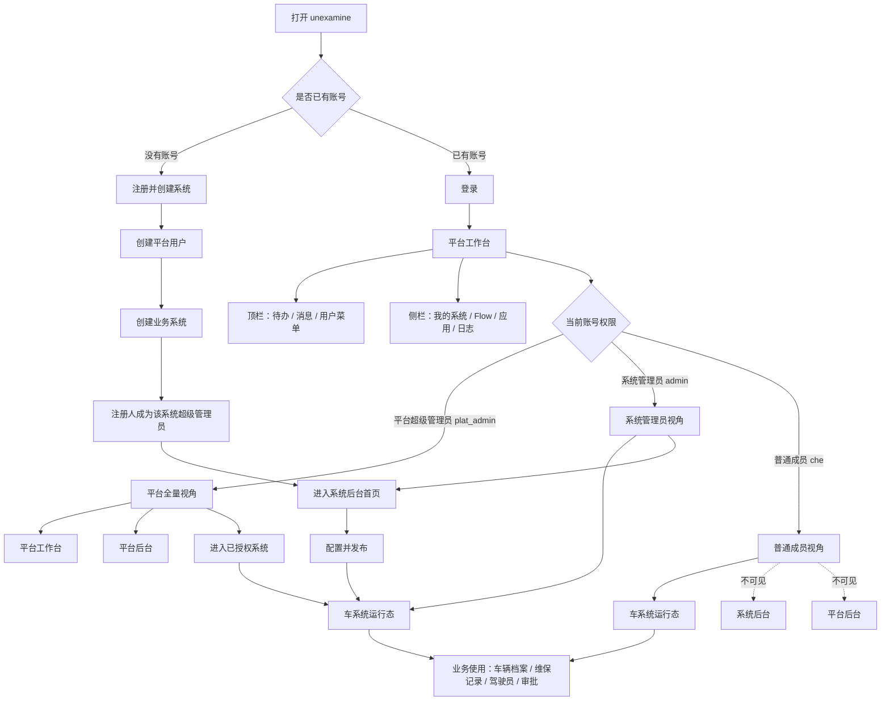
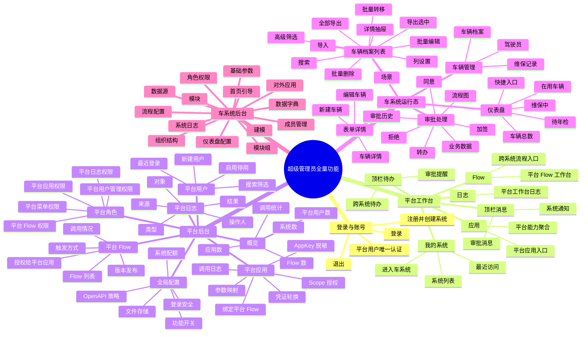
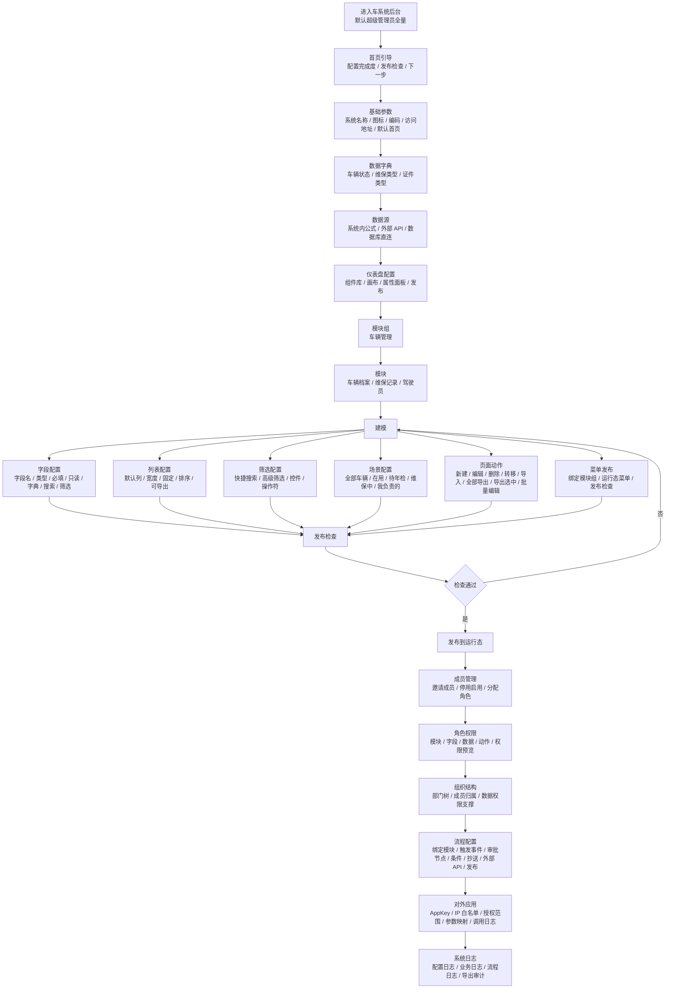
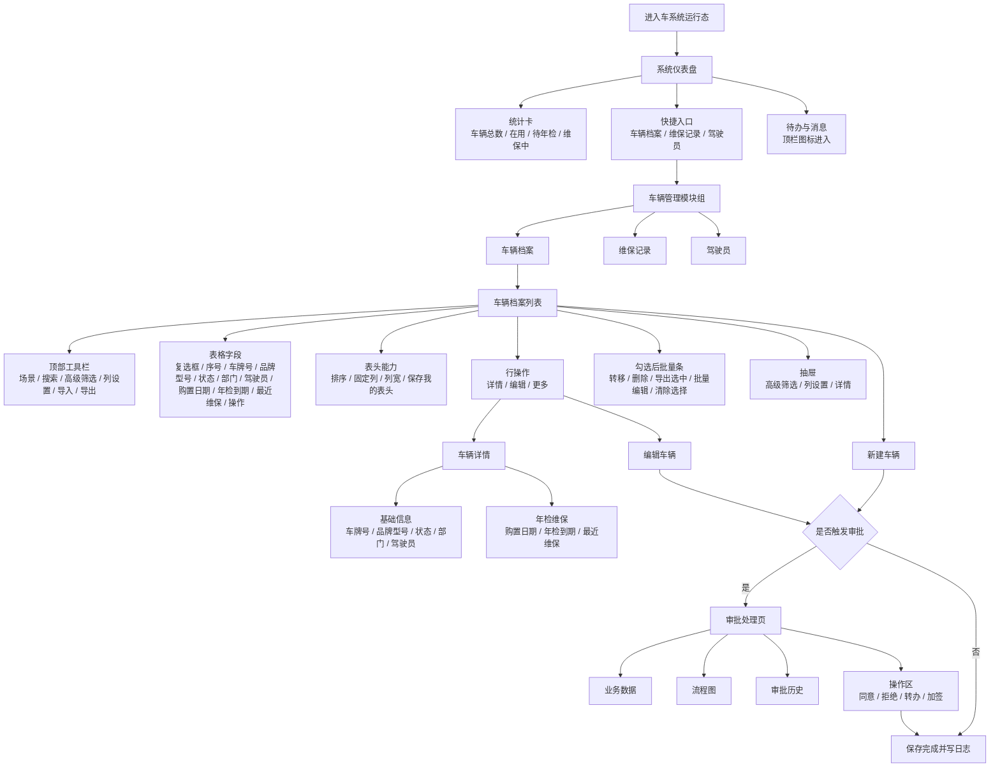
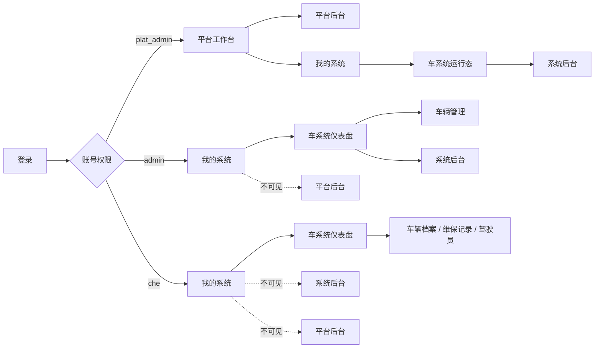
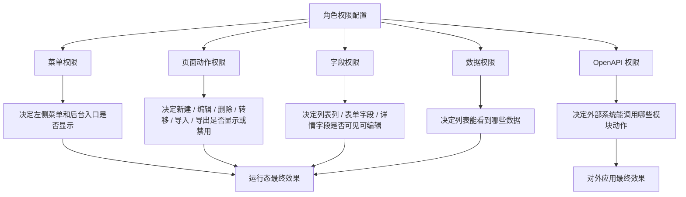

# 产品全量功能 NS 图（超级管理员视角）

> 这份图是给人看的产品功能地图，不是研发排期图。
> 默认按“超级管理员全量功能”展示；实际用户看到什么，由角色权限、菜单权限、按钮权限、字段权限、数据权限裁剪。

## 0. 读图规则

- **全量视角**：默认超级管理员可看到平台后台、系统后台、系统运行态全部入口。
- **普通成员视角**：例如 `che`，只看到车系统运行态和被授权的业务模块。
- **系统管理员视角**：例如 `admin`，看到车系统运行态 + 系统后台，但看不到平台后台。
- **平台管理员视角**：例如 `plat_admin`，看到平台工作台 + 平台后台，也可以进入已授权系统。
- **配置驱动**：页面菜单、按钮、列表字段、表单字段、详情字段、批量操作、导出能力都从配置和权限来。

## 1. 登录后按角色分流

## 2. 超级管理员全量功能地图

## 3. 系统后台全量配置 NS 图

## 4. 运行态全量页面 NS 图

## 5. 角色看到的首页和入口

| 角色/账号 | 登录后第一层 | 进入系统后首页 | 可见后台 | 看不到 |
|-----------|--------------|----------------|----------|--------|
| 平台超级管理员 `plat_admin` | 平台工作台 | 可进入已授权系统运行态 | 平台后台、系统后台 | 无，按全量示例展示 |
| 系统管理员 `admin` | 平台工作台 / 我的系统 | 车系统仪表盘 | 系统后台 | 平台后台 |
| 普通成员 `che` | 平台工作台 / 我的系统 | 车系统仪表盘 | 无 | 系统后台、平台后台、建模、角色权限 |

## 6. 权限配置如何影响页面

## 7. 超级管理员全量功能清单

### 平台层

| 区域 | 页面 | 全量功能 |
|------|------|----------|
| 登录前 | 登录 | 登录、退出、错误提示、找回入口占位 |
| 登录前 | 注册并创建系统 | 创建平台账号、创建系统、注册人成为系统管理员 |
| 平台工作台 | 我的系统 | 查看系统、进入系统、最近访问、系统状态、我的角色 |
| 平台工作台 | Flow | 平台 Flow 工作台入口、跨系统流程入口 |
| 平台工作台 | 应用 | 平台应用入口、平台能力聚合 |
| 平台工作台 | 日志 | 平台工作台日志查询 |
| 平台顶栏 | 待办/消息 | 待办列表、消息列表、角标提醒 |

### 平台后台

| 页面 | 全量功能 |
|------|----------|
| 概览 | 用户数、系统数、Flow 数、应用数、调用统计 |
| 平台用户 | 新建、启用、停用、搜索、筛选、查看最近登录 |
| 平台角色 | 平台菜单权限、平台用户权限、平台 Flow 权限、平台应用权限、平台日志权限 |
| 平台 Flow | Flow 列表、编码、状态、触发方式、版本、发布、调用情况 |
| 平台应用 | AppKey 脱敏、scope、授权平台 Flow、参数映射、凭证轮换、停用影响 |
| 平台日志 | 操作人、对象、类型、来源、结果、摘要 |
| 全局配置 | 登录安全、OpenAPI 策略、文件存储、配额、功能开关 |

### 系统运行态

| 页面 | 全量功能 |
|------|----------|
| 仪表盘 | 统计卡、快捷入口、待办消息、跳转模块 |
| 车辆档案列表 | 场景、搜索、高级筛选、列设置、导入、全部导出、导出选中、表头排序、序号、勾选、批量操作、详情抽屉 |
| 新建/编辑车辆 | 车牌号、品牌型号、车辆状态、归属部门、驾驶员、购置日期、年检到期、最近维保、备注 |
| 车辆详情 | 基础信息、年检维保、最近操作、编辑入口 |
| 审批处理 | 业务数据、流程图、审批历史、意见、同意、拒绝、转办、加签 |

### 系统后台

| 页面 | 全量功能 |
|------|----------|
| 首页引导 | 配置进度、发布检查、下一步任务 |
| 基础参数 | 系统名称、图标、编码、访问地址、默认首页 |
| 数据字典 | 字典类型、字典项、颜色、状态、排序、字段关联 |
| 数据源 | 系统内公式、外部 API、数据库直连、测试连接、刷新策略 |
| 仪表盘配置 | 组件库、画布、属性面板、数据源绑定、发布 |
| 模块组 | 车辆管理、运行态顶栏排序、状态 |
| 模块 | 车辆档案、维保记录、驾驶员、主字段、数据量、状态 |
| 建模 | 字段、列表、筛选、场景、页面动作、菜单发布、发布检查 |
| 成员管理 | 邀请、停用、启用、移出、分配角色、成员详情 |
| 角色权限 | 模块权限、字段权限、数据权限、动作权限、权限预览、复制角色 |
| 组织结构 | 部门树、成员归属、数据权限支撑 |
| 流程配置 | 绑定模块、触发事件、审批节点、条件、抄送、外部 API、发布检查 |
| 对外应用 | AppKey、Secret 状态、IP 白名单、授权范围、参数映射、调用日志 |
| 系统日志 | 配置变更、业务操作、流程日志、导出审计 |
