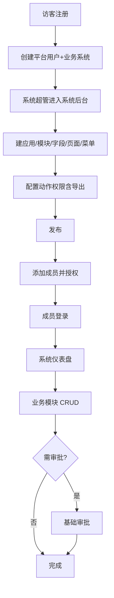
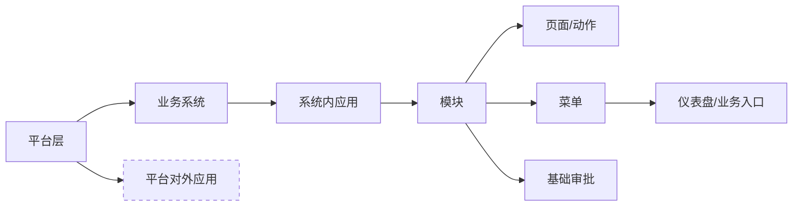

# unexamine 产品需求文档（PRD）— MVP 冻结版

> **版本:** 0.1.0-mvp  
> **agentId:** pm  
> **taskId:** phase-0-prd  
> **日期:** 2026-06-15  
> **依据:** `docs/user_requirement.md`、`.cursor/knowledge/*`、`docs/requirements/analysis.md`、`docs/decisions/resolution.md`

**冻结规则引用:** 产品与技术边界以 `.cursor/knowledge/frozen-rules.md` 为准；本文在其基础上定义 **MVP 切片**。

---

## 背景

unexamine 是面向企业团队的**可配置业务系统平台**。v1 在后端域能力上积累较多，但 UI/IA 导致普通用户无法自然使用。v2 在保留 generator + 多模块后端策略的前提下，按**用户任务**重做产品与界面，并以「车系统 / che 成员」作为首期验收锚点。

## 目标

### 产品目标

1. 平台管理员/注册用户能创建业务系统并完成建模发布。
2. 普通成员登录后进入**系统仪表盘**，在授权模块内完成业务 CRUD。
3. 配置与使用分离：系统后台仅对有管理权限的用户可见。
4. 交付物可部署：`frontend/dist` + 同源 API + 车系统 E2E 证据。

### 成功标准（MVP）

- 车系统剧本（见 §验收标准）浏览器可走通。
- 用户在 `user-approval.md` 对 Open Design 原型签字后，才进入开发。
- 不得将「接口通/build 过」等同于「用户可用」。

### 不做（MVP 实现 / 原型）

- **拖拽式**自由布局仪表盘（**配置式**组件栅格 Design 已有）
- KPI、打印模板、Agent 问数
- Excel 批量导入、复杂异步导出任务中心 UI
- 平台对外应用完整链路（OpenAPI 客户端全流程）
- Flow：事件触发审批、大流程（仅保留基础审批绑定模块）
- 多租户业务验收（字段可预留）
- 数据脱敏、配额、灰度发布等 §14 增强项

---

## 用户角色（权限画像）

| 画像 | 说明 | MVP 剧本 |
|------|------|----------|
| 平台管理员 | 平台后台、创建用户、全局策略 | `plat_admin` |
| 系统超管/创建人 | 系统后台、建模发布、成员授权 | 注册建系统者 / 车系统管理员 |
| 普通业务成员 | 仪表盘 + 授权模块业务功能 | `che` |
| 集成管理员 | 对外应用 | MVP 不验 |

角色名为权限模板，页面由**菜单+权限点**驱动，不写死角色名。

---

## 功能范围（MVP）

### 平台层

| 功能 | MVP | 说明 |
|------|-----|------|
| 登录/退出 | ✅ | 种子 `plat_admin` |
| 注册并创建首个系统 | ✅ | 统一认证；注册人=系统超管 |
| 我的系统 | ✅ | 列表、进入系统 |
| 平台后台 | ✅ | **概览卡片** + 平台用户管理 + 简配置（须有实质页面） |
| 顶栏待办/消息 | ✅ | **仅顶栏图标+角标**；侧栏不重复 |
| 平台 Flow 入口 | ⭕ | 侧栏「Flow」→ 跨系统待办/流程汇总列表 |
| 平台应用入口 | ⭕ | 侧栏「应用」→ 平台级应用聚合入口 |
| 平台日志 | ⭕ | 侧栏「日志」→ 只读列表 |
| 对外应用中心（平台后台内） | ⭕ | 平台级应用创建/AK 管理；与系统内「应用接入」配合 |

### 系统层

| 功能 | MVP | 说明 |
|------|-----|------|
| 系统仪表盘 | ✅ 配置驱动展示 | 拖拽设计器、复杂图表 → 分期 |
| 数据源 | ✅ 三类型 IA + 系统内公式 | DB 直连运行时、API 缓存 → 分期 |
| 数据字典 | ✅ 字典页 + 字段关联 | 级联字典 → 增强 |
| 系统基础参数 | ✅ 名称/图标/域名 | 域名 DNS 自动验证 → 增强 |
| 系统后台 | ✅ | 见 RES-2026-06-15-002 配置链 |
| 模块与分组 | ✅ | **模块分组 → 模块**（非「应用包含模块」） |
| 字段/页面动作/菜单/发布 | ✅ | 动作含导出 |
| 流程配置 | ✅ 画布+全节点类型 IA | 动态加签、并行会签 → 实现分期 |
| 对外应用 | ✅ 列表+参数映射 UI | 嵌套 JSON、响应反写 → 实现分期 |
| 角色权限 | ✅ 模块+字段+数据三 Tab | 自定义数据条件、脱敏 → 实现分期 |
| 业务功能（运行态） | ✅ | 列表/表单/详情/保存/筛选 |
| 基础审批运行 | ⭕ | 车系统可验「提交→审批」 |
| 附件 | ⭕ | 单文件上传/下载（可简版） |
| 导入 | ❌ | 增强期 |

### PM 对 analysis 差异的裁决（D-01~D-06）

| ID | 裁决 |
|----|------|
| D-01 | **取消「导出中心」独立导航**；导出为模块动作；配置在模块功能/动作权限 |
| D-02 | 选系统后默认 **系统仪表盘**；业务 CRUD 在模块功能内 |
| D-03 | 主推 **注册=建系统+超管**；运维用 `plat_admin` |
| D-04 | 本文 MVP 边界为准，不全量实现 user_requirement |
| D-05 | 导出权限 = 动作位 `export` |
| D-06 | UI 文案区分「应用接入（系统↔平台应用）」与「平台级对外应用」 |
| D-07 | 平台待办/消息**仅顶栏**；侧栏不重复（RES-002） |
| D-08 | 建模以**模块+模块分组**为中心；应用用于平台应用关联 |

---

## 项目整体流程图

## 业务模块关系图

虚线：MVP 不实现。

## 业务场景矩阵（MVP 节选）

| 角色 | 模块 | 场景 | 触发 | 验收点 |
|------|------|------|------|--------|
| 平台管理员 | 平台 | 登录进我的系统 | 登录 | 非空工作台 |
| 注册用户 | 平台 | 注册并建系统 | 注册页 | 自动进系统后台向导 |
| 系统超管 | 系统后台 | 建车辆模块并发布 | 建模 | 菜单出现在仪表盘 |
| 系统超管 | 成员 | 添加 che 并授权 | 成员管理 | che 仅有车辆模块 |
| che | 业务 | 新增/查询/编辑车辆 | 仪表盘进模块 | 无系统后台入口 |
| che | 动作 | 有 export 权限时可导出 | 列表动作区 | 非独立导出中心 |

## 技术架构与模块边界

遵循 `.cursor/architecture/backend-structure.md`：

- Java 21、Spring Boot 3.3、Maven 多模块
- `examine-generator` → `base/`；业务 → `manage/`
- 前端：Vue 3 + Vite + 一套 UI 组件库（**Design 阶段冻结**，候选 Naive UI / Ant Design Vue）
- API 同源 `/api/v1/`

## 核心用户流程：车系统剧本（P0 验收）

1. `plat_admin` 登录 → 我的系统 → 创建「车」系统（或用注册流程创建）。
2. 进入车系统后台 → 成员：将平台用户 `che` 加为成员并授权。
3. 建模：**先模块组「车辆管理」** → 组下模块「车辆档案」等 → 字段 → 页面动作 → 菜单 → 发布。
4. 动作权限：che 角色含查看/新建/编辑/导出（export）。
5. `che` 登录 → 进入车系统 **仪表盘** → 打开车辆模块。
6. 新增、筛选、编辑车辆记录；有权限时从列表**动作区导出**。
7. 断言：`che` 无平台后台、无系统后台、无建模菜单。

## 页面/交互说明（MVP 页面清单）

### 平台

- 登录 / 注册（注册并建系统）
- 我的系统
- 平台后台（用户管理、简配置）
- 顶部：待办、消息、退出

### 系统

- **系统仪表盘**（默认首页）
- **系统后台**（管理权限）：基础信息、成员与角色、应用、模块、字段、页面、菜单、发布
- **模块业务页**：列表（分页、筛选、动作区）、表单、详情

### 禁止的页面模式

- 裸露 API 编号/schema 的调试台
- 与模块平级的「导出中心」主导航
- 普通成员默认看到系统后台

## 数据规则

- 业务记录带 `systemId`；模块数据带 `appId`/`moduleId`
- `tenantId` 字段预留，MVP 单租户
- 配置发布使用版本快照（流程、页面）

## 权限规则

- 平台权限与系统权限分离
- 动作权限统一模型：crud + export +（可选）import/approve…
- 后端兜底校验；前端按权限隐藏/禁用

## 异常场景（MVP）

| 场景 | 反馈 |
|------|------|
| 无系统 | 引导注册/创建 |
| 无模块权限 | 中文空态：请联系管理员 |
| 无 export 动作权限 | 导出按钮不显示 |
| 未登录 | 跳转登录 |

## 验收标准

- [ ] 车系统剧本 7 步 E2E 有证据（`docs/evidence/e2e-car-system.md`）
- [ ] Open Design 原型 + `user-approval.md` approved
- [ ] `che` 视角无管理入口
- [ ] 导出从模块动作触发，无独立导出中心
- [ ] `plat_admin` 种子可登录

---

## 增强期（_post-MVP，不在此冻结实现）_

导入导出任务中心、Flow 三类完整、可配置仪表盘、OpenAPI 对外、多租户、KPI/打印/数据源。

---

## 文档维护

- API 契约：Phase 2 `docs/api/api.md`
- UI：`docs/design/ui-spec.md` + 原型
- 变更 MVP 边界须用户 `resolution` 或 escalated issue
