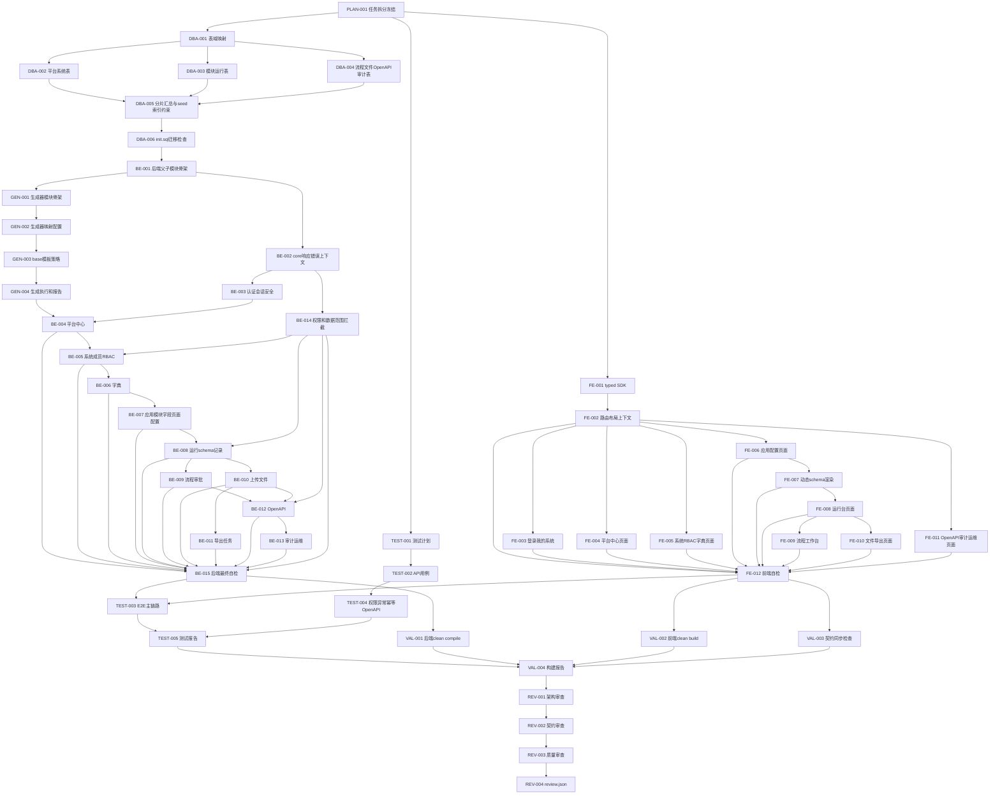

# unexamine 细粒度开发任务拆分

## 输入与冻结边界

本任务拆分基于以下冻结输入生成：

- `docs/prd.md`
- `docs/project_understanding.md`
- `docs/api.md`
- `docs/api_review.md`
- `docs/service_info.md`
- `docs/generator_reference.md`
- `.codex/state.json`

当前状态为 `current_step=14`，`api_frozen=true`，允许进入任务拆分阶段。当前阶段只产出 `docs/task_plan.md` 和 `docs/tasks/`，下一步仍只是任务清单评审，不执行 DB 设计、SQL 初始化、后端实现或前端实现。

## 任务拆分原则与阶段边界

1. 任务按冻结 API 和 PRD 的业务域拆分，避免一个任务跨越 DB、后端、前端、测试多个职责。
2. `base` 层基础 CRUD 必须由 `examine-generator` 基于已导入数据库表生成；业务 Controller、BO/DTO/VO、事务、权限和转换仅放在 `manage` 层。
3. 后端实现必须遵守冻结 API；若发现字段、枚举、错误码、状态流转或权限语义无法落地，登记契约变更问题并回到 API 契约评审。
4. 前端只基于冻结 `docs/api.md` 生成 typed SDK、页面级契约证据和最终 `frontend/docs/api-contract-map.md`；页面不得散落直接请求，也不得伪造 API 没有的更新语义。
5. 测试用例设计可与 DBA/后端/前端准备并行；测试执行必须依赖后端、前端和必要数据准备产物。
6. validator 必须 clean 验证，不能以增量构建或缓存产物作为通过依据。
7. reviewer 中间审查只输出 `docs/review_parts/` 分片，最终 `REV-004` 唯一输出合法 `docs/review.json`，失败时按 target 回环到对应阶段。

## 分期开发计划

为降低长时任务和最终验收失控风险，开发模式按期推进。每期只启动当前期内依赖已满足、输出路径不重叠的任务；当前期未通过 PM 验收前，不进入下一期。

| 期次 | 名称 | 任务范围 | 主责角色 | 入口条件 | 退出标准 | 当前状态 |
| --- | --- | --- | --- | --- | --- | --- |
| P0-foundation | 基础冻结与骨架期 | DBA-001 至 DBA-006、TEST-001 至 TEST-002、FE-001 至 FE-007、FE-011、BE-001 至 BE-002、GEN-001 | planner/dba/backend/frontend/test | 审阅模式冻结，开发模式启动 | DB/SQL、后端骨架、core、生成器骨架、前端 SDK/Layout/基础页面和测试计划完成，相关自检通过 | done |
| P1-generator | 生成器闭环期 | GEN-002、GEN-003、GEN-004 | backend | P0 完成，`sql/init.sql` 可导入，`examine-generator` 骨架可编译 | 能通过命令参数按表前缀生成各业务模块 `base` 包，后端 compile 通过 | pending |
| P2-auth-platform | 认证与平台期 | BE-003、BE-004、FE-003、FE-004 的联调补充、阶段 validator/test 轻量检查 | pm/backend/frontend/test/validator | P1 完成，base CRUD 可用 | 登录、刷新、退出、当前用户、我的系统、平台系统创建和平台账号角色核心接口/页面闭环，PM 验收通过 | pending |
| P3-system-config | 系统配置与权限期 | BE-005、BE-006、BE-007、BE-014、FE-005、FE-006 的联调补充 | pm/backend/frontend/test | P2 完成 | 系统成员、部门、角色、权限、字典、应用/模块/字段/页面配置闭环，权限与数据范围基础可用 | pending |
| P4-runtime-mvp | 运行台 MVP 期 | BE-008、FE-008、阶段 test/validator | pm/backend/frontend/test/validator | P3 完成 | 动态 schema、记录列表/详情/保存/历史/提交审批入口按权限跑通，运行台 MVP 满意度通过 | pending |
| P5-workflow-files-openapi | 流程文件导出 OpenAPI 期 | BE-009 至 BE-013、FE-009 至 FE-011 的联调补充 | pm/backend/frontend/test | P4 完成 | 流程待办、附件、导出、OpenAPI、审计运维核心链路闭环 | in_progress |
| P6-final-acceptance | 集成验收与上线判断期 | BE-015、FE-012、TEST-003 至 TEST-005、VAL-001 至 VAL-004、REV-001 至 REV-004 | test/validator/reviewer/pm | P5 完成 | 后端自检、前端契约闭环、E2E、clean build、review 全部通过，输出可上线判断 | pending |

分期状态规则：

- 每期状态允许 `pending/in_progress/paused/done/blocked/rework`。
- `planner` 维护分期和任务依赖；`pm` 在每期结束给出 `pass/rework/blocked` 结论。
- Orchestrator 在 `.codex/state.json.current_phase`、`.codex/state.json.phase_status` 和 `docs/progress.md` 同步当前期状态。
- 暂停时不改变未完成任务状态；如果 agent 中断后留下半成品，任务标记为 `partial`，继续时优先复核半成品。

## 里程碑

| 里程碑 | 任务范围 | 入口条件 | 输出 | 退出标准 | 状态 |
| --- | --- | --- | --- | --- | --- |
| 任务拆分 | PLAN-001 | API 已冻结 | `docs/task_plan.md`、`docs/tasks/` | 任务清单覆盖 DBA、后端、前端、test、validator、reviewer，状态均为 pending | pending |
| DB 设计 | DBA-001 至 DBA-005 | 任务拆分通过 | `docs/db_design_parts/`、`docs/db_design.md` | DBA-001 至 DBA-004 输出不重叠分片，DBA-005 串行汇总最终 DB 设计；表域、字段、关系、seed、索引、约束、并发规则清晰 | pending |
| SQL 初始化 | DBA-006 | DB 设计完成 | `sql/init.sql`、DBA 自检记录 | SQL 与 DB 设计一致，可导入目标 MySQL | pending |
| 后端架构 | BE-001 至 BE-003 | DB/SQL 完成 | `backend/` 架构骨架 | Maven 多模块、core、认证会话基础可编译 | pending |
| examine-generator | GEN-001 至 GEN-004 | DB/SQL 与后端骨架完成；参考 `.codex/oldgenerator/` 和 `docs/generator_reference.md` | `backend/examine-generator/`、各业务模块 `base/` 包 | base 层可通过命令直接生成，旧模板取舍清晰，输出路径由命令参数传入 | pending |
| 后端业务模块 | BE-004 至 BE-014 | 生成器产物、core、权限基础完成 | 各模块 `manage` 代码 | 平台、系统、模块、运行、流程、文件、导出、OpenAPI、审计接口符合 API | pending |
| API 实现自检 | BE-015 | 后端业务模块完成 | `backend/docs/backend-self-check.md` | 错误码、幂等、权限、事务、OpenAPI 签名和主要接口自检通过 | pending |
| 前端 SDK | FE-001 | API 冻结 | `frontend/src/api/`、`frontend/docs/page-contracts/_template.md` | 枚举、错误码、DTO/VO、分页、动态字段模型可被页面复用 | pending |
| 前端页面 | FE-002 至 FE-011 | SDK 和路由基础完成 | `frontend/src/pages/`、`frontend/src/components/`、`frontend/docs/page-contracts/` | 页面按模块完成，页面级 API 映射、权限禁用、空态、错误态、requestId 展示闭环 | pending |
| 前端自检 | FE-012 | 前端页面完成 | `frontend/docs/api-contract-map.md`、`frontend/docs/frontend-self-check.md` | 页面到接口映射、枚举错误码同步、无旁路请求 | pending |
| test 测试 | TEST-001 至 TEST-005 | API 冻结；执行依赖实现产物 | `docs/test_plan.md`、`docs/test_runs/`、`docs/test_report.md` | TEST-003/004 写独立执行记录，TEST-005 汇总报告并给出 pass/fail target | pending |
| validator 构建 | VAL-001 至 VAL-004 | 后端、前端、测试产物完成 | `docs/build/`、`docs/build_report.md` | VAL-001/002/003 写独立验证记录，VAL-004 汇总 clean compile、clean build 和契约同步结论 | pending |
| reviewer 审查 | REV-001 至 REV-004 | 测试和构建报告完成 | `docs/review_parts/`、`docs/review.json` | REV-001 至 REV-003 输出不重叠审查分片，REV-004 唯一输出合法 JSON 总结论 | pending |

## 依赖图

## 总任务矩阵

| taskId | 标题 | 角色 | 模块 | 输入 | 输出 | 依赖 | 可并行 | 完成标准 | 测试要求 | 状态 |
| --- | --- | --- | --- | --- | --- | --- | --- | --- | --- | --- |
| PLAN-001 | 任务拆分冻结 | planner | 计划管理 | PRD/API/理解/API评审/service/state | `docs/task_plan.md`、`docs/tasks/` | 无 | 否 | 任务文件完整且状态 pending | 自检文件数量与必填段落 | pending |
| DBA-001 | 表域与命名映射设计 | dba | DB | PRD/API/理解/service/legacy摘要 | `docs/db_design_parts/domain-map.md` | PLAN-001 | 否 | 表前缀、业务域和模块映射明确 | 与 API 数据落点逐项对齐 | pending |
| DBA-002 | 平台系统 RBAC 字典表设计 | dba | DB | DBA-001 | `docs/db_design_parts/platform-system-rbac-dict.md` | DBA-001 | 是 | `un_plat_` 与系统成员/RBAC/字典边界明确，最终总文档由 DBA-005 汇总 | 唯一键和状态枚举可测 | pending |
| DBA-003 | 模块配置运行记录导出表设计 | dba | DB | DBA-001 | `docs/db_design_parts/module-runtime-export.md` | DBA-001 | 是 | `un_module_` 配置、EAV、历史、导出闭环明确，最终总文档由 DBA-005 汇总 | 动态字段唯一性和软删规则可测 | pending |
| DBA-004 | 流程文件 OpenAPI 审计表设计 | dba | DB | DBA-001 | `docs/db_design_parts/flow-upload-openapi-audit.md` | DBA-001 | 是 | `un_flow_`、`un_upload_`、`un_openapi_`、`un_sys_`/`un_audit_` 表域明确，最终总文档由 DBA-005 汇总 | 幂等、签名、日志链路可测 | pending |
| DBA-005 | seed 索引约束并发设计 | dba | DB | DBA-001/002/003/004 分片、理解、旧项目参考 | `docs/db_design.md` | DBA-002, DBA-003, DBA-004 | 否 | 合并分片并补齐 seed、唯一索引、幂等锁、序号并发规则、旧项目差异和迁移注意事项 | 初始化和冲突用例可断言 | pending |
| DBA-006 | init.sql 与迁移检查 | dba | DB/SQL | DBA-005 | `sql/init.sql`、`docs/db_design.md` | DBA-005 | 否 | SQL 可导入，表结构与文档一致，迁移检查结果回写 DB 设计 | 导入 MySQL 并记录结果 | pending |
| GEN-001 | examine-generator 模块骨架 | backend | generator | DBA-006/BE-001/oldgenerator参考 | `backend/examine-generator/` | BE-001, DBA-006 | 是 | 生成器模块纳入父 POM，旧生成器参考取舍明确 | 编译可识别模块 | pending |
| GEN-002 | 生成器数据库映射配置 | backend | generator | GEN-001/DBA-006/service/oldgenerator参考 | 命令参数 | GEN-001 | 否 | 模块名、表前缀、base 包和输出目录由命令传入，旧硬编码已移除 | 连接配置和命令复跑自检 | pending |
| GEN-003 | base 层模板策略 | backend | generator | GEN-002/API/template_owner参考 | 模板与生成规则 | GEN-002 | 否 | 只生成 entity/mapper/service/serviceImpl，不生成 Controller | 验证不生成 Controller | pending |
| GEN-004 | 生成执行 | backend | generator | GEN-003/SQL/oldgenerator参考 | 各模块 `base/` 包 | GEN-003 | 否 | 按模块分别执行生成命令，命令显式包含模块名、表前缀、base 包和输出目录，不再维护映射文件或默认报告 | 编译前生成产物自检 | pending |
| BE-001 | 后端父子 POM 与模块骨架 | backend | backend | DBA-006/service | `backend/` | DBA-006 | 否 | Maven 多模块结构完整 | 父子模块基础 compile | pending |
| BE-002 | core 统一响应错误上下文 | backend | core | BE-001/API | `examine-core` | BE-001 | 是 | ApiResponse、错误码、requestId、上下文和幂等基础服务抽象完成 | 单元测试异常、响应结构和幂等基础响应 | pending |
| BE-003 | 认证会话安全 | backend | plat/web | BE-002/API | auth manage 接口 | BE-002 | 是 | 登录、刷新、退出、me 符合 AUTH 契约 | token、账号状态、requestId 测试 | pending |
| BE-004 | 平台中心 API | backend | plat | GEN-004/BE-003/API | 平台 manage 接口 | GEN-004, BE-003 | 否 | 系统创建事务、账号角色配置完成 | PLAT 接口与回滚测试 | pending |
| BE-005 | 系统成员 RBAC API | backend | module/plat | BE-004/BE-014 | 系统成员与权限接口 | BE-004, BE-014 | 否 | 成员、部门、角色、权限目录完成 | 跨系统、数据范围、授权测试 | pending |
| BE-006 | 字典管理 API | backend | module | BE-005/API | 字典 manage 接口 | BE-005 | 否 | 类型/字典项/引用限制/缓存版本完成 | DICT 接口和引用限制测试 | pending |
| BE-007 | 应用模块字段页面配置 API | backend | module | BE-006 | 应用配置接口 | BE-006 | 否 | APP/MOD/FIELD/UI 发布检查完成 | 发布版本与字段校验测试 | pending |
| BE-008 | 运行 schema 与记录 API | backend | module | BE-007/BE-014 | 运行台接口 | BE-007, BE-014 | 否 | schema、记录、EAV、历史、关联和运行记录幂等完成 | RUN 接口、唯一性、锁定测试 | pending |
| BE-009 | 流程模板实例任务 API | backend | flow | BE-007/BE-008/BE-014 | 流程接口 | BE-007, BE-008, BE-014 | 是 | 模板发布、待办、动作、状态联动完成 | 并发处理和状态流转测试 | done |
| BE-010 | 上传文件引用 API | backend | upload | BE-008/BE-014 | 文件接口 | BE-008, BE-014 | 是 | 临时文件、引用、预览下载权限完成 | 文件失败补偿和权限测试 | done |
| BE-011 | 导出任务 API | backend | module/upload | BE-010 | 导出接口 | BE-010 | 是 | 模板、任务、重试、结果文件闭环完成 | 导出状态与失败重试测试 | done |
| BE-012 | OpenAPI 安全与业务接口 | backend | app | BE-008/BE-009/BE-010/BE-014 | OpenAPI 管理和外部接口 | BE-008, BE-009, BE-010, BE-014 | 是 | AK/SK、签名、scope、限流、幂等完成 | `mvn -pl examine-app -am test` 通过 | done |
| BE-013 | 审计运维 API | backend | audit/ops | BE-012 | 审计与运维接口 | BE-012 | 是 | 日志、健康、版本、migration 状态完成 | `mvn -pl examine-web -am test` 通过 | done |
| BE-014 | 权限与数据范围拦截 | backend | core/module | BE-002/API | 权限服务与拦截器 | BE-002 | 是 | 后端权限顺序、字段权限、数据范围统一 | 越权、字段无写权测试 | pending |
| BE-015 | 幂等并发与 API 自检 | backend | backend | BE-004..BE-014 | `backend/docs/backend-self-check.md` | BE-004, BE-005, BE-006, BE-007, BE-008, BE-009, BE-010, BE-011, BE-012, BE-013, BE-014 | 否 | 固定自检报告包含接口清单、命令、结果、失败摘要、幂等/权限/OpenAPI 结论和 pass/fail | 后端单元和集成自检 | pending |
| FE-001 | typed SDK 与契约映射 | frontend | frontend | API/service | `frontend/src/api/`、`frontend/docs/page-contracts/_template.md` | PLAN-001 | 否 | DTO/VO/枚举/错误码同步，页面级证据模板完成 | 静态类型检查 | pending |
| FE-002 | 路由布局认证上下文 | frontend | frontend | FE-001/API | `frontend/src/router/`、`frontend/src/layouts/`、`frontend/src/stores/`、`frontend/docs/page-contracts/FE-002-routing-layout-auth-context.md` | FE-001 | 否 | 系统/租户/member 上下文闭环，路由证据完成 | 登录态与路由守卫自检 | pending |
| FE-003 | 登录注册与我的系统 | frontend | platform | FE-002 | `frontend/src/pages/auth/`、`frontend/src/pages/my-systems/`、`frontend/docs/page-contracts/FE-003-login-my-systems.md` | FE-002 | 是 | AUTH/PLAT 我的系统闭环，页面级 API 映射、权限禁用态、空态/错误态和证据完成 | 空态、错误态、requestId 自检 | pending |
| FE-004 | 平台中心页面 | frontend | platform | FE-002 | `frontend/src/pages/platform/`、`frontend/docs/page-contracts/FE-004-platform-center-pages.md` | FE-002 | 是 | 平台管理页面符合权限禁用，页面级 API 映射、空态/错误态和证据完成 | PLAT 页面接口映射自检 | pending |
| FE-005 | 系统成员 RBAC 字典页面 | frontend | system | FE-002 | `frontend/src/pages/system/`、`frontend/docs/page-contracts/FE-005-system-member-rbac-dict-pages.md` | FE-002 | 是 | 成员、部门、角色、字典页面完成，页面级 API 映射、禁用态、空态/错误态和证据完成 | RBAC/DICT 映射与禁用态自检 | pending |
| FE-006 | 应用模块字段配置页面 | frontend | module config | FE-002/FE-005 | `frontend/src/pages/module-config/`、`frontend/docs/page-contracts/FE-006-app-module-field-config-pages.md` | FE-002, FE-005 | 是 | APP/MOD/FIELD/UI 草稿发布页面完成，页面级 API 映射、禁用态、空态/错误态和证据完成 | 发布检查错误定位自检 | pending |
| FE-007 | 动态 schema 渲染组件 | frontend | runtime | FE-006 | `frontend/src/components/dynamic-schema/`、`frontend/docs/page-contracts/FE-007-dynamic-schema-renderer.md` | FE-006 | 否 | 字段权限、类型渲染、错误定位统一，组件级契约证据完成 | 动态字段组件自检 | pending |
| FE-008 | 应用运行台页面 | frontend | runtime | FE-007 | `frontend/src/pages/runtime/`、`frontend/docs/page-contracts/FE-008-runtime-workbench-pages.md` | FE-007 | 是 | RUN 查询、保存、提交、历史闭环，页面级 API 映射、禁用态、空态/错误态和证据完成 | 字段无权限和流程锁定自检 | pending |
| FE-009 | 流程工作台页面 | frontend | flow | FE-007/FE-008 | `frontend/src/pages/flow/`、`frontend/docs/page-contracts/FE-009-flow-workbench-pages.md` | FE-007, FE-008 | 是 | FLOW 任务处理和历史展示完成，页面级 API 映射、禁用态、空态/错误态和证据完成 | 重复处理、禁用态自检 | pending |
| FE-010 | 文件与导出页面 | frontend | upload/export | FE-007/FE-008 | `frontend/src/pages/files/`、`frontend/src/pages/export/`、`frontend/docs/page-contracts/FE-010-file-export-pages.md` | FE-007, FE-008 | 是 | 上传、预览、下载、导出轮询完成，页面级 API 映射、禁用态、空态/错误态和证据完成 | 文件权限和任务状态自检 | pending |
| FE-011 | OpenAPI 审计运维页面 | frontend | openapi/audit/ops | FE-002 | `frontend/src/pages/openapi/`、`frontend/src/pages/audit/`、`frontend/src/pages/ops/`、`frontend/docs/page-contracts/FE-011-openapi-audit-ops-pages.md` | FE-002 | 是 | 凭证一次展示、日志 requestId 检索完成，页面级 API 映射、禁用态、空态/错误态和证据完成 | OPM/AUD/OPS 映射自检 | pending |
| FE-012 | 前端自检与契约闭环 | frontend | frontend | FE-002..FE-011 | `frontend/docs/api-contract-map.md`、`frontend/docs/frontend-self-check.md` | FE-002, FE-003, FE-004, FE-005, FE-006, FE-007, FE-008, FE-009, FE-010, FE-011 | 否 | 汇总页面证据，无旁路请求，枚举错误码同步 | typecheck/build 前自检 | pending |
| TEST-001 | 测试计划与夹具设计 | test | test | PRD/API/task_plan/service | `docs/test_plan.md` | PLAN-001 | 是 | 范围、环境、夹具和入口明确 | 测试数据不进入生产 seed | pending |
| TEST-002 | API 契约用例 | test | test | TEST-001/API | API 用例清单 | TEST-001 | 是 | 正常、异常、权限、边界、幂等覆盖 | 可直接用于自动化 | pending |
| TEST-003 | E2E 主链路执行 | test | test | BE-015/FE-012 | `docs/test_runs/e2e-main-chain.md` | BE-015, FE-012, TEST-002 | 否 | 创建系统到审批导出 OpenAPI 闭环跑通，执行记录独立输出 | E2E 场景断言 | pending |
| TEST-004 | 权限异常幂等 OpenAPI 测试 | test | test | BE-015/FE-012/TEST-002 | `docs/test_runs/permission-exception-idempotency-openapi.md` | BE-015, FE-012, TEST-002 | 是 | 越权、状态冲突、签名、限流、幂等覆盖，执行记录独立输出 | fail 给出 target | pending |
| TEST-005 | 测试报告 | test | test | TEST-003/TEST-004 | `docs/test_report.md` | TEST-003, TEST-004 | 否 | 汇总测试执行记录，报告含命令、结果、失败摘要、target | 结论 pass/fail | pending |
| VAL-001 | 后端 clean compile | validator | validator | BE-015/service | `docs/build/backend-clean-compile.md` | BE-015 | 是 | JDK/Maven 路径和 clean compile 结果明确，记录独立输出 | 失败日志摘要 | pending |
| VAL-002 | 前端 clean build | validator | validator | FE-012/service | `docs/build/frontend-clean-build.md` | FE-012 | 是 | 清理 dist/tsbuildinfo 后 build，记录独立输出 | 失败日志摘要 | pending |
| VAL-003 | 契约同步检查 | validator | validator | API/FE-012 | `docs/build/contract-sync-check.md` | FE-012 | 是 | 错误码、枚举、状态值同步到 SDK/map，记录独立输出 | 不一致判 fail | pending |
| VAL-004 | 构建报告 | validator | validator | VAL-001/002/003/TEST-005 | `docs/build_report.md` | VAL-001, VAL-002, VAL-003, TEST-005 | 否 | 汇总构建记录，构建报告满足格式契约 | validator 结论明确 | pending |
| REV-001 | 架构审查 | reviewer | review | PRD/API/DB/backend/frontend | `docs/review_parts/rev-001-architecture.md` | VAL-004 | 否 | 模块边界、base/manage、事务权限风险审查 | 发现问题归因 target | pending |
| REV-002 | 契约实现审查 | reviewer | review | API/backend/frontend/map | `docs/review_parts/rev-002-contract.md` | REV-001 | 否 | API、SDK、后端实现一致 | 契约不一致按来源定 target | pending |
| REV-003 | 质量测试构建审查 | reviewer | review | test/build/backend/frontend | `docs/review_parts/rev-003-quality.md` | REV-002 | 否 | 测试缺口、构建风险、质量问题审查 | issues 指向具体文件/目录 | pending |
| REV-004 | 最终 review.json | reviewer | review | REV-003 | `docs/review.json` | REV-003 | 否 | JSON 合法，status/target/issues 符合规则 | pass/fail 可驱动回环 | pending |

## 并行批次计划

| 批次 | 可并行任务 | 串行任务 | 原因 |
| --- | --- | --- | --- |
| B0 | 无 | PLAN-001 | 当前阶段只产出任务拆分，必须先冻结任务清单。 |
| B1 | TEST-001 完成后，TEST-002 可与 DBA/后端/前端准备并行 | DBA-001 必须先完成 | TEST-002 依赖 TEST-001 和冻结 API；DB 后续设计依赖表域映射。 |
| B2 | DBA-002、DBA-003、DBA-004 | DBA-005、DBA-006 | 不同表域输出 `docs/db_design_parts/` 下互不重叠的分片，DBA-005 再串行合并为 `docs/db_design.md` 并补 seed/索引/并发规则。 |
| B3 | BE-002 与 GEN-001 可并行；BE-002 完成后 BE-003 与 BE-014 可并行 | BE-001、GEN-002 至 GEN-004 | 后端骨架完成后，core 公共能力和生成器骨架输出不重叠；认证和权限必须等 BE-002 完成后再启动，避免竞争 `examine-core` 公共基础。 |
| B4 | BE-009 与 BE-010 可并行；BE-009/BE-010 完成后 BE-011 与 BE-012 可并行 | BE-004 -> BE-005 -> BE-006 -> BE-007 -> BE-008；BE-013 在 BE-012 后执行；BE-015 最终自检 | 平台、系统、字典、应用配置和运行记录存在真实前后依赖；流程与上传可在运行记录完成后并行，导出和 OpenAPI 依赖对应前置能力，审计运维依赖 OpenAPI 后再收口。 |
| B5 | FE-003、FE-004、FE-005、FE-011 | FE-001、FE-002、FE-007、FE-012 | typed SDK 和路由上下文是页面前置；并行页面输出到不重叠的 `frontend/src/pages/*` 与 `frontend/docs/page-contracts/*`。 |
| B6 | FE-008 完成后，FE-009 与 FE-010 可并行 | FE-012 | 流程和文件导出页面依赖运行台页面的动态记录交互与 schema 约定；FE-009/FE-010 输出路径不重叠，页面级证据先落到 `frontend/docs/page-contracts/`，FE-012 最后汇总 `frontend/docs/api-contract-map.md`。 |
| B7 | TEST-003、TEST-004 可分场景并行 | TEST-005 | TEST-003/004 分别输出 `docs/test_runs/` 下独立执行记录，TEST-005 最后汇总 `docs/test_report.md`。 |
| B8 | VAL-001、VAL-002、VAL-003 | VAL-004 | 后端编译、前端构建、契约同步分别输出 `docs/build/` 下独立记录，VAL-004 最后汇总 `docs/build_report.md`。 |
| B9 | 无 | REV-001 至 REV-004 | reviewer 需要先架构，再契约，再质量，最终写合法 JSON。 |

## 状态合成规则

- 小任务状态：默认 `pending`；执行 agent 完成输出并通过自检后可更新为 `done`；发现阻塞时标记 `blocked` 并说明依赖。
- 大任务状态：所属小任务全部 `done` 才能标记 `done`；任一小任务 `blocked` 时大任务为 `blocked`；任一小任务失败回环时大任务为 `rework`。
- 项目完成状态：DB、后端、前端、test、validator、reviewer 大任务均 `done` 且 `docs/review.json.status=pass` 时才为完成。
- 并行状态汇总：并行批次中只要有一个任务修改冻结契约或共享输出结构，批次必须暂停并回到对应评审阶段。

## 风险和阻塞处理

| 风险 | 触发条件 | 处理方式 | 回环目标 |
| --- | --- | --- | --- |
| 契约变更 | 实现或测试发现接口、字段、枚举、错误码、状态或权限无法落地 | 停止私自修改实现，登记契约问题，由 PM 组织 API 契约评审 | api |
| DB/API 不一致 | DB 设计无法承载 API 数据落点、唯一性、幂等或事务边界 | DBA 输出阻塞 issue，必要时回到 API 或 PRD 决策 | dba/api |
| 代码生成失败 | 数据库不可连、表映射缺失、模块不支持、模板生成越界 | 修复 DB/生成器配置，不允许改为手写大批量 CRUD | dba/backend |
| 测试失败 | `docs/test_report.md` 为 fail | 按 report target 回到 backend/frontend/both/api/pm/planner/test | report target |
| 构建失败 | 后端 clean compile、前端 clean build 或契约同步失败 | validator 给出失败命令和日志摘要，回到对应实现任务 | backend/frontend/both |
| review fail | `docs/review.json.status=fail` | Orchestrator 按 target 执行回环，issues 必须指向具体文件或目录 | review target |
| 前端契约同步缺口 | 只涉及错误码、枚举或 `api-contract-map` 未同步 | 执行一次 contract_sync 微修复：frontend -> test -> validator -> reviewer | frontend |

## 当前阶段结论

本文件与 `docs/tasks/` 已完成任务拆分，并通过 DBA、backend、frontend、test 的任务清单复审。任务文件状态仍默认 `pending`，作为开发模式的待执行任务池；当前仍不执行 DB 设计、不生成 `sql/init.sql`、不写后端代码、不写前端代码。只有用户明确切换到开发模式后，才按冻结任务文档、冻结 API 和基础需求文档启动实现。
