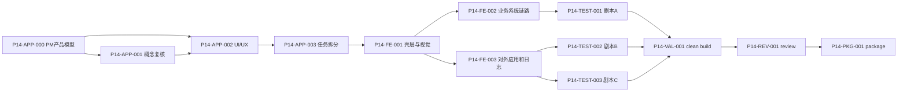

# P14 一次闭环返工任务计划

状态：`active`

## 目标

P14 不再按零散页面补丁推进。目标是一次性围绕“普通人可以正常使用的完整系统”完成产品模型、UI/UX、前端返工、必要后端补缺、真实浏览器 E2E、clean build、review 和部署包闸门。

## 输入

- `docs/product/product-vision-and-operating-model.md`
- `docs/product/integrated-system-baseline.md`
- `docs/ui/p14-integrated-ui.md`
- `docs/api.md`
- `docs/issues/pm/development/p14_app_concept_rework.md`
- 当前前后端源码

## 任务拆分

| taskId | 角色 | 任务 | 输出 | 退出标准 |
| --- | --- | --- | --- | --- |
| P14-APP-000 | pm | 冻结产品运行模型。 | `docs/product/product-vision-and-operating-model.md` | 明确角色、工作空间、信息架构、端到端剧本、权限边界和验收证据。 |
| P14-APP-001 | analyst | 对照原始需求、旧项目和当前实现复核应用概念。 | `docs/issues/replies/development/p14_analyst_app_concept_reply.md` | 平台级对外应用、系统内业务应用、OpenAPI 客户端边界明确。 |
| P14-APP-002 | uiux | 冻结 P14 集成 UI/UX。 | `docs/ui/p14-integrated-ui.md` | 页面、导航、视觉、状态、角色可见性和流程矩阵可直接约束开发。 |
| P14-APP-003 | planner | 将 P14 一次闭环拆成可执行任务。 | `docs/tasks/P14-integrated-rework-plan.md`、`docs/task_plan.md`、`docs/phases/development-phases.md` | 任务依赖、输出、验证和暂停恢复点明确。 |
| P14-FE-001 | frontend | 重构壳层、导航、视觉和页面文案。 | `frontend/src/layouts/AppShell.ts`、`frontend/src/router/index.ts`、`frontend/src/App.ts`、`frontend/src/styles.css` | 平台/系统/运行/集成工作空间分清，普通用户入口隔离。 |
| P14-FE-002 | frontend | 重做系统总览、系统设置、建模配置和运行台体验。 | `frontend/src/pages/system/*`、`module-config/*`、`runtime/*` | 剧本 A 可在浏览器连续走通。 |
| P14-FE-003 | frontend | 重做平台级对外应用和日志分层体验。 | `frontend/src/pages/openapi/*`、`audit/*`、`ops/*` | 剧本 B/C 页面链路可走通，对外应用不再与业务应用混用。 |
| P14-BE-001 | backend | 只补 P14 UI/测试发现的真实后端缺口。 | 对应后端源码与测试 | 不造假接口；如 API 契约不足，回 PM 裁决。 |
| P14-TEST-001 | test | 执行剧本 A 管理员到普通用户完整链路。 | `docs/test_runs/p14-scenario-a-business-system.md` | 管理员建系统/建模/发布，普通用户使用数据通过。 |
| P14-TEST-002 | test | 执行剧本 B 平台级对外应用链路。 | `docs/test_runs/p14-scenario-b-external-app.md` | 创建对外应用、授权、调用、日志追踪通过。 |
| P14-TEST-003 | test | 执行剧本 C 审计与恢复链路。 | `docs/test_runs/p14-scenario-c-audit-recovery.md` | 平台日志、系统日志、错误恢复和权限隔离通过。 |
| P14-VAL-001 | validator | clean build/package gate。 | `docs/build/p14-clean-build.md`、`docs/build_report.md` | 前端删除 dist 后重新 build，后端 clean package 通过。 |
| P14-REV-001 | reviewer | 按产品运行模型和 UI/UX 做最终审查。 | `docs/review.json`、`docs/issues/verification/development/p14_reviewer_verification.md` | 无 P0/P1 阻塞，`fullProjectDeployable` 只能在证据齐全后置 true。 |
| P14-PKG-001 | validator | 在 reviewer pass 后生成部署包。 | `dist/unexamine-full-deploy-*-p14.*` | 包含前端 dist、后端 jar、start.sh、nginx 文档和 P14 证据。 |

## 依赖

## PM 预判清单

1. 角色不是写死角色名，页面可见性由权限点和上下文决定。
2. 系统内业务应用和平台级对外应用在路由、导航、文案、页面上完全分开。
3. 普通业务用户没有系统设置和建模入口。
4. 创建系统后进入系统总览，不进入空运行台。
5. 建模配置按业务应用、模块、字段、页面、发布检查、发布顺序推进。
6. 对外应用有创建、secret 一次展示、授权范围、安全策略、调用日志和恢复路径。
7. 平台日志和系统日志分层，权限和检索条件分层。
8. 所有空态、错误态和无权限态都有中文下一步。
9. E2E 使用真实页面创建的数据和真实账号，不依赖测试默认值或地址栏调试参数。
10. nginx `/api/`、接口文档、静态刷新和 `start.sh` 纳入最终部署验收。

## 暂停恢复点

- UI/UX 冻结后暂停：恢复时先复核 `docs/ui/p14-integrated-ui.md` 是否仍为最新输入。
- P14-FE-001 后暂停：恢复时先运行前端 build，确认壳层可编译。
- 任一测试失败：保留失败记录，修复后重新跑完整相关剧本，不覆盖失败原因。
- reviewer fail：按 `docs/review.json.target` 回到对应角色，不进入打包。

## 打包闸门

以下任一不满足时不得执行 P14-PKG-001：

- 三条剧本测试未全 pass。
- 普通业务用户权限隔离未通过。
- 平台级对外应用链路未通过。
- 平台日志和系统日志未分层通过。
- 前端 clean build 或后端 clean package 未通过。
- reviewer 未明确 pass。
