# Build Task Plan

> version: `2026-06-23.3`
> status: planned
> gates: `design_user_approved=true`, `api_frozen=true`, `tasks_planned=true`
> API: `docs/api/api.md` version `0.1.0-frozen`

## 1. Inputs

- `docs/user_requirement.md`
- `docs/design/prototype-brief.md`
- `docs/design/prototypes/index.html`
- `docs/design/user-approval.md`
- `docs/api/api.md`
- `frontend/src/api/types.ts`
- `frontend/docs/api-contract-map.md`
- `.cursor/architecture/work-graph.md`
- `.cursor/architecture/backend-structure.md`
- `.cursor/templates/task.md`

## 2. Build DAG

```mermaid
flowchart TD
    DBA001["TASK-DBA-001 platform identity schema"] --> DBA010["TASK-DBA-010 merge init.sql"]
    DBA002["TASK-DBA-002 permission rbac schema"] --> DBA010
    DBA003["TASK-DBA-003 module config schema"] --> DBA010
    DBA004["TASK-DBA-004 dynamic runtime schema"] --> DBA010
    DBA005["TASK-DBA-005 workflow approval schema"] --> DBA010
    DBA006["TASK-DBA-006 message todo log schema"] --> DBA010
    DBA007["TASK-DBA-007 work management schema"] --> DBA010
    DBA008["TASK-DBA-008 secret openapi agent schema"] --> DBA010
    DBA009["TASK-DBA-009 async ops schema"] --> DBA010

    BE001["TASK-BE-001 backend core/web scaffold"] --> BE002["TASK-BE-002 backend module/generator scaffold"]
    BE002 --> BE003["TASK-BE-003 plat/core base generation"]
    BE002 --> BE004["TASK-BE-004 module/upload base generation"]
    BE002 --> BE005["TASK-BE-005 flow/message-log base generation"]
    BE002 --> BE006["TASK-BE-006 app/ai-work base generation"]
    DBA010 --> BE003
    DBA010 --> BE004
    DBA010 --> BE005
    DBA010 --> BE006

    BE003 --> BE010["TASK-BE-010 auth account APIs"]
    BE003 --> BE011["TASK-BE-011 platform system lifecycle APIs"]
    BE003 --> BE012["TASK-BE-012 context tenant org member APIs"]
    BE003 --> BE013["TASK-BE-013 role permission APIs"]
    BE010 --> BE014["TASK-BE-014 plat integration smoke"]
    BE011 --> BE014
    BE012 --> BE014
    BE013 --> BE014

    BE004 --> BE020["TASK-BE-020 module config APIs"]
    BE013 --> BE020
    BE020 --> BE021["TASK-BE-021 runtime record APIs"]
    BE005 --> BE033["TASK-BE-033 audit log async task APIs"]
    BE021 --> BE022["TASK-BE-022 import export attachment APIs"]
    BE033 --> BE022

    BE005 --> BE030["TASK-BE-030 flow definition APIs"]
    BE020 --> BE030
    BE030 --> BE031["TASK-BE-031 workflow approval todo APIs"]
    BE021 --> BE031
    BE005 --> BE032["TASK-BE-032 message notification APIs"]
    BE012 --> BE032

    BE013 --> BE034["TASK-BE-034 SSO secret no-member APIs"]
    BE006 --> BE035["TASK-BE-035 OpenAPI app APIs"]
    BE033 --> BE035
    BE006 --> BE036["TASK-BE-036 work management APIs"]
    BE021 --> BE036
    BE031 --> BE036
    BE032 --> BE036
    BE006 --> BE037["TASK-BE-037 AI Agent APIs"]
    BE034 --> BE037
    BE036 --> BE037
    BE003 --> BE038["TASK-BE-038 ops governance APIs"]
    BE033 --> BE038

    BE014 --> BE040["TASK-BE-040 backend integration smoke"]
    BE022 --> BE040
    BE031 --> BE040
    BE032 --> BE040
    BE035 --> BE040
    BE037 --> BE040
    BE038 --> BE040

    FE001["TASK-FE-001 frontend scaffold shell"] --> FE010["TASK-FE-010 auth platform system shell"]
    BE014 --> FE010
    FE010 --> FE020["TASK-FE-020 admin config views"]
    BE020 --> FE020
    FE010 --> FE030["TASK-FE-030 runtime work views"]
    BE021 --> FE030
    BE031 --> FE030
    BE037 --> FE030

    QA001["TASK-QA-001 test strategy"]
    QA005["TASK-QA-005 contract fixtures"]
    QA010["TASK-QA-010 static acceptance checks"]
    QA001 --> QA005
    QA001 --> QA010
    QA005 --> QA012["TASK-QA-012 role permission evidence"]
    BE014 --> QA012
    FE010 --> QA012
    QA010 --> QA015["TASK-QA-015 clean-build G3 evidence"]
    BE010 --> QA015
    BE011 --> QA015
    BE012 --> QA015
    BE013 --> QA015
    BE033 --> QA015
    QA015 --> QA016["TASK-QA-016 clean-build G6 evidence"]
    BE022 --> QA016
    BE031 --> QA016
    QA012 --> QA018["TASK-QA-018 pre-e2e build evidence"]
    QA016 --> QA018
    FE030 --> QA018
    BE040 --> QA018
    QA018 --> QA020["TASK-QA-020 che e2e evidence"]
    FE030 --> QA020
    BE040 --> QA020
```

## 3. Parallel Groups

| Group | Tasks | Notes |
|---|---|---|
| G0 | `TASK-DBA-001`, `TASK-DBA-002`, `TASK-DBA-003`, `TASK-DBA-004`, `TASK-DBA-005`, `TASK-DBA-006`, `TASK-DBA-007`, `TASK-DBA-008`, `TASK-DBA-009`, `TASK-BE-001`, `TASK-FE-001`, `TASK-QA-001`, `TASK-QA-005`, `TASK-QA-010` | DBA fragment outputs are disjoint; QA can prepare strategy, fixtures, and static acceptance templates while coding starts. |
| G1 | `TASK-DBA-010`, `TASK-BE-002` | SQL merge runs after all DBA fragments are accepted; backend module/generator scaffold can proceed after G0 paths exist. |
| G2 | `TASK-BE-003`, `TASK-BE-004`, `TASK-BE-005`, `TASK-BE-006` | Base generation split by Maven module and table prefix. Do not hand-edit generated base files. |
| G3 | `TASK-BE-010`, `TASK-BE-011`, `TASK-BE-012`, `TASK-BE-013`, `TASK-BE-033` | Platform identity, system, context, permission, log/task APIs use distinct manage packages. |
| G4 | `TASK-BE-014`, `TASK-BE-020`, `TASK-BE-032`, `TASK-BE-034`, `TASK-BE-038`, `TASK-FE-010` | Platform smoke plus module config, messages, SSO/secret, ops. |
| G4-QA | `TASK-QA-012`, `TASK-QA-015` | Role permission evidence and first clean-build evidence can run after identity/platform shell and G3 backend slices. |
| G5 | `TASK-BE-021`, `TASK-BE-030`, `TASK-BE-035`, `TASK-FE-020` | Runtime record, flow definition, OpenAPI, admin views. |
| G6 | `TASK-BE-022`, `TASK-BE-031` | Import/export/attachments and workflow approval/todo after runtime foundations. |
| G6-QA | `TASK-QA-016` | Clean-build evidence after import/export and workflow approval/todo slices. |
| G7 | `TASK-BE-036` | Work management depends on runtime, todo, and message contracts. |
| G8 | `TASK-BE-037` | AI Agent depends on SSO/secret, work, permission, and audit contracts. |
| G9 | `TASK-BE-040`, `TASK-FE-030` | Backend integration smoke and runtime frontend views. |
| G9-QA | `TASK-QA-018` | Pre-E2E clean-build and readiness evidence before the che script. |
| G10 | `TASK-QA-020` | End-to-end verification evidence. |

## 4. Task Index

| Task | Owner | Type | Depends on | Outputs |
|---|---|---|---|---|
| `TASK-DBA-001` | dba | implementation | none | `sql/fragments/001-platform-identity.sql`, `docs/database/platform-identity.md` |
| `TASK-DBA-002` | dba | implementation | none | `sql/fragments/002-permission-rbac.sql`, `docs/database/permission-rbac.md` |
| `TASK-DBA-003` | dba | implementation | none | `sql/fragments/003-module-config.sql`, `docs/database/module-config.md` |
| `TASK-DBA-004` | dba | implementation | none | `sql/fragments/004-dynamic-runtime.sql`, `docs/database/dynamic-runtime.md` |
| `TASK-DBA-005` | dba | implementation | none | `sql/fragments/005-workflow-approval.sql`, `docs/database/workflow-approval.md` |
| `TASK-DBA-006` | dba | implementation | none | `sql/fragments/006-message-todo-log.sql`, `docs/database/message-todo-log.md` |
| `TASK-DBA-007` | dba | implementation | none | `sql/fragments/007-work-management.sql`, `docs/database/work-management.md` |
| `TASK-DBA-008` | dba | implementation | none | `sql/fragments/008-secret-openapi-agent.sql`, `docs/database/secret-openapi-agent.md` |
| `TASK-DBA-009` | dba | implementation | none | `sql/fragments/009-async-ops.sql`, `docs/database/async-ops.md` |
| `TASK-DBA-010` | dba | implementation | `TASK-DBA-001`..`TASK-DBA-009` | `sql/init.sql`, `docs/database/init-sql-check.md` |
| `TASK-BE-001` | backend | implementation | none | `backend/pom.xml`, `backend/examine-core/**`, `backend/examine-web/**` |
| `TASK-BE-002` | backend | implementation | `TASK-BE-001` | module POMs, `backend/examine-generator/**` |
| `TASK-BE-003` | backend | implementation | `TASK-BE-002`, `TASK-DBA-010` | `examine-core/base/**`, `examine-plat/base/**`, mapper XML |
| `TASK-BE-004` | backend | implementation | `TASK-BE-002`, `TASK-DBA-010` | `examine-module/base/**`, `examine-upload/base/**`, mapper XML |
| `TASK-BE-005` | backend | implementation | `TASK-BE-002`, `TASK-DBA-010` | `examine-flow/base/**`, `examine-message-log/base/**`, mapper XML |
| `TASK-BE-006` | backend | implementation | `TASK-BE-002`, `TASK-DBA-010` | `examine-app/base/**`, `examine-ai-work/base/**`, mapper XML |
| `TASK-BE-010` | backend | implementation | `TASK-BE-003` | `backend/examine-plat/src/main/java/com/unique/examine/plat/manage/auth/**`, `.../account/**` |
| `TASK-BE-011` | backend | implementation | `TASK-BE-003` | `backend/examine-plat/src/main/java/com/unique/examine/plat/manage/system/**` |
| `TASK-BE-012` | backend | implementation | `TASK-BE-003` | `backend/examine-plat/src/main/java/com/unique/examine/plat/manage/context/**`, `.../tenant/**`, `.../org/**`, `.../member/**` |
| `TASK-BE-013` | backend | implementation | `TASK-BE-003` | `backend/examine-plat/src/main/java/com/unique/examine/plat/manage/role/**`, `.../permission/**` |
| `TASK-BE-014` | backend | implementation | `TASK-BE-010`, `TASK-BE-011`, `TASK-BE-012`, `TASK-BE-013` | `docs/evidence/backend-plat-smoke.md` |
| `TASK-BE-020` | backend | implementation | `TASK-BE-004`, `TASK-BE-013` | `backend/examine-module/src/main/java/com/unique/examine/module/manage/config/**` |
| `TASK-BE-021` | backend | implementation | `TASK-BE-020` | `backend/examine-module/src/main/java/com/unique/examine/module/manage/runtime/**` |
| `TASK-BE-022` | backend | implementation | `TASK-BE-021`, `TASK-BE-033` | `backend/examine-module/src/main/java/com/unique/examine/module/manage/importexport/**`, `.../draft/**`, `.../attachment/**`, `.../sequence/**`, `backend/examine-upload/src/main/java/com/unique/examine/upload/manage/**` |
| `TASK-BE-030` | backend | implementation | `TASK-BE-005`, `TASK-BE-020` | `backend/examine-flow/src/main/java/com/unique/examine/flow/manage/definition/**` |
| `TASK-BE-031` | backend | implementation | `TASK-BE-021`, `TASK-BE-030` | `backend/examine-flow/src/main/java/com/unique/examine/flow/manage/runtime/**`, `.../approval/**`, `.../todo/**` |
| `TASK-BE-032` | backend | implementation | `TASK-BE-005`, `TASK-BE-012` | `backend/examine-message-log/src/main/java/com/unique/examine/messagelog/manage/message/**`, `.../notification/**` |
| `TASK-BE-033` | backend | implementation | `TASK-BE-005` | `backend/examine-message-log/src/main/java/com/unique/examine/messagelog/manage/audit/**`, `.../task/**` |
| `TASK-BE-034` | backend | implementation | `TASK-BE-013` | `backend/examine-plat/src/main/java/com/unique/examine/plat/manage/sso/**`, `.../secret/**`, `.../nomember/**` |
| `TASK-BE-035` | backend | implementation | `TASK-BE-006`, `TASK-BE-033` | `backend/examine-app/src/main/java/com/unique/examine/app/manage/openapi/**` |
| `TASK-BE-036` | backend | implementation | `TASK-BE-021`, `TASK-BE-031`, `TASK-BE-032` | `backend/examine-ai-work/src/main/java/com/unique/examine/aiwork/manage/work/**` |
| `TASK-BE-037` | backend | implementation | `TASK-BE-006`, `TASK-BE-034`, `TASK-BE-036` | `backend/examine-ai-work/src/main/java/com/unique/examine/aiwork/manage/agent/**` |
| `TASK-BE-038` | backend | implementation | `TASK-BE-003`, `TASK-BE-033` | `backend/examine-core/src/main/java/com/unique/examine/core/manage/ops/**` |
| `TASK-BE-040` | backend | implementation | backend coding slices | `docs/evidence/backend-integration-smoke.md` |
| `TASK-FE-001` | frontend | implementation | none | `frontend/package.json`, `frontend/vite.config.ts`, `frontend/src/app/**`, `frontend/src/shared/**` |
| `TASK-FE-010` | frontend | implementation | `TASK-FE-001`, `TASK-BE-014` | `frontend/src/features/auth/**`, `frontend/src/features/platform/**`, `frontend/src/features/system-shell/**` |
| `TASK-FE-020` | frontend | implementation | `TASK-FE-010`, `TASK-BE-020` | `frontend/src/features/system-admin/**`, `frontend/src/features/platform-admin/**` |
| `TASK-FE-030` | frontend | implementation | `TASK-FE-020`, `TASK-BE-031`, `TASK-BE-037` | `frontend/src/features/runtime/**`, `frontend/src/features/work/**`, `frontend/src/features/messages/**` |
| `TASK-QA-001` | test | test | none | `docs/testing/test-strategy.md`, `docs/testing/evidence-conventions.md` |
| `TASK-QA-005` | test | test | none | `docs/testing/fixtures.md`, `docs/testing/contract-fixtures.md` |
| `TASK-QA-010` | test | test | none | `docs/testing/static-acceptance-checks.md`, `docs/evidence/static-check-template.md` |
| `TASK-QA-012` | test | test | `TASK-QA-005`, `TASK-BE-014`, `TASK-FE-010` | `docs/evidence/permission-matrix.md`, `docs/evidence/role-route-check.md` |
| `TASK-QA-015` | test | test | `TASK-QA-010`, `TASK-BE-010`, `TASK-BE-011`, `TASK-BE-012`, `TASK-BE-013`, `TASK-BE-033` | `docs/evidence/build-g3.md` |
| `TASK-QA-016` | test | test | `TASK-QA-015`, `TASK-BE-022`, `TASK-BE-031` | `docs/evidence/build-g6.md` |
| `TASK-QA-018` | test | test | `TASK-QA-012`, `TASK-QA-016`, `TASK-FE-030`, `TASK-BE-040` | `docs/evidence/build-g9.md`, `docs/evidence/pre-e2e-readiness.md` |
| `TASK-QA-020` | test | test | `TASK-QA-018`, `TASK-FE-030`, `TASK-BE-040` | `docs/evidence/e2e-che-script.md`, `docs/evidence/build-readiness.md` |

## 5. Backend Parallel Coding Rules

- Backend implementation must stay inside the output paths declared by each `TASK-BE-*.md`.
- `base/` packages are generated only by `TASK-BE-003` to `TASK-BE-006`; later manage tasks must not hand-edit `base/entity`, `base/mapper`, `base/service`, or generated XML.
- Module POM changes belong to `TASK-BE-002`; if a later slice needs a new dependency, it must record the need in evidence and coordinate with the module scaffold owner instead of editing unrelated POMs ad hoc.
- Cross-slice contracts should be expressed through `examine-core` response, context, error, audit, idempotency, and async task abstractions from `TASK-BE-001`; do not create duplicate local protocol objects in each manage package.
- Same Maven module can have parallel workers only when their package roots are disjoint, for example `manage/auth/**` and `manage/system/**`.
- If a slice finds the frozen API cannot be implemented without changing `docs/api/api.md`, open a contract issue and stop dependent work; do not silently change endpoint names or payload fields.

## 6. Acceptance Policy

- Each task must run its self-check commands and store logs under `docs/evidence/`.
- Each task must be accepted by `task-accept`; implementer cannot self-accept.
- A batch can move forward only when all tasks in the previous dependency path are accepted.
- `clean-build` runs after G3, G6, G9, and G10 or whenever Conductor decides a batch boundary needs evidence.
- Any new API mismatch opens a contract issue and pauses dependent tasks; API changes after freeze require PM decision.
