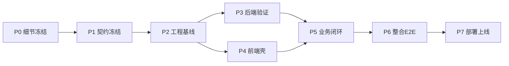
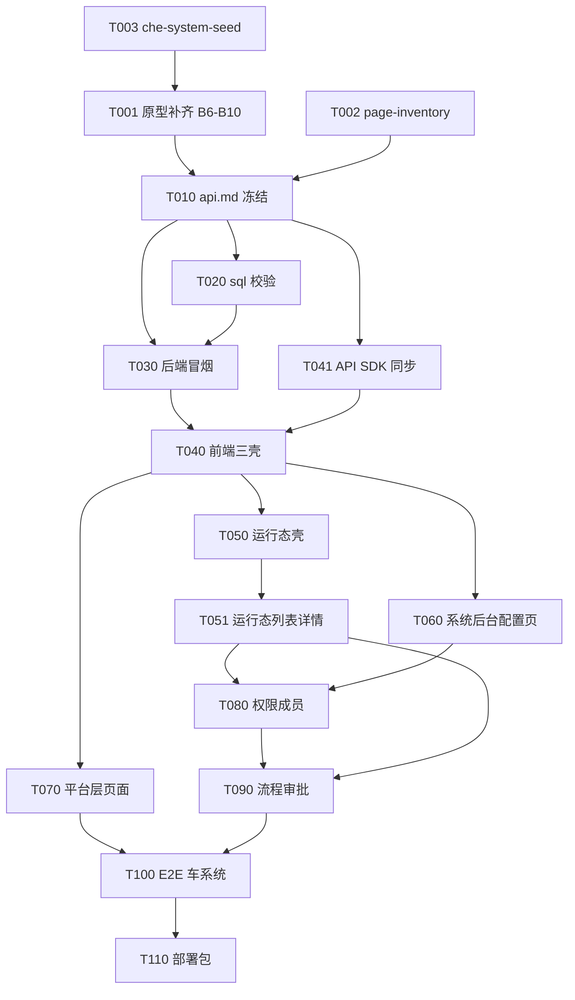

# 开发任务总计划

> **版本:** 1.0.0 · 2026-06-17  
> **原则:** 细节先冻结 → 契约 → 分批 Build → 并行 → 整合 → E2E → 上线  
> **权威:** [`detail-freeze.md`](../design/detail-freeze.md) · [`development-phases.md`](../phases/development-phases.md)

---

## 1. 任务拆分原则

1. **单任务可验收**：有输入、输出路径、完成标准、验证命令  
2. **路径不重叠才可并行**：同文件同时只一个任务  
3. **契约先行**：`api.md` 冻结后再改 backend/frontend 业务语义  
4. **UI 以 pass 页为标杆**：`runtime-list` / `admin-modeling` / `runtime-form`  
5. **样例数据统一**：`che-system-seed.md`

---

## 2. 阶段总览

| 阶段 | 目标 | 退出标准 |
|------|------|----------|
| **P0** | 文档+原型细节齐 | `detail-freeze.md` A+B 核心 ✅ |
| **P1** | API/DB/Test 契约 | `gates.api_frozen=true` |
| **P2** | 环境+DB+构建通 | mvn compile + npm build |
| **P3** | 后端按契约可用 | 车系统 API 冒烟 pass |
| **P4** | 前端三壳+路由 | 三 layout 可切换 |
| **P5** | 全页功能 | page-inventory MVP 列全绿 |
| **P6** | E2E+review | `e2e-car-system.md` pass |
| **P7** | dist+nginx | 用户可试用 |

---

## 3. 依赖图（任务级）

---

## 4. 并行批次

### Batch 0（可立即并行 · 仅文档/原型）

| 任务 ID | 角色 | 输出 | 并行组 |
|---------|------|------|--------|
| T001 | uiux | 原型 B6–B10 补齐 | B0-a |
| T002 | uiux | `page-inventory.md` 定稿 | B0-b ✅ |
| T003 | pm | `che-system-seed.md` | B0-c ✅ |
| T004 | test | `e2e-car-system.md` | B0-d |
| T005 | backend | `api/_draft/backend-gap.md` | B0-e |
| T006 | frontend | `api/_draft/frontend-route-map.md` | B0-f |
| T007 | dba | `api/db-impact.md` | B0-g |

### Batch 1（契约 · 串行汇总）

| 任务 ID | 依赖 | 输出 |
|---------|------|------|
| T010 | T005,T006,T007 | `docs/api/api.md` 冻结 |
| T011 | T010 | `docs/test/contract.md` |

### Batch 2（工程 · 可并行）

| 任务 ID | 输出 | 并行 |
|---------|------|------|
| T020 | sql 执行+种子数据脚本 | dba |
| T021 | backend clean compile | backend |
| T022 | frontend npm build | frontend |
| T023 | deploy/nginx 配置 | ops |

### Batch 3（前端 · 路径分区并行）

| 任务 ID | 范围 | 文件区 |
|---------|------|--------|
| T040 | 三 layout 壳 | `layouts/` `router/` |
| T050 | runtime-shell module-rail | `pages/runtime/` `styles` |
| T060 | admin 配置页 | `pages/system/` `module-config/` |
| T070 | platform 页 | `pages/platform/` `auth/` |

### Batch 4（整合 · 串行）

| 任务 ID | 说明 |
|---------|------|
| T100 | 跑 E2E 剧本 |
| T110 | dist + 文档 + progress 更新 |

---

## 5. 任务清单（摘要）

| ID | 名称 | 责任 | 依赖 | 状态 |
|----|------|------|------|------|
| T001 | 原型 B6–B10 补齐 | uiux | T003 | in_progress |
| T010 | API 契约冻结 | pm | Batch0 | pending |
| T020 | 数据库就绪 | dba | T010 | pending |
| T021 | 后端编译 | backend | T020 | pending |
| T040 | 前端三壳 | frontend | T010 | pending |
| T050 | 运行态 module-rail | frontend | T040 | pending |
| T051 | 列表+右侧详情 | frontend | T050 | pending |
| T060 | 建模/字典/仪表盘配置 UI | frontend | T040 | pending |
| T080 | 成员+角色四 Tab | frontend | T060 | pending |
| T090 | 流程+审批侧栏 | frontend+backend | T051,T080 | pending |
| T100 | E2E 车系统 | test | T090 | pending |
| T110 | 部署上线 | all | T100 | pending |

详细任务卡见 [`docs/tasks/`](./).

---

## 6. 技术决策（已冻结）

| 项 | 决策 | 理由 |
|----|------|------|
| 后端 | 沿用 `.oldbk` 多模块 + generator | 已实现 174 API |
| 前端框架 | **首期保留 Vite+TS**，按原型改 DOM/组件 | API SDK 已齐；Vue 迁移放增强 |
| UI 组件 | 先复用原型 `app.css` token，后接 Naive UI | 速度与 ui-spec 折中 |
| 模块 IA | **模块组顶栏+左栏模块**（RES-003） | 与旧「应用含模块」不同，前端必改 |
| 导出 | 列表工具栏动作 | 无导出中心 |
| 部署 | 同源 `/api/v1` | DEPLOY.md |

---

## 7. 风险与阻塞

| 风险 | 缓解 |
|------|------|
| 旧前端 IA 与 RES-003 冲突 | T050 专任务改壳，不 patch |
| 21 页原型占位 | page-inventory + seed 驱动实现 |
| 本机无 JDK21/Maven | T021 在开发机验证 |
| API 与 UI 新 IA 字段缺口 | T010 契约评审显式列 gap |

---

## 8. 完成定义（上线）

- [ ] `detail-freeze.md` 全绿  
- [ ] `api.md` 冻结  
- [ ] 车系统 15 步 E2E pass（`e2e-car-system.md`）  
- [ ] che 无管理入口  
- [ ] `frontend/dist` + 后端 jar 可部署  
- [ ] `docs/progress.md` 标记 `fullProjectDeployable=true`
