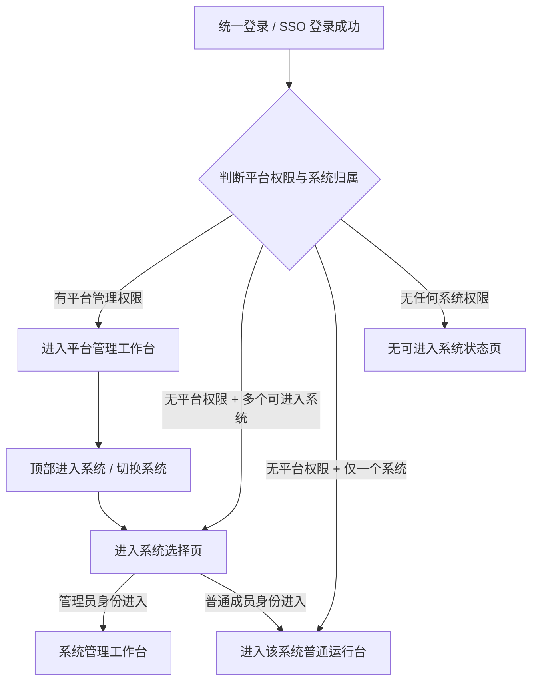
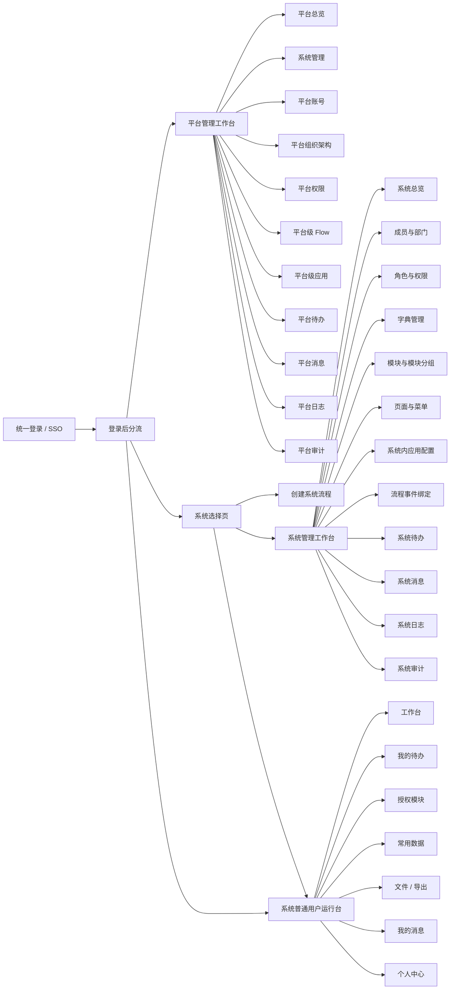
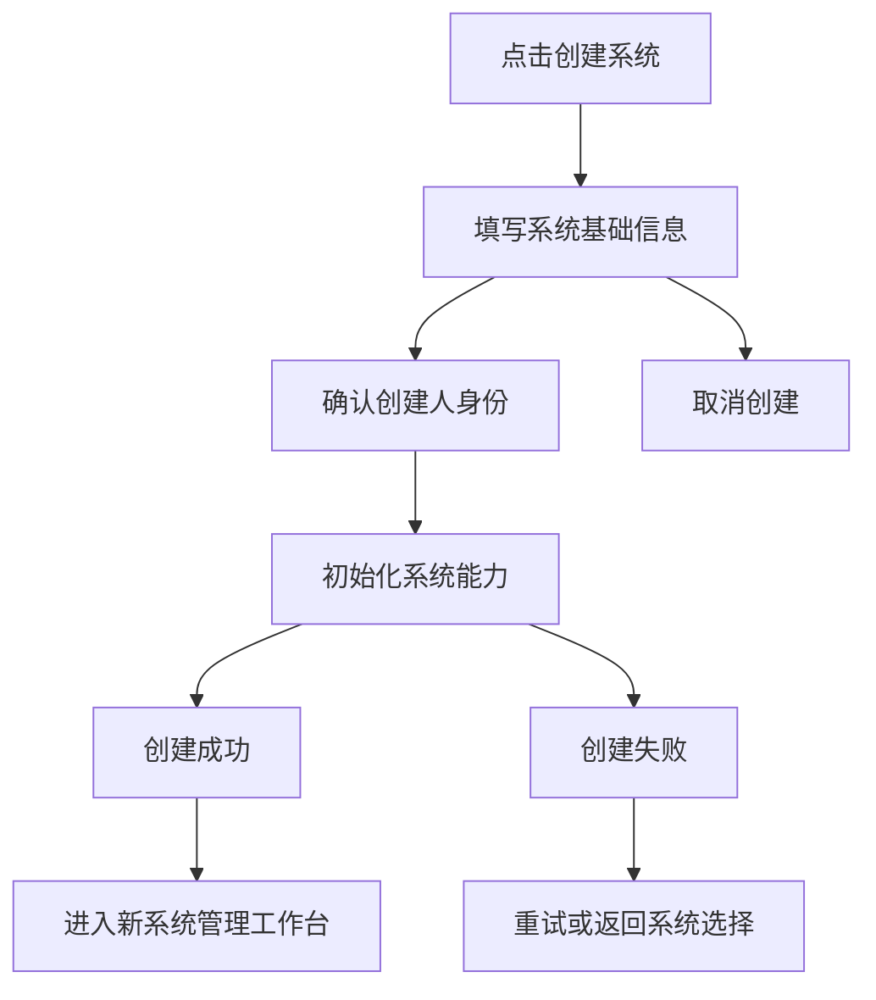

# examine2 P19 Open Design 自包含详细 Brief

状态：`uiux-draft-for-review`

来源：`uiux-agent`

更新时间：2026-06-13

## 1. 项目定位与设计目标

examine2 是一个“统一登录/SSO 入口 + 平台固定能力中心 + 用户自建业务系统”的企业控制台产品。

平台不是某个业务系统后台。平台负责统一入口、平台组织、平台权限、平台级 Flow、平台级应用、平台日志、平台审计、平台待办、平台消息等固定能力。

自建系统是用户创建的业务后台，每个系统独立承载系统组织、成员、部门、角色权限、字典、模块、模块分组、页面、菜单、系统内应用配置、流程事件绑定、系统日志、系统审计、系统待办、系统消息和业务运行台。

本次 Open Design 目标是生成可评审、可交给 frontend 实现前评审的高保真后台原型，重点解决：

- 用户登录后知道自己在哪里。
- 平台管理、系统管理、普通运行台三类工作空间完全分离。
- 系统数量上百上千时仍能快速进入目标系统。
- Flow 和应用在平台层、系统层都保持清晰分域。
- 日志和审计按归属上下文拆分，不混层。
- 普通业务用户看到的是可直接处理业务数据的运行台，不是接口调试台或配置后台。

## 2. 设计风格

整体风格：稳重企业控制台 + 普通运行台亲和度。

- 平台管理工作台：稳重企业控制台，信息密度适中，强调权限、审计、配置和运维。
- 系统管理工作台：面向系统管理员，强调搭建业务后台、配置模块、页面、菜单、权限和流程。
- 系统普通用户运行台：亲和、任务导向，突出待办、常用模块、业务数据处理和个人入口。

视觉要求：

- 使用清晰的顶部栏、左侧导航、内容区、右侧抽屉结构。
- 控制台页面不要做营销 Hero，不要用大幅宣传图。
- 不要使用异常拉伸卡片、大面积无意义空白、接口字段堆砌。
- 普通运行台可以更亲和，但仍保持业务后台效率。
- 所有页面中文文案优先，OpenAPI、Flow、SSO、AppKey、requestId 等专有名词可保留英文。

## 3. 不得做的事

- 不要把平台管理、系统管理、普通运行台混在同一个左侧导航中。
- 不要把系统列表放进左侧导航树。
- 不要把平台当成某个业务系统后台。
- 不要设计外部用户自助注册平台账号。
- 不要让“创建系统”的创建人自动获得平台管理权限。
- 不要把平台级 Flow 和平台级应用合并成一个域。
- 不要把系统内“流程事件绑定”和“系统内应用配置”合并。
- 不要把模块分组命名成应用。
- 不要把平台日志、平台审计、系统日志、系统审计混成一个列表。
- 不要用接口名、数据库字段名、API 调试信息作为普通用户页面主内容。
- 不要缺少筛选、分页、详情、错误反馈、权限不足状态。

## 4. 用户角色与权限边界

### 4.1 平台管理员

可以进入平台管理工作台。

可管理：

- 平台组织架构
- 平台账号创建、导入、启停
- 平台权限
- 平台级 Flow
- 平台级应用
- 平台日志
- 平台审计
- 平台待办
- 平台消息
- 系统列表与系统状态

不能默认进入某个自建系统的业务数据，除非同时被授权为该系统成员。

### 4.2 系统创建人

通过“创建系统”入口创建自建系统。

创建成功后：

- 成为该自建系统的系统管理员。
- 获得该系统的管理工作台权限。
- 不获得平台组织、平台权限、平台应用、平台 Flow、平台审计等平台管理权限。

### 4.3 系统管理员

进入具体系统后，可以使用系统管理工作台。

可管理：

- 系统成员与部门
- 系统角色与权限
- 字典
- 模块与模块分组
- 页面与菜单
- 系统内应用配置
- 流程事件绑定
- 系统日志
- 系统审计
- 系统待办
- 系统消息

不能管理平台固定能力，除非另有平台权限。

### 4.4 普通业务用户

进入具体系统后，默认进入系统普通用户运行台。

可使用：

- 授权模块
- 我的待办
- 系统消息
- 常用数据
- 文件 / 导出
- 个人中心

不可见：

- 平台管理菜单
- 系统字段设计
- 页面发布
- 菜单配置
- 角色权限配置
- 系统日志审计管理入口，除非额外授权

## 5. 登录后分流规则

默认落点：

| 用户情况 | 默认落点 |
|---|---|
| 有平台管理权限 | 平台管理工作台 |
| 无平台管理权限，只有一个系统 | 系统普通用户运行台 |
| 无平台管理权限，多个系统 | 系统选择页 |
| 创建系统完成 | 新建系统的系统管理工作台 |
| 从平台点击进入系统 | 系统选择页 |
| 从系统管理点击进入运行台 | 当前系统普通运行台 |
| 从运行台点击系统设置且有权限 | 当前系统管理工作台 |

## 6. 整体信息架构

## 7. 路由规划

### 7.1 平台管理路由

| 路由 | 页面 |
|---|---|
| `/platform` | 平台总览 |
| `/platform/systems` | 系统管理 |
| `/platform/systems/create` | 创建系统 |
| `/platform/accounts` | 平台账号 |
| `/platform/org` | 平台组织架构 |
| `/platform/rbac` | 平台权限 |
| `/platform/flow/templates` | 平台级 Flow - 流程模板 |
| `/platform/flow/instances` | 平台级 Flow - 流程实例 |
| `/platform/flow/todos` | 平台级 Flow - 待办审批 |
| `/platform/flow/logs` | 平台级 Flow - 流程日志 |
| `/platform/apps` | 平台级应用 - 应用列表 |
| `/platform/apps/credentials` | 平台级应用 - 凭证管理 |
| `/platform/apps/scopes` | 平台级应用 - 授权范围 |
| `/platform/apps/ip-rules` | 平台级应用 - IP 白名单 |
| `/platform/apps/rate-limits` | 平台级应用 - 限流策略 |
| `/platform/apps/call-logs` | 平台级应用 - 调用日志 |
| `/platform/todos` | 平台待办 |
| `/platform/messages` | 平台消息 |
| `/platform/logs` | 平台日志 |
| `/platform/audits` | 平台审计 |

### 7.2 系统选择路由

| 路由 | 页面 |
|---|---|
| `/systems` | 系统选择页 |
| `/systems/create` | 创建系统流程 |
| `/systems/recent` | 最近访问系统 |
| `/systems/favorites` | 收藏系统 |

### 7.3 系统管理路由

| 路由 | 页面 |
|---|---|
| `/systems/:systemId/admin` | 系统管理总览 |
| `/systems/:systemId/admin/members` | 成员与部门 |
| `/systems/:systemId/admin/rbac` | 角色与权限 |
| `/systems/:systemId/admin/dicts` | 字典管理 |
| `/systems/:systemId/admin/modules` | 模块与模块分组 |
| `/systems/:systemId/admin/pages` | 页面配置 |
| `/systems/:systemId/admin/menus` | 菜单配置 |
| `/systems/:systemId/admin/app-configs` | 系统内应用配置 |
| `/systems/:systemId/admin/flow-bindings` | 流程事件绑定 |
| `/systems/:systemId/admin/todos` | 系统待办 |
| `/systems/:systemId/admin/messages` | 系统消息 |
| `/systems/:systemId/admin/logs` | 系统日志 |
| `/systems/:systemId/admin/audits` | 系统审计 |

### 7.4 普通运行台路由

| 路由 | 页面 |
|---|---|
| `/systems/:systemId/runtime` | 运行台首页 |
| `/systems/:systemId/runtime/todos` | 我的待办 |
| `/systems/:systemId/runtime/modules/:moduleId` | 授权模块数据列表 |
| `/systems/:systemId/runtime/modules/:moduleId/new` | 新建数据抽屉 |
| `/systems/:systemId/runtime/modules/:moduleId/:recordId` | 数据详情抽屉 |
| `/systems/:systemId/runtime/common` | 常用数据 |
| `/systems/:systemId/runtime/files` | 文件 / 导出 |
| `/systems/:systemId/runtime/messages` | 我的消息 |
| `/systems/:systemId/runtime/profile` | 个人中心 |

## 8. 三套工作空间导航

### 8.1 平台管理工作台

默认落点：`/platform`

顶部栏：

- 平台 Logo、平台名称
- 全局搜索，支持搜索系统、账号、应用、流程
- 进入系统 / 切换系统
- 平台待办
- 平台消息
- 帮助
- 当前账号菜单

左侧导航：

- 平台总览
- 系统管理
- 平台账号
- 平台组织架构
- 平台权限
- 平台级 Flow
  - 流程模板
  - 流程实例
  - 待办审批
  - 流程日志
- 平台级应用
  - 应用列表
  - 凭证管理
  - 授权范围
  - IP 白名单
  - 限流策略
  - 调用日志
- 平台待办
- 平台消息
- 平台日志
- 平台审计

权限边界：

- 仅平台管理员可见该工作台。
- 平台管理员不自动拥有系统内业务数据权限。
- 查看密钥、重置凭证需二次确认和独立权限。

### 8.2 系统管理工作台

默认落点：`/systems/:systemId/admin`

顶部栏：

- 当前系统名称、系统状态标签
- 返回系统选择
- 进入运行台
- 系统内搜索
- 系统待办
- 系统消息
- 当前成员菜单

左侧导航：

- 系统总览
- 成员与部门
- 角色与权限
- 字典管理
- 模块与模块分组
- 页面与菜单
  - 页面配置
  - 菜单配置
  - 发布记录
- 系统内应用配置
- 流程事件绑定
- 系统待办
- 系统消息
- 系统日志
- 系统审计

权限边界：

- 只有当前系统管理员或拥有对应系统管理权限的成员可进入。
- 不展示平台级组织、平台权限、平台应用、平台 Flow。
- 系统管理员只能管理当前系统。

### 8.3 系统普通用户运行台

默认落点：`/systems/:systemId/runtime`

顶部栏：

- 当前系统名称
- 切换系统
- 搜索当前系统内可见数据
- 我的待办
- 我的消息
- 个人中心

左侧导航：

- 工作台
- 我的待办
- 授权模块分组
  - 根据权限显示模块分组
  - 只显示授权模块
- 常用数据
- 文件 / 导出
- 我的消息

权限边界：

- 普通用户只能看到授权菜单、授权模块、授权字段和数据范围内的数据。
- 无权限字段不出现在列表、详情、导出、OpenAPI 授权范围中。
- 普通用户不能看到字段设计、页面发布、角色权限、系统日志审计管理入口。

## 9. 系统选择页详细设计

路由：`/systems`

用途：支持上百或上千系统场景下的进入、筛选、搜索、收藏和创建系统。

布局：

- 顶部区域：
  - 标题：“选择系统”
  - 副标题：“进入你有权限访问的业务系统”
  - 主按钮：“创建系统”
  - 次按钮：“刷新”
- 搜索区：
  - 搜索框，占位文案：“搜索系统名称、系统编号、创建人”
  - 高级筛选按钮
- 筛选区：
  - 最近访问：全部 / 最近 7 天 / 最近 30 天
  - 收藏状态：全部 / 已收藏
  - 我的角色：全部 / 系统管理员 / 普通成员 / 只读成员
  - 系统状态：全部 / 正常 / 停用 / 维护中
  - 创建时间
- 列表区：
  - 默认表格适合大量系统
  - 可提供表格 / 紧凑卡片视图切换
  - 支持分页；大量数据时可用虚拟滚动

表格字段：

- 收藏
- 系统名称
- 系统编号
- 系统状态
- 我的角色
- 最近访问时间
- 待办数
- 创建人
- 操作

操作：

- 进入运行台
- 进入管理
- 收藏 / 取消收藏
- 查看系统信息

空态：

- 无系统时显示：“暂无可进入的系统”
- 提供“创建系统”按钮
- 若账号无创建系统权限，显示：“请联系管理员为你开通系统访问权限”

分页：

- 每页 20 / 50 / 100
- 显示总数
- 支持跳页

## 10. 创建系统流程

入口：

- 系统选择页主按钮：“创建系统”
- 平台系统管理页主按钮：“创建系统”

流程：

步骤条：

1. 基础信息
2. 初始化配置
3. 创建完成

表单字段：

- 系统名称，必填
- 系统编号，必填，支持自动生成和手动编辑
- 系统描述，选填
- 所属组织，选填
- 初始化模板，选填
- 系统图标，选填

确认说明：

- 页面明确展示：“创建成功后，你将成为该系统管理员。”
- 页面明确展示：“该操作不会授予你平台管理权限。”

创建完成页：

- 成功标题：“系统创建成功”
- 系统名称
- 系统编号
- 你的身份：系统管理员
- 主按钮：“进入系统管理”
- 次按钮：“进入运行台”
- 辅助按钮：“继续创建系统”

## 11. 平台账号创建 / 导入设计

页面：`/platform/accounts`

用途：平台用户只能由平台内创建、导入或受控开通，不提供外部自助注册平台账号。

布局：

- 顶部标题：“平台账号”
- 主按钮：“创建账号”
- 次按钮：“导入账号”
- 批量操作：“启用”“停用”“分配平台角色”

筛选：

- 关键词
- 账号状态
- 平台角色
- 所属组织
- 创建时间

表格字段：

- 账号
- 姓名
- 手机 / 邮箱
- 所属平台组织
- 平台角色
- 状态
- 最近登录时间
- 创建方式
- 操作

创建账号抽屉：

- 基础信息：账号、姓名、手机、邮箱
- 组织与权限：平台组织、平台角色、是否启用
- 通知方式：发送初始通知、需要首次登录改密

导入账号弹窗：

- 上传 Excel
- 下载模板
- 导入预检结果
- 错误明细下载
- 导入成功统计

权限边界：

- 只有平台账号管理权限可创建/导入。
- 普通系统管理员不能创建平台账号。
- 系统管理员只能在系统成员页邀请或加入已有平台账号到本系统成员上下文。

## 12. 页面线框要求

### 12.1 平台总览

路由：`/platform`

主区域：

- 顶部指标：
  - 系统总数
  - 平台账号数
  - 平台应用数
  - 今日调用量
  - 待处理平台待办
  - 异常审计事件
- 中部双列：
  - 最近创建系统列表
  - 平台应用调用趋势
- 下部双列：
  - 平台 Flow 待办概览
  - 最近平台审计事件

所有指标可点击进入对应列表并自动带筛选。

### 12.2 平台系统管理

路由：`/platform/systems`

字段：系统名称、系统编号、状态、创建人、创建时间、最近访问、成员数、模块数、操作。

筛选：关键词、状态、创建人、创建时间、最近访问时间。

操作：创建系统、查看详情、停用 / 启用、进入系统、查看平台侧审计。

详情抽屉：基础信息、创建人信息、系统管理员、最近活动、平台侧操作记录。

### 12.3 平台级 Flow

路由组：`/platform/flow/*`

Tabs：

- 流程模板
- 流程实例
- 待办审批
- 流程日志

流程模板字段：模板名称、模板编号、状态、版本、适用范围、创建人、更新时间、操作。

流程实例字段：实例编号、流程名称、发起人、所属系统、当前节点、状态、发起时间、操作。

待办审批字段：待办标题、流程名称、发起人、当前节点、优先级、到达时间、操作。

流程日志字段：时间、流程对象、操作者、动作、节点、结果、来源、追踪 ID、操作。

边界：平台级 Flow 管平台能力相关流程模板、实例、平台待办审批和平台流程日志，不承载某个系统模块字段的事件绑定配置。

### 12.4 平台级应用

路由组：`/platform/apps/*`

Tabs：

- 应用列表
- 凭证管理
- 授权范围
- IP 白名单
- 限流策略
- 调用日志

应用列表字段：应用名称、调用方、应用类型、状态、授权系统数、创建时间、操作。

凭证管理字段：应用名称、AppKey、Secret 状态、最近轮换时间、到期时间、操作。

授权范围字段：应用名称、授权系统、授权模块 / 能力、授权动作、字段范围、状态、操作。

调用日志字段：时间、应用名称、调用方、接口 / 能力、结果、来源 IP、追踪 ID、操作。

边界：平台级应用管理调用方、凭证、scope、IP、限流和调用日志；不等于系统内模块，不等于模块分组，不包含系统内流程触发配置。

### 12.5 系统管理总览

路由：`/systems/:systemId/admin`

主区域：

- 当前系统信息：系统名称、系统编号、状态、我的身份、最近更新时间。
- 搭建进度：成员已配置、角色已配置、模块已创建、页面已发布、菜单已启用、流程已绑定。
- 快捷入口：成员与部门、角色与权限、模块与模块分组、页面与菜单、流程事件绑定、系统内应用配置。
- 最近活动：最近系统日志、最近系统审计。

### 12.6 成员与部门

路由：`/systems/:systemId/admin/members`

布局：左侧部门树，右侧成员表格。

成员字段：姓名、账号、部门、系统角色、状态、最近登录、操作。

操作：添加已有平台账号为成员、批量导入成员、调整部门、分配系统角色、移出系统。

边界：系统管理员添加的是已有平台账号到当前系统成员，不是创建平台账号。如需创建平台账号，应提示联系平台管理员或使用受控开通流程。

### 12.7 模块与模块分组

路由：`/systems/:systemId/admin/modules`

布局：

- 左侧：模块分组，包含分组名称、排序、启用状态。
- 右侧：模块表格。

模块字段：模块名称、模块编号、所属分组、状态、字段数、页面数、数据量、更新时间、操作。

操作：新建模块、设计字段、配置页面、配置菜单、查看数据、停用。

边界：模块承载字段、页面和业务数据；模块分组只用于组织模块，不是应用。

### 12.8 页面与菜单

路由：`/systems/:systemId/admin/pages`、`/systems/:systemId/admin/menus`

Tabs：

- 页面配置
- 菜单配置
- 发布记录

页面配置字段：页面名称、关联模块、页面类型、状态、更新时间、操作。

菜单配置：当前系统内菜单树，支持排序、启停、绑定页面，不显示其他系统菜单，不显示平台菜单。

发布记录字段：发布时间、发布人、发布范围、结果、追踪 ID、操作。

### 12.9 系统内应用配置

路由：`/systems/:systemId/admin/app-configs`

用途：配置当前系统如何使用平台级应用能力。

字段：配置名称、关联平台应用、开放模块、开放字段范围、授权动作、状态、更新时间、操作。

详情抽屉：基础信息、关联平台应用、开放模块、字段范围、动作范围、调用限制、最近调用、操作日志。

边界：

- 只表达“当前系统对平台级应用能力的启用和授权范围”。
- 不承载流程事件触发逻辑。
- 不等于模块或模块分组。

### 12.10 流程事件绑定

路由：`/systems/:systemId/admin/flow-bindings`

用途：配置当前系统的模块事件如何绑定流程。

字段：绑定名称、模块、触发事件、关联流程、状态、更新时间、操作。

触发事件示例：新增后、提交后、状态变更后、删除前、审批通过后、审批拒绝后。

详情抽屉：基础信息、触发条件、关联流程、字段映射、异常处理、最近触发记录。

边界：只表达系统内模块事件与流程的绑定，不管理平台级应用凭证、IP、限流、调用日志。

### 12.11 普通运行台首页

路由：`/systems/:systemId/runtime`

主区域：

- 顶部欢迎区：当前系统名称、我的角色、切换系统。
- 待办区：我的待办、超时待办、已完成入口。
- 常用模块：按授权模块显示，显示新建入口。
- 最近处理数据：模块、标题、更新时间、状态。
- 系统消息：未读消息、最近公告。

普通用户不应看到字段设计、页面配置、菜单发布、权限配置、系统日志审计管理。

### 12.12 授权模块数据列表

路由：`/systems/:systemId/runtime/modules/:moduleId`

布局：

- 顶部：模块名称、模块说明、主按钮“新建”。
- 筛选区：关键词、高级筛选、状态、时间范围、保存视图。
- 表格：动态字段列、状态列、创建人、更新时间、操作。
- 工具栏：列配置、排序、批量操作、导出。
- 分页：每页条数、总数、跳页。

抽屉：

- 新建抽屉
- 编辑抽屉
- 详情抽屉

详情抽屉分组：

- 基础信息
- 业务字段
- 流程记录
- 附件
- 操作日志

权限：

- 无可见权限字段不显示。
- 无编辑权限字段只读。
- 无导出权限字段不进入导出范围。
- 无按钮权限时按钮隐藏或禁用并解释原因。

## 13. 日志与审计分域设计

### 13.1 平台日志

路由：`/platform/logs`

归属上下文：平台能力运行日志。

覆盖：平台账号登录、平台组织变更、平台权限配置、平台应用调用、平台 Flow 执行、平台消息、平台待办。

列表字段：时间、操作者、平台能力域、对象、动作、结果、来源、追踪 ID、操作。

筛选：时间范围、操作者、平台能力域、动作、结果、来源、追踪 ID。

详情抽屉：基础信息、请求来源、影响对象、结果详情、追踪链路、原始摘要。

权限：仅平台日志查看权限可访问，不展示系统内业务数据明细。

### 13.2 平台审计

路由：`/platform/audits`

归属上下文：平台高风险、合规和权限相关审计。

覆盖：平台账号创建/导入/停用、平台角色变更、平台应用密钥查看/重置、授权范围变更、IP 白名单变更、限流策略变更、平台 Flow 模板发布、系统创建/停用。

列表字段：时间、操作者、审计对象、审计动作、风险等级、结果、来源、追踪 ID、操作。

筛选：时间范围、操作者、风险等级、审计动作、结果、对象类型、追踪 ID。

详情抽屉：审计摘要、变更前、变更后、审批或确认记录、来源信息、追踪 ID。

权限：仅平台审计权限可访问，高风险详情需二次确认。

### 13.3 系统日志

路由：`/systems/:systemId/admin/logs`

归属上下文：当前自建系统运行日志。

覆盖：系统成员登录、模块数据新增/编辑/删除、页面访问、文件上传/导出、系统内应用调用、流程事件触发、系统消息和待办。

列表字段：时间、操作者、系统对象、模块 / 能力、动作、结果、来源、追踪 ID、操作。

筛选：时间范围、操作者、模块 / 能力、动作、结果、来源、追踪 ID。

详情抽屉：基础信息、当前系统上下文、关联模块、关联数据、请求来源、结果详情、追踪 ID。

权限：仅当前系统日志权限可访问，不展示平台级应用密钥、平台组织、平台权限等信息。

### 13.4 系统审计

路由：`/systems/:systemId/admin/audits`

归属上下文：当前自建系统配置与业务高风险审计。

覆盖：系统成员加入/移出、系统角色权限变更、字段权限变更、模块/页面/菜单发布、系统内应用配置变更、流程事件绑定变更、业务数据删除、导出高敏字段。

列表字段：时间、操作者、审计对象、所属模块 / 能力、审计动作、风险等级、结果、来源、追踪 ID、操作。

筛选：时间范围、操作者、所属模块 / 能力、风险等级、审计动作、结果、追踪 ID。

详情抽屉：审计摘要、当前系统上下文、变更前、变更后、影响范围、确认记录、追踪 ID。

权限：仅当前系统审计权限可访问，只能看当前系统，不得跨系统查看。

## 14. 关键组件规范

表格：

- 必须包含表头、筛选区、操作列、分页。
- 支持加载、空态、错误态。
- 可配置列宽、显示列、排序。
- 操作列固定在右侧。

筛选区：

- 默认展示常用筛选。
- 高级筛选使用展开面板。
- 已选筛选条件以标签形式展示，可一键清空。

抽屉：

- 用于新建、编辑、详情。
- 右侧进入，宽度 480-720px。
- 底部固定操作区。
- 保存失败不关闭抽屉。

弹窗：

- 用于二次确认、导入、危险操作。
- 危险操作必须说明影响范围。

Tabs：

- 用于同一能力域下的平级子页面。
- Flow 与应用不能放在同一组 Tabs。

步骤条：

- 用于创建系统、导入账号等流程。
- 必须显示当前步骤、完成步骤、失败步骤。

状态标签：

- 正常：绿色
- 停用：灰色
- 维护中：橙色
- 失败：红色
- 待处理：蓝色
- 高风险：红色或橙色

分页：

- 默认每页 20。
- 支持 20 / 50 / 100。
- 显示总数和跳页。

权限提示：

- 无页面权限：展示权限不足页。
- 无按钮权限：隐藏或禁用按钮。
- 禁用按钮需 tooltip 说明原因。

## 15. 状态设计

加载中：

- 表格使用骨架行。
- 卡片使用骨架块。
- 不出现整页空白。

空态：

- 无系统：“暂无可进入的系统”
- 无待办：“当前没有待处理事项”
- 无日志：“当前筛选条件下暂无日志”
- 无权限数据：“你暂无可查看的数据，请联系管理员确认权限”

错误态：

- 显示错误原因。
- 提供重试。
- 显示追踪 ID。
- 保留用户输入。

权限不足：

- 标题：“无权访问”
- 说明当前缺少的权限类型。
- 提供返回入口。

保存成功：

- Toast：“保存成功”
- 刷新当前列表或详情区域。

保存失败：

- 字段级错误显示在字段下方。
- 全局错误显示在表单顶部。
- 抽屉不关闭。

二次确认：

- 删除
- 停用
- 发布
- 重置密钥
- 查看密钥
- 变更授权范围
- 导出敏感字段

危险操作：

- 按钮文案必须明确动作，例如“确认停用系统”“确认重置密钥”。
- 必须展示影响范围。

登录过期：

- 提示重新登录。
- 尽量保留当前路径，登录后返回。

系统不可用：

- 显示系统状态。
- 提供返回系统选择页。
- 如有维护说明则展示维护说明。

## 16. Open Design 生成要求

请生成一套自包含 UI 原型，覆盖以下页面：

- 登录后分流页
- 系统选择页
- 创建系统流程
- 平台管理工作台
- 平台账号创建 / 导入
- 平台级 Flow
- 平台级应用
- 平台日志
- 平台审计
- 系统管理工作台
- 成员与部门
- 模块与模块分组
- 页面与菜单
- 系统内应用配置
- 流程事件绑定
- 系统日志
- 系统审计
- 系统普通用户运行台
- 授权模块数据列表
- 新建 / 编辑 / 详情抽屉

必须体现：

- 三套工作空间独立导航。
- 左侧导航支持展开和折叠。
- 顶部栏包含工作空间识别和切换入口。
- 系统数量大时用系统选择页，不用左侧系统树。
- Flow 和应用在平台层分域，在系统层也分域。
- 日志和审计按平台 / 系统拆分。
- 普通用户运行台不出现管理配置入口。
- 所有关键列表有筛选、分页、详情和操作列。
- 所有关键表单有分组、校验、保存成功和失败状态。
- 所有危险操作有二次确认。

## 17. 验收矩阵

| 验收项 | 通过标准 |
|---|---|
| 平台定位 | 平台被表达为统一登录/SSO 入口和固定能力中心，不是业务系统后台 |
| 三工作空间 | 平台管理、系统管理、普通运行台导航完全分离 |
| 默认落点 | 不同权限和系统数量下有明确登录后落点 |
| 系统选择页 | 支持搜索、筛选、最近访问、收藏、角色/状态信息、分页或虚拟滚动 |
| 系统规模 | 系统不放左侧导航，可支撑上百上千系统 |
| 创建系统 | 创建人成为该系统管理员，但不获得平台管理权限 |
| 平台账号 | 平台账号只能平台内创建、导入或受控开通 |
| 平台 Flow | 流程模板、实例、待办审批、流程日志结构清楚 |
| 平台应用 | 应用、凭证、授权、IP、限流、调用日志结构清楚 |
| 系统流程绑定 | 独立于系统内应用配置，表达模块事件绑定流程 |
| 系统内应用配置 | 独立于模块和流程绑定，表达系统启用平台应用能力 |
| 平台日志 | 只覆盖平台能力运行日志，字段、筛选、详情完整 |
| 平台审计 | 覆盖平台高风险与合规变更，权限和二次确认明确 |
| 系统日志 | 只覆盖当前系统运行日志，不混平台信息 |
| 系统审计 | 只覆盖当前系统配置和业务高风险变更 |
| 普通运行台 | 普通用户只看到授权模块、待办、消息、常用数据和个人入口 |
| 权限边界 | 菜单、页面、按钮、字段、数据范围、导出/OpenAPI 范围均有表达 |
| 列表可用性 | 关键列表都有表头、筛选、分页、操作列、详情抽屉 |
| 表单一致性 | 新建、编辑、详情统一使用抽屉体系，复杂流程使用步骤条 |
| 状态完整性 | 加载、空态、错误、权限不足、禁用、成功、失败、二次确认完整 |
| 视觉质量 | 无大面积无意义空白、无异常拉伸卡片、无接口调试台观感 |
| 中文文案 | 导航、按钮、状态、提示、错误和空态均为中文且可理解 |
