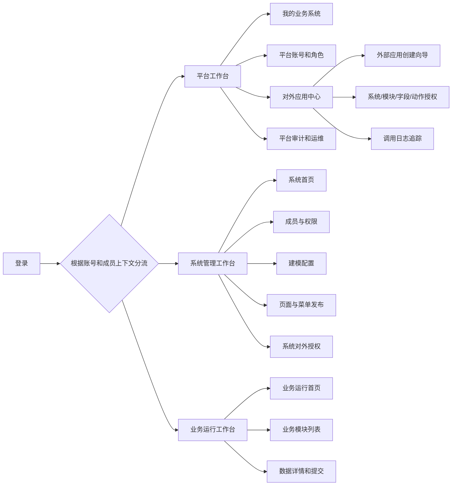

# P16 Open Design 高保真原型生成 Brief

状态：`ready-for-open-design`

更新时间：2026-06-13

目标工具：Open Design Docker 本地服务 `http://127.0.0.1:7456/`

## 1. 一句话目标

设计一个普通人能自然使用的中文企业级可配置业务系统平台。它不是接口调试台，也不是配置字段堆叠页，而是一个能让平台管理员、系统管理员、普通业务用户、集成管理员在各自工作台完成真实任务的完整 SaaS 后台。

## 2. 产品定位

系统用于快速创建多个业务系统。平台管理员先创建业务系统，系统管理员在某个业务系统里搭建模块、字段、页面、菜单和权限，普通业务用户登录后只在自己所属系统里处理被授权的业务数据。平台级对外应用用于把业务系统的数据、模块动作、字段范围、流程、文件或平台能力安全开放给外部系统。

## 3. 设计原则

- 默认中文界面。除 OpenAPI、appKey、secret、requestId、API ID 等专有名词外，不使用英文 UI 文案。
- 平台层、系统层、业务运行台、平台级对外应用必须在导航和页面文案上清晰分离。
- 普通业务用户不需要理解平台账号、系统成员、tenantId、systemId、memberId、moduleId、scope、请求头等技术概念。
- 新建和编辑使用主按钮触发独立页面、抽屉或分步向导，不在表格上方常驻大表单。
- 每个列表必须包含筛选、分页、空态、加载态、错误态、无权限态和恢复提示。
- 视觉风格是现代企业 SaaS 后台：克制、清晰、信息密度适中、层级明确。不要营销页，不要大面积渐变，不要接口调试台。
- 卡片只用于状态摘要、重复对象和弹窗/抽屉内部小区块；不要卡片套卡片。

## 4. 角色与工作台

### 4.1 平台管理员

目标：创建业务系统、维护平台账号和平台角色、管理平台级对外应用、查看平台审计和运维状态。

登录落点：我的业务系统。

可见导航：

- 我的业务系统
- 平台管理：业务系统、平台账号、平台角色、平台配置
- 对外应用中心
- 平台审计
- 运维诊断

### 4.2 系统管理员

目标：进入某个业务系统后，完成成员开通、角色授权、业务应用、模块、字段、页面、菜单、发布、系统审计和系统级对外授权。

登录或进入系统后的落点：系统首页。

可见导航：

- 系统首页
- 成员与权限：成员、部门、系统角色、字典
- 建模配置：业务应用、模块、字段、页面与发布
- 业务运行
- 协同与文件：流程、文件、导出
- 系统对外授权
- 系统审计

### 4.3 普通业务用户

目标：只在自己所属业务系统里处理被授权的业务模块和数据。

登录落点：如果只属于一个系统，直接进入该系统的业务运行台；如果属于多个系统，先进入业务系统选择页。

可见导航：

- 业务运行首页
- 被授权业务模块，例如车辆档案
- 待办、文件、导出等被授权入口
- 退出

不可见入口：

- 平台管理
- 系统建模
- 字段设计
- 页面发布
- 权限配置
- 平台级对外应用配置

### 4.4 集成管理员

目标：配置平台级对外应用，把业务系统数据和平台能力授权给外部系统，并追踪调用日志。

可见导航：

- 对外应用中心
- 应用凭证
- 授权范围
- 调用日志
- requestId 追踪

## 5. 信息架构



## 6. 必须生成的页面

### 6.1 登录页

页面目标：让用户登录后清楚进入自己的工作空间。

关键元素：

- 产品名：统一业务配置平台
- 登录表单：账号、密码
- 主按钮：登录
- 错误提示：账号不存在、密码错误、账号停用、服务异常
- 辅助信息：联系管理员开通账号

### 6.2 我的业务系统

用户：平台管理员、系统管理员。

页面目标：创建系统、进入系统、查看最近访问和系统状态。

布局：

- 顶部：页面标题“我的业务系统”、主按钮“创建业务系统”
- 筛选：系统名称、状态、最近访问
- 列表/卡片：系统名称、业务说明、成员数、模块数、发布状态、最近访问时间、进入系统
- 空态：还没有业务系统，提示创建第一个系统
- 创建系统使用抽屉或独立页面，不使用常驻大表单

### 6.3 系统首页

用户：系统管理员。

页面目标：告诉管理员当前系统是否已经可用，以及下一步该做什么。

布局：

- 顶部上下文：当前系统“车”、当前角色“系统管理员”
- 配置进度：成员、模块、字段、页面、菜单、授权、发布
- 下一步任务：开通成员、创建模块、发布运行台
- 快捷入口：成员与权限、建模配置、业务运行、系统对外授权、系统审计
- 异常提醒：未发布模块、缺少字段、没有成员授权

### 6.4 成员与权限

用户：系统管理员。

页面目标：在当前系统内直接开通成员账号、加入系统、配置角色和数据范围，不要求先去平台账号页。

布局：

- 顶部主按钮：开通成员
- 筛选：姓名/账号、角色、状态
- 成员列表：姓名、登录账号、系统角色、数据范围、状态、最近登录、操作
- 开通成员抽屉：姓名、登录账号、初始密码、手机号、部门、岗位、系统角色、数据范围
- 角色详情：权限分组、菜单权限、动作权限、字段权限
- 无权限态：没有成员管理权限时隐藏开通按钮并提示原因

### 6.5 建模配置

用户：系统管理员。

页面目标：创建业务应用、模块、字段、页面和菜单，并完成发布。

建议使用分步向导：

1. 业务应用：例如“车辆业务”
2. 业务模块：例如“车辆档案”
3. 字段设计：车牌号、车型、颜色、登记日期、状态
4. 页面配置：列表页、表单页、详情页
5. 菜单发布：发布到业务运行台
6. 发布检查：缺字段、缺页面、缺菜单、缺权限时给出阻塞原因

列表页面仍需支持：

- 模块列表：模块名称、字段数、页面状态、菜单状态、发布状态、最近更新时间
- 主按钮：新建模块
- 操作：设计字段、配置页面、发布、停用

### 6.6 业务运行首页

用户：普通业务用户。

页面目标：登录后立刻知道自己在哪个系统、能处理哪些业务。

布局：

- 顶部上下文：车 / 业务运行台，当前用户 che
- 业务模块入口：车辆档案
- 待处理事项：待提交、被退回、最近编辑
- 最近数据：最近新增或编辑的车辆档案
- 空态：当前系统还没有开放业务模块，请联系管理员
- 不显示任何建模、字段、发布、权限入口

### 6.7 业务模块列表页：车辆档案

用户：普通业务用户。

页面目标：查询、分页、新增、编辑、提交车辆数据。

布局：

- 标题：车辆档案
- 主按钮：新增车辆档案
- 筛选：车牌号、车型、状态、登记日期
- 表格列：车牌号、车型、颜色、登记日期、状态、创建人、更新时间、操作
- 分页：每页条数、当前页、总数
- 行操作：查看详情、编辑、提交
- 批量操作：批量提交或导出，仅在有权限时显示
- 错误态：加载失败时显示重试和 requestId

### 6.8 新建/编辑车辆档案

用户：普通业务用户。

页面目标：清楚填写业务字段并保存。

布局：

- 推荐使用右侧抽屉或独立页面
- 字段：车牌号、车型、颜色、登记日期、状态
- 字段权限：只读字段显示锁定提示，隐藏字段不出现
- 按钮：保存草稿、保存并提交、取消
- 校验：必填、格式错误、无权限编辑

### 6.9 车辆档案详情

用户：普通业务用户、系统管理员。

页面目标：查看完整数据、流程状态、历史和操作日志。

布局：

- 顶部：车辆档案标题、状态标签、操作按钮
- 详情区：字段详情
- 流程区：当前状态、提交记录、审批结果
- 历史区：修改历史
- 日志区：操作人、操作时间、requestId

### 6.10 对外应用中心

用户：平台管理员、集成管理员。

页面目标：创建平台级外部接入应用，并授权访问业务系统数据和平台能力。

布局：

- 顶部主按钮：创建对外应用
- 列表：应用名称、appKey、状态、授权系统数、最近调用、限流策略、操作
- 创建向导：
  1. 基本信息：应用名称、负责人、说明
  2. 凭证：生成 appKey/secret，secret 只展示一次
  3. 授权业务系统：选择“车”
  4. 授权模块和字段：车辆档案、车牌号、车型、颜色、登记日期、状态
  5. 授权动作：查询、新增、编辑、提交
  6. 安全策略：IP 白名单、限流、过期时间、签名方式
  7. 确认发布：展示影响范围

### 6.11 系统对外授权

用户：系统管理员、集成管理员。

页面目标：在具体业务系统内确认哪些系统数据可以被平台级对外应用访问。

布局：

- 当前系统上下文：车
- 已授权应用列表
- 授权范围：模块、字段、动作、数据范围
- 风险提示：外部应用将访问哪些业务数据

### 6.12 日志审计

用户：平台管理员、系统管理员、审计/运维。

页面目标：按层级追踪平台操作、系统操作、运行数据和 OpenAPI 调用。

页面分层：

- 平台审计：登录日志、平台账号、系统创建、平台配置、对外应用、运维诊断
- 系统审计：成员、角色、模块、字段、页面、菜单、运行数据、系统内 OpenAPI 调用
- requestId 追踪：输入 requestId 后展示签名、授权、限流、执行结果、错误原因

## 7. 连续流程原型要求

Open Design 生成的原型必须能表达以下连续路径，不要求真实保存数据，但需要页面之间有明确跳转和状态变化：

1. 平台管理员登录。
2. 创建“车”业务系统。
3. 进入“车”系统首页。
4. 开通成员账号 `che` 并加入当前系统。
5. 创建“车辆业务”应用。
6. 创建“车辆档案”模块。
7. 添加车辆字段。
8. 配置列表页、表单页、详情页。
9. 发布到业务运行台。
10. 给 `che` 授权车辆档案查看、新增、编辑、提交和字段权限。
11. 平台管理员退出。
12. `che` 登录后直接进入“车 / 业务运行台”。
13. `che` 新增、查询、编辑、提交车辆档案。
14. 创建“车联网外部接入”对外应用。
15. 授权它访问“车 / 车辆档案”。
16. 查看 OpenAPI 调用日志和 requestId 追踪。

## 8. 视觉风格建议

- 左侧导航 + 顶部上下文栏 + 主内容区。
- 颜色使用中性灰、白色、少量品牌主色和状态色，避免单一蓝紫或大面积渐变。
- 表格、筛选、按钮、抽屉、步骤条、状态标签、分页要一致。
- 标题不要过大，后台系统以扫描效率为主。
- 关键状态使用标签：未配置、待发布、已发布、草稿、已提交、已停用、调用成功、调用失败。
- 主按钮在页面右上或标题区明确出现，例如“创建业务系统”“开通成员”“新建模块”“新增车辆档案”“创建对外应用”。

## 9. 禁止生成的样式

- 不要把每个接口做成一个调试卡片。
- 不要把新增表单常驻在列表上方。
- 不要让普通用户看到平台、系统配置、字段设计、发布、权限菜单。
- 不要把“对外应用中心”和“业务应用/模块”混成一个菜单。
- 不要暴露技术 ID 作为主内容。
- 不要使用英文占位文案。
- 不要做营销首页、hero 介绍页或概念展示页。

## 10. Open Design 输入 Prompt

```text
请基于以下要求生成一个中文企业级 SaaS 后台高保真可交互原型，主题是“统一业务配置平台”。目标不是接口调试台，而是普通人能使用的完整业务系统平台。

必须包含四类用户工作台：平台管理员、系统管理员、普通业务用户、集成管理员。平台层、系统层、业务运行台、平台级对外应用必须清楚分离。

请生成以下页面和可点击流程：登录页、我的业务系统、创建业务系统、系统首页、成员与权限、建模配置向导、字段设计、页面与菜单发布、普通业务运行首页、车辆档案列表、新建/编辑车辆档案、车辆档案详情、对外应用中心、对外应用创建向导、系统对外授权、平台审计、系统审计、requestId 追踪。

连续流程必须表达：平台管理员登录 -> 创建“车”业务系统 -> 进入系统首页 -> 在系统内开通 che 成员账号 -> 创建“车辆业务”应用 -> 创建“车辆档案”模块 -> 添加车牌号、车型、颜色、登记日期、状态字段 -> 配置列表页/表单页/详情页 -> 发布到业务运行台 -> 给 che 授权 -> platform_admin 退出 -> che 登录后直接进入“车 / 业务运行台” -> che 新增、查询、编辑、提交车辆档案 -> 创建“车联网外部接入”对外应用 -> 授权访问“车 / 车辆档案” -> 查看 OpenAPI 调用日志和 requestId 追踪。

设计要求：现代、克制、清晰的企业后台；左侧导航、顶部上下文、主内容区；中文文案；列表有筛选、分页、空态、错误态；新建/编辑使用抽屉、独立页面或分步向导，不允许在表格上方堆常驻大表单；普通业务用户只能看到业务运行首页和被授权业务模块，不能看到平台管理、建模配置、字段设计、发布、权限配置入口。

请避免营销页、渐变 hero、接口字段堆叠、调试台风格、技术 ID 主视觉。页面要让没有技术背景的人也知道下一步该做什么。
```
