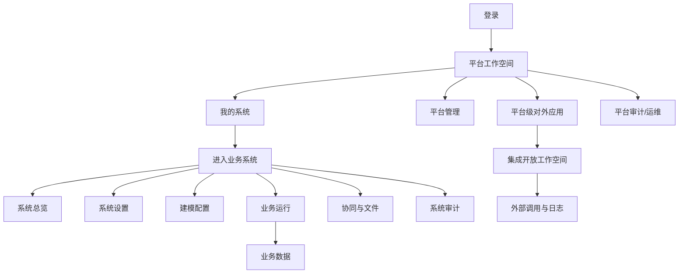

# P14 集成 UI/UX 设计冻结稿

状态：`frozen-for-p14-integrated-rework`

输入：`docs/product/product-vision-and-operating-model.md`、`docs/product/integrated-system-baseline.md`、`docs/issues/pm/development/p14_app_concept_rework.md`、`docs/ui/ui-design.md`、`docs/ui/p13-usability-rework-spec.md`、当前前端 `frontend/src/`。

## 1. PM/UIUX 结论

P14 前端目标不是继续修 P13 页面，而是把当前工程型界面重组为一个普通人能连续使用的业务系统平台。

当前可复用的是底层能力：API client、typed SDK、权限 store、系统上下文、动态字段渲染、运行台数据读写、已有后端接口。当前必须重做的是产品界面：信息架构、导航分组、页面布局、视觉层级、中文文案、状态反馈、角色可见性、对外应用流程、平台日志与系统日志分层。

P14 UI 以四个工作空间组织：

1. 平台工作空间：我的系统、平台管理、平台级对外应用、平台审计、运维诊断。
2. 系统管理工作空间：系统总览、系统设置、建模配置、系统审计。
3. 业务运行工作空间：普通业务用户使用已发布模块处理数据、审批、附件和导出。
4. 集成开放工作空间：创建对外应用、授权系统数据/能力、管理凭证、查看调用日志。

## 2. 角色与权限落地

本设计中的角色是产品画像和默认权限模板，不是固定写死角色名。

| 产品画像 | 默认模板 | 判定依据 | 首页落点 |
| --- | --- | --- | --- |
| 平台超级管理员 | 平台超级管理员 | 平台权限包含 `PLAT_*`、`OPS_*`、`PLAT_AUDIT_VIEW`。 | 平台工作空间 |
| 系统管理员 | 系统管理员 | 当前系统成员权限包含 `SYS_MANAGE_ALL` 或系统设置、角色、建模相关权限。 | 系统总览 |
| 建模配置人员 | 建模配置人员 | 当前系统成员权限包含 `APP_VIEW`、`MODULE_VIEW`、`FIELD_VIEW`、`PAGE_VIEW`、发布相关权限。 | 建模配置 |
| 普通业务用户 | 业务用户 | 有系统成员上下文和运行台权限，但无系统设置/建模配置权限。 | 业务运行 |
| 集成管理员 | 集成管理员 | 有平台级对外应用或系统 OpenAPI 授权管理权限。 | 对外应用 |
| 审计/运维人员 | 审计人员 | 有平台审计、系统审计或运维只读权限。 | 对应审计页 |

落地规则：

- 前端不得用角色名称字符串决定页面可见性。
- 页面入口必须基于权限点、菜单、字段权限、数据范围和真实 `SYS-001` 上下文判断。
- 默认角色模板只负责开箱体验，用户后续可以通过角色配置生成自定义角色。
- 普通业务用户不得看到系统设置、建模配置、平台管理、对外应用授权、运维诊断入口。
- 无权限入口优先隐藏；如果保留用于说明路径，则必须禁用并给中文原因。

## 3. 信息架构



平台层导航：

| 分组 | 页面 | 使用者 | 说明 |
| --- | --- | --- | --- |
| 工作台 | 我的系统 | 所有登录用户 | 创建系统、进入可管理或可使用系统。 |
| 平台管理 | 系统、账号、角色、平台配置 | 平台管理员 | 管理平台级对象，不进入业务数据写操作。 |
| 对外应用 | 对外应用列表、应用详情、授权、凭证、调用日志 | 平台管理员、集成管理员 | 平台级外部接入，不是系统内业务应用。 |
| 平台审计 | 平台操作日志、登录日志、对外应用日志 | 平台审计/运维 | 平台层日志和诊断。 |
| 运维诊断 | 健康、版本、配置、迁移 | 运维人员 | 只读诊断优先。 |

系统层导航：

| 分组 | 页面 | 使用者 | 说明 |
| --- | --- | --- | --- |
| 总览 | 系统总览 | 系统成员 | 说明当前状态和下一步。 |
| 系统设置 | 资料、租户、成员、部门、角色、字典 | 系统管理员 | 建立系统内组织和权限。 |
| 建模配置 | 业务应用、模块、字段、页面、发布 | 建模配置人员 | 把业务对象发布成可运行模块。 |
| 业务运行 | 我的任务、已发布模块、记录列表、详情 | 普通业务用户 | 日常处理业务数据。 |
| 协同与文件 | 流程、文件、导出 | 业务用户、审批人、管理员 | 审批、附件、导出。 |
| 系统审计 | 配置日志、数据日志、系统 OpenAPI 日志 | 系统管理员/审计 | 系统内审计。 |

默认落点：

- 登录成功：进入“我的系统”。
- 创建系统成功：进入该系统“系统总览”。
- 普通业务用户进入系统：进入“业务运行”或“我的任务”，如果没有模块则显示可恢复空态。
- 系统管理员进入系统：进入“系统总览”。
- 集成管理员进入平台：入口优先显示“对外应用”快捷卡。

## 4. 视觉与组件规范

目标气质：现代、克制、清晰、工作型，不做营销页，不做接口调试页。

- 主色：深青蓝 `#1f5f6f`，用于主导航、主按钮、选中态。
- 辅助色：中性灰 `#f4f6f8`、边框灰 `#d8dee6`、正文 `#17212b`。
- 状态色：成功绿、警告橙、错误红只用于状态，不大面积铺底。
- 页面背景使用浅灰，内容区使用白色或分隔线，不堆嵌套卡片。
- 圆角统一 6-8px；表格、抽屉、弹窗保持紧凑。
- 字号不随 viewport 缩放；标题和表单标签层级固定。
- 按钮使用图标加文字；危险操作必须二次确认。
- 列表、表单、详情、日志使用统一 Toolbar、FilterBar、DataTable、DrawerForm、DetailTabs、EmptyState、ErrorState、PermissionHint。
- 所有页面默认中文；`OpenAPI`、`appKey`、`secret`、`scope`、`requestId` 等专有词可保留英文。

## 5. 全局壳层

平台壳层：

```text
unexamine | 我的系统 | 平台管理 | 对外应用 | 平台审计 | 运维诊断
当前账号 / 平台角色 / 退出
页面标题 + 说明 + 主操作
筛选 / 状态 / 内容 / 详情抽屉
```

规则：

- 平台层不显示系统内“成员、字段、运行台”等菜单。
- 平台超级管理员可进入系统，但默认不直接修改业务数据。
- 对外应用必须作为平台层一级入口。

系统壳层：

```text
返回平台 / 当前系统 / 当前租户 / 当前成员 / 权限摘要
左侧：系统总览、系统设置、建模配置、业务运行、协同与文件、系统审计
右侧：页面标题、下一步提示、页面内容
```

规则：

- 系统壳层必须展示真实系统、租户、成员上下文。
- 缺少成员或租户上下文时，阻断写操作并给修复入口。
- 普通业务用户只看到业务运行、协同与文件中自己有权限的入口。

## 6. 页面设计

### 6.1 登录

目标：用户知道这是一个业务系统配置与运行平台，并能快速进入。

- 左侧展示产品名、适用对象、三步能力摘要：建系统、用业务、对外开放。
- 右侧展示登录表单。
- 登录失败展示账号、密码、停用、网络或服务异常的中文解释。
- 登录成功进入“我的系统”。
- 页面不展示接口地址配置面板。

### 6.2 我的系统

目标：用户能创建系统或进入自己有权限的系统。

```text
标题区：我的系统                         [创建业务系统]
说明：选择要进入的业务系统，或创建新的业务系统。
筛选：系统名称/编码、状态
内容：系统卡片或表格
右侧：下一步/最近访问/无系统引导
```

系统卡片展示：名称、编码、状态、租户模式、我的身份、最近访问、主操作。

空态：

- 平台管理员：`暂无业务系统。创建后你会成为该系统的系统管理员。`
- 普通用户：`暂无可用业务系统。请联系管理员把你加入业务系统。`

创建成功后主按钮为“进入系统总览”。

### 6.3 系统总览

目标：用户知道这个系统是否可用、下一步做什么。

内容：

- 当前系统摘要：系统状态、租户、成员、我的角色、权限数量。
- 配置进度：成员、角色、业务应用、模块、字段、页面、已发布模块、对外开放、日志。
- 推荐路径：设置成员和角色 -> 建业务模块 -> 发布到运行台 -> 邀请普通用户使用 -> 按需配置对外应用。
- 快捷入口：系统设置、建模配置、业务运行、系统审计。

状态：

- 新系统：突出“先添加成员/角色”和“创建业务模块”。
- 配置中：显示未完成项和去处理按钮。
- 已发布：显示可运行模块和最近业务数据。
- 无权限：只显示自己能做的下一步。

### 6.4 系统设置

目标：系统管理员配置组织、成员、角色和字典。

页面：

- 系统资料：系统名称、状态、租户模式、描述。
- 租户：租户列表、启停、默认租户。
- 成员：选择平台账号加入系统，配置租户、部门、岗位、角色。
- 部门：左树右详情。
- 系统角色：菜单权限、操作权限、字段权限、数据范围。
- 字典：左类型右字典项。

设计重点：

- 成员不是登录账号，必须从平台账号扩展而来。
- 角色授权必须按权限组展示，不显示长逗号字符串。
- 字段权限和数据范围要解释影响，例如“仅能查看本人创建数据”。
- 删除/停用有影响范围说明。

### 6.5 建模配置

目标：让配置人员按任务流把业务对象变成可运行模块。

```text
业务应用选择器 / 模块选择器
步骤条：业务应用 -> 模块 -> 字段 -> 页面 -> 发布检查 -> 发布
主内容区：当前步骤
右侧辅助区：当前完成度、检查项、下一步
```

术语：

- 系统内业务应用：只用于组织模块和运行入口。
- 平台级对外应用：不出现在建模配置中。

步骤：

1. 业务应用：创建业务应用，填写名称、编码、说明。
2. 模块：创建业务模块，填写名称、编码、标题字段策略。
3. 字段：配置字段名称、编码、类型、必填、唯一、显示、权限。
4. 页面：配置列表、表单、详情、按钮和菜单。
5. 发布检查：检查字段、页面、菜单、权限、标题字段。
6. 发布：填写发布说明，发布到运行台。

空态：

- 无业务应用：引导创建业务应用。
- 无模块：引导创建模块。
- 无字段：提示至少添加一个标题字段或业务字段。
- 发布失败：列出具体失败项，提供定位按钮。

### 6.6 业务运行

目标：普通业务用户处理真实业务数据。

布局：

- 左侧：已发布模块菜单。
- 顶部：模块名、状态、数据范围说明、主操作。
- 中间：筛选、列表、分页。
- 右侧/详情页：记录详情、附件、审批、历史。

规则：

- 只展示已发布且用户有菜单权限的模块。
- 不展示字段配置、页面配置、发布按钮。
- 新增/编辑表单按字段权限渲染，可读不可写字段禁用并说明。
- 数据范围提示使用业务语言，例如“仅显示你创建的记录”。

### 6.7 协同与文件

目标：让业务数据与流程、附件、导出闭环。

- 流程模板：管理员维护模板、绑定模块、发布检查。
- 我的待办：普通用户或审批人处理待办。
- 我的申请：查看已发起流程。
- 流程实例：管理员追踪系统内流程。
- 文件中心：上传、下载、引用对象、权限、删除。
- 导出任务：模板、任务状态、下载、失败重试。

状态：

- 无待办：显示空态，不误导为异常。
- 文件无权限：禁用下载并说明。
- 导出失败：显示失败原因和重试入口。

### 6.8 平台级对外应用

目标：让外部系统有受控、可追踪的接入方式。

平台层入口：`对外应用`。

列表展示：应用名称、编码、状态、授权系统数、密钥状态、限流策略、最近调用、负责人。

创建流程：

1. 基本信息：名称、编码、负责人、说明。
2. 凭证生成：生成 appKey/secret，secret 只展示一次。
3. 授权范围：选择可访问业务系统、租户、模块、字段、动作、数据范围。
4. 平台能力：选择可调用的平台级流程、文件、消息或后续能力。
5. 安全策略：IP 白名单、限流、过期时间、签名策略、幂等。
6. 调用示例：展示示例请求和必要参数。

详情 Tabs：基本信息、凭证、授权范围、安全策略、调用日志、变更历史。

设计底线：

- 不把它叫成“应用配置”。
- 不把它藏在系统内建模菜单里。
- 不只展示技术字段，必须能解释“这个外部应用可以访问什么、为什么失败、怎么恢复”。

### 6.9 审计与日志

目标：平台和业务系统的日志分层、可追踪、可恢复。

平台审计：

- 平台登录、账号、平台角色、业务系统创建/停用、平台级对外应用、密钥轮换、平台能力调用、运维诊断。

系统审计：

- 系统成员、部门、角色、字典、模块、字段、页面、发布、业务记录、流程、文件、导出、系统相关 OpenAPI 调用。

列表字段：时间、层级、操作者、对象、动作、结果、原因、requestId。

详情展示：操作上下文、请求摘要、响应摘要、权限判断、scope 判断、限流判断、错误原因、恢复建议。

## 7. 原型流程追踪矩阵

| 剧本 | 用户 | 页面路径 | 关键接口 | 成功证据 | 失败/恢复 |
| --- | --- | --- | --- | --- | --- |
| A1 创建系统 | 平台管理员 | 登录 -> 我的系统 -> 创建业务系统 -> 系统总览 | `AUTH-002`、`PLAT-001`、`PLAT-002`、`SYS-001` | 新系统卡片和系统总览可见。 | 创建失败显示中文原因和 requestId。 |
| A2 配置成员角色 | 系统管理员 | 系统总览 -> 系统设置 -> 成员/角色 | `MEM-*`、`RBAC-*` | 成员拥有系统角色，权限版本刷新。 | 无平台账号、无权限、停用成员均有提示。 |
| A3 建模发布 | 建模配置人员 | 建模配置 -> 业务应用 -> 模块 -> 字段 -> 页面 -> 发布 | `APP-*`、`MOD-*`、`FIELD-*`、`UI-*` | 发布检查通过，运行台出现模块。 | 检查失败定位字段/页面。 |
| A4 普通用户使用 | 普通业务用户 | 我的系统 -> 业务运行 -> 模块 -> 新增/查询/编辑/提交 | `RUN-*`、`FLOW-*` | 只看到授权模块和数据范围内记录。 | 无模块、无权限、保存失败可恢复。 |
| B1 创建对外应用 | 集成管理员 | 平台 -> 对外应用 -> 创建 | `OPM-*` | appKey/secret 创建，secret 只展示一次。 | 密钥保存提醒、失败可重试。 |
| B2 授权范围 | 集成管理员 | 对外应用详情 -> 授权范围 | `OPM-*`、模块/字段权限接口 | 授权系统、模块、字段、动作和数据范围可回显。 | 无权限 scope 禁用并说明。 |
| B3 外部调用 | 外部系统/集成管理员 | 调用 OpenAPI -> 调用日志 | `OPN-*`、`AUD-*` | 返回业务结果和 requestId。 | 签名、scope、限流、业务错误可按 requestId 查到。 |
| C1 平台审计 | 审计人员 | 平台审计 | `AUD-006`、`AUD-008` | 平台日志与系统日志不混用。 | 可按 requestId 定位失败原因。 |
| C2 系统审计 | 系统管理员 | 系统审计 | `AUD-001` 至 `AUD-005`、`AUD-007` | 系统内配置和数据日志可检索。 | 无权限时只显示授权范围内日志。 |

## 8. 前端实现映射

必须重做：

- `frontend/src/layouts/AppShell.ts`：导航分组、平台/系统壳层、普通用户可见性。
- `frontend/src/router/index.ts`：术语和路由分组，平台级对外应用入口从系统内 OpenAPI 概念中拆清。
- `frontend/src/App.ts`：页面渲染结构、工作空间、状态和业务文案。
- `frontend/src/styles.css`：视觉层级、布局、组件状态、空态/错误态。
- `frontend/src/pages/openapi/*`：升级为平台级对外应用体验，保留 OpenAPI 技术能力但改变产品入口。
- `frontend/src/pages/audit/*`：平台日志和系统日志分层表达。
- `frontend/src/pages/module-config/*`：改名和文案从“应用”调整为“业务应用/建模配置”。
- `frontend/src/pages/runtime/*`：强化普通业务用户视角和权限说明。

优先复用：

- `frontend/src/api/*`
- `frontend/src/stores/*`
- `frontend/src/components/dynamic-schema/*`
- 已验证的页面模型中和接口调用相关的函数。

不得实现：

- 不新增写死角色名判断。
- 不新增地址栏调试参数作为用户入口。
- 不把后端没有更新语义的接口伪造成编辑能力。
- 不把平台级对外应用继续放在系统内“应用配置”下面。

## 9. 验收清单

1. 普通用户能看懂登录后下一步。
2. 系统创建后不会进入空运行台。
3. 系统管理员能按总览提示完成设置、建模、发布。
4. 普通业务用户看不到建模配置入口。
5. 对外应用能解释创建、密钥、授权、调用、日志。
6. 平台日志和系统日志分层。
7. 每个空态和错误态都有中文恢复提示。
8. 页面不出现 `current`、schema、接口 ID、测试默认值等调试痕迹。
9. 导航、文案和视觉规范一致。
10. E2E 能按剧本 A、B、C 连续验证。

P14 未满足以上任一 P0 项时，不允许进入打包。
