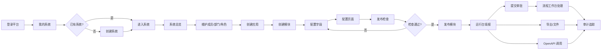

# UI/UX 设计冻结稿

版本：2026-06-10

状态：draft-frozen-for-frontend-rework

## 1. PM 结论

当前前端已完成真实接口调用、主要写链路和可部署构建，但页面是按接口能力补齐的工程型界面，缺少独立 UI/UX 设计阶段。它可以用于功能试跑，不应作为最终用户可正常使用的产品体验。

P12 先冻结本设计，再由 frontend 按设计改造页面。frontend 不再临场决定导航、页面层级、表单布局和交互文案。

## 2. 使用对象与关键任务

| 用户 | 主要目标 | 高频任务 | 体验优先级 |
| --- | --- | --- | --- |
| 平台超级管理员 | 管理平台、账号、系统和全局运维。 | 登录、创建系统、管理平台账号角色、查看平台审计。 | 快速定位平台级对象，避免误入系统内业务数据。 |
| 系统超级管理员 | 搭建单个系统的组织、权限、应用和运行规则。 | 进入系统、维护租户/成员/部门/角色、创建应用模块、发布配置。 | 明确当前系统上下文，按配置步骤推进。 |
| 应用配置管理员 | 把业务对象配置成可运行模块。 | 创建应用、建模块、配置字段、配置页面、发布检查、发布。 | 需要向导式路径，减少在应用/模块/字段之间迷路。 |
| 业务用户 | 使用已发布模块填报、查询和提交审批。 | 进入运行台、筛选列表、新建记录、编辑记录、查看详情、提交审批、导出。 | 操作要少，业务数据优先，配置入口弱化。 |
| 审批人 | 处理待办并追踪审批历史。 | 查看待办、同意/拒绝/转交、查看流程图和历史。 | 待办优先，审批上下文和风险信息清楚。 |
| 运维审计人员 | 追踪问题、健康和调用日志。 | 按 requestId 检索、查看健康、审计日志、OpenAPI 调用日志。 | 搜索和状态优先，日志结果可扫描。 |

## 3. 信息架构

系统采用“双层工作台”：

1. 平台层：登录后默认进入“我的系统”。只放平台账号、平台角色、平台系统、平台配置、平台审计、运维健康。
2. 系统层：进入某个系统后，顶部固定显示当前系统、租户、成员和权限摘要；侧边导航切换为系统内模块。

系统内导航分为 6 组：

| 分组 | 页面 | 用途 |
| --- | --- | --- |
| 总览 | 系统总览 | 展示系统状态、当前租户、成员权限、待处理事项和配置完成度。 |
| 系统设置 | 系统资料、租户、成员、部门、角色、字典 | 管理系统基础和权限上下文。 |
| 应用配置 | 应用、模块、字段、页面配置、发布检查 | 配置业务模型并发布到运行台。 |
| 业务运行 | 运行台、业务模块列表、记录详情 | 业务用户使用已发布模块。 |
| 协同与文件 | 流程模板、流程工作台、文件中心、导出任务 | 审批、附件和导出闭环。 |
| 集成与审计 | OpenAPI、系统审计、运维状态 | 外部接入、日志和健康。 |

平台层导航不显示系统内配置页面；系统层导航不显示平台账号和平台角色。

## 4. 核心用户流程

流程约束：

- 创建系统成功后必须明确引导“进入系统”。
- 进入系统后默认落到系统总览，不直接进入某个配置页。
- 应用配置必须按“应用 -> 模块 -> 字段 -> 页面 -> 发布检查 -> 发布”的路径组织。
- 运行台只展示已发布模块，不混入配置入口。
- 审计和运维从任何错误提示中的 requestId 都能跳转或复制检索。

## 5. 页面框架

### 5.1 登录页

布局：

- 左侧为产品名称、适用场景和系统能力摘要。
- 右侧为登录表单。
- 注册和重置密码作为次级入口，不与登录主按钮抢视觉权重。

字段：

- 登录名、密码。
- 错误提示显示在表单上方，包含 requestId。

验收：

- 默认焦点在登录名。
- 回车触发登录。
- 登录成功进入“我的系统”。

### 5.2 平台工作台

布局：

- 左侧平台导航。
- 顶部显示平台身份、退出、全局消息区域。
- 主区采用“标题区 + 操作区 + 内容区 + 详情抽屉”。

页面：

| 页面 | 主信息 | 主操作 | 详情/反馈 |
| --- | --- | --- | --- |
| 我的系统 | 系统卡片、状态、租户模式、最后访问 | 创建系统、进入系统 | 创建后出现成功提示和进入按钮。 |
| 平台系统 | 系统表格、状态筛选、编码搜索 | 创建、启停、进入 | 启停必须二次确认。 |
| 平台账号 | 账号表格、状态、角色摘要 | 创建、启停、重置密码占位 | 停用账号提示影响范围。 |
| 平台角色 | 角色表格、权限摘要 | 创建、授权、启停 | 授权使用抽屉，按权限组勾选。 |
| 平台配置 | 配置项表格、敏感值脱敏 | 编辑配置 | 保存后刷新配置版本。 |
| 平台审计 | 日志列表、requestId 搜索 | 查询、查看详情 | 详情抽屉展示请求、用户和错误。 |

### 5.3 系统总览

系统层默认首页，避免进入系统后直接面对分散菜单。

内容：

- 当前系统、租户、成员、角色和权限数量。
- 配置进度：成员、角色、应用、模块、已发布模块、流程模板、OpenAPI 客户端。
- 待办提醒：我的待办、导出失败、健康异常。
- 快捷入口：成员管理、应用配置、运行台、流程工作台。

验收：

- 没有租户或成员上下文时显示阻断空态和修复入口。
- 系统停用时只允许查看，不允许配置写操作。

### 5.4 系统设置

布局：

- 左侧为设置子导航：系统资料、租户、成员、部门、角色、字典。
- 主区为列表与表单。
- 新建/编辑使用右侧抽屉，避免列表被表单挤压。

关键设计：

- 成员页必须先搜索或选择平台账号，再补系统内显示名、部门、角色。
- 部门页左侧树、右侧成员/部门详情。
- 角色授权按“菜单权限、操作权限、数据范围、字段权限”分 Tabs。
- 字典页左侧字典类型，右侧字典项。

状态：

- 无成员：提示“先添加系统成员，才能分配角色和使用运行台”。
- 无角色：提示“创建角色后，可为成员授予系统内权限”。
- 权限不足：按钮保留但禁用，悬浮或旁文显示原因。

### 5.5 应用配置

布局：

- 顶部为应用选择器和模块选择器。
- 左侧为配置步骤条。
- 主区按当前步骤展示。
- 右侧为发布检查面板。

步骤：

1. 应用：创建或选择应用。
2. 模块：创建模块，选择标题字段策略。
3. 字段：维护字段列表、类型、必填、唯一、显示状态。
4. 页面：配置列表、表单、详情展示字段和动作。
5. 发布检查：展示检查项、错误、警告和定位入口。
6. 发布：填写发布说明并生成运行版本。

验收：

- 没有应用时，模块/字段/页面页展示引导，不出现空白表格。
- 发布检查失败时，每条错误能定位到字段或页面配置。
- 发布成功后提示去运行台查看。

### 5.6 运行台

布局：

- 左侧为已发布模块菜单。
- 顶部为当前模块名称、状态、常用操作。
- 列表页包含筛选区、表格、批量操作、分页。
- 新建/编辑使用独立表单页或大抽屉；详情页展示业务字段、附件、审批、历史。

列表：

- 默认显示标题字段、状态、创建人、更新时间和关键业务字段。
- 筛选区默认折叠高级筛选。
- 删除、提交审批、导出等危险或批量操作必须二次确认。

详情：

- 顶部摘要：标题、状态、流程状态、更新时间。
- Tabs：详情、附件、审批、历史、关联。

### 5.7 流程工作台

页面：

- 流程模板：模板列表、发布状态、绑定模块、默认审批图。
- 待办：按优先级和到达时间排序。
- 抄送：只读确认。
- 我的申请：查看发起记录和状态。
- 实例详情：流程图、审批历史、业务摘要。

审批动作：

- 同意：意见可选。
- 拒绝、退回、终止：原因必填。
- 转交：必须选择接收成员。
- 重复处理返回明确错误并刷新列表。

### 5.8 文件与导出

文件中心：

- 上传区放在列表上方，支持拖拽或选择文件。
- 列表显示文件名、类型、大小、引用状态、上传人、时间。
- 预览/下载按钮按权限显示或禁用。

导出：

- 导出模板和导出任务分 Tabs。
- 创建导出任务前必须显示当前模块是否已发布。
- 任务状态使用标签：排队、处理中、成功、失败、取消。
- 成功任务显示下载结果；失败任务显示失败原因和重试入口。

### 5.9 OpenAPI

布局：

- 客户端列表为主。
- 详情抽屉分 Tabs：基础信息、凭证、scope、IP 白名单、限流、调用日志。

关键交互：

- secret 只在创建或轮换后展示一次，并强调保存。
- scope 授权按业务域分组，不展示无权限 scope。
- IP 白名单支持新增、删除和空白风险提示。
- 调用日志可按 requestId、状态、时间查询。

### 5.10 审计运维

审计：

- 搜索优先：requestId、用户、系统、时间范围、日志类型。
- 列表可扫描：时间、操作者、动作、对象、状态、requestId。
- 详情展示请求、响应摘要、错误码、耗时、上下文。

运维：

- 健康卡片展示数据库、Redis、文件存储、OpenAPI 配置、版本和 migration。
- 异常项置顶，提供建议处理。
- 只读为主，线上配置修改作为后续增强。

## 6. 组件规范

| 组件 | 规则 |
| --- | --- |
| 页面标题 | H1 只用于当前页面名；副标题展示当前上下文或说明。 |
| 操作按钮 | 主按钮每页最多一个；危险操作使用红色或警告样式并二次确认。 |
| 表格 | 表头固定含主对象字段、状态、更新时间、操作；空态不能只显示空白。 |
| 表单 | 按业务分组；必填字段标记；保存按钮固定在底部操作区。 |
| 抽屉 | 用于新建、编辑、授权、查看详情；宽度 520-720px。 |
| Tabs | 详情类页面使用 Tabs，不把所有信息堆在一个长面板。 |
| 状态标签 | 正常/启用用绿色，草稿/处理中用蓝色，停用/失败用红色或灰色，警告用黄色。 |
| requestId | 错误提示必须展示并可复制。 |
| 空态 | 说明为什么为空，并给出下一步主操作。 |
| 加载态 | 列表、详情、按钮提交分别有加载态；提交中禁止重复点击。 |

## 7. 文案规范

- 当前默认中文界面。
- 按“对象 + 动作”命名按钮，例如“创建系统”“保存字段”“发布模块”。
- 不使用英文占位词；`OpenAPI`、`requestId`、`AccessKey`、`SecretKey` 保留英文。
- 错误提示格式：`操作失败：原因。requestId: xxx`。
- 空态格式：`暂无{对象}。{下一步建议}`。

## 8. P12 前端改造范围

P12 只做 UI/UX 可用化重构，不改后端业务语义，不扩大 API。

必须改：

1. 拆分 `frontend/src/App.ts` 中的大量页面渲染逻辑，按页面/域落到组件或渲染模块。
2. 增加系统总览页，进入系统后默认给用户明确的配置路径。
3. 重做导航分组，区分平台层和系统层。
4. 把新建/编辑/授权从散落输入区改为抽屉或明确表单区。
5. 给应用配置增加步骤式路径：应用、模块、字段、页面、发布检查、发布。
6. 给运行台详情增加详情、附件、审批、历史 Tabs。
7. 统一空态、错误态、加载态、禁用态和 requestId 展示。
8. 保留同源 `/api/v1/...` 部署语义和 typed SDK 调用。

不做：

1. 不新增后端接口。
2. 不做完整移动端适配。
3. 不做复杂拖拽页面设计器。
4. 不做多语言框架。

## 9. UI 验收标准

P12 通过条件：

- 用户登录后能清楚区分平台层和系统层。
- 创建系统后能被引导进入系统总览。
- 系统管理员能按总览提示完成成员、角色、应用、模块、字段、页面和发布路径。
- 业务用户在运行台看不到配置噪音，只看到已发布模块和业务操作。
- 主要页面有明确空态、加载态、错误态、权限禁用态。
- 浏览器 E2E 覆盖从创建系统到发布模块、运行填报、提交审批、导出和审计检索的主链路。
- `npm.cmd run build` 通过，部署包包含前端 dist 和后端 jar。
