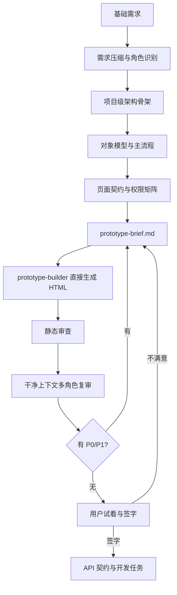

# 原型生成 Harness：从粗需求到可开发原型

> 适用范围：把“基础需求 / 模糊想法 / 旧系统重构目标”转成高质量、可评审、可签字、可进入 API 和开发的产品原型。
> 使用方式：把 `tilian/yuanxing/` 整个目录复制到新项目，按本文件和 `README.md` 执行。
> 关键约束：本 Harness 不依赖 Open Design；如接入其他设计生成器，只能作为“原型构建器”的可替换实现，不能替代 brief、复审和门禁。

## 0. 当前可用性结论

原始提炼方向是对的，但单个 `yuanxing.md` 还不足以直接复用到新项目。要能稳定地“粗需求生成丰满原型”，必须同时具备：

- 可落盘的目录和状态文件。
- 粗需求压缩模板。
- 角色、对象、页面、权限、状态、验收的结构化模板。
- 不依赖 Open Design 的 HTML 原型构建标准。
- 静态断链、泛化入口、按钮结果、关键术语证据检查。
- 干净上下文多角色复审模板。
- 用户签字和禁止进入开发的 gate。

本目录补齐后，使用口径是：`prototype-brief.md` 是唯一设计输入，`docs/design/prototypes/index.html` 是唯一原型入口，`prototype-static-audit.mjs` 是第一层确定性检查，`prototype-review.md` 和 `pre-coding-readiness.md` 是进入签字前的证据。

## 1. 启动口令

每次开始原型工作时先执行这段，不直接继承聊天上下文：

```text
我是 prototype-conductor。
本次目标：把用户基础需求转成完整可开发原型。
只读落盘输入，只写声明的输出。

规则：
1. 只信落盘文件，不信长聊天记忆。
2. 先恢复需求、状态、历史评审、失败教训，再输出新 brief 或原型。
3. 设计优先级：完整业务闭环 > 角色权限边界 > 对象模型 > 页面骨架 > 细节交互 > 视觉风格。
4. 用户指出一个点时，必须提炼背后通用规则，并扫描同类问题。
5. 原型未由用户签字前，不进入 API / 后端 / 前端 / SQL 开发。
6. 不调用 Open Design；由 prototype-builder 直接产出静态 HTML 原型。
```

## 2. 最终交付

最终交付必须回答这些问题：

- 用户从哪里进入？
- 不同角色看到什么？
- 核心业务对象是什么？
- 列表、详情、新建、编辑、审批、导入、导出、日志怎么闭环？
- 后台配置如何支撑运行态？
- 权限、字段、按钮、数据范围如何生效？
- 失败、空态、禁用、异步任务、审计和 trace 怎么反馈？
- 哪些是 MVP，哪些是后续？
- 用户是否已签字？

最小输出清单：

```text
docs/user_requirement.md
docs/product/understanding.md
docs/product/role-matrix.md
docs/product/object-model.md
docs/design/prototype-brief.md
docs/design/prototypes/index.html
docs/design/prototype-review.md
docs/design/pre-coding-readiness.md
docs/design/user-approval.md
docs/evidence/prototype-audit-YYYY-MM-DD.md
.cursor/session/state.json 或等价 state.json
.cursor/session/issues/registry.jsonl 或等价 issues registry
.cursor/knowledge/prototype-rules.md 或等价 knowledge
```

## 3. 推荐目录

复制到新项目后建立以下目录：

```text
docs/
  user_requirement.md
  product/
    understanding.md
    role-matrix.md
    object-model.md
    page-contract.md
  design/
    prototype-brief.md
    prototype-review.md
    pre-coding-readiness.md
    user-approval.md
    prototypes/
      index.html
  evidence/
    prototype-audit-YYYY-MM-DD.md
.cursor 或 .agent/
  session/
    state.json
    issues/registry.jsonl
  knowledge/
    prototype-rules.md
    project-rules.md
```

如果项目不使用 `.cursor`，也要保留等价的 `state.json`、`issues`、`knowledge`，否则后续新会话会依赖聊天记忆，原型质量会漂移。

## 4. 阶段总览



## 5. 角色分工

| 角色 | 输入 | 输出 | 禁止 |
|---|---|---|---|
| prototype-conductor | state、需求、评审、issue | 调度、gate、最终口径 | 写业务代码 |
| product-analyst | 用户原话、旧系统 | understanding、对象模型 | 直接画页面 |
| ux-architect | understanding、role-matrix、object-model | 页面契约、交互规则 | 只追视觉效果 |
| prototype-builder | prototype-brief、page-contract | `index.html` | 改需求范围 |
| prototype-reviewer | brief、prototype、knowledge | review、P0/P1 问题 | 只看断链不看业务 |
| qa-auditor | prototype、review | audit evidence、readiness | 把未验证项写成 pass |

单人执行时也要切换这些视角；连续两轮仍发现低级问题时，必须启动干净上下文复审。

## 6. 阶段 1：需求压缩

输入：

- 用户原始话术。
- 旧系统截图、旧代码或已有原型。
- 用户反复强调的纠偏。

输出：

- `docs/user_requirement.md`
- `docs/product/understanding.md`

提炼规则：

1. 保留用户原话，不急着改写。
2. 把“我要某个页面”翻译成“用户要完成什么工作”。
3. 把“这个不好用”翻译成可复用规则。
4. 把新增需求区分为原始范围必须有、MVP 可先做、后续增强、仅为设计参考。
5. 每次用户纠偏后同步沉淀到需求、brief、review 或 knowledge，不能只留在聊天里。

需求压缩模板见 `templates/understanding.md`；如果该模板不存在，可用以下最小结构：

```markdown
# 需求理解

## 1. 产品一句话

这是一个……

## 2. 用户角色

| 角色 | 日常目标 | 可见入口 | 不可见入口 |
|---|---|---|---|

## 3. 核心业务对象

| 对象 | 谁创建 | 生命周期 | 关联对象 | 关键权限 |
|---|---|---|---|---|

## 4. 主剧本

1. 用户登录
2. 选择/进入工作空间
3. 打开核心模块
4. 新增/处理/审批/查询数据
5. 查看消息、待办、日志或结果

## 5. 非目标

- 暂不做……
```

## 7. 阶段 2：先定架构，不先画页面

很多原型跑偏，是因为先堆页面，后补架构。正确顺序是先确定产品层级。

必须回答：

- 是否有平台层 / 租户层 / 系统层 / 普通业务层？
- 管理后台和业务运行台是否分开？
- 普通用户、管理员、超级管理员的入口是否不同？
- 配置态如何发布到运行态？
- 权限、数据范围、字段控制和按钮控制在哪里配置？
- 消息、待办、日志、导入导出、异步任务是否全局统一？
- 上线保障、集成、密钥、安全审计是否需要在原型中提前露出边界？

架构骨架模板：

```markdown
## 项目级架构

1. 入口层：登录、注册、找回、SSO、系统/租户切换。
2. 工作台层：用户日常首页、待办、消息、最近访问、全局搜索。
3. 业务运行层：模块分组、列表、详情、新建、编辑、审批、附件、导入导出。
4. 配置管理层：组织、角色、模块、字段、流程、字典、仪表盘、集成、日志。
5. 权限身份层：账号、成员、角色、数据范围、字段权限、动作权限。
6. 协作流程层：流程、审批、待办、消息模板、通知渠道。
7. 集成运维层：OpenAPI、SSO、密钥、数据源、日志、后台任务、备份恢复。
8. 智能能力层：AI Agent 配置、运行、确认、审计。
```

## 8. 阶段 3：对象和视图分离

先定对象，再定视图。

规则：

- 列表、看板、日历、时间线是同一对象集合的视图，不是不同功能。
- 如果字段、生命周期、权限、目的不同，才拆对象。
- 配置对象和运行对象分开。
- 消息、待办、日志、任务、审批都要有目标对象和跳转规则。
- 运行态看到的每个字段、按钮、筛选、状态，都要能追溯到配置态或固定业务规则。

对象模型模板：

```markdown
| 对象 | 类型 | 字段 | 状态 | 视图 | 动作 | 审计 |
|---|---|---|---|---|---|---|
| 客户 | 业务对象 | 名称、等级、负责人 | 潜在/跟进/成交 | 列表、详情、看板 | 新增、编辑、转移、导出 | 操作日志 |
| 审批任务 | 流程对象 | 节点、处理人、截止 | 待办/已办/驳回 | 待办列表、详情侧栏 | 通过、驳回、转交 | 审批日志 |
```

## 9. 阶段 4：角色权限矩阵

角色矩阵必须早于页面设计，否则会漏入口。

```markdown
| 角色 | 默认首页 | 可见导航 | 关键动作 | 禁止动作 | 无权限反馈 |
|---|---|---|---|---|---|
| 普通成员 | 业务首页 | 权限内模块、待办、消息、个人信息 | 新增、编辑自己范围内数据 | 后台配置、越权导出 | 申请权限 / 显示原因 |
| 系统管理员 | 系统首页 | 业务页、系统后台 | 配置模块、角色、流程 | 平台全局配置 | 平台无权限页 |
```

设计硬规则：

- 后台入口来自权限，不写死在角色名上。
- 超级管理员是特例，要明确边界。
- 前端隐藏只是体验，原型里仍要表达后端兜底拒绝。
- 无权限不是空白页，要显示缺失权限、当前角色、申请入口、requestId。

## 10. 阶段 5：页面契约

页面清单不是越多越好，而是要覆盖每个主流程。每个页面必须写：

- 谁用？
- 解决什么任务？
- 入口在哪里？
- 主对象是什么？
- 主动作是什么？
- 列表/详情/表单/配置/日志/结果怎么闭环？
- 权限和异常态是什么？

页面契约模板：

```markdown
| 页面 | 角色 | 入口 | 主对象 | 主动作 | 必备状态 |
|---|---|---|---|---|---|
| 业务列表 | 普通成员 | 顶部模块组 > 左侧模块 | 业务记录 | 行点击详情、新建、筛选 | 空、无权限、加载、错误、批量禁用 |
| 详情抽屉 | 普通成员 | 行点击 | 单条记录 | 编辑、审批、打印 | 字段脱敏、流程状态、附件失败 |
```

## 11. 阶段 6：写 prototype-brief

`prototype-brief.md` 必须能独立喂给 prototype-builder，不依赖聊天上下文。

建议结构见 `templates/prototype-brief.md`。最低要求：

- 最高优先级：本项目最终目标、不是什么、哪些旧资料作废。
- 角色与入口：角色表、默认首页、可见/不可见入口、权限反馈。
- 产品骨架：平台/系统/业务/后台/工作台/消息/待办等壳。
- 页面清单：按页面列出布局、主对象、主动作、状态。
- 关键业务剧本：用真实角色走 5 到 15 步，不要只列功能。
- 数据与示例：真实业务列、状态、负责人、时间、金额、审批节点。
- 交互规则：行点击、详情抽屉、导入导出、批量操作、禁用态、结果反馈。
- 后台配置规则：字段、字典、流程、角色、页面动作、通知模板、日志、集成。
- 验收清单：可逐项勾选，不能只有抽象描述。

brief 禁止：

- “做一个现代化后台”这种空话。
- 只写页面名，不写业务对象。
- 只写“支持权限”，不写谁能看、谁不能看。
- 用通用弹窗兜底所有复杂场景。
- 把导入导出、审批、AI、SSO、日志写成后续开发再说。

## 12. 阶段 7：不依赖 Open Design 的原型生成

prototype-builder 直接生成静态 HTML。默认输出：

```text
docs/design/prototypes/index.html
```

生成前输入必须完整：

- `docs/user_requirement.md`
- `docs/product/understanding.md`
- `docs/product/role-matrix.md`
- `docs/product/object-model.md`
- `docs/product/page-contract.md`
- `docs/design/prototype-brief.md`
- `docs/design/prototype-review.md` 中最新 P0/P1 约束

HTML 原型标准：

- 单入口 `index.html`，可直接浏览。
- 首页能到所有主要页面。
- 登录、注册、找回、系统/租户/工作空间切换必须是真实页面或真实抽屉，不是演示按钮。
- 用 `section.screen` 表示大壳，用 `.page` 表示壳内页面，用 `template` 表示抽屉/弹窗。
- 跳转使用稳定 `data-screen`、`data-page`、`data-drawer`、`data-row-drawer` 等属性，便于静态审查。
- 列表数据行主动作通常是整行点击详情；行内按钮只放编辑、删除、审批、转移、导出等差异动作。
- 关键按钮不能只 toast，必须接同步结果、后台任务、发布检查、日志追踪或专属抽屉。
- 真实业务数据优先，不用“名称 / 类型 / 说明”占位。
- 工具型后台保持高密度、可扫描。
- `defaultDrawer` 只表示设计缺口阻断态，不是可开发兜底。
- 不出现 `genericFlowDrawer`、`genericBizDrawer` 这类 P0 兜底入口。

prototype-builder 输出后必须写一段自检结果：

```markdown
## Builder 自检

- [ ] 真实登录/注册/找回入口存在
- [ ] 角色入口和权限裁剪存在
- [ ] 业务运行台和后台配置分离
- [ ] 列表有搜索、筛选、排序、分页、列设置、批量动作限制
- [ ] 详情是专属业务结构，不是通用说明表
- [ ] 导入导出通过弹窗/抽屉和后台任务反馈
- [ ] 流程、消息、待办、日志、SSO、AI Agent 有配置和运行闭环
- [ ] 无 default/generic 兜底入口
```

## 13. 阶段 8：静态审查

先跑确定性检查，再做人工复审。

```powershell
node tilian/yuanxing/tools/prototype-static-audit.mjs docs/design/prototypes/index.html
```

如果项目把 harness 复制到了其他目录，按实际脚本路径执行。

静态审查至少覆盖：

- `data-screen`、`data-page`、`data-drawer`、消息跳转、行点击目标无断链。
- 不直接引用 `defaultDrawer` 或 `generic*Drawer` 承接关键入口。
- `data-toast` 数量为 0，或仅用于非关键轻提示并写明原因。
- 消息卡片内不堆“进入详情/打开任务/查看日志”重复小按钮。
- 精确重复“详情 / 查看 / 打开 / 进入”等同义详情按钮为 0，后续再做语义复审。
- `href="#"` 为 0。
- 关键术语能在 brief 和原型中找到可见证据。

建议把输出保存到：

```text
docs/evidence/prototype-audit-YYYY-MM-DD.md
```

## 14. 阶段 9：原型复审

原型出来后，不要马上给用户看。先做四类复审。

### 14.1 产品架构复审

- 是否表达完整系统，而不是页面 demo？
- 是否有真实登录、注册、找回、系统/租户/工作空间切换？
- 平台层和业务层是否混在一起？
- 配置态是否能支撑运行态？

### 14.2 UX 复审

- 树是否真像树，画布是否真像画布？
- 左右布局比例是否合理？
- 表格是否有足够业务列？
- 操作是否重复？
- 详情是否保留列表上下文？
- 移动或窄屏是否不会挤爆？

### 14.3 权限数据复审

- 普通用户是否看不到后台？
- 跨系统/跨租户是否有上下文对象？
- 字段、按钮、导出、审批节点权限是否可解释？
- 无权限是否有反馈和申请入口？

### 14.4 开发验收复审

- 页面、抽屉、页签、跳转无断链。
- 关键按钮有结果承接。
- 异步任务有 taskId、状态、结果文件、错误文件。
- 日志有 traceId/requestId/auditLogId。
- 没有 default/generic 兜底 P0 入口。

如果连续两轮仍发现明显低级问题，启动干净上下文复审：新审阅者只读落盘文件和当前原型，不读聊天历史。

## 15. 质量门禁

```json
{
  "requirements_compressed": false,
  "architecture_frozen": false,
  "prototype_brief_ready": false,
  "prototype_generated": false,
  "static_audit_passed": false,
  "multi_role_review_passed": false,
  "user_approved": false,
  "api_frozen": false,
  "tasks_planned": false
}
```

门禁规则：

- `user_approved=false`：禁止 API、后端、前端、SQL 开发。
- `static_audit_passed=false`：不要给用户说“差不多好了”。
- `multi_role_review_passed=false`：不要进入签字。
- `api_frozen=false`：不要拆正式开发任务。

## 16. P0 原型阻断清单

出现以下任一项，不能签字：

- 没有真实登录入口。
- 普通用户能看到后台入口。
- 平台后台和系统后台混在一起。
- 业务运行台和配置后台混在一起。
- 业务列表没有真实业务列、筛选、分页。
- 行详情只能靠“详情”按钮，不能整行进入。
- 操作列重复“详情 / 查看 / 打开 / 进入”。
- 详情 tab 是占位表格或权限矩阵。
- 导入导出常驻铺在列表下方。
- 组织架构不是树。
- 流程设计器没有连线、条件、属性面板。
- 消息做成普通业务表格，或消息跳转靠一堆小按钮。
- 待办仍显示业务模块侧栏。
- 字段、字典、流程、权限、日志只有概念没有配置承接。
- SSO、OpenAPI、AI、密钥没有安全和审计边界。
- default/generic 抽屉承接关键功能。
- 关键按钮没有结果反馈、任务状态或 trace。

## 17. 通用设计规则

### 17.1 主动作唯一

同一对象同一上下文只保留一个主动作。列表数据行主动作通常是整行点击详情；行内按钮只放编辑、删除、审批、转移、导出等差异动作。

### 17.2 列表是工作台，不是数据堆

列表必须有搜索、常用筛选、高级筛选、场景/保存视图、表头排序、列设置、序号列、勾选列、分页、批量动作限制和禁用原因、导入/导出入口、空态和错误态。

### 17.3 详情要像业务详情

详情至少包含顶部摘要、主操作、基础信息、关联对象、附件、评论或备注、操作记录、审批状态、打印/导出记录。

### 17.4 配置态必须能解释运行态

运行态看到的每个字段、按钮、列表列、筛选、状态、标签、流程、消息，都应该能在后台配置中找到来源。

### 17.5 结果反馈要闭环

任何保存、发布、审批、导入、导出、AI 写入、密钥轮换、体检、备份恢复，都必须有成功态、失败态、部分成功态、禁用原因、traceId/requestId 和下一步入口。

## 18. 从本项目提炼出的关键教训

这些教训适用于大多数 ToB / 后台 / 低代码 / 管理系统：

- 不要等用户指出一个问题才修一个问题；要反推同类问题。
- 页面能点不等于能用；布局比例、业务数据和状态反馈同样重要。
- 入口必须真实存在，不能藏在演示按钮里。
- 平台、系统、业务、后台、工作台要分壳。
- 待办是独立工作台，不是业务模块列表。
- 消息是消息流，不是普通数据表。
- 导入导出是动作和任务反馈，不是列表下方常驻面板。
- 审批在业务详情或待办里，不在左侧导航里。
- 后台日志一个入口，内部按类型筛选，不要拆散导航。
- SSO 不是登录按钮，而是身份源、组织映射、成员绑定、无权限反馈和审计链路。
- AI Agent 不是聊天按钮，而是模型授权、权限范围、人工确认、脱敏和日志审计。
- 工作管理要区分项目任务、普通任务、日报；列表和看板是视图切换。
- 状态、标签、颜色、图标应来自字典或配置，不要各页硬写。
- default/generic 是设计缺口，不是兜底方案。

## 19. 一键执行提示

```text
请按 tilian/yuanxing/yuanxing.md 执行本项目原型生成，不调用 Open Design。

输入：
1. 读取 docs/user_requirement.md。
2. 如果有旧系统、截图、代码或历史原型，只作为参考，不被旧结构限制。
3. 读取 tilian/yuanxing/templates 和 prompts。

输出：
1. docs/product/understanding.md
2. docs/product/role-matrix.md
3. docs/product/object-model.md
4. docs/product/page-contract.md
5. docs/design/prototype-brief.md
6. docs/design/prototypes/index.html
7. docs/design/prototype-review.md
8. docs/design/pre-coding-readiness.md
9. docs/design/user-approval.md
10. docs/evidence/prototype-audit-YYYY-MM-DD.md

流程：
1. 先定项目级架构和角色入口。
2. 再定对象模型和主流程。
3. 再写页面契约和 brief。
4. 直接生成静态 HTML 原型。
5. 运行静态审查。
6. 做干净上下文多角色复审。
7. 无 P0/P1 后交给用户签字。

硬规则：
- 用户签字前，不进入 API / 后端 / 前端 / SQL。
- 发现一个问题，必须扫描同类问题。
- 原型必须让正常用户能完成主剧本，也让开发能抽取接口和状态。
```
